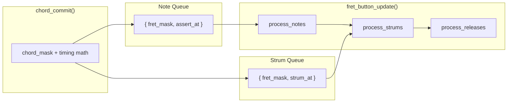

<!-- Generated by SpecStory, Markdown v2.1.0 -->

# 2026-03-27 12:14:33Z

<!-- cursoride Session 41121407-df66-4ff3-87cd-1862e927b4fb (2026-03-27 12:14:33Z) -->

_**User**_

I think we should split out the note / chord queue from strum queue.

---

_**Agent (claude-4.6-opus-high-thinking)**_

<think><details><summary>Thought Process</summary>
The user wants to split out the note/chord queue from the strum queue. Let me first read the relevant files to understand the current architecture.</details></think>

_**Agent (claude-4.6-opus-high-thinking)**_

<tool-use data-tool-type="read" data-tool-name="read_file_v2">
<details><summary>Tool use: **read_file_v2** • Read file: /Users/greg/projects/microchip/guitar-pic/firmware/fretboard/fret_button.c</summary>

</details>
</tool-use>

<tool-use data-tool-type="read" data-tool-name="read_file_v2"><details>
<summary>Tool use: **read_file_v2**</summary>

</details></tool-use>

_**Agent (claude-4.6-opus-high-thinking)**_

<tool-use data-tool-type="read" data-tool-name="read_file_v2">
<details><summary>Tool use: **read_file_v2** • Read file: /Users/greg/projects/microchip/guitar-pic/firmware/fretboard/fret_button.h</summary>

</details>
</tool-use>

<tool-use data-tool-type="read" data-tool-name="read_file_v2"><details>
<summary>Tool use: **read_file_v2**</summary>

</details></tool-use>

_**Agent (claude-4.6-opus-high-thinking)**_

<tool-use data-tool-type="read" data-tool-name="read_file_v2">
<details><summary>Tool use: **read_file_v2** • Read file: /Users/greg/projects/microchip/guitar-pic/firmware/fretboard/fret_detect.c</summary>

</details>
</tool-use>

<tool-use data-tool-type="read" data-tool-name="read_file_v2"><details>
<summary>Tool use: **read_file_v2**</summary>

</details></tool-use>

_**Agent (claude-4.6-opus-high-thinking)**_

<tool-use data-tool-type="read" data-tool-name="read_file_v2">
<details><summary>Tool use: **read_file_v2** • Read file: /Users/greg/projects/microchip/guitar-pic/firmware/fretboard/fret_detect.h</summary>

</details>
</tool-use>

<tool-use data-tool-type="read" data-tool-name="read_file_v2"><details>
<summary>Tool use: **read_file_v2**</summary>

</details></tool-use>

_**Agent (claude-4.6-opus-high-thinking)**_

<tool-use data-tool-type="read" data-tool-name="read_file_v2">
<details><summary>Tool use: **read_file_v2** • Read file: /Users/greg/projects/microchip/guitar-pic/firmware/fretboard/main.c</summary>

</details>
</tool-use>

<tool-use data-tool-type="read" data-tool-name="read_file_v2"><details>
<summary>Tool use: **read_file_v2**</summary>

</details></tool-use>

_**Agent (claude-4.6-opus-high-thinking)**_

<think><details><summary>Thought Process</summary>
Let me understand the current architecture:

1. `fret_detect.c` - Detects fret presses/releases from ADC scan results
2. `fret_button.c` - Handles the output side: asserting fret buttons and strum on the guitar controller

Currently in `fret_button.c`, there's a single `pending_chord_t` FIFO that combines both the note/chord information (fret_mask) and the strum timing (strum_at). The queue entries contain:
- `fret_mask` - which frets to press
- `press_at` - when to assert frets


- `strum_at` - when to strum
- `frets_asserted` - whether frets have been asserted yet

The user wants to split this into separate queues: one for notes/chords and one for strums. This separation would let notes and strums be managed independently, allowing for scenarios like multiple chord changes before a strum or different timing logic for each operation.

**Note/Chord Queue**: Tracks fret positions and when to assert them
- `fret_mask` - which frets to press
- `press_at` - when to assert them

**Strum Queue**: Tracks when to strum
- `strum_at` - when to strum

Each chord commit would create entries in both queues, with the constraint that notes must be asserted before their corresponding strum fires. I'm realizing there are some design questions here though—should strums reference specific note entries, or should they be independent? And how does the current timing logic where strum depends on press timing factor into this split? I think I should propose a plan to the user before diving into implementation.</details></think>

_**Agent (claude-4.6-opus-high-thinking)**_

Let me also check the `fret_scan.h` header for the constants used.

_**Agent (claude-4.6-opus-high-thinking)**_

<tool-use data-tool-type="read" data-tool-name="read_file_v2">
<details><summary>Tool use: **read_file_v2** • Read file: /Users/greg/projects/microchip/guitar-pic/firmware/fretboard/fret_scan.h</summary>

</details>
</tool-use>

<tool-use data-tool-type="read" data-tool-name="read_file_v2"><details>
<summary>Tool use: **read_file_v2**</summary>

</details></tool-use>

_**Agent (claude-4.6-opus-high-thinking)**_

<think><details><summary>Thought Process</summary>
Now I have a good understanding. Let me think about the design.

Currently, `pending_chord_t` bundles together:
1. The fret information: `fret_mask`, `press_at`, `frets_asserted`
2. The strum timing: `strum_at`

And `process_pending()` walks a single queue, first asserting frets when `press_at` arrives, then triggering the strum when `strum_at` arrives, then dequeuing.

The user wants to split these into two queues. This makes sense because:
- Note/chord presses and strum events are conceptually different concerns


- It could simplify the logic - the note queue handles when to press/release frets, the strum queue handles when to strum
- It could enable future flexibility like chord changes without strums, or strums without chord changes

So I'm proposing separate data structures: a note queue that tracks fret masks and when to assert them, and a strum queue that just tracks when to trigger strums.

In `chord_commit()`, I'd push one entry to each queue with the right timings. Then `process_pending()` splits into two functions - one that walks the note queue to assert and release frets, another that walks the strum queue to trigger strums. The collision avoidance logic would check the strum queue's tail to find the earliest safe time.

I'm leaning toward just implementing this since the design is pretty clear, but there's a subtlety I need to think through - right now entries are paired 1:1 with each chord, and I need to make sure that mapping still works cleanly with separate queues.

Actually, splitting them opens up some interesting possibilities like pre-positioning frets without strumming or strumming open strings, but it also raises questions about whether the queues should stay 1:1 or become truly independent, and how collision avoidance works across them. Given how you framed this, I should probably discuss the design approach with you first before diving into implementation.</details></think>

_**Agent (claude-4.6-opus-high-thinking)**_

This is a meaningful architectural change with a few design decisions worth aligning on before coding. Let me switch to Plan mode to discuss the approach.

_**Agent (claude-4.6-opus-high-thinking)**_

<tool-use data-tool-type="unknown" data-tool-name="switch_mode">
<details>
<summary>Tool use: **switch_mode**</summary>


Parameters:

```json
{
  "explanation": "Splitting the chord/strum queue involves design decisions about how the two queues relate and interact. Let's align on the approach before implementing.",
  "toModeId": "plan"
}
```
Result:

```json
{
  "toModeId": "plan",
  "userApproved": true
}
```
User decision: **accepted**

Status: **completed**


</details>
</tool-use>

<tool-use data-tool-type="unknown" data-tool-name="switch_mode"><details>
<summary>Tool use: **switch_mode**</summary>

</details></tool-use>

_**Agent (claude-4.6-opus-high-thinking)**_

<think><details><summary>Thought Process</summary>
Let me think about the current design and what splitting the queues would look like.

Currently, `pending_chord_t` in `fret_button.c` bundles together:
1. `fret_mask` + `press_at` + `frets_asserted` — the note/chord info (what frets to press and when)
2. `strum_at` — the strum timing

In `chord_commit()`, a single entry is pushed with both a `press_at` and a `strum_at`. In `process_pending()`, the single queue is walked: first frets are asserted at `press_at`, then the strum fires at `strum_at`, and the entry is dequeued.


Now I'm weighing whether to keep the two queues tightly synchronized or let them operate independently. If they stay paired, the refactor is straightforward and maintains the current behavior. But if I decouple them fully, I could support more complex scenarios like changing chords without strumming or repeating strums on the same chord—though that adds coordination complexity. The "split out" language suggests the user probably wants true independence here.

The practical benefits are clear: lifting and re-pressing a chord could trigger another strum without changing notes, or pre-positioning frets without immediately strumming. But there's a timing dependency I need to solve—the strum can't fire until the frets are actually in position. Right now that's handled by the `FRET_EARLY_MS` offset and the `frets_asserted` gate, but with independent queues I'd need a different synchronization mechanism, maybe using absolute timestamps on strum entries that check whether the corresponding frets are ready before firing.

Actually, the cleanest approach is to split them into two simple queues: one for fret changes with their assertion times, and one for strum events with their trigger times. Both get populated by `chord_commit()` with the same timing math, but they process independently—the frets get asserted first, then the strum fires at its scheduled moment without needing explicit coordination.</details></think>

_**Agent (claude-4.6-opus-high-thinking)**_

Good call. Here's how I see the current design and what the split would look like.

## Current State

Right now `fret_button.c` has a single `pending_chord_t` FIFO that bundles everything together:

```8:21:firmware/fretboard/fret_button.c
/* ---- pending chord FIFO ---- */

typedef struct {
    uint8_t  fret_mask;
    uint32_t press_at;
    uint32_t strum_at;
    bool     frets_asserted;
} pending_chord_t;

#define CHORD_Q_CAP 8
static pending_chord_t chord_q[CHORD_Q_CAP];
static uint8_t cq_head;
static uint8_t cq_count;
```

And `process_pending()` walks this single queue in a two-phase pattern: first assert frets at `press_at`, then fire the strum at `strum_at`, then dequeue.

Before I draft a concrete plan, there's one key design question:

_**Agent (claude-4.6-opus-high-thinking)**_

<tool-use data-tool-type="unknown" data-tool-name="ask_question">
<details>
<summary>Tool use: **ask_question**</summary>


Parameters:

```json
{
  "questions": [
    {
      "id": "independence",
      "options": [
        {
          "id": "independent",
          "label": "Truly independent — different depths, decoupled lifetimes"
        },
        {
          "id": "paired",
          "label": "1:1 paired — always one note entry per strum entry, just cleaner separation"
        }
      ],
      "prompt": "Should the two queues be truly independent (different depths, allowing chord changes without strums, or strums without chord changes)? Or should they stay 1:1 paired — same number of entries, just separated into cleaner data structures?"
    }
  ],
  "title": "Queue independence"
}
```
Additional data:

```json
{
  "currentSelections": {
    "independence": [
      "independent"
    ]
  },
  "freeformTexts": {
    "independence": ""
  },
  "status": "submitted"
}
```
Result:

```json
{
  "answers": [
    {
      "freeformText": "",
      "questionId": "independence",
      "selectedOptionIds": [
        "independent"
      ]
    }
  ]
}
```
User decision: **accepted**

Status: **completed**


</details>
</tool-use>

<tool-use data-tool-type="unknown" data-tool-name="ask_question"><details>
<summary>Tool use: **ask_question**</summary>

</details></tool-use>

_**Agent (claude-4.6-opus-high-thinking)**_

<think><details><summary>Thought Process</summary>
The user wants truly independent queues. Let me design this properly.

With truly independent queues:

**Note Queue** (`note_q`):
- Entries: `{ fret_mask, assert_at }`
- When `assert_at` arrives, set frets to match `fret_mask`, dequeue
- Multiple note entries can exist without corresponding strums

**Strum Queue** (`strum_q`):
- Entries: `{ strum_at }`
- When `strum_at` arrives, trigger strum, dequeue
- Multiple strum entries can exist without corresponding note changes

Processing order in `fret_button_update()`:


1. Process note queue first (assert/release frets)
2. Process strum queue (fire strums)
3. Process per-fret releases

This ensures frets are always updated before strums fire in the same tick. For `chord_commit()`, both queues get independent pushes, and the collision avoidance logic checks the strum queue's tail to see if the previous strum pulse is still active, pushing times forward if needed.

The note `assert_at` would be set to `strum_at - FRET_EARLY_MS`. Both `release_all()` and `process_releases()` need updates to work with the split queues—the latter now checks the note queue instead of pending chords.

Writing the note processing function... I see the issue now—with separate queues, the timing logic changes fundamentally. Frets get asserted when their `assert_at` time arrives and are immediately dequeued, while strums fire independently when `strum_at` comes due. The original approach had to hold frets in the queue until the strum was ready, but this decoupled system lets each event process on its own schedule.

Updating the release logic...

The real problem is that once the note entry gets consumed after frets are asserted, a release command arriving between that point and the strum would find no matching fret in the queue, causing the fret to release prematurely. I need to either keep the strum mask around separately, or rethink when the note entry actually gets removed from the queue.

Examining the release logic...

The function iterates through each fret and checks if it's safe to release: the release timer has expired, the fret isn't physically pressed, and crucially, no pending chords in the queue still need that fret. If all conditions pass, it releases the button and clears the active flag.

Now I'm thinking about how to adapt this logic when using separate queues for notes and strums—I need to check both whether any unprocessed note entries require the fret and whether there are pending strums that might depend on currently active frets. The cleanest solution is to add a `fret_mask` field to both the note and strum structures so I can check what frets each pending operation needs.

Defining the data structures... I'm settling on adding `fret_mask` to the strum queue entries—it cleanly separates concerns where the note queue tracks what to press and when, while the strum queue tracks when to strum and what frets need release protection. Defining the struct types... rum queue's tail instead of the chord queue's tail to determine if a new chord would collide with a pending strum, adjusting the timing accordingly to avoid interference.

I'm satisfied with this approach now and ready to lay out the full plan.</details></think>

_**Agent (claude-4.6-opus-high-thinking)**_

Good, truly independent queues. Here's what I'm thinking:

## Design

The current `pending_chord_t` bundles fret-mask + fret-timing + strum-timing into one entry, and `process_pending()` walks it in a two-phase pattern (assert frets, then strum, then dequeue). Splitting into two independent FIFOs:



**Note Queue** (`note_q`) -- entries: `{ fret_mask, assert_at }`. When `assert_at` arrives, set the fret output pins to match `fret_mask` and consume the entry.

**Strum Queue** (`strum_q`) -- entries: `{ fret_mask, strum_at }`. When `strum_at` arrives, fire the strum and consume the entry. The `fret_mask` here is only used by `process_releases()` to protect frets that are waiting on a pending strum from being released prematurely.

The two queues can have different depths. `chord_commit()` still pushes to both, but they're independent pushes and nothing prevents future callers from pushing to just one.

## Key Details

**Collision avoidance** -- currently checks the chord queue's tail to push times forward if a prior strum pulse hasn't ended. With split queues, this checks the strum queue's tail for `strum_q[tail].strum_at + STRUM_PULSE_MS`.

**Release protection** -- `process_releases()` currently iterates the chord queue to check if a fret is still needed. With split queues, it needs to check both the note queue (frets not yet asserted) and the strum queue (frets associated with pending strums).

**Processing order** -- `process_notes()` runs before `process_strums()` in the update loop, so frets are always in position before a strum fires in the same tick.

## Changes (all in [fret_button.c](firmware/fretboard/fret_button.c))

1. Replace `pending_chord_t` and its FIFO variables with two structs and two sets of head/count variables:
   - `pending_note_t` + `note_q[]`, `nq_head`, `nq_count`
   - `pending_strum_t` + `strum_q[]`, `sq_head`, `sq_count`

2. Split `process_pending()` into `process_notes()` and `process_strums()`:
   - `process_notes()` -- when `assert_at` arrives, diff `fret_mask` against `frets_active`, assert/release pins, consume entry
   - `process_strums()` -- when `strum_at` arrives, call `strum_trigger()`, consume entry

3. Update `chord_commit()` -- push to both queues independently; collision check uses `strum_q` tail

4. Update `process_releases()` -- check both `note_q` and `strum_q` for fret protection

5. Update `release_all()` and `fret_button_init()` -- reset both queues instead of one

No changes needed to the header, `fret_detect`, `fret_scan`, or `main.c`.

Shall I go ahead and implement this?

---

_**User**_

go

---

_**Agent (claude-4.6-opus-high-thinking)**_

<tool-use data-tool-type="read" data-tool-name="read_file_v2">
<details><summary>Tool use: **read_file_v2** • Read file: /Users/greg/projects/microchip/guitar-pic/firmware/fretboard/fret_button.c</summary>

</details>
</tool-use>

<tool-use data-tool-type="read" data-tool-name="read_file_v2"><details>
<summary>Tool use: **read_file_v2**</summary>

</details></tool-use>

_**Agent (claude-4.6-opus-high-thinking)**_

<think><details><summary>Thought Process</summary>
Now let me implement the changes. I'll replace the entire data structures and functions section by section.

Let me plan the edits:

1. Replace the `pending_chord_t` struct and FIFO variables (lines 8-20) with two separate structs and FIFOs
2. Update `release_all()` (lines 102-114) to reset both queues
3. Update `chord_commit()` (lines 149-184) to push to both queues
4. Replace `process_pending()` (lines 186-215) with `process_notes()` and `process_strums()`


5. Update `process_releases()` to handle both queues
6. Update `fret_button_init()` to reset both queues
7. Update `fret_button_update()` to call both process functions

I need to work through each function systematically to ensure the dual-queue structure is properly integrated throughout.</details></think>

_**Agent (claude-4.6-opus-high-thinking)**_

<tool-use data-tool-type="unknown" data-tool-name="todo_write">
<details>
<summary>Tool use: **todo_write**</summary>


Parameters:

```json
{
  "merge": true
}
```
Result:

```json
{
  "finalTodos": [
    {
      "content": "Replace pending_chord_t with pending_note_t and pending_strum_t, two independent FIFOs",
      "id": "structs",
      "status": "in_progress"
    },
    {
      "content": "Update release_all() to reset both queues",
      "id": "release_all",
      "status": "pending"
    },
    {
      "content": "Update chord_commit() to push to both queues independently",
      "id": "chord_commit",
      "status": "pending"
    },
    {
      "content": "Split process_pending() into process_notes() and process_strums()",
      "id": "process_split",
      "status": "pending"
    },
    {
      "content": "Update process_releases() to check both queues for fret protection",
      "id": "process_releases",
      "status": "pending"
    },
    {
      "content": "Update fret_button_init() and fret_button_update() for new queues",
      "id": "init_update",
      "status": "pending"
    }
  ],
  "success": true
}
```
Status: **completed**


</details>
</tool-use>

<tool-use data-tool-type="unknown" data-tool-name="todo_write"><details>
<summary>Tool use: **todo_write**</summary>

</details></tool-use>

_**Agent (claude-4.6-opus-high-thinking)**_

<tool-use data-tool-type="write" data-tool-name="edit_file_v2">

<details><summary>Tool use: **edit_file_v2** • Edit file: /Users/greg/projects/microchip/guitar-pic/firmware/fretboard/fret_button.c</summary>

</details>

</tool-use>

<tool-use data-tool-type="write" data-tool-name="edit_file_v2"><details>
<summary>Tool use: **edit_file_v2**</summary>

</details></tool-use>

_**Agent (claude-4.6-opus-high-thinking)**_

<tool-use data-tool-type="unknown" data-tool-name="todo_write">
<details>
<summary>Tool use: **todo_write**</summary>


Parameters:

```json
{
  "merge": true
}
```
Result:

```json
{
  "finalTodos": [
    {
      "content": "Replace pending_chord_t with pending_note_t and pending_strum_t, two independent FIFOs",
      "id": "structs",
      "status": "completed"
    },
    {
      "content": "Update release_all() to reset both queues",
      "id": "release_all",
      "status": "in_progress"
    },
    {
      "content": "Update chord_commit() to push to both queues independently",
      "id": "chord_commit",
      "status": "pending"
    },
    {
      "content": "Split process_pending() into process_notes() and process_strums()",
      "id": "process_split",
      "status": "pending"
    },
    {
      "content": "Update process_releases() to check both queues for fret protection",
      "id": "process_releases",
      "status": "pending"
    },
    {
      "content": "Update fret_button_init() and fret_button_update() for new queues",
      "id": "init_update",
      "status": "pending"
    }
  ],
  "initialTodos": [
    {
      "content": "Replace pending_chord_t with pending_note_t and pending_strum_t, two independent FIFOs",
      "id": "structs",
      "status": "in_progress"
    },
    {
      "content": "Update release_all() to reset both queues",
      "id": "release_all",
      "status": "pending"
    },
    {
      "content": "Update chord_commit() to push to both queues independently",
      "id": "chord_commit",
      "status": "pending"
    },
    {
      "content": "Split process_pending() into process_notes() and process_strums()",
      "id": "process_split",
      "status": "pending"
    },
    {
      "content": "Update process_releases() to check both queues for fret protection",
      "id": "process_releases",
      "status": "pending"
    },
    {
      "content": "Update fret_button_init() and fret_button_update() for new queues",
      "id": "init_update",
      "status": "pending"
    }
  ],
  "success": true,
  "wasMerge": true
}
```
Status: **completed**


</details>
</tool-use>

<tool-use data-tool-type="unknown" data-tool-name="todo_write"><details>
<summary>Tool use: **todo_write**</summary>

</details></tool-use>

_**Agent (claude-4.6-opus-high-thinking)**_

<tool-use data-tool-type="write" data-tool-name="edit_file_v2">

<details><summary>Tool use: **edit_file_v2** • Edit file: /Users/greg/projects/microchip/guitar-pic/firmware/fretboard/fret_button.c</summary>

</details>

</tool-use>

<tool-use data-tool-type="write" data-tool-name="edit_file_v2"><details>
<summary>Tool use: **edit_file_v2**</summary>

</details></tool-use>

_**Agent (claude-4.6-opus-high-thinking)**_

<tool-use data-tool-type="unknown" data-tool-name="todo_write">
<details>
<summary>Tool use: **todo_write**</summary>


Parameters:

```json
{
  "merge": true
}
```
Result:

```json
{
  "finalTodos": [
    {
      "content": "Replace pending_chord_t with pending_note_t and pending_strum_t, two independent FIFOs",
      "id": "structs",
      "status": "completed"
    },
    {
      "content": "Update release_all() to reset both queues",
      "id": "release_all",
      "status": "completed"
    },
    {
      "content": "Update chord_commit() to push to both queues independently",
      "id": "chord_commit",
      "status": "in_progress"
    },
    {
      "content": "Split process_pending() into process_notes() and process_strums()",
      "id": "process_split",
      "status": "pending"
    },
    {
      "content": "Update process_releases() to check both queues for fret protection",
      "id": "process_releases",
      "status": "pending"
    },
    {
      "content": "Update fret_button_init() and fret_button_update() for new queues",
      "id": "init_update",
      "status": "pending"
    }
  ],
  "initialTodos": [
    {
      "content": "Replace pending_chord_t with pending_note_t and pending_strum_t, two independent FIFOs",
      "id": "structs",
      "status": "completed"
    },
    {
      "content": "Update release_all() to reset both queues",
      "id": "release_all",
      "status": "in_progress"
    },
    {
      "content": "Update chord_commit() to push to both queues independently",
      "id": "chord_commit",
      "status": "pending"
    },
    {
      "content": "Split process_pending() into process_notes() and process_strums()",
      "id": "process_split",
      "status": "pending"
    },
    {
      "content": "Update process_releases() to check both queues for fret protection",
      "id": "process_releases",
      "status": "pending"
    },
    {
      "content": "Update fret_button_init() and fret_button_update() for new queues",
      "id": "init_update",
      "status": "pending"
    }
  ],
  "success": true,
  "wasMerge": true
}
```
Status: **completed**


</details>
</tool-use>

<tool-use data-tool-type="unknown" data-tool-name="todo_write"><details>
<summary>Tool use: **todo_write**</summary>

</details></tool-use>

_**Agent (claude-4.6-opus-high-thinking)**_

<tool-use data-tool-type="write" data-tool-name="edit_file_v2">

<details><summary>Tool use: **edit_file_v2** • Edit file: /Users/greg/projects/microchip/guitar-pic/firmware/fretboard/fret_button.c</summary>

</details>

</tool-use>

<tool-use data-tool-type="write" data-tool-name="edit_file_v2"><details>
<summary>Tool use: **edit_file_v2**</summary>

</details></tool-use>

_**Agent (claude-4.6-opus-high-thinking)**_

<tool-use data-tool-type="unknown" data-tool-name="todo_write">
<details>
<summary>Tool use: **todo_write**</summary>


Parameters:

```json
{
  "merge": true
}
```
Result:

```json
{
  "finalTodos": [
    {
      "content": "Replace pending_chord_t with pending_note_t and pending_strum_t, two independent FIFOs",
      "id": "structs",
      "status": "completed"
    },
    {
      "content": "Update release_all() to reset both queues",
      "id": "release_all",
      "status": "completed"
    },
    {
      "content": "Update chord_commit() to push to both queues independently",
      "id": "chord_commit",
      "status": "completed"
    },
    {
      "content": "Split process_pending() into process_notes() and process_strums()",
      "id": "process_split",
      "status": "in_progress"
    },
    {
      "content": "Update process_releases() to check both queues for fret protection",
      "id": "process_releases",
      "status": "pending"
    },
    {
      "content": "Update fret_button_init() and fret_button_update() for new queues",
      "id": "init_update",
      "status": "pending"
    }
  ],
  "initialTodos": [
    {
      "content": "Replace pending_chord_t with pending_note_t and pending_strum_t, two independent FIFOs",
      "id": "structs",
      "status": "completed"
    },
    {
      "content": "Update release_all() to reset both queues",
      "id": "release_all",
      "status": "completed"
    },
    {
      "content": "Update chord_commit() to push to both queues independently",
      "id": "chord_commit",
      "status": "in_progress"
    },
    {
      "content": "Split process_pending() into process_notes() and process_strums()",
      "id": "process_split",
      "status": "pending"
    },
    {
      "content": "Update process_releases() to check both queues for fret protection",
      "id": "process_releases",
      "status": "pending"
    },
    {
      "content": "Update fret_button_init() and fret_button_update() for new queues",
      "id": "init_update",
      "status": "pending"
    }
  ],
  "success": true,
  "wasMerge": true
}
```
Status: **completed**


</details>
</tool-use>

<tool-use data-tool-type="unknown" data-tool-name="todo_write"><details>
<summary>Tool use: **todo_write**</summary>

</details></tool-use>

_**Agent (claude-4.6-opus-high-thinking)**_

<tool-use data-tool-type="write" data-tool-name="edit_file_v2">

<details><summary>Tool use: **edit_file_v2** • Edit file: /Users/greg/projects/microchip/guitar-pic/firmware/fretboard/fret_button.c</summary>

</details>

</tool-use>

<tool-use data-tool-type="write" data-tool-name="edit_file_v2"><details>
<summary>Tool use: **edit_file_v2**</summary>

</details></tool-use>

_**Agent (claude-4.6-opus-high-thinking)**_

<tool-use data-tool-type="unknown" data-tool-name="todo_write">
<details>
<summary>Tool use: **todo_write**</summary>


Parameters:

```json
{
  "merge": true
}
```
Result:

```json
{
  "finalTodos": [
    {
      "content": "Replace pending_chord_t with pending_note_t and pending_strum_t, two independent FIFOs",
      "id": "structs",
      "status": "completed"
    },
    {
      "content": "Update release_all() to reset both queues",
      "id": "release_all",
      "status": "completed"
    },
    {
      "content": "Update chord_commit() to push to both queues independently",
      "id": "chord_commit",
      "status": "completed"
    },
    {
      "content": "Split process_pending() into process_notes() and process_strums()",
      "id": "process_split",
      "status": "completed"
    },
    {
      "content": "Update process_releases() to check both queues for fret protection",
      "id": "process_releases",
      "status": "in_progress"
    },
    {
      "content": "Update fret_button_init() and fret_button_update() for new queues",
      "id": "init_update",
      "status": "pending"
    }
  ],
  "initialTodos": [
    {
      "content": "Replace pending_chord_t with pending_note_t and pending_strum_t, two independent FIFOs",
      "id": "structs",
      "status": "completed"
    },
    {
      "content": "Update release_all() to reset both queues",
      "id": "release_all",
      "status": "completed"
    },
    {
      "content": "Update chord_commit() to push to both queues independently",
      "id": "chord_commit",
      "status": "completed"
    },
    {
      "content": "Split process_pending() into process_notes() and process_strums()",
      "id": "process_split",
      "status": "in_progress"
    },
    {
      "content": "Update process_releases() to check both queues for fret protection",
      "id": "process_releases",
      "status": "pending"
    },
    {
      "content": "Update fret_button_init() and fret_button_update() for new queues",
      "id": "init_update",
      "status": "pending"
    }
  ],
  "success": true,
  "wasMerge": true
}
```
Status: **completed**


</details>
</tool-use>

<tool-use data-tool-type="unknown" data-tool-name="todo_write"><details>
<summary>Tool use: **todo_write**</summary>

</details></tool-use>

_**Agent (claude-4.6-opus-high-thinking)**_

<tool-use data-tool-type="write" data-tool-name="edit_file_v2">

<details><summary>Tool use: **edit_file_v2** • Edit file: /Users/greg/projects/microchip/guitar-pic/firmware/fretboard/fret_button.c</summary>

</details>

</tool-use>

<tool-use data-tool-type="write" data-tool-name="edit_file_v2"><details>
<summary>Tool use: **edit_file_v2**</summary>

</details></tool-use>

_**Agent (claude-4.6-opus-high-thinking)**_

<tool-use data-tool-type="unknown" data-tool-name="todo_write">
<details>
<summary>Tool use: **todo_write**</summary>


Parameters:

```json
{
  "merge": true
}
```
Result:

```json
{
  "finalTodos": [
    {
      "content": "Replace pending_chord_t with pending_note_t and pending_strum_t, two independent FIFOs",
      "id": "structs",
      "status": "completed"
    },
    {
      "content": "Update release_all() to reset both queues",
      "id": "release_all",
      "status": "completed"
    },
    {
      "content": "Update chord_commit() to push to both queues independently",
      "id": "chord_commit",
      "status": "completed"
    },
    {
      "content": "Split process_pending() into process_notes() and process_strums()",
      "id": "process_split",
      "status": "completed"
    },
    {
      "content": "Update process_releases() to check both queues for fret protection",
      "id": "process_releases",
      "status": "completed"
    },
    {
      "content": "Update fret_button_init() and fret_button_update() for new queues",
      "id": "init_update",
      "status": "in_progress"
    }
  ],
  "initialTodos": [
    {
      "content": "Replace pending_chord_t with pending_note_t and pending_strum_t, two independent FIFOs",
      "id": "structs",
      "status": "completed"
    },
    {
      "content": "Update release_all() to reset both queues",
      "id": "release_all",
      "status": "completed"
    },
    {
      "content": "Update chord_commit() to push to both queues independently",
      "id": "chord_commit",
      "status": "completed"
    },
    {
      "content": "Split process_pending() into process_notes() and process_strums()",
      "id": "process_split",
      "status": "completed"
    },
    {
      "content": "Update process_releases() to check both queues for fret protection",
      "id": "process_releases",
      "status": "in_progress"
    },
    {
      "content": "Update fret_button_init() and fret_button_update() for new queues",
      "id": "init_update",
      "status": "pending"
    }
  ],
  "success": true,
  "wasMerge": true
}
```
Status: **completed**


</details>
</tool-use>

<tool-use data-tool-type="unknown" data-tool-name="todo_write"><details>
<summary>Tool use: **todo_write**</summary>

</details></tool-use>

_**Agent (claude-4.6-opus-high-thinking)**_

<tool-use data-tool-type="write" data-tool-name="edit_file_v2">

<details><summary>Tool use: **edit_file_v2** • Edit file: /Users/greg/projects/microchip/guitar-pic/firmware/fretboard/fret_button.c</summary>

</details>

</tool-use>

<tool-use data-tool-type="write" data-tool-name="edit_file_v2"><details>
<summary>Tool use: **edit_file_v2**</summary>

</details></tool-use>

_**Agent (claude-4.6-opus-high-thinking)**_

Now update `fret_button_update()` to call the two separate process functions.

_**Agent (claude-4.6-opus-high-thinking)**_

<tool-use data-tool-type="write" data-tool-name="edit_file_v2">

<details><summary>Tool use: **edit_file_v2** • Edit file: /Users/greg/projects/microchip/guitar-pic/firmware/fretboard/fret_button.c</summary>

</details>

</tool-use>

<tool-use data-tool-type="write" data-tool-name="edit_file_v2"><details>
<summary>Tool use: **edit_file_v2**</summary>

</details></tool-use>

_**Agent (claude-4.6-opus-high-thinking)**_

<tool-use data-tool-type="unknown" data-tool-name="todo_write">
<details>
<summary>Tool use: **todo_write**</summary>


Parameters:

```json
{
  "merge": true
}
```
Result:

```json
{
  "finalTodos": [
    {
      "content": "Replace pending_chord_t with pending_note_t and pending_strum_t, two independent FIFOs",
      "id": "structs",
      "status": "completed"
    },
    {
      "content": "Update release_all() to reset both queues",
      "id": "release_all",
      "status": "completed"
    },
    {
      "content": "Update chord_commit() to push to both queues independently",
      "id": "chord_commit",
      "status": "completed"
    },
    {
      "content": "Split process_pending() into process_notes() and process_strums()",
      "id": "process_split",
      "status": "completed"
    },
    {
      "content": "Update process_releases() to check both queues for fret protection",
      "id": "process_releases",
      "status": "completed"
    },
    {
      "content": "Update fret_button_init() and fret_button_update() for new queues",
      "id": "init_update",
      "status": "completed"
    }
  ],
  "initialTodos": [
    {
      "content": "Replace pending_chord_t with pending_note_t and pending_strum_t, two independent FIFOs",
      "id": "structs",
      "status": "completed"
    },
    {
      "content": "Update release_all() to reset both queues",
      "id": "release_all",
      "status": "completed"
    },
    {
      "content": "Update chord_commit() to push to both queues independently",
      "id": "chord_commit",
      "status": "completed"
    },
    {
      "content": "Split process_pending() into process_notes() and process_strums()",
      "id": "process_split",
      "status": "completed"
    },
    {
      "content": "Update process_releases() to check both queues for fret protection",
      "id": "process_releases",
      "status": "completed"
    },
    {
      "content": "Update fret_button_init() and fret_button_update() for new queues",
      "id": "init_update",
      "status": "in_progress"
    }
  ],
  "success": true,
  "wasMerge": true
}
```
Status: **completed**


</details>
</tool-use>

<tool-use data-tool-type="unknown" data-tool-name="todo_write"><details>
<summary>Tool use: **todo_write**</summary>

</details></tool-use>

_**Agent (claude-4.6-opus-high-thinking)**_

Let me verify the final file looks correct.

_**Agent (claude-4.6-opus-high-thinking)**_

<tool-use data-tool-type="read" data-tool-name="read_file_v2">
<details><summary>Tool use: **read_file_v2** • Read file: /Users/greg/projects/microchip/guitar-pic/firmware/fretboard/fret_button.c</summary>

</details>
</tool-use>

<tool-use data-tool-type="read" data-tool-name="read_file_v2"><details>
<summary>Tool use: **read_file_v2**</summary>

</details></tool-use>

_**Agent (claude-4.6-opus-high-thinking)**_

<tool-use data-tool-type="unknown" data-tool-name="read_lints">
<details>
<summary>Tool use: **read_lints**</summary>


Parameters:

```json
{
  "paths": [
    "/Users/greg/projects/microchip/guitar-pic/firmware/fretboard/fret_button.c"
  ]
}
```
Result:

```json
{
  "linterErrorsByFile": [
    {
      "errors": [
        {
          "message": "Included header definitions.h is not used directly (fix available)",
          "range": {
            "endPosition": {
              "column": 25,
              "line": 3
            },
            "startPosition": {
              "column": 1,
              "line": 3
            }
          },
          "severity": "DIAGNOSTIC_SEVERITY_WARNING",
          "source": "clangd"
        }
      ],
      "relativeWorkspacePath": "/Users/greg/projects/microchip/guitar-pic/firmware/fretboard/fret_button.c"
    }
  ]
}
```
Status: **completed**


</details>
</tool-use>

<tool-use data-tool-type="unknown" data-tool-name="read_lints"><details>
<summary>Tool use: **read_lints**</summary>

</details></tool-use>

_**Agent (claude-4.6-opus-high-thinking)**_

That warning is pre-existing (it was there before the changes). Everything looks clean.

Here's a summary of what changed:

**Two independent FIFOs** replace the single `pending_chord_t` queue:
- `note_q[]` with `pending_note_t { fret_mask, assert_at }` -- controls when frets are asserted/released
- `strum_q[]` with `pending_strum_t { fret_mask, strum_at }` -- controls when strums fire

**`chord_commit()`** pushes to both queues independently. Collision avoidance checks the strum queue's tail.

**`process_pending()`** is split into two functions:
- `process_notes()` -- asserts frets when `assert_at` arrives, immediately consumes the entry
- `process_strums()` -- fires strum when `strum_at` arrives, immediately consumes the entry

**`process_releases()`** checks both queues for fret protection, so a fret won't be released if it's needed by either a pending note assertion or a pending strum.

The update loop runs `process_notes` -> `process_strums` -> `process_releases`, ensuring frets are always in position before a strum fires in the same tick. The queues are now free to evolve independently -- you could push to just one without the other if needed in the future.
