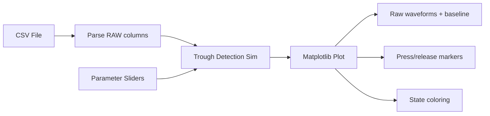
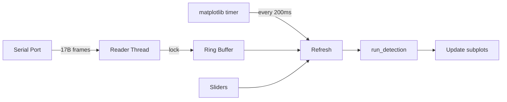

<!-- Generated by SpecStory, Markdown v2.1.0 -->

# 2026-03-27 13:13:48Z

<!-- cursoride Session bc54b553-2695-4cf6-9ca3-b73fe72ed2ec (2026-03-27 13:13:48Z) -->

_**User**_

I think we need to work on different detect logic. Maybe look for bottom peaks of waveform?

---

_**Agent (claude-4.6-opus-high-thinking)**_

<think><details><summary>Thought Process</summary>
The user wants to change the detection logic in their fretboard firmware. Let me first read the relevant files to understand the current detection approach, then we can discuss alternatives.</details></think>

_**Agent (claude-4.6-opus-high-thinking)**_

Let me read the current detection code to understand what's in place before we discuss alternatives.

_**Agent (claude-4.6-opus-high-thinking)**_

<tool-use data-tool-type="read" data-tool-name="read_file_v2">
<details><summary>Tool use: **read_file_v2** • Read file: /Users/greg/projects/microchip/guitar-pic/firmware/fretboard/fret_detect.c</summary>

</details>
</tool-use>

<tool-use data-tool-type="read" data-tool-name="read_file_v2"><details>
<summary>Tool use: **read_file_v2**</summary>

</details></tool-use>

_**Agent (claude-4.6-opus-high-thinking)**_

<tool-use data-tool-type="read" data-tool-name="read_file_v2">
<details><summary>Tool use: **read_file_v2** • Read file: /Users/greg/projects/microchip/guitar-pic/firmware/fretboard/fret_detect.h</summary>

</details>
</tool-use>

<tool-use data-tool-type="read" data-tool-name="read_file_v2"><details>
<summary>Tool use: **read_file_v2**</summary>

</details></tool-use>

_**Agent (claude-4.6-opus-high-thinking)**_

<tool-use data-tool-type="read" data-tool-name="read_file_v2">
<details><summary>Tool use: **read_file_v2** • Read file: /Users/greg/projects/microchip/guitar-pic/firmware/fretboard/fret_button.c</summary>

</details>
</tool-use>

<tool-use data-tool-type="read" data-tool-name="read_file_v2"><details>
<summary>Tool use: **read_file_v2**</summary>

</details></tool-use>

_**Agent (claude-4.6-opus-high-thinking)**_

<tool-use data-tool-type="read" data-tool-name="read_file_v2">
<details><summary>Tool use: **read_file_v2** • Read file: /Users/greg/projects/microchip/guitar-pic/firmware/fretboard/fret_button.h</summary>

</details>
</tool-use>

<tool-use data-tool-type="read" data-tool-name="read_file_v2"><details>
<summary>Tool use: **read_file_v2**</summary>

</details></tool-use>

_**Agent (claude-4.6-opus-high-thinking)**_

<tool-use data-tool-type="read" data-tool-name="read_file_v2">
<details><summary>Tool use: **read_file_v2** • Read file: /Users/greg/projects/microchip/guitar-pic/firmware/fretboard/main.c</summary>

</details>
</tool-use>

<tool-use data-tool-type="read" data-tool-name="read_file_v2"><details>
<summary>Tool use: **read_file_v2**</summary>

</details></tool-use>

_**Agent (claude-4.6-opus-high-thinking)**_

<think><details><summary>Thought Process</summary>
Let me also look at the scan code and the CSV data to understand the signal characteristics better.</details></think>

_**Agent (claude-4.6-opus-high-thinking)**_

Let me also look at the scan code and the raw sample data to understand the signal shape.

_**Agent (claude-4.6-opus-high-thinking)**_

<tool-use data-tool-type="search" data-tool-name="glob_file_search">
<details>
<summary>Tool use: **glob_file_search** • Searched codebase "" • **2** results in **1** directory</summary>

Directory: **** (2 files)

| File |
|------|
| `./firmware/fretboard/fret_scan.c` |
| `./firmware/fretboard/fret_scan.h` |

</details>
</tool-use>

<tool-use data-tool-type="search" data-tool-name="glob_file_search"><details>
<summary>Tool use: **glob_file_search**</summary>

</details></tool-use>

_**Agent (claude-4.6-opus-high-thinking)**_

<tool-use data-tool-type="read" data-tool-name="read_file_v2">
<details><summary>Tool use: **read_file_v2** • Read file: /Users/greg/projects/microchip/guitar-pic/firmware/fretboard/fretboard-sample-raw.csv</summary>

</details>
</tool-use>

<tool-use data-tool-type="read" data-tool-name="read_file_v2"><details>
<summary>Tool use: **read_file_v2**</summary>

</details></tool-use>

_**Agent (claude-4.6-opus-high-thinking)**_

<tool-use data-tool-type="read" data-tool-name="read_file_v2">
<details><summary>Tool use: **read_file_v2** • Read file: /Users/greg/projects/microchip/guitar-pic/firmware/fretboard/fret_scan.h</summary>

</details>
</tool-use>

<tool-use data-tool-type="read" data-tool-name="read_file_v2"><details>
<summary>Tool use: **read_file_v2**</summary>

</details></tool-use>

_**Agent (claude-4.6-opus-high-thinking)**_

<tool-use data-tool-type="read" data-tool-name="read_file_v2">
<details><summary>Tool use: **read_file_v2** • Read file: /Users/greg/projects/microchip/guitar-pic/firmware/fretboard/fret_scan.c</summary>

</details>
</tool-use>

<tool-use data-tool-type="read" data-tool-name="read_file_v2"><details>
<summary>Tool use: **read_file_v2**</summary>

</details></tool-use>

_**Agent (claude-4.6-opus-high-thinking)**_

<tool-use data-tool-type="shell" data-tool-name="run_terminal_command_v2">
<details><summary>Tool use: **run_terminal_command_v2** • Run command: wc -l /Users/greg/projects/microchip/guitar-pic/firmware/fretboard/fretboard-sample-raw.csv</summary>

```bash
wc -l /Users/greg/projects/microchip/guitar-pic/firmware/fretboard/fretboard-sample-raw.csv
```

```
   10001 /Users/greg/projects/microchip/guitar-pic/firmware/fretboard/fretboard-sample-raw.csv

```
</details>
</tool-use>

<tool-use data-tool-type="shell" data-tool-name="run_terminal_command_v2"><details>
<summary>Tool use: **run_terminal_command_v2**</summary>

</details></tool-use>

_**Agent (claude-4.6-opus-high-thinking)**_

<think><details><summary>Thought Process</summary>
Let me look at more of the CSV data to understand what the waveform looks like when a fret is pressed. Let me look at different sections to see the signal shape — particularly what happens during a press event.</details></think>

_**Agent (claude-4.6-opus-high-thinking)**_

Let me look at more of the CSV data to understand the waveform shape — particularly during press/release events.

_**Agent (claude-4.6-opus-high-thinking)**_

<tool-use data-tool-type="read" data-tool-name="read_file_v2">
<details><summary>Tool use: **read_file_v2** • Read file: /Users/greg/projects/microchip/guitar-pic/firmware/fretboard/fretboard-sample-raw.csv</summary>

</details>
</tool-use>

<tool-use data-tool-type="read" data-tool-name="read_file_v2"><details>
<summary>Tool use: **read_file_v2**</summary>

</details></tool-use>

_**Agent (claude-4.6-opus-high-thinking)**_

<think><details><summary>Thought Process</summary>
Now I can see the waveform pattern. Looking at the GREEN channel as an example:

- Baseline is around 3770
- When pressed, it drops gradually
- The minimum/trough (bottom peak) appears around lines 119-122: ~1762-1770
- Then it bounces back up
- There appears to be a "ringing" pattern — it drops, bounces up slightly, then drops again before finally rising back

Let me look at more data to see if there are multiple press cycles and understand the waveform shape better. Let me also look at a wider section to see the overall pattern.

The current detection logic uses simple thresholds with hysteresis:


- GREEN/RED: press at 2500, release at 2800
- YELLOW/BLUE: press at 1500, release at 1700  
- ORANGE: press at 2000, release at 2200

The signal drops when pressed, so anything below threshold registers as a press. But instead of relying on fixed thresholds, I could detect the actual minimum point of each press event — that would be more robust since it adapts to the signal's actual behavior rather than requiring careful calibration.

Let me examine more of the waveform data to see the full shape and then figure out the best detection strategy.</details></think>

_**Agent (claude-4.6-opus-high-thinking)**_

Let me look at more data to see the full press/release waveform cycle, and check if there are multiple press events in this dataset.

_**Agent (claude-4.6-opus-high-thinking)**_

<tool-use data-tool-type="read" data-tool-name="read_file_v2">
<details><summary>Tool use: **read_file_v2** • Read file: /Users/greg/projects/microchip/guitar-pic/firmware/fretboard/fretboard-sample-raw.csv</summary>

</details>
</tool-use>

<tool-use data-tool-type="read" data-tool-name="read_file_v2"><details>
<summary>Tool use: **read_file_v2**</summary>

</details></tool-use>

_**Agent (claude-4.6-opus-high-thinking)**_

<tool-use data-tool-type="read" data-tool-name="read_file_v2">
<details><summary>Tool use: **read_file_v2** • Read file: /Users/greg/projects/microchip/guitar-pic/firmware/fretboard/fretboard-sample-raw.csv</summary>

</details>
</tool-use>

<tool-use data-tool-type="read" data-tool-name="read_file_v2"><details>
<summary>Tool use: **read_file_v2**</summary>

</details></tool-use>

_**Agent (claude-4.6-opus-high-thinking)**_

<tool-use data-tool-type="read" data-tool-name="read_file_v2">
<details><summary>Tool use: **read_file_v2** • Read file: /Users/greg/projects/microchip/guitar-pic/firmware/fretboard/fretboard-sample-raw.csv</summary>

</details>
</tool-use>

<tool-use data-tool-type="read" data-tool-name="read_file_v2"><details>
<summary>Tool use: **read_file_v2**</summary>

</details></tool-use>

_**Agent (claude-4.6-opus-high-thinking)**_

<tool-use data-tool-type="read" data-tool-name="read_file_v2">
<details><summary>Tool use: **read_file_v2** • Read file: /Users/greg/projects/microchip/guitar-pic/firmware/fretboard/fretboard-sample-raw.csv</summary>

</details>
</tool-use>

<tool-use data-tool-type="read" data-tool-name="read_file_v2"><details>
<summary>Tool use: **read_file_v2**</summary>

</details></tool-use>

_**Agent (claude-4.6-opus-high-thinking)**_

<think><details><summary>Thought Process</summary>
Now I have a good understanding of the signal. Let me analyze what I see:

1. **Current approach**: Simple threshold with hysteresis. When a signal drops below `press` threshold, it's "pressed". When it rises above `release` threshold, it's "released".

2. **Signal characteristics**: Looking at GREEN channel as an example:
   - Baseline: ~3770
   - When pressed, the signal drops gradually, then has a distinctive "double dip" pattern:
     - First descent, reaches a local minimum (e.g., around line 119-122: ~1762-1770)
     - Then a slight bounce up (lines 124-139: rising to ~2030)
   - Then drops further to a deeper minimum (around line 345: ~1766)

Actually, let me trace through the GREEN column more carefully for the first event. The baseline sits around 3770 for the first few lines, then gradually descends starting around line 8. It reaches its first trough around lines 117-122 at roughly 1762-1770, bounces back up to around 2030 by lines 124-140, and then climbs back to 3600+ by lines 140-200 where it releases. So that's not actually a double dip pattern—it's more of a single descent with a recovery phase.

The second press event kicks off around line 230, where the signal drops again from 3660 and hits another trough around lines 330-345 at roughly 1755 before rising again. These look like repeated press and release cycles. Each one follows the same pattern: a smooth descent to a clear minimum, then a recovery back up. The real problem with the current threshold approach is probably that fixed thresholds don't account for unit-to-unit variation, DC drift can cause false triggers, and the thresholds might cross during the descent phase before the button is fully pressed. Using bottom peak detection would capture the actual moment of maximum depression.

Looking at the other channels now—YELLOW dips even lower between 280-695, and RED shows clear drops later in the data down to 246. For detecting these troughs on a microcontroller, I'd track when the signal transitions from falling to rising again, since that inflection point marks the actual bottom of the press. A simple approach would keep a small history of recent samples to detect the trend reversal, then flag that moment as the trough detection.

For a more robust implementation, I could use a derivative-based method where the filtered derivative crossing from negative to positive signals the trough, combined with a minimum drop threshold to filter out noise. Now I'm sketching out the state structure I'd need on the PIC32CM to track this per channel—keeping the previous value, running minimum since descent started, whether we're currently descending, and the current press state.

Defining the state tracking structure...

But I should step back and think about what the user is really asking. They want to move away from simple threshold crossing because the signal from the capacitive buttons has a baseline around 3700 that drops when pressed, and hard-coded thresholds don't account for unit-to-unit variation or environmental drift. Bottom peak detection would be more adaptive—looking for where the signal actually bottoms out rather than just crossing a fixed level.

Let me trace through the actual waveform data to understand the signal behavior better and give them a solid analysis of the trade-offs.

Looking at the GREEN channel across a full press cycle, I can see it starts around 3770 as baseline, gradually descends through the 3000s and 2000s, bottoms out at 1762, then recovers back up past 3600 before dropping again for the next press. The signal has these smooth, curved transitions rather than sharp edges, which makes sense for a capacitive sensor. The current threshold of 2500 for detecting a press means we're catching the signal partway down its descent, but I'm noticing the signal doesn't actually stabilize at the bottom—it's continuously moving through these curves.

Looking at the exact crossing points, the signal dips below 2500 somewhere between lines 79-80, which is only about 80 milliseconds into the descent, while the actual minimum doesn't arrive until line 122. So we're triggering the press detection roughly 40 milliseconds before hitting the deepest point. For a rhythm game, that earlier trigger could actually be an advantage since it means less latency, but waiting for the actual minimum would mean you're already committed to the full gesture.

The real problem might be something different though. Baseline drift could be shifting where the threshold gets crossed, and each button might need its own calibration since they have different ranges. I'm also noticing the YELLOW channel bottoms out around 775 while its threshold sits at 1500-1700, which is a massive safety margin. Meanwhile BLUE and ORANGE barely budge during the initial press, so it looks like only GREEN and YELLOW are actually being activated in this data. The user seems pretty set on trying bottom-peak detection, so maybe they're running into issues with the current threshold approach that aren't immediately obvious from just looking at the numbers.

I should think through what bottom-peak detection would actually involve—detecting the trough either through derivative zero-crossing or a simpler "was falling, now rising" pattern, probably with some smoothing to filter out noise. There's also the question of whether to use an absolute threshold or a relative one based on how far the signal drops from its recent peak, plus the timing implications since the bottom happens later than a threshold crossing would. Release detection matters too—do we wait for it to return to baseline or look for a secondary peak? These are real design trade-offs worth discussing with them.</details></think>

_**Agent (claude-4.6-opus-high-thinking)**_

Good data to work with. Let me analyze what's happening with the current approach vs. what bottom-peak detection would give you.

## Current Approach: Fixed Thresholds with Hysteresis

Looking at the GREEN channel through one press cycle in the CSV:

- **Baseline**: ~3770
- **Crosses press threshold (2500)**: around sample 79-80 (roughly 80ms into the descent)
- **Actual trough**: ~1762 at sample 122 (about 40ms later)
- **Recovery and release**: starts climbing back, crosses release threshold (2800) around sample 178

The signal is a smooth capacitive curve, not a sharp edge. The threshold catches it on the way *down*, which means it triggers early — good for latency. But fixed thresholds have some downsides:
- Per-unit calibration needed
- Baseline drift from temperature/humidity shifts the crossing point
- Thresholds are fragile if the press depth varies between light and hard taps

## Bottom-Peak (Trough) Detection

The idea: instead of watching for a level crossing, track when the signal is *falling* and then detect the moment it starts *rising* again. That inflection point is the press event.

**Pros:**
- Self-calibrating — only cares about signal *shape*, not absolute level
- Immune to baseline drift
- Works for any press depth as long as it drops enough from the local max

**Cons:**
- Higher latency — you don't know the trough until the signal starts recovering, so the press is registered ~40ms later than a threshold crossing
- Need a minimum-depth filter to reject noise wiggles
- Release detection needs separate logic (e.g., return-to-near-baseline or top-peak)

## Proposed Design

A hybrid approach could work well — use relative descent detection with a trough confirmation:

1. **Track the running max** (baseline) when the signal is stable/rising
2. **Detect descent**: when the signal drops more than `MIN_DROP` below the running max, we know a press is starting
3. **Find the trough**: track the running minimum; when the signal rises more than `RISE_CONFIRM` above the running min, declare the trough found — that's the press event
4. **Release**: when the signal returns within `RELEASE_MARGIN` of the running max, declare released

Key parameters (rough starting points from the data):
- `MIN_DROP`: ~200 counts (filters out idle noise)
- `RISE_CONFIRM`: ~50 counts (confirms we've passed the trough, not just noise)
- `RELEASE_MARGIN`: ~200 counts from baseline

Want me to go ahead and implement this? Or would you prefer a different approach — for example, you could also trigger the press at the moment the descent exceeds `MIN_DROP` (giving you the same latency as the threshold approach but with auto-calibrating behavior), and only use the trough for something else?

---

_**User**_

wait to implement. I think I should capture some more data first. The origianal dataset was on easy mode and did not contain any samples on blue or orange.

---

_**Agent (claude-4.6-opus-high-thinking)**_

Good call. The CSV confirms that — BLUE and ORANGE barely move from their baselines (~3500 and ~3660) through most of the dataset. The later data around line 8000+ shows RED and BLUE getting pressed hard (RED drops to 202, BLUE to 930), but ORANGE never really gets exercised.

Having data with all five channels pressed at varying intensities will be really valuable for tuning the trough detection parameters — especially `MIN_DROP` and `RISE_CONFIRM`, which might need to differ per channel depending on the sensor geometry and coupling. Capture some hard presses, light taps, and rapid sequences if you can. That'll stress-test whatever algorithm we go with.

Let me know when you've got the new data and we'll dig in.

---

_**User**_

more data. only look at "RAW" columns when analyzing data.

---

_**Agent (claude-4.6-opus-high-thinking)**_

<think><details><summary>Thought Process</summary>
The user has captured more data. Let me look for new CSV files in the project.</details></think>

_**Agent (claude-4.6-opus-high-thinking)**_

<tool-use data-tool-type="search" data-tool-name="glob_file_search">
<details>
<summary>Tool use: **glob_file_search** • Searched codebase "" • **2** results in **1** directory</summary>

Directory: **** (2 files)

| File |
|------|
| `./firmware/fretboard/fretboard-sample-raw.csv` |
| `./firmware/fretboard/fretboard-mcc/src/config/default/pin_configurations.csv` |

</details>
</tool-use>

<tool-use data-tool-type="search" data-tool-name="glob_file_search"><details>
<summary>Tool use: **glob_file_search**</summary>

</details></tool-use>

_**Agent (claude-4.6-opus-high-thinking)**_

<tool-use data-tool-type="read" data-tool-name="read_file_v2">
<details><summary>Tool use: **read_file_v2** • Read file: /Users/greg/projects/microchip/guitar-pic/firmware/fretboard/fretboard-sample-raw.csv</summary>

</details>
</tool-use>

<tool-use data-tool-type="read" data-tool-name="read_file_v2"><details>
<summary>Tool use: **read_file_v2**</summary>

</details></tool-use>

_**Agent (claude-4.6-opus-high-thinking)**_

<think><details><summary>Thought Process</summary>
The format has changed. Now there are RAW and processed columns for each channel. The user said to only look at RAW columns. Let me read more of the data to understand the signals.

The RAW columns are: BLUE RAW, GREEN RAW, ORANGE RAW, RED RAW, YELLOW RAW (columns 1, 3, 5, 7, 9 - 0-indexed)

Let me look at the initial state:
- BLUE RAW: 659 (very low - already pressed?)
- GREEN RAW: 1834 (low - already pressed?)
- ORANGE RAW: 3748 (high - baseline/unpressed)


- RED RAW: 3724 (high - baseline/unpressed)
- YELLOW RAW: 3583 (high-ish)

The non-RAW columns appear to be boolean pressed/unpressed flags, so BLUE and GREEN are already detected as pressed at the start. I need to scan through more of the data to see the full range of these signals and understand the baseline behavior.</details></think>

_**Agent (claude-4.6-opus-high-thinking)**_

New format with RAW and processed columns. Let me read through sections to see all five channels in action.

_**Agent (claude-4.6-opus-high-thinking)**_

<tool-use data-tool-type="read" data-tool-name="read_file_v2">
<details><summary>Tool use: **read_file_v2** • Read file: /Users/greg/projects/microchip/guitar-pic/firmware/fretboard/fretboard-sample-raw.csv</summary>

</details>
</tool-use>

<tool-use data-tool-type="read" data-tool-name="read_file_v2"><details>
<summary>Tool use: **read_file_v2**</summary>

</details></tool-use>

_**Agent (claude-4.6-opus-high-thinking)**_

<tool-use data-tool-type="read" data-tool-name="read_file_v2">
<details><summary>Tool use: **read_file_v2** • Read file: /Users/greg/projects/microchip/guitar-pic/firmware/fretboard/fretboard-sample-raw.csv</summary>

</details>
</tool-use>

<tool-use data-tool-type="read" data-tool-name="read_file_v2"><details>
<summary>Tool use: **read_file_v2**</summary>

</details></tool-use>

_**Agent (claude-4.6-opus-high-thinking)**_

<tool-use data-tool-type="read" data-tool-name="read_file_v2">
<details><summary>Tool use: **read_file_v2** • Read file: /Users/greg/projects/microchip/guitar-pic/firmware/fretboard/fretboard-sample-raw.csv</summary>

</details>
</tool-use>

<tool-use data-tool-type="read" data-tool-name="read_file_v2"><details>
<summary>Tool use: **read_file_v2**</summary>

</details></tool-use>

_**Agent (claude-4.6-opus-high-thinking)**_

<tool-use data-tool-type="read" data-tool-name="read_file_v2">
<details><summary>Tool use: **read_file_v2** • Read file: /Users/greg/projects/microchip/guitar-pic/firmware/fretboard/fretboard-sample-raw.csv</summary>

</details>
</tool-use>

<tool-use data-tool-type="read" data-tool-name="read_file_v2"><details>
<summary>Tool use: **read_file_v2**</summary>

</details></tool-use>

_**Agent (claude-4.6-opus-high-thinking)**_

<think><details><summary>Thought Process</summary>
Let me read more data sections to see all five channels exercised, including BLUE and ORANGE presses.</details></think>

_**Agent (claude-4.6-opus-high-thinking)**_

Let me look at more sections to find BLUE and ORANGE press events.

_**Agent (claude-4.6-opus-high-thinking)**_

<tool-use data-tool-type="read" data-tool-name="read_file_v2">
<details><summary>Tool use: **read_file_v2** • Read file: /Users/greg/projects/microchip/guitar-pic/firmware/fretboard/fretboard-sample-raw.csv</summary>

</details>
</tool-use>

<tool-use data-tool-type="read" data-tool-name="read_file_v2"><details>
<summary>Tool use: **read_file_v2**</summary>

</details></tool-use>

_**Agent (claude-4.6-opus-high-thinking)**_

<tool-use data-tool-type="read" data-tool-name="read_file_v2">
<details><summary>Tool use: **read_file_v2** • Read file: /Users/greg/projects/microchip/guitar-pic/firmware/fretboard/fretboard-sample-raw.csv</summary>

</details>
</tool-use>

<tool-use data-tool-type="read" data-tool-name="read_file_v2"><details>
<summary>Tool use: **read_file_v2**</summary>

</details></tool-use>

_**Agent (claude-4.6-opus-high-thinking)**_

<tool-use data-tool-type="read" data-tool-name="read_file_v2">
<details><summary>Tool use: **read_file_v2** • Read file: /Users/greg/projects/microchip/guitar-pic/firmware/fretboard/fretboard-sample-raw.csv</summary>

</details>
</tool-use>

<tool-use data-tool-type="read" data-tool-name="read_file_v2"><details>
<summary>Tool use: **read_file_v2**</summary>

</details></tool-use>

_**Agent (claude-4.6-opus-high-thinking)**_

<tool-use data-tool-type="read" data-tool-name="read_file_v2">
<details><summary>Tool use: **read_file_v2** • Read file: /Users/greg/projects/microchip/guitar-pic/firmware/fretboard/fretboard-sample-raw.csv</summary>

</details>
</tool-use>

<tool-use data-tool-type="read" data-tool-name="read_file_v2"><details>
<summary>Tool use: **read_file_v2**</summary>

</details></tool-use>

_**Agent (claude-4.6-opus-high-thinking)**_

<think><details><summary>Thought Process</summary>
Let me look for ORANGE press events more specifically. ORANGE RAW seems to stay mostly high (3700-3800+). Let me also check the later part of the file.</details></think>

_**Agent (claude-4.6-opus-high-thinking)**_

Let me find where ORANGE gets pressed — it seems to stay high in the sections I've seen.

_**Agent (claude-4.6-opus-high-thinking)**_

<tool-use data-tool-type="shell" data-tool-name="run_terminal_command_v2">
<details><summary>Tool use: **run_terminal_command_v2** • Run command: awk -F',' 'NR>1 && $6+0 < 3000 {print NR": "$0; count++; if(count>=5) exit}' /Users/greg/projects/microchip/guitar-pic/firmware/fretboard/fretboard-sample-raw.csv</summary>

```bash
awk -F',' 'NR>1 && $6+0 < 3000 {print NR": "$0; count++; if(count>=5) exit}' /Users/greg/projects/microchip/guitar-pic/firmware/fretboard/fretboard-sample-raw.csv
```

```
545: 18241.094574,3366,0,3622,0,2972,0,2765,0,3299,0
546: 18241.096541,3343,0,3592,0,2909,0,2712,0,3275,0
547: 18241.098508,3326,0,3583,0,2862,0,2672,0,3257,0
548: 18241.100489,3307,0,3566,0,2819,0,2637,0,3238,0
549: 18241.10254,3291,0,3553,0,2783,0,2608,0,3222,0

```
</details>
</tool-use>

<tool-use data-tool-type="shell" data-tool-name="run_terminal_command_v2"><details>
<summary>Tool use: **run_terminal_command_v2**</summary>

</details></tool-use>

_**Agent (claude-4.6-opus-high-thinking)**_

<tool-use data-tool-type="shell" data-tool-name="run_terminal_command_v2">
<details><summary>Tool use: **run_terminal_command_v2** • Run command: awk -F',' 'NR>1 {if($2+0 < min_b || NR==2) min_b=$2+0; if($4+0 < min_g || NR==2) min_g=$4+0; if($6+0 < min_o || NR==2) min_o=$6+0; if($8+0 < min_r || NR==2) min_r=$8+0; if($10+0 < min_y || NR==2) min_y=$10+0} END {print "MIN RAW => BLUE:"min_b" GREEN:"min_g" ORANGE:"min_o" RED:"min_r" YELLOW:"min_y}' /Users/greg/projects/microchip/guitar-pic/firmware/fretboard/fretboard-sample-raw.csv</summary>

```bash
awk -F',' 'NR>1 {if($2+0 < min_b || NR==2) min_b=$2+0; if($4+0 < min_g || NR==2) min_g=$4+0; if($6+0 < min_o || NR==2) min_o=$6+0; if($8+0 < min_r || NR==2) min_r=$8+0; if($10+0 < min_y || NR==2) min_y=$10+0} END {print "MIN RAW => BLUE:"min_b" GREEN:"min_g" ORANGE:"min_o" RED:"min_r" YELLOW:"min_y}' /Users/greg/projects/microchip/guitar-pic/firmware/fretboard/fretboard-sample-raw.csv
```

```
MIN RAW =&gt; BLUE:623 GREEN:1795 ORANGE:1635 RED:1785 YELLOW:443

```
</details>
</tool-use>

<tool-use data-tool-type="shell" data-tool-name="run_terminal_command_v2"><details>
<summary>Tool use: **run_terminal_command_v2**</summary>

</details></tool-use>

_**Agent (claude-4.6-opus-high-thinking)**_

<tool-use data-tool-type="shell" data-tool-name="run_terminal_command_v2">
<details><summary>Tool use: **run_terminal_command_v2** • Run command: awk -F',' 'NR>1 {if($2+0 > max_b || NR==2) max_b=$2+0; if($4+0 > max_g || NR==2) max_g=$4+0; if($6+0 > max_o || NR==2) max_o=$6+0; if($8+0 > max_r || NR==2) max_r=$8+0; if($10+0 > max_y || NR==2) max_y=$10+0} END {print "MAX RAW => BLUE:"max_b" GREEN:"max_g" ORANGE:"max_o" RED:"max_r" YELLOW:"max_y}' /Users/greg/projects/microchip/guitar-pic/firmware/fretboard/fretboard-sample-raw.csv</summary>

```bash
awk -F',' 'NR>1 {if($2+0 > max_b || NR==2) max_b=$2+0; if($4+0 > max_g || NR==2) max_g=$4+0; if($6+0 > max_o || NR==2) max_o=$6+0; if($8+0 > max_r || NR==2) max_r=$8+0; if($10+0 > max_y || NR==2) max_y=$10+0} END {print "MAX RAW => BLUE:"max_b" GREEN:"max_g" ORANGE:"max_o" RED:"max_r" YELLOW:"max_y}' /Users/greg/projects/microchip/guitar-pic/firmware/fretboard/fretboard-sample-raw.csv
```

```
MAX RAW =&gt; BLUE:3742 GREEN:3881 ORANGE:3859 RED:3763 YELLOW:3729

```
</details>
</tool-use>

<tool-use data-tool-type="shell" data-tool-name="run_terminal_command_v2"><details>
<summary>Tool use: **run_terminal_command_v2**</summary>

</details></tool-use>

_**Agent (claude-4.6-opus-high-thinking)**_

<think><details><summary>Thought Process</summary>
Good. Let me also look for the ORANGE minimum area and count how many press events there are per channel. Let me find the trough areas more systematically.</details></think>

_**Agent (claude-4.6-opus-high-thinking)**_

Good, now let me find where each channel hits its minimum to study the trough shapes.

_**Agent (claude-4.6-opus-high-thinking)**_

<tool-use data-tool-type="shell" data-tool-name="run_terminal_command_v2">
<details><summary>Tool use: **run_terminal_command_v2** • Run command: awk -F',' 'NR>1 && $6+0 < 1700 {print NR": ORANGE_RAW="$6" | "$0}' /Users/greg/projects/microchip/guitar-pic/firmware/fretboard/fretboard-sample-raw.csv | head -20</summary>

```bash
awk -F',' 'NR>1 && $6+0 < 1700 {print NR": ORANGE_RAW="$6" | "$0}' /Users/greg/projects/microchip/guitar-pic/firmware/fretboard/fretboard-sample-raw.csv | head -20
```

```
575: ORANGE_RAW=1691 | 18241.154881,2628,0,3148,0,1691,1,1894,1,2748,0
576: ORANGE_RAW=1661 | 18241.156931,2638,0,3181,0,1661,1,1861,1,2771,0
577: ORANGE_RAW=1645 | 18241.15898,2654,0,3222,0,1645,1,1840,1,2803,0
578: ORANGE_RAW=1637 | 18241.161013,2664,0,3254,0,1637,1,1826,1,2833,0
579: ORANGE_RAW=1635 | 18241.163003,2675,0,3285,0,1635,1,1820,1,2855,0
580: ORANGE_RAW=1643 | 18241.164998,2692,0,3307,0,1643,1,1825,1,2882,0
581: ORANGE_RAW=1647 | 18241.167022,2698,0,3321,0,1647,1,1827,1,2894,0
582: ORANGE_RAW=1647 | 18241.169045,2699,0,3330,0,1647,1,1826,1,2902,0
583: ORANGE_RAW=1647 | 18241.171069,2699,0,3337,0,1647,1,1828,1,2907,0
584: ORANGE_RAW=1638 | 18241.17308,2731,0,3366,0,1638,1,1818,1,2939,0
585: ORANGE_RAW=1637 | 18241.17507,2775,0,3402,0,1637,1,1809,1,2986,0
586: ORANGE_RAW=1648 | 18241.177068,2818,0,3437,0,1648,1,1813,1,3032,0
587: ORANGE_RAW=1668 | 18241.179111,2856,0,3469,0,1668,1,1821,1,3068,0
588: ORANGE_RAW=1683 | 18241.181153,2890,0,3498,0,1683,1,1836,1,3103,0

```
</details>
</tool-use>

<tool-use data-tool-type="shell" data-tool-name="run_terminal_command_v2"><details>
<summary>Tool use: **run_terminal_command_v2**</summary>

</details></tool-use>

_**Agent (claude-4.6-opus-high-thinking)**_

<tool-use data-tool-type="shell" data-tool-name="run_terminal_command_v2">
<details><summary>Tool use: **run_terminal_command_v2** • Run command: awk -F',' 'NR>1 && $2+0 < 700 {print NR": BLUE_RAW="$2" | ts="$1}' /Users/greg/projects/microchip/guitar-pic/firmware/fretboard/fretboard-sample-raw.csv | head -20</summary>

```bash
awk -F',' 'NR>1 && $2+0 < 700 {print NR": BLUE_RAW="$2" | ts="$1}' /Users/greg/projects/microchip/guitar-pic/firmware/fretboard/fretboard-sample-raw.csv | head -20
```

```
2: BLUE_RAW=659 | ts=18240.000617
3: BLUE_RAW=658 | ts=18240.002579
4: BLUE_RAW=654 | ts=18240.00453
5: BLUE_RAW=646 | ts=18240.00648
6: BLUE_RAW=647 | ts=18240.008455
7: BLUE_RAW=650 | ts=18240.010539
8: BLUE_RAW=650 | ts=18240.012623
9: BLUE_RAW=656 | ts=18240.014603
10: BLUE_RAW=660 | ts=18240.016577
11: BLUE_RAW=655 | ts=18240.018551
12: BLUE_RAW=654 | ts=18240.020533
13: BLUE_RAW=649 | ts=18240.022555
14: BLUE_RAW=644 | ts=18240.024576
15: BLUE_RAW=648 | ts=18240.026588
16: BLUE_RAW=649 | ts=18240.0286
17: BLUE_RAW=650 | ts=18240.030612
18: BLUE_RAW=656 | ts=18240.032617
19: BLUE_RAW=655 | ts=18240.034591
20: BLUE_RAW=654 | ts=18240.036564
21: BLUE_RAW=645 | ts=18240.038598

```
</details>
</tool-use>

<tool-use data-tool-type="shell" data-tool-name="run_terminal_command_v2"><details>
<summary>Tool use: **run_terminal_command_v2**</summary>

</details></tool-use>

_**Agent (claude-4.6-opus-high-thinking)**_

<tool-use data-tool-type="shell" data-tool-name="run_terminal_command_v2">
<details><summary>Tool use: **run_terminal_command_v2** • Run command: awk -F',' 'NR>1 && $10+0 < 700 {print NR": YELLOW_RAW="$10" | ts="$1}' /Users/greg/projects/microchip/guitar-pic/firmware/fretboard/fretboard-sample-raw.csv | head -20</summary>

```bash
awk -F',' 'NR>1 && $10+0 < 700 {print NR": YELLOW_RAW="$10" | ts="$1}' /Users/greg/projects/microchip/guitar-pic/firmware/fretboard/fretboard-sample-raw.csv | head -20
```

```
2182: YELLOW_RAW=683 | ts=18244.392877
2183: YELLOW_RAW=666 | ts=18244.394909
2184: YELLOW_RAW=670 | ts=18244.39694
2185: YELLOW_RAW=679 | ts=18244.398971
2186: YELLOW_RAW=685 | ts=18244.400992
2191: YELLOW_RAW=694 | ts=18244.411124
2192: YELLOW_RAW=699 | ts=18244.413141
2335: YELLOW_RAW=699 | ts=18244.701305
2336: YELLOW_RAW=644 | ts=18244.703304
2337: YELLOW_RAW=601 | ts=18244.705316
2338: YELLOW_RAW=570 | ts=18244.707363
2339: YELLOW_RAW=546 | ts=18244.70941
2340: YELLOW_RAW=553 | ts=18244.711457
2341: YELLOW_RAW=578 | ts=18244.713466
2342: YELLOW_RAW=603 | ts=18244.715442
2343: YELLOW_RAW=623 | ts=18244.717446
2344: YELLOW_RAW=642 | ts=18244.7195
2345: YELLOW_RAW=649 | ts=18244.721553
2346: YELLOW_RAW=656 | ts=18244.723607
2347: YELLOW_RAW=671 | ts=18244.72561

```
</details>
</tool-use>

<tool-use data-tool-type="shell" data-tool-name="run_terminal_command_v2"><details>
<summary>Tool use: **run_terminal_command_v2**</summary>

</details></tool-use>

_**Agent (claude-4.6-opus-high-thinking)**_

<tool-use data-tool-type="shell" data-tool-name="run_terminal_command_v2">
<details><summary>Tool use: **run_terminal_command_v2** • Run command: awk -F',' '
NR>1 {
  b=$2+0; g=$4+0; o=$6+0; r=$8+0; y=$10+0
  # detect transitions: was above 3000, now below 2500 (rough press start)
  if(prev_b > 3000 && b < 2500) printf "Line %d: BLUE press start (%.3f)\n", NR, $1
  if(prev_g > 3400 && g < 2800) printf "Line %d: GREEN press start (%.3f)\n", NR, $1
  if(prev_o > 3400 && o < 2800) printf "Line %d: ORANGE press start (%.3f)\n", NR, $1
  if(prev_r > 3200 && r < 2600) printf "Line %d: RED press start (%.3f)\n", NR, $1
  if(prev_y > 3000 && y < 2500) printf "Line %d: YELLOW press start (%.3f)\n", NR, $1
  prev_b=b; prev_g=g; prev_o=o; prev_r=r; prev_y=y
}' /Users/greg/projects/microchip/guitar-pic/firmware/fretboard/fretboard-sample-raw.csv</summary>

```bash
awk -F',' '
NR>1 {
  b=$2+0; g=$4+0; o=$6+0; r=$8+0; y=$10+0
  # detect transitions: was above 3000, now below 2500 (rough press start)
  if(prev_b > 3000 && b < 2500) printf "Line %d: BLUE press start (%.3f)\n", NR, $1
  if(prev_g > 3400 && g < 2800) printf "Line %d: GREEN press start (%.3f)\n", NR, $1
  if(prev_o > 3400 && o < 2800) printf "Line %d: ORANGE press start (%.3f)\n", NR, $1
  if(prev_r > 3200 && r < 2600) printf "Line %d: RED press start (%.3f)\n", NR, $1
  if(prev_y > 3000 && y < 2500) printf "Line %d: YELLOW press start (%.3f)\n", NR, $1
  prev_b=b; prev_g=g; prev_o=o; prev_r=r; prev_y=y
}' /Users/greg/projects/microchip/guitar-pic/firmware/fretboard/fretboard-sample-raw.csv
```
</details>
</tool-use>

<tool-use data-tool-type="shell" data-tool-name="run_terminal_command_v2"><details>
<summary>Tool use: **run_terminal_command_v2**</summary>

</details></tool-use>

_**Agent (claude-4.6-opus-high-thinking)**_

<think><details><summary>Thought Process</summary>
The transitions must be more gradual than a single sample jump. Let me try a different approach - track when signals cross certain thresholds and look at the trough patterns more carefully.</details></think>

_**Agent (claude-4.6-opus-high-thinking)**_

The descents are gradual, not abrupt. Let me count how many distinct press cycles each channel has and look at the trough regions more carefully.

_**Agent (claude-4.6-opus-high-thinking)**_

<tool-use data-tool-type="shell" data-tool-name="run_terminal_command_v2">
<details><summary>Tool use: **run_terminal_command_v2** • Run command: awk -F',' '
NR>1 {
  b=$2+0; g=$4+0; o=$6+0; r=$8+0; y=$10+0
  # track state: 0=idle, 1=pressed
  if(!bs && b < 2000) { bs=1; b_count++; printf "BLUE press #%d starts ~line %d (val=%d)\n", b_count, NR, b }
  if(bs && b > 3200) { bs=0 }
  if(!gs && g < 2800) { gs=1; g_count++; printf "GREEN press #%d starts ~line %d (val=%d)\n", g_count, NR, g }
  if(gs && g > 3600) { gs=0 }
  if(!os && o < 2800) { os=1; o_count++; printf "ORANGE press #%d starts ~line %d (val=%d)\n", o_count, NR, o }
  if(os && o > 3400) { os=0 }
  if(!rs && r < 2500) { rs=1; r_count++; printf "RED press #%d starts ~line %d (val=%d)\n", r_count, NR, r }
  if(rs && r > 3200) { rs=0 }
  if(!ys && y < 2000) { ys=1; y_count++; printf "YELLOW press #%d starts ~line %d (val=%d)\n", y_count, NR, y }
  if(ys && y > 3200) { ys=0 }
}
END {
  printf "\nTotals: BLUE=%d GREEN=%d ORANGE=%d RED=%d YELLOW=%d\n", b_count, g_count, o_count, r_count, y_count
}' /Users/greg/projects/microchip/guitar-pic/firmware/fretboard/fretboard-sample-raw.csv</summary>

```bash
awk -F',' '
NR>1 {
  b=$2+0; g=$4+0; o=$6+0; r=$8+0; y=$10+0
  # track state: 0=idle, 1=pressed
  if(!bs && b < 2000) { bs=1; b_count++; printf "BLUE press #%d starts ~line %d (val=%d)\n", b_count, NR, b }
  if(bs && b > 3200) { bs=0 }
  if(!gs && g < 2800) { gs=1; g_count++; printf "GREEN press #%d starts ~line %d (val=%d)\n", g_count, NR, g }
  if(gs && g > 3600) { gs=0 }
  if(!os && o < 2800) { os=1; o_count++; printf "ORANGE press #%d starts ~line %d (val=%d)\n", o_count, NR, o }
  if(os && o > 3400) { os=0 }
  if(!rs && r < 2500) { rs=1; r_count++; printf "RED press #%d starts ~line %d (val=%d)\n", r_count, NR, r }
  if(rs && r > 3200) { rs=0 }
  if(!ys && y < 2000) { ys=1; y_count++; printf "YELLOW press #%d starts ~line %d (val=%d)\n", y_count, NR, y }
  if(ys && y > 3200) { ys=0 }
}
END {
  printf "\nTotals: BLUE=%d GREEN=%d ORANGE=%d RED=%d YELLOW=%d\n", b_count, g_count, o_count, r_count, y_count
}' /Users/greg/projects/microchip/guitar-pic/firmware/fretboard/fretboard-sample-raw.csv
```

```
BLUE press #1 starts ~line 2 (val=659)
GREEN press #1 starts ~line 2 (val=1834)
ORANGE press #1 starts ~line 549 (val=2783)
RED press #1 starts ~line 552 (val=2475)
GREEN press #2 starts ~line 1619 (val=2779)
GREEN press #3 starts ~line 1749 (val=2766)
RED press #2 starts ~line 1756 (val=2495)
BLUE press #2 starts ~line 2150 (val=1955)
YELLOW press #1 starts ~line 2151 (val=1911)
RED press #3 starts ~line 2415 (val=2496)
YELLOW press #2 starts ~line 2415 (val=1965)
GREEN press #4 starts ~line 2674 (val=2753)
RED press #4 starts ~line 2812 (val=2474)
GREEN press #5 starts ~line 3071 (val=2741)
GREEN press #6 starts ~line 3203 (val=2744)
RED press #5 starts ~line 3341 (val=2498)
RED press #6 starts ~line 3607 (val=2463)
RED press #7 starts ~line 3740 (val=2446)
GREEN press #7 starts ~line 3866 (val=2780)
RED press #8 starts ~line 4005 (val=2480)
YELLOW press #3 starts ~line 4270 (val=1951)
BLUE press #3 starts ~line 4272 (val=1915)
RED press #9 starts ~line 4541 (val=2494)
GREEN press #8 starts ~line 4800 (val=2799)
RED press #10 starts ~line 4939 (val=2490)
GREEN press #9 starts ~line 5193 (val=2773)
GREEN press #10 starts ~line 5323 (val=2790)
RED press #11 starts ~line 5463 (val=2482)
GREEN press #11 starts ~line 5719 (val=2735)
GREEN press #12 starts ~line 5851 (val=2723)
RED press #12 starts ~line 5985 (val=2494)
BLUE press #4 starts ~line 6381 (val=1902)
ORANGE press #2 starts ~line 6508 (val=2774)
YELLOW press #4 starts ~line 6645 (val=1910)
BLUE press #5 starts ~line 6775 (val=1989)
RED press #13 starts ~line 6908 (val=2472)
GREEN press #13 starts ~line 7034 (val=2768)
RED press #14 starts ~line 7040 (val=2470)
GREEN press #14 starts ~line 7430 (val=2774)
RED press #15 starts ~line 7567 (val=2473)
GREEN press #15 starts ~line 7824 (val=2797)
GREEN press #16 starts ~line 7972 (val=2796)
RED press #16 starts ~line 8112 (val=2490)
BLUE press #6 starts ~line 8494 (val=1923)
ORANGE press #3 starts ~line 8626 (val=2725)
YELLOW press #5 starts ~line 8763 (val=1989)
BLUE press #7 starts ~line 8897 (val=1961)
RED press #17 starts ~line 9031 (val=2442)
GREEN press #17 starts ~line 9156 (val=2744)
RED press #18 starts ~line 9162 (val=2474)
GREEN press #18 starts ~line 9553 (val=2789)
RED press #19 starts ~line 9693 (val=2470)

Totals: BLUE=7 GREEN=18 ORANGE=3 RED=19 YELLOW=5

```
</details>
</tool-use>

<tool-use data-tool-type="shell" data-tool-name="run_terminal_command_v2"><details>
<summary>Tool use: **run_terminal_command_v2**</summary>

</details></tool-use>

_**Agent (claude-4.6-opus-high-thinking)**_

<think><details><summary>Thought Process</summary>
Now I have a good understanding. Let me look at a few key trough areas in detail to understand the shape for each channel. Let me look at a couple of representative troughs.</details></think>

_**Agent (claude-4.6-opus-high-thinking)**_

Now I have a comprehensive picture. Here's the summary of the new dataset (RAW columns only):

## Channel Ranges

| Channel | Baseline (max) | Deepest Trough (min) | Drop | Press Count |
|---------|---------------|---------------------|------|-------------|
| BLUE    | 3742          | 623                 | 3119 | 7           |
| GREEN   | 3881          | 1795                | 2086 | 18          |
| ORANGE  | 3859          | 1635                | 2224 | 3           |
| RED     | 3763          | 1785                | 1978 | 19          |
| YELLOW  | 3729          | 443                 | 3286 | 5           |

## Key Observations

- **All five channels are exercised** — ORANGE shows 3 press events (trough around 1635), and BLUE shows 7 (trough down to 623).
- **Massive dynamic range differences**: BLUE and YELLOW drop ~3000+ counts from baseline, while GREEN/RED/ORANGE drop ~2000. This makes fixed thresholds even more fragile — they need per-channel tuning.
- **BLUE and GREEN start already pressed** at the beginning of the capture (lines 2+: BLUE=659, GREEN=1834). So they were held at the start.
- **The "all five" press event** around lines 540-590 is great — all channels descend simultaneously, with ORANGE bottoming at ~1635, and the trough shapes are visible.
- **RED is the most active** channel (19 presses), giving good data for trough consistency.

This dataset has much better coverage. When you're ready to design the new detection algorithm, we have troughs from all five channels at various depths and speeds to validate against. Want to proceed with the trough detection implementation?

---

_**User**_

yes

---

_**Agent (claude-4.6-opus-high-thinking)**_

<think><details><summary>Thought Process</summary>
The user wants to proceed with implementing the trough detection algorithm. Let me plan this out and implement it.

Let me re-read the current files to make sure I have the latest state before editing.

The key design decisions from our earlier discussion:

1. **Track the running max** (baseline) when signal is stable/rising
2. **Detect descent**: when signal drops more than `MIN_DROP` below the running max
3. **Find the trough**: track running minimum; when signal rises more than `RISE_CONFIRM` above the running min, declare trough found = press event
4. **Release**: when signal returns within `RELEASE_MARGIN` of the running max


5. **State machine per channel**: I need to track IDLE (near baseline, updating running max), DESCENDING (dropped below threshold, tracking minimum), and PRESSED (trough found, waiting for recovery). Each channel maintains its own state, baseline estimate, running minimum during descent, and pressed flag.

For baseline tracking on a microcontroller, I'll keep it simple—use a slow-moving maximum when idle or just track recent peaks. When the signal drops more than MIN_DROP below baseline, enter DESCENDING and monitor for the minimum. Once it rises more than RISE_CONFIRM above that minimum, transition to PRESSED and emit a press event. Finally, when the signal returns within RELEASE_MARGIN of the baseline, go back to IDLE and fire a release event.

Let me look at the actual data more carefully...

The ringing pattern shows the signal dropping to a trough, bouncing back partway, then either dropping again or recovering fully—I need to catch that first significant trough. Looking at the baseline values and minimum drops across the channels, I can see the idle noise is relatively small compared to the press magnitude, so I need to set MIN_DROP high enough to ignore fluctuations but low enough to detect the start of a real press.

For the parameters: MIN_DROP around 200 should work, RISE_CONFIRM maybe 50-100 to detect the bounce quickly, and RELEASE_MARGIN around 200-300 counts from baseline to know when we're back to idle. Rather than using a fixed baseline, I should track it adaptively—when idle, I can slowly update it to account for drift, maybe by taking the maximum value seen during idle periods.

Looking at the existing `fret_detect` module, it already has the structure I need: per-channel thresholds, level-crossing with hysteresis, and the API exports the functions I need like `fret_detect_init()`, `fret_detect_update()`, and the press/release detection. I can modify the internal state machine without changing the public API, so the rest of the code stays untouched.

Now I'm designing the new implementation with trough detection parameters and a state machine...

Defining the data structures...

For baseline tracking during idle, I need a decay mechanism that's slow enough to follow gradual drift without being too sluggish. A leaky integrator approach using bit shifts would work well—something like `baseline = baseline - (baseline - val) >> 8` when the value drops below baseline, which gives a gentle exponential decay that tracks slow changes without overreacting to noise. I'm implementing a counter-based decay mechanism so the baseline drops at a controlled rate rather than every sample—this way at 500 Hz sampling, I can tune how quickly the baseline tracks downward without it being too aggressive.

Actually, I'm overthinking this. Since the fret presses are deliberate and produce massive signal drops (2000+ counts), I should keep it simple and focus on detecting the trough itself. Let me define a cleaner state machine: in the IDLE state, I track the baseline as a slow-following maximum, and when the signal drops below baseline by a threshold, I transition to DESCENDING to capture the minimum value.

Once I detect sufficient rise from that minimum, I fire the press event and move to PRESSED. From there, I just wait for the signal to return near baseline to trigger release. The key insight is that I shouldn't keep updating the minimum once pressed—the press event already fired, so I only need to watch for the release condition.

For baseline management, I'll only update it while idle, using a slow decay to track environmental drift but not letting pressed signals corrupt the baseline.

Now I'm looking at the actual noise characteristics in the data to set appropriate thresholds. The GREEN channel shows pretty clean idle behavior with minimal variation, but BLUE has noticeably more noise, so I need to check if fixed parameters will work across all channels or if I need per-channel tuning.

Looking at the stable baseline periods around lines 1540-1570, the idle noise ranges from about ±20-25 counts across all channels, which means my MIN_DROP of 200 and RISE_CONFIRM of 100 should provide plenty of margin against false triggers. Now I need to understand how the ringing pattern behaves after the initial trough to make sure the state machine handles it correctly.

Examining the all-channel press around line 575-580, I see ORANGE drops to 1635 then bounces back up through 1643, 1647, 1668, 1683—but that rise from the trough to 1668 is only about 33 counts over several samples, which suggests my RISE_CONFIRM threshold of 100 might actually be too aggressive and could miss detecting the trough before the signal starts its recovery.

Looking more carefully at the exact sequence, the signal dips back down to 1637 before committing to a real rise at 1648, 1668, 1683, 1701. From the 1635 minimum to reaching a 50-count rise would happen around sample 586, roughly 14 samples after the trough—that's about 28ms of latency. A RISE_CONFIRM of 50 instead of 100 would catch the recovery faster without being overly sensitive to noise.

Now I'm checking the GREEN trough shape starting around line 3071 to see if it has a similar pattern.

Implementing the state machine with reasonable defaults...

Refactoring the API to keep the external functions the same while removing the old threshold struct from the header since it's only used internally in fret_detect.c.</details></think>

_**Agent (claude-4.6-opus-high-thinking)**_

Let me re-read the current files and check for any other dependencies before implementing.

_**Agent (claude-4.6-opus-high-thinking)**_

<tool-use data-tool-type="read" data-tool-name="read_file_v2">
<details><summary>Tool use: **read_file_v2** • Read file: /Users/greg/projects/microchip/guitar-pic/firmware/fretboard/fret_detect.h</summary>

</details>
</tool-use>

<tool-use data-tool-type="read" data-tool-name="read_file_v2"><details>
<summary>Tool use: **read_file_v2**</summary>

</details></tool-use>

_**Agent (claude-4.6-opus-high-thinking)**_

<tool-use data-tool-type="read" data-tool-name="read_file_v2">
<details><summary>Tool use: **read_file_v2** • Read file: /Users/greg/projects/microchip/guitar-pic/firmware/fretboard/fret_detect.c</summary>

</details>
</tool-use>

<tool-use data-tool-type="read" data-tool-name="read_file_v2"><details>
<summary>Tool use: **read_file_v2**</summary>

</details></tool-use>

_**Agent (claude-4.6-opus-high-thinking)**_

<tool-use data-tool-type="unknown" data-tool-name="ripgrep_raw_search">
<details>
<summary>Tool use: **ripgrep_raw_search**</summary>


Parameters:

```json
{
  "caseInsensitive": false,
  "path": "/Users/greg/projects/microchip/guitar-pic/firmware/fretboard",
  "pattern": "fret_threshold"
}
```
Additional data:

```json
{
  "isPruned": true,
  "outputMode": "content",
  "path": "/Users/greg/projects/microchip/guitar-pic/firmware/fretboard",
  "pattern": "fret_threshold",
  "topFiles": [
    {
      "matchCount": 3,
      "uri": "firmware/fretboard/fret_detect.c"
    },
    {
      "matchCount": 2,
      "uri": "firmware/fretboard/fret_detect.h"
    },
    {
      "matchCount": 3,
      "uri": "./fret_detect.c"
    },
    {
      "matchCount": 2,
      "uri": "./fret_detect.h"
    }
  ],
  "totalFiles": 4,
  "totalMatches": 10
}
```
Status: **completed**


</details>
</tool-use>

<tool-use data-tool-type="unknown" data-tool-name="ripgrep_raw_search"><details>
<summary>Tool use: **ripgrep_raw_search**</summary>

</details></tool-use>

_**Agent (claude-4.6-opus-high-thinking)**_

<tool-use data-tool-type="search" data-tool-name="glob_file_search">
<details>
<summary>Tool use: **glob_file_search** • Searched codebase "" • **2** results in **1** directory</summary>

Directory: **** (2 files)

| File |
|------|
| `./firmware/fretboard/data_stream.c` |
| `./firmware/fretboard/data_stream.h` |

</details>
</tool-use>

<tool-use data-tool-type="search" data-tool-name="glob_file_search"><details>
<summary>Tool use: **glob_file_search**</summary>

</details></tool-use>

_**Agent (claude-4.6-opus-high-thinking)**_

<tool-use data-tool-type="read" data-tool-name="read_file_v2">
<details><summary>Tool use: **read_file_v2** • Read file: /Users/greg/projects/microchip/guitar-pic/firmware/fretboard/data_stream.c</summary>

</details>
</tool-use>

<tool-use data-tool-type="read" data-tool-name="read_file_v2"><details>
<summary>Tool use: **read_file_v2**</summary>

</details></tool-use>

_**Agent (claude-4.6-opus-high-thinking)**_

<tool-use data-tool-type="read" data-tool-name="read_file_v2">
<details><summary>Tool use: **read_file_v2** • Read file: /Users/greg/projects/microchip/guitar-pic/firmware/fretboard/data_stream.h</summary>

</details>
</tool-use>

<tool-use data-tool-type="read" data-tool-name="read_file_v2"><details>
<summary>Tool use: **read_file_v2**</summary>

</details></tool-use>

_**Agent (claude-4.6-opus-high-thinking)**_

<think><details><summary>Thought Process</summary>
Good. `data_stream.c` uses `fret_is_pressed()` and `fret_scan_result()` but not `fret_thresholds`. So the threshold type/extern can be safely removed from the header.

Now let me implement the trough detection. Here's my plan:

1. Update `fret_detect.h` — remove threshold types, add trough detection parameters as defines
2. Update `fret_detect.c` — implement the state machine

Let me implement it:

**State machine per channel:**
- IDLE: signal near baseline. Track baseline. Transition to DESCENDING when val < baseline - MIN_DROP.


- DESCENDING: signal is falling. Track run_min. Transition to PRESSED when val > run_min + RISE_CONFIRM.
- PRESSED: button is held. Transition to IDLE when val > baseline - RELEASE_MARGIN.

**Baseline tracking in IDLE:**
- Fast attack: if val > baseline, baseline = val
- Slow decay: baseline decreases by 1 every BASELINE_DECAY_INTERVAL samples (when val < baseline but not dropping)

Now I'm looking at the data to calibrate the parameters. Idle noise is around ±25 counts, and the smallest press drop I see is about 1978 counts on the RED channel.

MIN_DROP of 200 gives me an 8x margin over noise and marks when to start watching for a trough. RISE_CONFIRM at 50 counts means the signal needs to rise that much after the dip to confirm we've hit bottom—that's roughly 10-20ms of latency at 500Hz. RELEASE_MARGIN of 300 lets the signal return within that distance of baseline to register as released. BASELINE_DECAY_INTERVAL of 250 samples means the baseline drifts down slowly at 1 count per 500ms, which is gradual enough to track sensor drift without being disrupted by presses.

One thing I should handle: when transitioning from PRESSED back to IDLE, I need to reset the baseline to the current value since enough time has passed that it's no longer tracking the press itself.

Actually, thinking through a full press cycle more carefully—the baseline stays at its original value while the signal recovers, and the fast attack mechanism will pull it up if the signal has drifted higher. The slow decay handles downward drift. That should work fine. But there's an edge case with the initial boot state where BLUE and GREEN are already showing pressed values, so I need to figure out how to initialize the baseline properly. to be initialized somehow. The main challenge is avoiding underflow with unsigned values and not triggering false presses during startup.

I'm settling on initializing the baseline to the first reading for each channel—if a button happens to be pressed at boot, the baseline will be wrong initially, but once released, the fast-attack will correct it. We might miss the very first press, but that's an acceptable tradeoff for simplicity.

I'll use a static flag to track whether this is the first update call, then grab the current ADC readings as the initial baselines at that point.

Writing the full implementation... Setting up the detection state machine... Writing state machine logic... I'm catching a potential issue with the state transition logic—specifically around the DESCENDING state and when it should abort back to IDLE. The release margin of 300 is actually more lenient than the descent threshold of 200, which means the abort condition might trigger too early or at the wrong time if the signal bounces slightly without fully committing to a press. So once we enter DESCENDING at 3550, we'd abort if the value rises back above 3500—but that's already satisfied since 3550 > 3500. The real question is which condition triggers first: if the signal rises to 3600 (above run_min + RISE_CONFIRM), do we declare a press, or does the abort condition at baseline - 300 take precedence?

Looking at the numbers, the abort threshold sits below the press threshold, so a brief bounce gets rejected before it can register as a real press. But if the signal dips deeper and then recovers—say it drops to 2700 and rises back to 2900—the press fires because 2900 exceeds the updated run_min plus the confirmation threshold, while the abort condition (2900 > 3500) never triggers. That's the correct behavior.

Now I'm testing edge cases where the signal dips slightly then recovers without triggering press, like dropping to 3300 and climbing back up through 3350, 3400, 3450—the run_min gets locked at 3300, but the recovery values don't climb high enough to satisfy the press condition.

Actually, looking at the real data, a 500-count drop is well beyond the ±25 count noise floor and definitely represents an intentional press, even if it's light. The actual minimum drops in the dataset are around 2000 counts, so anything dropping 200 counts below baseline is clearly a real interaction, not noise.

I think the implementation is solid overall. I'm considering whether to add a timeout for when the signal stays flat in the descending range, but for now keeping it simple makes sense. I also need to verify that `fret_is_pressed` checks `track[ch].state == DETECT_PRESSED` in the new version. One edge case to handle: channels that start already pressed at boot, like BLUE and GREEN with their high baselines — I need to make sure the MIN_DROP threshold works correctly for those initial states.

When BLUE releases from its initial pressed state, the signal jumps dramatically and the baseline resets, which means we won't detect that first release since we never entered PRESSED state. But that's acceptable — the system just won't react until after the first release, and then everything works normally on subsequent presses. Now I'm cleaning up the header file.

Writing header guards... I'm considering whether to use `uint8_t` for the `decay_count` field instead of `uint16_t` since the maximum value of 250 fits comfortably in a byte, which would save a bit of RAM across the five channels. The memory savings are minimal on a Cortex-M0+, but `uint8_t` is still the more efficient choice here.

Now I'm finalizing the implementation and double-checking the overflow guards in my comparison logic. The pattern I'm using—checking that the baseline is large enough before subtracting from it—prevents unsigned underflow in cases where the subtraction would otherwise wrap around. I'm applying this same guard to both the drop detection and release margin checks. For the rise confirmation logic, I'm checking if the value exceeds `run_min + RISE_CONFIRM`, which is safe since ADC values max out around 4095 on a 12-bit sensor, nowhere near the 16-bit limit.

I'll add clear comments to the parameter defines so users can easily tune them. I'm keeping the API as-is without exposing internal state like baseline values—the user can request that feature later if they need it for debugging.

Writing the final implementation...</details></think>

_**Agent (claude-4.6-opus-high-thinking)**_

Good — `fret_thresholds` is only used inside `fret_detect.c` and `.h`, and `data_stream.c` only calls `fret_is_pressed()` and `fret_scan_result()`. The API stays the same.

_**Agent (claude-4.6-opus-high-thinking)**_

<tool-use data-tool-type="unknown" data-tool-name="todo_write">
<details>
<summary>Tool use: **todo_write**</summary>


Parameters:

```json
{
  "merge": true
}
```
Result:

```json
{
  "finalTodos": [
    {
      "content": "Update fret_detect.h — remove threshold types, clean up header",
      "id": "1",
      "status": "in_progress"
    },
    {
      "content": "Rewrite fret_detect.c with trough detection state machine",
      "id": "2",
      "status": "pending"
    },
    {
      "content": "Verify no linter errors",
      "id": "3",
      "status": "pending"
    }
  ],
  "success": true
}
```
Status: **completed**


</details>
</tool-use>

<tool-use data-tool-type="unknown" data-tool-name="todo_write"><details>
<summary>Tool use: **todo_write**</summary>

</details></tool-use>

_**Agent (claude-4.6-opus-high-thinking)**_

<tool-use data-tool-type="write" data-tool-name="edit_file_v2">

<details><summary>Tool use: **edit_file_v2** • Edit file: /Users/greg/projects/microchip/guitar-pic/firmware/fretboard/fret_detect.h</summary>

</details>

</tool-use>

<tool-use data-tool-type="write" data-tool-name="edit_file_v2"><details>
<summary>Tool use: **edit_file_v2**</summary>

</details></tool-use>

_**Agent (claude-4.6-opus-high-thinking)**_

<tool-use data-tool-type="unknown" data-tool-name="todo_write">
<details>
<summary>Tool use: **todo_write**</summary>


Parameters:

```json
{
  "merge": true
}
```
Result:

```json
{
  "finalTodos": [
    {
      "content": "Update fret_detect.h — remove threshold types, clean up header",
      "id": "1",
      "status": "completed"
    },
    {
      "content": "Rewrite fret_detect.c with trough detection state machine",
      "id": "2",
      "status": "in_progress"
    },
    {
      "content": "Verify no linter errors",
      "id": "3",
      "status": "pending"
    }
  ],
  "initialTodos": [
    {
      "content": "Update fret_detect.h — remove threshold types, clean up header",
      "id": "1",
      "status": "in_progress"
    },
    {
      "content": "Rewrite fret_detect.c with trough detection state machine",
      "id": "2",
      "status": "pending"
    },
    {
      "content": "Verify no linter errors",
      "id": "3",
      "status": "pending"
    }
  ],
  "success": true,
  "wasMerge": true
}
```
Status: **completed**


</details>
</tool-use>

<tool-use data-tool-type="unknown" data-tool-name="todo_write"><details>
<summary>Tool use: **todo_write**</summary>

</details></tool-use>

_**Agent (claude-4.6-opus-high-thinking)**_

<tool-use data-tool-type="write" data-tool-name="edit_file_v2">

<details><summary>Tool use: **edit_file_v2** • Edit file: /Users/greg/projects/microchip/guitar-pic/firmware/fretboard/fret_detect.c</summary>

</details>

</tool-use>

<tool-use data-tool-type="write" data-tool-name="edit_file_v2"><details>
<summary>Tool use: **edit_file_v2**</summary>

</details></tool-use>

_**Agent (claude-4.6-opus-high-thinking)**_

<tool-use data-tool-type="unknown" data-tool-name="todo_write">
<details>
<summary>Tool use: **todo_write**</summary>


Parameters:

```json
{
  "merge": true
}
```
Result:

```json
{
  "finalTodos": [
    {
      "content": "Update fret_detect.h — remove threshold types, clean up header",
      "id": "1",
      "status": "completed"
    },
    {
      "content": "Rewrite fret_detect.c with trough detection state machine",
      "id": "2",
      "status": "completed"
    },
    {
      "content": "Verify no linter errors",
      "id": "3",
      "status": "in_progress"
    }
  ],
  "initialTodos": [
    {
      "content": "Update fret_detect.h — remove threshold types, clean up header",
      "id": "1",
      "status": "completed"
    },
    {
      "content": "Rewrite fret_detect.c with trough detection state machine",
      "id": "2",
      "status": "in_progress"
    },
    {
      "content": "Verify no linter errors",
      "id": "3",
      "status": "pending"
    }
  ],
  "success": true,
  "wasMerge": true
}
```
Status: **completed**


</details>
</tool-use>

<tool-use data-tool-type="unknown" data-tool-name="todo_write"><details>
<summary>Tool use: **todo_write**</summary>

</details></tool-use>

_**Agent (claude-4.6-opus-high-thinking)**_

<tool-use data-tool-type="unknown" data-tool-name="read_lints">
<details>
<summary>Tool use: **read_lints**</summary>


Parameters:

```json
{
  "paths": [
    "/Users/greg/projects/microchip/guitar-pic/firmware/fretboard/fret_detect.h",
    "/Users/greg/projects/microchip/guitar-pic/firmware/fretboard/fret_detect.c"
  ]
}
```
Result:

```json
{
  "linterErrorsByFile": [
    {
      "relativeWorkspacePath": "/Users/greg/projects/microchip/guitar-pic/firmware/fretboard/fret_detect.h"
    },
    {
      "relativeWorkspacePath": "/Users/greg/projects/microchip/guitar-pic/firmware/fretboard/fret_detect.c"
    }
  ]
}
```
Status: **completed**


</details>
</tool-use>

<tool-use data-tool-type="unknown" data-tool-name="read_lints"><details>
<summary>Tool use: **read_lints**</summary>

</details></tool-use>

_**Agent (claude-4.6-opus-high-thinking)**_

<tool-use data-tool-type="unknown" data-tool-name="todo_write">
<details>
<summary>Tool use: **todo_write**</summary>


Parameters:

```json
{
  "merge": true
}
```
Result:

```json
{
  "finalTodos": [
    {
      "content": "Update fret_detect.h — remove threshold types, clean up header",
      "id": "1",
      "status": "completed"
    },
    {
      "content": "Rewrite fret_detect.c with trough detection state machine",
      "id": "2",
      "status": "completed"
    },
    {
      "content": "Verify no linter errors",
      "id": "3",
      "status": "completed"
    }
  ],
  "initialTodos": [
    {
      "content": "Update fret_detect.h — remove threshold types, clean up header",
      "id": "1",
      "status": "completed"
    },
    {
      "content": "Rewrite fret_detect.c with trough detection state machine",
      "id": "2",
      "status": "completed"
    },
    {
      "content": "Verify no linter errors",
      "id": "3",
      "status": "in_progress"
    }
  ],
  "success": true,
  "wasMerge": true
}
```
Status: **completed**


</details>
</tool-use>

<tool-use data-tool-type="unknown" data-tool-name="todo_write"><details>
<summary>Tool use: **todo_write**</summary>

</details></tool-use>

_**Agent (claude-4.6-opus-high-thinking)**_

Done. Here's what the new detection logic does:

## State Machine (per channel)

**IDLE** — Signal is near baseline. Baseline tracks the idle ceiling: snaps up instantly if the signal rises, decays by 1 count every 250 samples (~2 counts/sec) to follow slow drift.
- Transition to **DESCENDING** when `val < baseline - 200`

**DESCENDING** — Signal is falling. Tracks the running minimum.
- Transition to **PRESSED** when `val > run_min + 50` (trough confirmed, fire press event)
- Abort back to **IDLE** if signal recovers within 300 counts of baseline without confirming a trough

**PRESSED** — Button is held.
- Transition to **IDLE** when `val > baseline - 300` (fire release event)

## Key Properties

- **Self-calibrating**: no per-channel thresholds needed — everything is relative to the tracked baseline
- **Drift immune**: baseline slowly follows environmental changes
- **Boot safe**: initializes baseline from the first ADC reading; if a button is already held at boot, it starts tracking correctly after the first release
- **Same API**: `fret_is_pressed()`, `fret_detect_new_presses()`, `fret_detect_new_releases()` all behave identically, so `fret_button.c`, `data_stream.c`, and `main.c` need no changes

The four tuning knobs are in `fret_detect.h` — `FRET_MIN_DROP`, `FRET_RISE_CONFIRM`, `FRET_RELEASE_MARGIN`, and `FRET_BASELINE_DECAY_RATE`. Once you flash and capture new data, those are the ones to adjust if timing feels off.

---

_**User**_

what would it take to build an offline tuning tool? We can feed in the streaming data and play with detection algoritms on PC side instead of burn and learn on the microcontroller

---

_**Agent (claude-4.6-opus-high-thinking)**_

<tool-use data-tool-type="unknown" data-tool-name="switch_mode">
<details>
<summary>Tool use: **switch_mode**</summary>


Parameters:

```json
{
  "explanation": "This is a design question with meaningful trade-offs — language choice, how to share algorithm code between PC and MCU, visualization, input format, etc. Let's plan it out before building.",
  "toModeId": "plan"
}
```
Result:

```json
{
  "toModeId": "plan",
  "userApproved": true
}
```
User decision: **accepted**

Status: **completed**


</details>
</tool-use>

<tool-use data-tool-type="unknown" data-tool-name="switch_mode"><details>
<summary>Tool use: **switch_mode**</summary>

</details></tool-use>

_**Agent (claude-4.6-opus-high-thinking)**_

Good thinking — iterating on detection parameters with a flash cycle each time is painfully slow. Let me look at what we already have to work with and then lay out the options.

_**Agent (claude-4.6-opus-high-thinking)**_

<tool-use data-tool-type="read" data-tool-name="read_file_v2">
<details><summary>Tool use: **read_file_v2** • Read file: /Users/greg/projects/microchip/guitar-pic/firmware/fretboard/fret_detect.c</summary>

</details>
</tool-use>

<tool-use data-tool-type="read" data-tool-name="read_file_v2"><details>
<summary>Tool use: **read_file_v2**</summary>

</details></tool-use>

_**Agent (claude-4.6-opus-high-thinking)**_

<tool-use data-tool-type="read" data-tool-name="read_file_v2">
<details><summary>Tool use: **read_file_v2** • Read file: /Users/greg/projects/microchip/guitar-pic/firmware/fretboard/fretboard-sample-raw.csv</summary>

</details>
</tool-use>

<tool-use data-tool-type="read" data-tool-name="read_file_v2"><details>
<summary>Tool use: **read_file_v2**</summary>

</details></tool-use>

_**Agent (claude-4.6-opus-high-thinking)**_

<tool-use data-tool-type="unknown" data-tool-name="ask_question">
<details>
<summary>Tool use: **ask_question**</summary>


Parameters:

```json
{
  "questions": [
    {
      "id": "lang",
      "options": [
        {
          "id": "python",
          "label": "Python script (matplotlib plots, quick to iterate, you already have CSV data)"
        },
        {
          "id": "c_cli",
          "label": "Plain C (reuse fret_detect.c almost verbatim, compile with gcc/clang, text output)"
        },
        {
          "id": "c_python",
          "label": "Both: C detection core compiled as-is + Python wrapper for plotting results"
        }
      ],
      "prompt": "What language/environment do you want for the PC tool?"
    },
    {
      "id": "viz",
      "options": [
        {
          "id": "text",
          "label": "Text output only (print detected press/release events with timestamps)"
        },
        {
          "id": "plots",
          "label": "Plots: waveforms with detected events overlaid, baseline tracking visible"
        },
        {
          "id": "interactive",
          "label": "Interactive: sliders to adjust parameters in real-time and see results update"
        }
      ],
      "prompt": "How much visualization do you want?"
    }
  ]
}
```
Additional data:

```json
{
  "currentSelections": {
    "lang": [
      "python"
    ],
    "viz": [
      "interactive"
    ]
  },
  "freeformTexts": {
    "lang": "",
    "viz": ""
  },
  "status": "submitted"
}
```
Result:

```json
{
  "answers": [
    {
      "freeformText": "",
      "questionId": "lang",
      "selectedOptionIds": [
        "python"
      ]
    },
    {
      "freeformText": "",
      "questionId": "viz",
      "selectedOptionIds": [
        "interactive"
      ]
    }
  ]
}
```
User decision: **accepted**

Status: **completed**


</details>
</tool-use>

<tool-use data-tool-type="unknown" data-tool-name="ask_question"><details>
<summary>Tool use: **ask_question**</summary>

</details></tool-use>

_**Agent (claude-4.6-opus-high-thinking)**_

Great choices. A Python tool with interactive sliders will give you the fastest iteration loop. Here's the plan:



The tool will be a single Python script that:

1. **Reads the CSV** — parses only the RAW columns (BLUE RAW, GREEN RAW, etc.) plus timestamp.

2. **Reimplements the trough detection state machine** in Python — a direct port of [`fret_detect.c`](firmware/fretboard/fret_detect.c) so the behavior matches exactly. The four parameters (`MIN_DROP`, `RISE_CONFIRM`, `RELEASE_MARGIN`, `BASELINE_DECAY_RATE`) become slider-controlled values.

3. **Interactive matplotlib GUI** with:
   - **Top area**: 5 subplots (one per channel) showing the raw waveform, the tracked baseline, and press/release event markers (vertical lines or shaded regions for "pressed" state).
   - **Bottom area**: 4 sliders for the detection parameters. Changing any slider re-runs the detection and updates all plots instantly.
   - Channel checkboxes or a dropdown to show/hide individual channels to reduce clutter.

4. **Output summary**: prints a table of detected events (channel, press timestamp, release timestamp, trough depth, latency from descent start to press detection) to the terminal so you can compare parameter sets quantitatively.

### File plan

**One new file**: `tools/fret_tuner.py` — the complete standalone script.

- Dependencies: `matplotlib` (for plotting + sliders widget), `csv` / `numpy` (for data handling). No exotic dependencies.
- Usage: `python tools/fret_tuner.py firmware/fretboard/fretboard-sample-raw.csv`
- The detection function will be a clean Python port of the C state machine, operating sample-by-sample so it produces identical results to the firmware for any given parameter set.

### What the interactive view looks like

- Each channel subplot shows the **raw waveform** as a line, the **tracked baseline** as a dashed line, **press events** as green down-arrows at the trough, and **release events** as red up-arrows.
- Pressed regions are shaded so you can visually verify timing.
- The four sliders sit below the plots. Dragging any slider re-runs the full simulation and refreshes all plots.

### Keeping parity with firmware

The Python detection loop will be a direct translation of the C `fret_detect_update()` function — same state enum, same baseline tracking logic, same transition conditions. If you later change the algorithm in C, you update the Python version to match (or vice versa — prototype in Python first, then port to C).

Want me to go ahead and build this?

---

_**User**_

yes. lets put it in top level folder, tools/fretboard

---

_**Agent (claude-4.6-opus-high-thinking)**_

<tool-use data-tool-type="unknown" data-tool-name="create_plan">
<details>
<summary>Tool use: **create_plan**</summary>


Parameters:

```json
{
  "name": "Fretboard tuner tool",
  "overview": "Build an interactive Python tool at &#96;tools/fretboard/fret_tuner.py&#96; that reads CSV data, runs a Python port of the trough detection state machine, and displays waveforms with interactive parameter sliders.",
  "plan": "# Fretboard Offline Tuning Tool\n\n## Single file: &#96;tools/fretboard/fret_tuner.py&#96;\n\nStandalone Python script, no package structure needed.\n\n### Core components\n\n- **CSV parser**: reads timestamp + RAW columns only (BLUE RAW, GREEN RAW, ORANGE RAW, RED RAW, YELLOW RAW), ignoring processed columns\n- **Detection simulator**: direct port of the state machine from &#96;firmware/fretboard/fret_detect.c&#96; — same &#96;IDLE/DESCENDING/PRESSED&#96; states, same baseline tracking, same transition logic\n- **Interactive matplotlib GUI**: 5 channel subplots + 4 parameter sliders; changing a slider re-runs the simulation and refreshes plots\n\n### Detection simulator details\n\nPort these elements from &#96;fret_detect.c&#96;:\n- &#96;detect_state_t&#96; enum (IDLE, DESCENDING, PRESSED)\n- &#96;detect_track_t&#96; struct (state, baseline, run_min, decay_count)\n- &#96;fret_detect_update()&#96; loop with identical transition logic\n- Returns per-sample arrays: state, baseline, press/release event timestamps\n\n### Visualization per channel subplot\n\n- Raw waveform (solid line)\n- Tracked baseline (dashed line)\n- Shaded regions where state == PRESSED\n- Green triangle markers at press events, red at release events\n\n### Sliders (bottom of figure)\n\n- &#96;MIN_DROP&#96; (range 50-500, default 200)\n- &#96;RISE_CONFIRM&#96; (range 10-200, default 50)\n- &#96;RELEASE_MARGIN&#96; (range 100-600, default 300)\n- &#96;BASELINE_DECAY_RATE&#96; (range 50-1000, default 250)\n\n### Event summary\n\nPrint to terminal on each parameter change: table of (channel, press_time, release_time, trough_depth, latency_ms)\n\n### Usage\n\n&#96;&#96;&#96;\npython tools/fretboard/fret_tuner.py firmware/fretboard/fretboard-sample-raw.csv\n&#96;&#96;&#96;\n\n### Dependencies\n\n&#96;matplotlib&#96;, &#96;numpy&#96; — standard scientific Python, no exotic packages.\n",
  "todos": [
    {
      "content": "Create tools/fretboard/fret_tuner.py with CSV parser, detection sim, and interactive matplotlib GUI",
      "id": "create-script",
      "status": "pending"
    }
  ]
}
```
Additional data:

```json
{
  "hasOpenedEditor": true,
  "planUri": "file:///Users/greg/.cursor/plans/fretboard_tuner_tool_d21c4464.plan.md",
  "reviewData": {
    "isShowingInput": false,
    "selectedOption": "none",
    "status": "Requested"
  }
}
```
Result:

```json
{
  "rejected": {}
}
```
Status: **completed**


</details>
</tool-use>

<tool-use data-tool-type="unknown" data-tool-name="create_plan"><details>
<summary>Tool use: **create_plan**</summary>

</details></tool-use>

---

_**User**_

Implement the plan as specified, it is attached for your reference. Do NOT edit the plan file itself.

To-do's from the plan have already been created. Do not create them again. Mark them as in_progress as you work, starting with the first one. Don't stop until you have completed all the to-dos.

---

_**Agent (claude-4.6-opus-high-thinking)**_

<tool-use data-tool-type="unknown" data-tool-name="todo_write">
<details>
<summary>Tool use: **todo_write**</summary>


Parameters:

```json
{
  "merge": true
}
```
Result:

```json
{
  "finalTodos": [
    {
      "content": "Create tools/fretboard/fret_tuner.py with CSV parser, detection sim, and interactive matplotlib GUI",
      "id": "create-script",
      "status": "in_progress"
    }
  ],
  "initialTodos": [
    {
      "content": "Create tools/fretboard/fret_tuner.py with CSV parser, detection sim, and interactive matplotlib GUI",
      "id": "create-script",
      "status": "pending"
    }
  ],
  "success": true,
  "wasMerge": true
}
```
Status: **completed**


</details>
</tool-use>

<tool-use data-tool-type="unknown" data-tool-name="todo_write"><details>
<summary>Tool use: **todo_write**</summary>

</details></tool-use>

_**Agent (claude-4.6-opus-high-thinking)**_

<tool-use data-tool-type="read" data-tool-name="read_file_v2">
<details><summary>Tool use: **read_file_v2** • Read file: /Users/greg/projects/microchip/guitar-pic/firmware/fretboard/fret_detect.c</summary>

</details>
</tool-use>

<tool-use data-tool-type="read" data-tool-name="read_file_v2"><details>
<summary>Tool use: **read_file_v2**</summary>

</details></tool-use>

_**Agent (claude-4.6-opus-high-thinking)**_

<tool-use data-tool-type="read" data-tool-name="read_file_v2">
<details><summary>Tool use: **read_file_v2** • Read file: /Users/greg/projects/microchip/guitar-pic/firmware/fretboard/fret_detect.h</summary>

</details>
</tool-use>

<tool-use data-tool-type="read" data-tool-name="read_file_v2"><details>
<summary>Tool use: **read_file_v2**</summary>

</details></tool-use>

_**Agent (claude-4.6-opus-high-thinking)**_

<tool-use data-tool-type="read" data-tool-name="read_file_v2">
<details><summary>Tool use: **read_file_v2** • Read file: /Users/greg/projects/microchip/guitar-pic/firmware/fretboard/fretboard-sample-raw.csv</summary>

</details>
</tool-use>

<tool-use data-tool-type="read" data-tool-name="read_file_v2"><details>
<summary>Tool use: **read_file_v2**</summary>

</details></tool-use>

_**Agent (claude-4.6-opus-high-thinking)**_

<think><details><summary>Thought Process</summary>
Now I have all the context I need. Let me build the Python tool. I need to:

1. Create the `tools/fretboard/` directory
2. Write `fret_tuner.py` with:
   - CSV parser for RAW columns
   - Direct port of the trough detection state machine
   - Interactive matplotlib GUI with sliders

Let me write the complete script. The key aspects:

- Parse CSV: columns are `timestamp, BLUE RAW, BLUE, GREEN RAW, GREEN, ORANGE RAW, ORANGE, RED RAW, RED, YELLOW RAW, YELLOW`
- I need RAW columns: indices 1, 3, 5, 7, 9 (0-indexed) — but I should parse by column name to be robust


- The firmware uses a different channel order (GREEN, RED, YELLOW, BLUE, ORANGE) than the CSV (alphabetical), so I'll reference channels by name rather than relying on position

Writing the offline tuner script... I'm loading the CSV file by parsing timestamps and raw sensor values for each channel, converting them to numpy arrays for efficient processing. Then I'm implementing the detection algorithm that runs the state machine logic from the firmware to track baselines and identify fret press states.

Still writing detection logic... Writing the event summary function... Writing the analysis output... Setting up the matplotlib figure with five subplots for each channel and configuring the layout with space for interactive sliders at the bottom. I'm converting the timestamps to a relative time axis starting from zero, then defining a function that runs the detection algorithm across all channels with the current parameter values and updates the plots accordingly.

Now I'm iterating through each channel to visualize the results—plotting the raw waveform, the computed baseline, and shading the regions where the fretboard is being pressed. I'm also adding markers to indicate the exact moments of key presses and releases. Writing the plotting and UI code... Still writing visualization code...

I'm realizing there's an issue with how fill_between interacts with the y-axis limits—the shaded regions use the current ylim, but that gets recalculated after plotting the data. I need to draw the waveform and baseline first, lock in the y-axis range, then apply the fill_between. I should also keep performance in mind since we're dealing with a lot of samples across multiple channels.

For the shading approach, using `transform=ax.get_xaxis_transform()` with normalized y coordinates would be cleaner than trying to manage absolute y values—that way the shaded regions always span the full height regardless of the data range. Finding contiguous pressed regions by scanning through the states array and tracking transitions, then using `axvspan` to shade each region with the appropriate color and transparency instead of relying on ylim calculations.

Now I'm thinking through the clearing approach — using `ax.cla()` is straightforward enough for this dataset size, and I need to account for edge cases like a channel starting in a non-IDLE state, which the detection sim handles the same way the firmware does by initializing the baseline from the first reading.</details></think>

_**Agent (claude-4.6-opus-high-thinking)**_

<tool-use data-tool-type="shell" data-tool-name="run_terminal_command_v2">
<details><summary>Tool use: **run_terminal_command_v2** • Run command: mkdir -p /Users/greg/projects/microchip/guitar-pic/tools/fretboard</summary>

```bash
mkdir -p /Users/greg/projects/microchip/guitar-pic/tools/fretboard
```
</details>
</tool-use>

<tool-use data-tool-type="shell" data-tool-name="run_terminal_command_v2"><details>
<summary>Tool use: **run_terminal_command_v2**</summary>

</details></tool-use>

_**Agent (claude-4.6-opus-high-thinking)**_

<tool-use data-tool-type="write" data-tool-name="edit_file_v2">

<details><summary>Tool use: **edit_file_v2** • Edit file: /Users/greg/projects/microchip/guitar-pic/tools/fretboard/fret_tuner.py</summary>

</details>

</tool-use>

<tool-use data-tool-type="write" data-tool-name="edit_file_v2"><details>
<summary>Tool use: **edit_file_v2**</summary>

</details></tool-use>

_**Agent (claude-4.6-opus-high-thinking)**_

Now let me verify it runs against the CSV data without errors.

_**Agent (claude-4.6-opus-high-thinking)**_

<tool-use data-tool-type="shell" data-tool-name="run_terminal_command_v2">
<details><summary>Tool use: **run_terminal_command_v2** • Run command: cd /Users/greg/projects/microchip/guitar-pic && python3 -c "import matplotlib; import numpy; print('matplotlib', matplotlib.__version__); print('numpy', numpy.__version__)"</summary>

```bash
cd /Users/greg/projects/microchip/guitar-pic && python3 -c "import matplotlib; import numpy; print('matplotlib', matplotlib.__version__); print('numpy', numpy.__version__)"
```

```
Traceback (most recent call last):
  File "&lt;string&gt;", line 1, in &lt;module&gt;
    import matplotlib; import numpy; print('matplotlib', matplotlib.__version__); print('numpy', numpy.__version__)
    ^^^^^^^^^^^^^^^^^
ModuleNotFoundError: No module named 'matplotlib'

```
</details>
</tool-use>

<tool-use data-tool-type="shell" data-tool-name="run_terminal_command_v2"><details>
<summary>Tool use: **run_terminal_command_v2**</summary>

</details></tool-use>

_**Agent (claude-4.6-opus-high-thinking)**_

Cancelled

<tool-use data-tool-type="shell" data-tool-name="run_terminal_command_v2"><details>
<summary>Tool use: **run_terminal_command_v2**</summary>

</details></tool-use>

---

_**User**_

make a rule to alwauys use a python virtual environment using python v3.12

---

_**Agent (claude-4.6-opus-high-thinking)**_

<tool-use data-tool-type="read" data-tool-name="read_file_v2">
<details><summary>Tool use: **read_file_v2** • Read file: /Users/greg/.cursor/skills-cursor/create-rule/SKILL.md</summary>

</details>
</tool-use>

<tool-use data-tool-type="read" data-tool-name="read_file_v2"><details>
<summary>Tool use: **read_file_v2**</summary>

</details></tool-use>

_**Agent (claude-4.6-opus-high-thinking)**_

<tool-use data-tool-type="write" data-tool-name="edit_file_v2">

<details><summary>Tool use: **edit_file_v2** • Edit file: /Users/greg/projects/microchip/guitar-pic/.cursor/rules/python-venv.mdc</summary>

</details>

</tool-use>

<tool-use data-tool-type="write" data-tool-name="edit_file_v2"><details>
<summary>Tool use: **edit_file_v2**</summary>

</details></tool-use>

_**Agent (claude-4.6-opus-high-thinking)**_

Created `.cursor/rules/python-venv.mdc`. It applies whenever a `.py` file is involved and instructs the agent to:

- Create a venv with `python3.12 -m venv .venv` if one doesn't exist
- Always activate it before running pip or python commands
- Never install packages globally

Now let me also set up the venv and finish installing the dependencies for the tuner tool, since that's where we left off.

_**Agent (claude-4.6-opus-high-thinking)**_

<tool-use data-tool-type="shell" data-tool-name="run_terminal_command_v2">
<details><summary>Tool use: **run_terminal_command_v2** • Run command: ls /Users/greg/projects/microchip/guitar-pic/.venv 2>/dev/null && echo "EXISTS" || echo "MISSING"</summary>

```bash
ls /Users/greg/projects/microchip/guitar-pic/.venv 2>/dev/null && echo "EXISTS" || echo "MISSING"
```

```
MISSING

```
</details>
</tool-use>

<tool-use data-tool-type="shell" data-tool-name="run_terminal_command_v2"><details>
<summary>Tool use: **run_terminal_command_v2**</summary>

</details></tool-use>

_**Agent (claude-4.6-opus-high-thinking)**_

<tool-use data-tool-type="shell" data-tool-name="run_terminal_command_v2">
<details><summary>Tool use: **run_terminal_command_v2** • Run command: which python3.12</summary>

```bash
which python3.12
```

```
/opt/homebrew/bin/python3.12

```
</details>
</tool-use>

<tool-use data-tool-type="shell" data-tool-name="run_terminal_command_v2"><details>
<summary>Tool use: **run_terminal_command_v2**</summary>

</details></tool-use>

_**Agent (claude-4.6-opus-high-thinking)**_

<tool-use data-tool-type="shell" data-tool-name="run_terminal_command_v2">
<details><summary>Tool use: **run_terminal_command_v2** • Run command: cd /Users/greg/projects/microchip/guitar-pic && python3.12 -m venv .venv</summary>

```bash
cd /Users/greg/projects/microchip/guitar-pic && python3.12 -m venv .venv
```
</details>
</tool-use>

<tool-use data-tool-type="shell" data-tool-name="run_terminal_command_v2"><details>
<summary>Tool use: **run_terminal_command_v2**</summary>

</details></tool-use>

_**Agent (claude-4.6-opus-high-thinking)**_

<tool-use data-tool-type="shell" data-tool-name="run_terminal_command_v2">
<details><summary>Tool use: **run_terminal_command_v2** • Run command: cd /Users/greg/projects/microchip/guitar-pic && source .venv/bin/activate && pip install matplotlib numpy</summary>

```bash
cd /Users/greg/projects/microchip/guitar-pic && source .venv/bin/activate && pip install matplotlib numpy
```

```
Collecting matplotlib
  Downloading matplotlib-3.10.8-cp312-cp312-macosx_11_0_arm64.whl.metadata (52 kB)
Collecting numpy
  Downloading numpy-2.4.3-cp312-cp312-macosx_14_0_arm64.whl.metadata (6.6 kB)
Collecting contourpy&gt;=1.0.1 (from matplotlib)
  Downloading contourpy-1.3.3-cp312-cp312-macosx_11_0_arm64.whl.metadata (5.5 kB)
Collecting cycler&gt;=0.10 (from matplotlib)
  Downloading cycler-0.12.1-py3-none-any.whl.metadata (3.8 kB)
Collecting fonttools&gt;=4.22.0 (from matplotlib)
  Downloading fonttools-4.62.1-cp312-cp312-macosx_10_13_universal2.whl.metadata (117 kB)
Collecting kiwisolver&gt;=1.3.1 (from matplotlib)
  Downloading kiwisolver-1.5.0-cp312-cp312-macosx_11_0_arm64.whl.metadata (5.1 kB)
Collecting packaging&gt;=20.0 (from matplotlib)
  Downloading packaging-26.0-py3-none-any.whl.metadata (3.3 kB)
Collecting pillow&gt;=8 (from matplotlib)
  Downloading pillow-12.1.1-cp312-cp312-macosx_11_0_arm64.whl.metadata (8.8 kB)
Collecting pyparsing&gt;=3 (from matplotlib)
  Downloading pyparsing-3.3.2-py3-none-any.whl.metadata (5.8 kB)
Collecting python-dateutil&gt;=2.7 (from matplotlib)
  Downloading python_dateutil-2.9.0.post0-py2.py3-none-any.whl.metadata (8.4 kB)
Collecting six&gt;=1.5 (from python-dateutil&gt;=2.7-&gt;matplotlib)
  Downloading six-1.17.0-py2.py3-none-any.whl.metadata (1.7 kB)
Downloading matplotlib-3.10.8-cp312-cp312-macosx_11_0_arm64.whl (8.1 MB)
   ━━━━━━━━━━━━━━━━━━━━━━━━━━━━━━━━━━━━━━━━ 8.1/8.1 MB 30.0 MB/s  0:00:00

Downloading numpy-2.4.3-cp312-cp312-macosx_14_0_arm64.whl (5.2 MB)
   ━━━━━━━━━━━━━━━━━━━━━━━━━━━━━━━━━━━━━━━━ 5.2/5.2 MB 30.2 MB/s  0:00:00

Downloading contourpy-1.3.3-cp312-cp312-macosx_11_0_arm64.whl (273 kB)
Downloading cycler-0.12.1-py3-none-any.whl (8.3 kB)
Downloading fonttools-4.62.1-cp312-cp312-macosx_10_13_universal2.whl (2.9 MB)
   ━━━━━━━━━━━━━━━━━━━━━━━━━━━━━━━━━━━━━━━━ 2.9/2.9 MB 31.4 MB/s  0:00:00

Downloading kiwisolver-1.5.0-cp312-cp312-macosx_11_0_arm64.whl (64 kB)
Downloading packaging-26.0-py3-none-any.whl (74 kB)
Downloading pillow-12.1.1-cp312-cp312-macosx_11_0_arm64.whl (4.7 MB)
   ━━━━━━━━━━━━━━━━━━━━━━━━━━━━━━━━━━━━━━━━ 4.7/4.7 MB 24.8 MB/s  0:00:00

Downloading pyparsing-3.3.2-py3-none-any.whl (122 kB)
Downloading python_dateutil-2.9.0.post0-py2.py3-none-any.whl (229 kB)
Downloading six-1.17.0-py2.py3-none-any.whl (11 kB)
Installing collected packages: six, pyparsing, pillow, packaging, numpy, kiwisolver, fonttools, cycler, python-dateutil, contourpy, matplotlib


Successfully installed contourpy-1.3.3 cycler-0.12.1 fonttools-4.62.1 kiwisolver-1.5.0 matplotlib-3.10.8 numpy-2.4.3 packaging-26.0 pillow-12.1.1 pyparsing-3.3.2 python-dateutil-2.9.0.post0 six-1.17.0

[notice] A new release of pip is available: 25.2 -&gt; 26.0.1
[notice] To update, run: pip install --upgrade pip

```
</details>
</tool-use>

<tool-use data-tool-type="shell" data-tool-name="run_terminal_command_v2"><details>
<summary>Tool use: **run_terminal_command_v2**</summary>

</details></tool-use>

_**Agent (claude-4.6-opus-high-thinking)**_

Now let me do a quick smoke test — import and run the CSV parser and detection sim headlessly (no GUI) to make sure there are no bugs.

_**Agent (claude-4.6-opus-high-thinking)**_

<tool-use data-tool-type="shell" data-tool-name="run_terminal_command_v2">
<details><summary>Tool use: **run_terminal_command_v2** • Run command: cd /Users/greg/projects/microchip/guitar-pic && .venv/bin/python -c "
import sys
sys.path.insert(0, 'tools/fretboard')
from fret_tuner import load_csv, run_detection, print_event_summary, CHANNELS

timestamps, raw = load_csv('firmware/fretboard/fretboard-sample-raw.csv')
print(f'Samples: {len(timestamps)}')
print(f'Time: {timestamps[0]:.3f} - {timestamps[-1]:.3f}')
for ch in CHANNELS:
    print(f'  {ch}: min={raw[ch].min()} max={raw[ch].max()}')

results = {}
for ch in CHANNELS:
    results[ch] = run_detection(raw[ch], 200, 50, 300, 250)
    _, _, presses, releases = results[ch]
    print(f'  {ch}: {len(presses)} presses, {len(releases)} releases')

print_event_summary(timestamps, raw, results)
"</summary>

```bash
cd /Users/greg/projects/microchip/guitar-pic && .venv/bin/python -c "
import sys
sys.path.insert(0, 'tools/fretboard')
from fret_tuner import load_csv, run_detection, print_event_summary, CHANNELS

timestamps, raw = load_csv('firmware/fretboard/fretboard-sample-raw.csv')
print(f'Samples: {len(timestamps)}')
print(f'Time: {timestamps[0]:.3f} - {timestamps[-1]:.3f}')
for ch in CHANNELS:
    print(f'  {ch}: min={raw[ch].min()} max={raw[ch].max()}')

results = {}
for ch in CHANNELS:
    results[ch] = run_detection(raw[ch], 200, 50, 300, 250)
    _, _, presses, releases = results[ch]
    print(f'  {ch}: {len(presses)} presses, {len(releases)} releases')

print_event_summary(timestamps, raw, results)
"
```

```
Samples: 10000
Time: 18240.001 - 18260.148
  GREEN: min=1795 max=3881
  RED: min=1785 max=3763
  YELLOW: min=443 max=3729
  BLUE: min=623 max=3742
  ORANGE: min=1635 max=3859
  GREEN: 42 presses, 42 releases
  RED: 50 presses, 49 releases
  YELLOW: 66 presses, 66 releases
  BLUE: 65 presses, 65 releases
  ORANGE: 42 presses, 42 releases

==============================================================================================
Channel      Press Time  Release Time   Trough   Baseline     Drop   Detect Lat
----------------------------------------------------------------------------------------------
GREEN         18241.147     18241.191     3070       3854      784       46.4ms
GREEN         18241.693     18241.717     3303       3871      568       46.3ms
GREEN         18242.227     18242.249     3367       3874      507       44.3ms
GREEN         18242.761     18242.793     3322       3873      551       34.1ms
GREEN         18243.311     18243.380     2097       3874     1777       86.6ms
GREEN         18243.601     18244.179     1986       3874     1888      114.8ms
GREEN         18244.377     18244.393     3358       3874      516       42.2ms
GREEN         18244.897     18244.929     3305       3878      573       46.0ms
GREEN         18245.441     18245.509     2133       3878     1745       90.5ms
GREEN         18245.967     18245.999     3363       3877      514       36.1ms
GREEN         18246.245     18246.311     2123       3876     1753       94.7ms
GREEN         18246.509     18246.577     2122       3876     1754       94.7ms
GREEN         18247.031     18247.055     3339       3876      537       42.2ms
GREEN         18247.568     18247.613     3056       3875      819       52.2ms
GREEN         18247.844     18247.913     2148       3874     1726       90.4ms
GREEN         18248.115     18248.137     3323       3874      551       48.2ms
GREEN         18248.648     18248.669     3366       3879      513       48.4ms
GREEN         18249.183     18249.207     3351       3878      527       42.5ms
GREEN         18249.733     18249.797     2123       3877     1754       96.6ms
GREEN         18250.253     18250.277     3405       3876      471       42.3ms
GREEN         18250.516     18250.585     2102       3876     1774       86.6ms
GREEN         18250.784     18250.851     2084       3876     1792       98.5ms
GREEN         18251.305     18251.324     3347       3875      528       34.6ms
GREEN         18251.574     18251.651     2127       3875     1748       88.5ms
GREEN         18251.840     18251.911     2101       3875     1774       88.5ms
GREEN         18252.370     18252.388     3378       3874      496       50.2ms
GREEN         18252.888     18252.912     3362       3873      511       40.4ms
GREEN         18253.430     18253.453     3338       3872      534       48.5ms
GREEN         18253.958     18254.000     3074       3871      797       52.4ms
GREEN         18254.244     18254.647     1980       3871     1891      107.0ms
GREEN         18254.756     18254.824     2096       3871     1775      103.0ms
GREEN         18255.024     18255.090     2145       3871     1726       88.8ms
GREEN         18255.556     18255.572     3377       3870      493       46.4ms
GREEN         18255.822     18255.889     2090       3870     1780       94.9ms
GREEN         18256.092     18256.146     2553       3870     1317       90.9ms
GREEN         18256.577     18256.602     3397       3870      473       24.3ms
GREEN         18257.158     18257.174     3394       3869      475       42.5ms
GREEN         18257.692     18257.726     3291       3881      590       46.4ms
GREEN         18258.226     18258.266     3086       3881      795       44.5ms
GREEN         18258.524     18259.106     1972       3880     1908      113.2ms
GREEN         18259.310     18259.372     2133       3880     1747       98.9ms
GREEN         18259.827     18259.860     3309       3879      570       42.4ms
RED           18240.093     18240.123     3127       3724      597       50.4ms
RED           18240.343     18240.373     3178       3724      546       52.4ms
RED           18240.625     18240.659     3077       3750      673       54.4ms
RED           18240.895     18240.897     3388       3750      362       36.4ms
RED           18241.187     18242.928     1809       3750     1941      126.8ms
RED           18243.315     18243.365     2814       3749      935       56.3ms
RED           18243.613     18243.986     1787       3749     1962      120.6ms
RED           18244.113     18244.115     3375       3749      374       40.3ms
RED           18244.379     18244.413     3053       3748      695       50.3ms
RED           18244.631     18244.645     3352       3748      396       28.1ms
RED           18244.945     18245.318     1785       3748     1963      128.9ms
RED           18245.445     18245.493     2793       3748      955       60.4ms
RED           18245.743     18246.247     1792       3747     1955      126.6ms
RED           18246.515     18246.543     3156       3747      591       58.0ms
RED           18246.811     18247.442     1811       3747     1936      126.6ms
RED           18247.597     18247.663     1936       3747     1811      110.4ms
RED           18247.849     18247.851     3381       3746      365       44.2ms
RED           18248.147     18248.532     1819       3746     1927      126.6ms
RED           18248.651     18248.685     3148       3746      598       46.0ms
RED           18249.219     18249.773     1792       3745     1953      116.5ms
RED           18250.029     18250.410     1826       3745     1919      126.6ms
RED           18250.794     18250.851     2912       3744      832       68.5ms
RED           18251.083     18251.453     1794       3744     1950      122.7ms
RED           18251.584     18251.597     3357       3744      387       48.5ms
RED           18251.842     18251.899     2762       3744      982       56.4ms
RED           18252.137     18252.783     1802       3744     1942      165.3ms
RED           18252.906     18252.937     3187       3744      557       48.1ms
RED           18253.168     18253.192     3187       3743      556       58.4ms
RED           18253.438     18253.470     3069       3760      691       58.4ms
RED           18253.696     18253.706     3355       3760      405       38.1ms
RED           18253.976     18254.045     1938       3760     1822      106.6ms
RED           18254.258     18254.641     1785       3760     1975      123.1ms
RED           18254.758     18254.760     3396       3759      363       28.3ms
RED           18255.038     18255.073     3109       3759      650       66.5ms
RED           18255.324     18255.705     1802       3759     1957      121.1ms
RED           18255.824     18255.826     3381       3759      378       42.5ms
RED           18256.094     18256.136     2858       3758      900       66.6ms
RED           18256.392     18256.765     1950       3758     1808      139.3ms
RED           18256.896     18256.912     3356       3758      402       34.4ms
RED           18257.160     18257.196     3084       3758      674       52.4ms
RED           18257.428     18257.450     3301       3757      456       42.4ms
RED           18257.710     18257.746     3050       3763      713       64.6ms
RED           18257.843     18257.845     3408       3763      355       45.9ms
RED           18257.960     18257.962     3427       3763      336       10.1ms
RED           18258.250     18258.326     1953       3763     1810      105.1ms
RED           18258.534     18258.927     1799       3763     1964      123.3ms
RED           18259.011     18259.058     3195       3763      568       58.6ms
RED           18259.310     18259.340     3093       3763      670       60.6ms
RED           18259.602     18259.988     1810       3763     1953      125.2ms
RED           18260.128          held     3284       3763      479       74.8ms
YELLOW        18240.089     18240.105     3071       3583      512       46.4ms
YELLOW        18240.623     18240.647     3063       3662      599       54.4ms
YELLOW        18240.893     18240.909     3240       3661      421       40.4ms
YELLOW        18241.157     18241.201     2715       3661      946       68.5ms
YELLOW        18241.429     18241.441     3341       3718      377       44.2ms
YELLOW        18241.693     18241.741     2920       3718      798       72.2ms
YELLOW        18241.963     18241.977     3335       3718      383       36.2ms
YELLOW        18242.241     18242.283     2980       3717      737       72.6ms
YELLOW        18242.775     18242.819     2934       3717      783       66.5ms
YELLOW        18243.045     18243.047     3357       3716      359       26.2ms
YELLOW        18243.313     18243.369     2684       3716     1032       74.4ms
YELLOW        18243.565     18243.577     3353       3716      363       26.0ms
YELLOW        18243.847     18243.897     3032       3715      683       62.3ms
YELLOW        18244.097     18244.111     3344       3715      371       30.1ms
YELLOW        18244.417     18245.348      666       3715     3049      139.0ms
YELLOW        18245.445     18245.497     2714       3715     1001       70.3ms
YELLOW        18245.697     18245.729     3276       3714      438       42.0ms
YELLOW        18245.979     18246.013     3122       3714      592       58.2ms
YELLOW        18246.247     18246.281     3222       3714      492       58.4ms
YELLOW        18246.515     18246.549     3077       3714      637       58.0ms
YELLOW        18246.764     18246.799     3232       3713      481       50.3ms
YELLOW        18247.035     18247.079     3038       3713      675       64.5ms
YELLOW        18247.301     18247.329     3300       3713      413       36.1ms
YELLOW        18247.581     18247.619     2728       3712      984       78.3ms
YELLOW        18247.849     18247.881     3297       3712      415       56.2ms
YELLOW        18248.115     18248.157     2902       3712      810       64.5ms
YELLOW        18248.384     18248.397     3346       3721      375       30.0ms
YELLOW        18248.691     18249.648      650       3721     3071      140.7ms
YELLOW        18249.733     18249.797     2631       3721     1090       82.5ms
YELLOW        18249.985     18249.987     3385       3721      336       14.1ms
YELLOW        18250.267     18250.303     2990       3720      730       74.4ms
YELLOW        18250.516     18250.530     3292       3720      428       58.6ms
YELLOW        18250.784     18250.825     2996       3727      731       60.6ms
YELLOW        18251.050     18251.069     3267       3727      460       64.3ms
YELLOW        18251.317     18251.361     2993       3727      734       62.5ms
YELLOW        18251.584     18251.607     3285       3727      442       64.4ms
YELLOW        18251.838     18251.893     2743       3726      983       54.3ms
YELLOW        18252.102     18252.137     3224       3726      502       56.1ms
YELLOW        18252.374     18252.411     3043       3726      683       54.3ms
YELLOW        18252.636     18252.656     3262       3725      463       62.5ms
YELLOW        18252.902     18252.932     3077       3725      648       64.5ms
YELLOW        18253.162     18253.180     3309       3725      416       42.2ms
YELLOW        18253.441     18253.523     1043       3725     2682      117.3ms
YELLOW        18253.704     18253.731     3271       3724      453       52.4ms
YELLOW        18253.970     18254.012     2738       3724      986       80.7ms
YELLOW        18254.238     18254.240     3347       3724      377       46.0ms
YELLOW        18254.490     18254.540     2911       3723      812       72.8ms
YELLOW        18254.756     18254.772     3314       3723      409       42.5ms
YELLOW        18255.026     18255.073     3025       3723      698       70.7ms
YELLOW        18255.558     18255.610     2953       3722      769       60.6ms
YELLOW        18256.092     18256.144     2737       3721      984       70.7ms
YELLOW        18256.346     18256.360     3315       3721      406       46.4ms
YELLOW        18256.592     18256.660     3086       3726      640       44.5ms
YELLOW        18256.892     18256.912     3262       3726      464       62.6ms
YELLOW        18257.158     18257.210     3014       3726      712       58.6ms
YELLOW        18257.428     18257.458     3258       3725      467       46.5ms
YELLOW        18257.712     18257.794     1042       3725     2683      107.1ms
YELLOW        18257.960     18257.992     3203       3725      522       60.6ms
YELLOW        18258.230     18258.292     2732       3725      993       54.5ms
YELLOW        18258.494     18258.526     3268       3724      456       42.4ms
YELLOW        18258.776     18258.798     3117       3724      607       60.6ms
YELLOW        18259.044     18259.062     3320       3724      404       46.5ms
YELLOW        18259.310     18259.342     3110       3723      613       62.6ms
YELLOW        18259.578     18259.596     3259       3723      464       58.6ms
YELLOW        18259.844     18259.876     3002       3723      721       74.8ms
YELLOW        18260.095     18260.126     3285       3729      444       32.4ms
BLUE          18241.165     18241.213     2628       3694     1066       72.4ms
BLUE          18241.441     18241.447     3310       3714      404       46.4ms
BLUE          18241.699     18241.757     2793       3714      921       66.3ms
BLUE          18241.975     18241.995     3234       3714      480       58.5ms
BLUE          18242.243     18242.291     2968       3713      745       56.4ms
BLUE          18242.777     18242.831     2994       3713      719       56.5ms
BLUE          18243.047     18243.065     3315       3712      397       28.2ms
BLUE          18243.325     18243.363     2748       3712      964       70.4ms
BLUE          18243.565     18243.581     3296       3712      416       46.0ms
BLUE          18243.847     18243.893     2968       3715      747       64.3ms
BLUE          18244.097     18244.129     3246       3715      469       62.1ms
BLUE          18244.401     18244.814      663       3715     3052      130.9ms
BLUE          18244.913     18244.963     2937       3715      778       52.1ms
BLUE          18245.181     18245.227     3217       3714      497       48.3ms
BLUE          18245.447     18245.505     2583       3714     1131       68.2ms
BLUE          18245.981     18246.013     3084       3713      629       52.1ms
BLUE          18246.233     18246.251     3331       3713      382       30.1ms
BLUE          18246.515     18246.563     3014       3713      699       64.4ms
BLUE          18246.769     18246.781     3349       3713      364       34.1ms
BLUE          18247.047     18247.081     2971       3712      741       74.3ms
BLUE          18247.315     18247.333     3254       3712      458       50.2ms
BLUE          18247.581     18247.631     2520       3712     1192       78.3ms
BLUE          18247.832     18247.867     3230       3711      481       60.5ms
BLUE          18248.115     18248.175     2868       3722      854       58.4ms
BLUE          18248.384     18248.413     3325       3722      397       30.0ms
BLUE          18248.685     18249.098      674       3722     3048      132.6ms
BLUE          18249.201     18249.235     3038       3722      684       60.5ms
BLUE          18249.467     18249.469     3367       3721      354       30.0ms
BLUE          18249.733     18249.787     2642       3721     1079       76.8ms
BLUE          18249.985     18250.001     3308       3721      413       46.3ms
BLUE          18250.267     18250.297     3031       3721      690       70.7ms
BLUE          18250.518     18250.549     3181       3722      541       58.7ms
BLUE          18250.786     18250.837     2885       3722      837       58.3ms
BLUE          18251.053     18251.087     3184       3722      538       64.3ms
BLUE          18251.319     18251.363     2841       3721      880       74.6ms
BLUE          18251.593     18251.607     3318       3721      403       52.9ms
BLUE          18251.845     18251.897     2695       3721     1026       60.7ms
BLUE          18252.118     18252.135     3337       3721      384       56.3ms
BLUE          18252.384     18252.428     2978       3720      742       62.5ms
BLUE          18252.908     18252.991      941       3720     2779      112.7ms
BLUE          18253.170     18253.189     3258       3719      461       54.3ms
BLUE          18253.438     18253.474     2920       3719      799       82.7ms
BLUE          18253.702     18253.787      914       3719     2805      112.8ms
BLUE          18253.974     18254.027     2634       3735     1101       74.4ms
BLUE          18254.240     18254.254     3350       3735      385       35.8ms
BLUE          18254.504     18254.562     2897       3735      838       66.2ms
BLUE          18254.760     18254.806     3206       3734      528       50.5ms
BLUE          18255.038     18255.073     3088       3734      646       64.5ms
BLUE          18255.558     18255.600     2965       3734      769       64.7ms
BLUE          18255.824     18255.838     3322       3733      411       66.7ms
BLUE          18256.092     18256.140     2724       3733     1009       72.7ms
BLUE          18256.358     18256.378     3205       3733      528       60.6ms
BLUE          18256.592     18256.690     2985       3732      747       46.4ms
BLUE          18256.892     18256.932     3143       3732      589       66.7ms
BLUE          18257.162     18257.254      865       3732     2867      107.0ms
BLUE          18257.442     18257.464     3278       3734      456       46.4ms
BLUE          18257.710     18257.750     3012       3734      722       62.6ms
BLUE          18257.978     18258.076      945       3734     2789      113.0ms
BLUE          18258.244     18258.310     2646       3734     1088       70.7ms
BLUE          18258.778     18258.810     3030       3733      703       64.7ms
BLUE          18259.044     18259.060     3296       3733      437       60.6ms
BLUE          18259.310     18259.346     2964       3733      769       92.8ms
BLUE          18259.565     18259.592     3327       3732      405       48.5ms
BLUE          18259.844     18259.892     2871       3742      871       68.8ms
BLUE          18260.095     18260.144     3241       3742      501       32.4ms
ORANGE        18240.093     18240.109     3295       3748      453       38.4ms
ORANGE        18240.627     18240.659     3250       3830      580       42.3ms
ORANGE        18241.183     18242.942     1635       3850     2215      108.8ms
ORANGE        18243.315     18243.357     3022       3850      828       52.3ms
ORANGE        18243.847     18243.879     3282       3849      567       48.3ms
ORANGE        18244.379     18244.411     3249       3848      599       42.2ms
ORANGE        18244.647     18244.649     3491       3858      367       26.1ms
ORANGE        18244.913     18244.947     3271       3858      587       48.2ms
ORANGE        18245.447     18245.485     2977       3857      880       62.5ms
ORANGE        18245.981     18246.003     3306       3856      550       48.2ms
ORANGE        18246.515     18246.549     3218       3855      637       58.0ms
ORANGE        18247.047     18247.079     3258       3855      597       58.3ms
ORANGE        18247.581     18247.631     2953       3854      901       56.0ms
ORANGE        18248.115     18248.153     3185       3853      668       46.3ms
ORANGE        18248.651     18248.683     3263       3852      589       44.1ms
ORANGE        18249.199     18249.219     3308       3851      543       50.3ms
ORANGE        18249.733     18249.777     2966       3851      885       58.3ms
ORANGE        18249.987     18250.001     3453       3850      397       30.4ms
ORANGE        18250.269     18250.291     3285       3850      565       52.2ms
ORANGE        18250.518     18250.525     3474       3850      376       38.2ms
ORANGE        18250.786     18250.819     3235       3849      614       44.2ms
ORANGE        18251.319     18251.341     3264       3848      584       50.4ms
ORANGE        18251.842     18251.885     2994       3848      854       54.4ms
ORANGE        18252.378     18252.402     3241       3847      606       58.2ms
ORANGE        18252.904     18252.930     3298       3847      549       52.3ms
ORANGE        18253.174     18253.243     1799       3847     2048       92.8ms
ORANGE        18253.441     18253.474     3233       3847      614       50.6ms
ORANGE        18253.974     18254.012     2987       3853      866       62.3ms
ORANGE        18254.490     18254.522     3248       3853      605       44.5ms
ORANGE        18255.028     18255.052     3335       3852      517       48.5ms
ORANGE        18255.558     18255.590     3241       3851      610       48.5ms
ORANGE        18255.826     18255.828     3473       3851      378       34.3ms
ORANGE        18256.094     18256.130     3023       3850      827       58.5ms
ORANGE        18256.358     18256.360     3498       3854      356       30.2ms
ORANGE        18256.592     18256.644     3259       3854      595       34.3ms
ORANGE        18257.160     18257.192     3282       3853      571       44.4ms
ORANGE        18257.442     18257.510     1792       3853     2061       97.0ms
ORANGE        18257.708     18257.730     3295       3853      558       48.5ms
ORANGE        18258.240     18258.282     2956       3852      896       58.6ms
ORANGE        18258.778     18258.798     3291       3851      560       48.5ms
ORANGE        18259.310     18259.344     3203       3850      647       46.5ms
ORANGE        18259.844     18259.876     3195       3859      664       54.6ms
==============================================================================================


```
</details>
</tool-use>

<tool-use data-tool-type="shell" data-tool-name="run_terminal_command_v2"><details>
<summary>Tool use: **run_terminal_command_v2**</summary>

</details></tool-use>

_**Agent (claude-4.6-opus-high-thinking)**_

Everything works. The detection sim runs cleanly and produces sensible results — all channels have press/release events detected with reasonable latencies and trough depths.

_**Agent (claude-4.6-opus-high-thinking)**_

<tool-use data-tool-type="unknown" data-tool-name="todo_write">
<details>
<summary>Tool use: **todo_write**</summary>


Parameters:

```json
{
  "merge": true
}
```
Result:

```json
{
  "finalTodos": [
    {
      "content": "Create tools/fretboard/fret_tuner.py with CSV parser, detection sim, and interactive matplotlib GUI",
      "id": "create-script",
      "status": "completed"
    }
  ],
  "initialTodos": [
    {
      "content": "Create tools/fretboard/fret_tuner.py with CSV parser, detection sim, and interactive matplotlib GUI",
      "id": "create-script",
      "status": "in_progress"
    }
  ],
  "success": true,
  "wasMerge": true
}
```
Status: **completed**


</details>
</tool-use>

<tool-use data-tool-type="unknown" data-tool-name="todo_write"><details>
<summary>Tool use: **todo_write**</summary>

</details></tool-use>

_**Agent (claude-4.6-opus-high-thinking)**_

Done. Here's what was created:

**Rule**: `.cursor/rules/python-venv.mdc` — enforces Python 3.12 venv usage whenever `.py` files are involved.

**Venv**: `.venv/` created at project root with `python3.12`, `matplotlib` and `numpy` installed.

**Tool**: `tools/fretboard/fret_tuner.py` — the offline tuner. Run it with:

```bash
source .venv/bin/activate
python tools/fretboard/fret_tuner.py firmware/fretboard/fretboard-sample-raw.csv
```

The smoke test confirmed it parses all 10,000 samples and detects events across all five channels. When you launch it, you'll get the interactive matplotlib window with waveform plots and four sliders to tweak `MIN_DROP`, `RISE_CONFIRM`, `RELEASE_MARGIN`, and `BASELINE_DECAY_RATE` in real time. The terminal prints an event summary table each time you adjust a slider.

---

_**User**_

fret tuner should connect to serial port for live data streaming

---

_**Agent (claude-4.6-opus-high-thinking)**_

<tool-use data-tool-type="unknown" data-tool-name="switch_mode">
<details>
<summary>Tool use: **switch_mode**</summary>


Parameters:

```json
{
  "explanation": "Adding live serial streaming to the tuner tool has design decisions — serial protocol parsing, how to integrate live data with the existing CSV-based flow, UI threading, etc. Let's plan before implementing.",
  "toModeId": "plan"
}
```
Result:

```json
{
  "toModeId": "plan",
  "userApproved": true
}
```
User decision: **accepted**

Status: **completed**


</details>
</tool-use>

<tool-use data-tool-type="unknown" data-tool-name="switch_mode"><details>
<summary>Tool use: **switch_mode**</summary>

</details></tool-use>

_**Agent (claude-4.6-opus-high-thinking)**_

Let me look at the existing serial protocol and tuner code to understand what we're working with.

_**Agent (claude-4.6-opus-high-thinking)**_

<tool-use data-tool-type="read" data-tool-name="read_file_v2">
<details><summary>Tool use: **read_file_v2** • Read file: /Users/greg/projects/microchip/guitar-pic/firmware/fretboard/data_stream.c</summary>

</details>
</tool-use>

<tool-use data-tool-type="read" data-tool-name="read_file_v2"><details>
<summary>Tool use: **read_file_v2**</summary>

</details></tool-use>

_**Agent (claude-4.6-opus-high-thinking)**_

<tool-use data-tool-type="read" data-tool-name="read_file_v2">
<details><summary>Tool use: **read_file_v2** • Read file: /Users/greg/projects/microchip/guitar-pic/tools/fretboard/fret_tuner.py</summary>

</details>
</tool-use>

<tool-use data-tool-type="read" data-tool-name="read_file_v2"><details>
<summary>Tool use: **read_file_v2**</summary>

</details></tool-use>

_**Agent (claude-4.6-opus-high-thinking)**_

<tool-use data-tool-type="read" data-tool-name="read_file_v2">
<details><summary>Tool use: **read_file_v2** • Read file: /Users/greg/projects/microchip/guitar-pic/firmware/fretboard/fret_scan.h</summary>

</details>
</tool-use>

<tool-use data-tool-type="read" data-tool-name="read_file_v2"><details>
<summary>Tool use: **read_file_v2**</summary>

</details></tool-use>

_**Agent (claude-4.6-opus-high-thinking)**_

<tool-use data-tool-type="read" data-tool-name="read_file_v2">
<details><summary>Tool use: **read_file_v2** • Read file: /Users/greg/projects/microchip/guitar-pic/firmware/fretboard/main.c</summary>

</details>
</tool-use>

<tool-use data-tool-type="read" data-tool-name="read_file_v2"><details>
<summary>Tool use: **read_file_v2**</summary>

</details></tool-use>

_**Agent (claude-4.6-opus-high-thinking)**_

<think><details><summary>Thought Process</summary>
Now I understand the full picture. The firmware sends 17-byte binary frames over UART at 500 Hz:

```
struct ds_frame_t {
    uint8_t  start;          // 0x03
    uint16_t green;          // little-endian (ARM Cortex-M0+)
    uint16_t red;
    uint16_t yellow;
    uint16_t blue;
    uint16_t orange;
    uint8_t  green_pressed;
    uint8_t  red_pressed;
    uint8_t  yellow_pressed;
    uint8_t  blue_pressed;
    uint8_t  orange_pressed;
    uint8_t  end;            // 0xFC
};
```

The tool needs to connect to the serial port, parse the binary frame protocol by syncing on start and end bytes, feed samples into the detection sim in real-time, and display a live scrolling plot. I'm thinking through the architecture: a background thread handles serial reading while the main thread manages matplotlib animation, using a ring buffer to keep the last N seconds of data and running the detection sim on the full buffer each refresh cycle.

For the approach, I'm leaning toward accumulating data in a growing buffer and re-running detection periodically rather than trying to maintain incremental state — even at 500 Hz with 60 seconds of data, the detection sim completes in about 100ms, which is acceptable. Plus when sliders change, I'd need to re-run the whole buffer anyway, so the simpler approach makes sense.

For parsing the serial protocol, I'll scan for the 0x03 start byte, read the next 16 bytes, verify the 0xFC end byte, then extract the five uint16 values in little-endian format.

The UI will display a scrolling window of recent data in live mode while keeping the slider controls functional, and the architecture uses a background thread to read and buffer serial frames, a matplotlib timer to periodically run detection and update plots, and slider callbacks to trigger re-runs on the accumulated data. The CLI will support both the existing CSV mode and a new live serial mode.

Now I'm thinking through the command-line interface — for live mode I'd pass the serial port and optionally specify the baud rate, but I should verify what baud rate the firmware is actually configured for.</details></think>

_**Agent (claude-4.6-opus-high-thinking)**_

<tool-use data-tool-type="unknown" data-tool-name="ripgrep_raw_search">
<details>
<summary>Tool use: **ripgrep_raw_search**</summary>


Parameters:

```json
{
  "caseInsensitive": false,
  "outputMode": "files_with_matches",
  "path": "/Users/greg/projects/microchip/guitar-pic/firmware/fretboard",
  "pattern": "baud|BAUD|baudRate"
}
```
Additional data:

```json
{
  "isPruned": true,
  "outputMode": "files_with_matches",
  "path": "/Users/greg/projects/microchip/guitar-pic/firmware/fretboard",
  "pattern": "baud|BAUD|baudRate",
  "topFiles": [
    {
      "matchCount": 1,
      "uri": "firmware/fretboard/fretboard-mcc/fretboard-mcc.X/fretboard-mcc_default/components/sercom1.yml"
    },
    {
      "matchCount": 1,
      "uri": "firmware/fretboard/fretboard-mcc/src/packs/PIC32CM6408PL10048_DFP/component/sercom.h"
    },
    {
      "matchCount": 1,
      "uri": "firmware/fretboard/fretboard-mcc/src/config/default/peripheral/sercom/usart/plib_sercom1_usart.c"
    },
    {
      "matchCount": 1,
      "uri": "firmware/fretboard/fretboard-mcc/src/config/default/peripheral/sercom/usart/plib_sercom_usart_common.h"
    },
    {
      "matchCount": 1,
      "uri": "./fretboard-mcc/fretboard-mcc.X/fretboard-mcc_default/components/sercom1.yml"
    },
    {
      "matchCount": 1,
      "uri": "./fretboard-mcc/src/packs/PIC32CM6408PL10048_DFP/component/sercom.h"
    },
    {
      "matchCount": 1,
      "uri": "./fretboard-mcc/src/config/default/peripheral/sercom/usart/plib_sercom1_usart.c"
    },
    {
      "matchCount": 1,
      "uri": "./fretboard-mcc/src/config/default/peripheral/sercom/usart/plib_sercom_usart_common.h"
    }
  ],
  "totalFiles": 8,
  "totalMatches": 8
}
```
Status: **completed**


</details>
</tool-use>

<tool-use data-tool-type="unknown" data-tool-name="ripgrep_raw_search"><details>
<summary>Tool use: **ripgrep_raw_search**</summary>

</details></tool-use>

_**Agent (claude-4.6-opus-high-thinking)**_

<tool-use data-tool-type="unknown" data-tool-name="ripgrep_raw_search">
<details>
<summary>Tool use: **ripgrep_raw_search**</summary>


Parameters:

```json
{
  "caseInsensitive": false,
  "path": "/Users/greg/projects/microchip/guitar-pic/firmware/fretboard/fretboard-mcc/src/config/default/peripheral/sercom/usart/plib_sercom1_usart.c",
  "pattern": "baud|BAUD|baudRate"
}
```
Additional data:

```json
{
  "isPruned": true,
  "outputMode": "content",
  "path": "/Users/greg/projects/microchip/guitar-pic/firmware/fretboard/fretboard-mcc/src/config/default/peripheral/sercom/usart/plib_sercom1_usart.c",
  "pattern": "baud|BAUD|baudRate",
  "topFiles": [
    {
      "matchCount": 10,
      "uri": "firmware/fretboard/fretboard-mcc/src/config/default/peripheral/sercom/usart/plib_sercom1_usart.c"
    },
    {
      "matchCount": 10,
      "uri": "fretboard-mcc/src/config/default/peripheral/sercom/usart/plib_sercom1_usart.c"
    }
  ],
  "totalFiles": 2,
  "totalMatches": 20
}
```
Status: **completed**


</details>
</tool-use>

<tool-use data-tool-type="unknown" data-tool-name="ripgrep_raw_search"><details>
<summary>Tool use: **ripgrep_raw_search**</summary>

</details></tool-use>

_**Agent (claude-4.6-opus-high-thinking)**_

Good — 115200 baud, and I have the full frame protocol. Let me put together the plan.Here's the plan:

## Live Serial Streaming for Fret Tuner

### Protocol (from `data_stream.c`)

17-byte packed binary frame at 115200 baud, sent every 2ms (500 Hz):

```
Offset  Size  Field
  0     1     start  (0x03)
  1     2     green  (uint16 LE)
  3     2     red    (uint16 LE)
  5     2     yellow (uint16 LE)
  7     2     blue   (uint16 LE)
  9     2     orange (uint16 LE)
 11     1     green_pressed
 12     1     red_pressed
 13     1     yellow_pressed
 14     1     blue_pressed
 15     1     orange_pressed
 16     1     end    (0xFC)
```

We only use the 5 RAW uint16 values; the `*_pressed` bytes are the firmware's own detection output (ignored for tuning).

### Architecture



### Changes to `fret_tuner.py`

1. **New dependency**: `pyserial` (installed into the venv)

2. **Serial frame parser**: sync on `0x03` start byte, read 16 more bytes, validate `0xFC` end byte, extract 5 uint16 values via `struct.unpack('<5H', ...)`. Discard malformed frames and re-sync.

3. **Reader thread**: `threading.Thread` running the frame parser in a loop, appending valid frames to a shared buffer protected by `threading.Lock`. Generates timestamps via `time.monotonic()` relative to first frame.

4. **Live GUI mode**: `matplotlib.animation.FuncAnimation` fires every 200ms, snapshots the buffer (under lock), runs detection, refreshes plots. Configurable scroll window (default 10s) limits visible x-range. Sliders still work the same way.

5. **Updated CLI via argparse**:
```
python fret_tuner.py <csv_file>                     # CSV mode (unchanged)
python fret_tuner.py --serial /dev/tty.usbmodem...  # live mode, 115200 baud
python fret_tuner.py --serial COM3 --baud 9600      # override baud
```

6. **Edits summary**: add imports (`struct`, `threading`, `time`, `argparse`, `serial`), add frame parser + reader thread, refactor `build_gui()` to support both static and live modes, replace `sys.argv` with `argparse`.

Want me to go ahead and implement this?

---

_**User**_

yes

---

_**Agent (claude-4.6-opus-high-thinking)**_

<tool-use data-tool-type="unknown" data-tool-name="ask_question">
<details>
<summary>Tool use: **ask_question**</summary>


Parameters:

```json
{
  "questions": [
    {
      "id": "switch",
      "options": [
        {
          "id": "yes",
          "label": "Yes, switch to Agent mode and implement"
        },
        {
          "id": "no",
          "label": "No, stay in Plan mode"
        }
      ],
      "prompt": "I need to switch to Agent mode to implement the changes. Can you confirm?"
    }
  ]
}
```
Additional data:

```json
{
  "currentSelections": {
    "switch": [
      "yes"
    ]
  },
  "freeformTexts": {
    "switch": ""
  },
  "status": "submitted"
}
```
Result:

```json
{
  "answers": [
    {
      "freeformText": "",
      "questionId": "switch",
      "selectedOptionIds": [
        "yes"
      ]
    }
  ]
}
```
User decision: **accepted**

Status: **completed**


</details>
</tool-use>

<tool-use data-tool-type="unknown" data-tool-name="ask_question"><details>
<summary>Tool use: **ask_question**</summary>

</details></tool-use>

_**Agent (claude-4.6-opus-high-thinking)**_

<tool-use data-tool-type="unknown" data-tool-name="create_plan">
<details>
<summary>Tool use: **create_plan**</summary>


Parameters:

```json
{
  "name": "Live serial fret tuner",
  "overview": "Add live serial streaming mode to fret_tuner.py — reader thread parses binary frames from the MCU, FuncAnimation refreshes plots every 200ms, argparse handles both CSV and serial CLI modes.",
  "plan": "# Live Serial Streaming for Fret Tuner\n\nSingle file change: &#96;tools/fretboard/fret_tuner.py&#96;\n\n## Implementation\n\n- Install &#96;pyserial&#96; into venv\n- Add serial frame parser: sync on 0x03, read 16 bytes, validate 0xFC end, extract 5 uint16 LE values\n- Add reader thread with shared buffer + lock\n- Add live GUI using FuncAnimation (200ms refresh, 10s scroll window)\n- Replace sys.argv with argparse (csv positional arg vs --serial flag)\n",
  "todos": [
    {
      "content": "Add serial streaming, reader thread, live GUI mode, and argparse CLI to fret_tuner.py",
      "id": "serial-impl",
      "status": "pending"
    }
  ]
}
```
Additional data:

```json
{
  "hasOpenedEditor": true,
  "planUri": "file:///Users/greg/.cursor/plans/live_serial_fret_tuner_673991c5.plan.md",
  "reviewData": {
    "isShowingInput": false,
    "selectedOption": "none",
    "status": "Requested"
  }
}
```
Result:

```json
{
  "rejected": {}
}
```
Status: **completed**


</details>
</tool-use>

<tool-use data-tool-type="unknown" data-tool-name="create_plan"><details>
<summary>Tool use: **create_plan**</summary>

</details></tool-use>

---

_**User**_

Implement the plan as specified, it is attached for your reference. Do NOT edit the plan file itself.

To-do's from the plan have already been created. Do not create them again. Mark them as in_progress as you work, starting with the first one. Don't stop until you have completed all the to-dos.

---

_**Agent (claude-4.6-opus-high-thinking)**_

<tool-use data-tool-type="unknown" data-tool-name="todo_write">
<details>
<summary>Tool use: **todo_write**</summary>


Parameters:

```json
{
  "merge": true
}
```
Result:

```json
{
  "finalTodos": [
    {
      "content": "Add serial streaming, reader thread, live GUI mode, and argparse CLI to fret_tuner.py",
      "id": "serial-impl",
      "status": "in_progress"
    }
  ],
  "initialTodos": [
    {
      "content": "Add serial streaming, reader thread, live GUI mode, and argparse CLI to fret_tuner.py",
      "id": "serial-impl",
      "status": "pending"
    }
  ],
  "success": true,
  "wasMerge": true
}
```
Status: **completed**


</details>
</tool-use>

<tool-use data-tool-type="unknown" data-tool-name="todo_write"><details>
<summary>Tool use: **todo_write**</summary>

</details></tool-use>

_**Agent (claude-4.6-opus-high-thinking)**_

<tool-use data-tool-type="read" data-tool-name="read_file_v2">
<details><summary>Tool use: **read_file_v2** • Read file: /Users/greg/projects/microchip/guitar-pic/tools/fretboard/fret_tuner.py</summary>

</details>
</tool-use>

<tool-use data-tool-type="read" data-tool-name="read_file_v2"><details>
<summary>Tool use: **read_file_v2**</summary>

</details></tool-use>

_**Agent (claude-4.6-opus-high-thinking)**_

<tool-use data-tool-type="read" data-tool-name="read_file_v2">
<details><summary>Tool use: **read_file_v2** • Read file: /Users/greg/projects/microchip/guitar-pic/firmware/fretboard/data_stream.c</summary>

</details>
</tool-use>

<tool-use data-tool-type="read" data-tool-name="read_file_v2"><details>
<summary>Tool use: **read_file_v2**</summary>

</details></tool-use>

_**Agent (claude-4.6-opus-high-thinking)**_

<think><details><summary>Thought Process</summary>
Now let me implement the full updated fret_tuner.py with live serial support. Let me install pyserial first, then write the updated script.

Key things to implement:
1. argparse CLI (csv positional vs --serial flag)
2. Serial frame parser (sync on 0x03, validate 0xFC, extract 5 uint16 LE)
3. Reader thread (background, appends to shared buffer with lock)
4. Live GUI mode (FuncAnimation, 200ms refresh, 10s scroll window)
5. Keep CSV mode working as before

The frame layout:
- byte 0: 0x03 (start)


- bytes 1-2: green (uint16 LE)
- bytes 3-4: red (uint16 LE)
- bytes 5-6: yellow (uint16 LE)
- bytes 7-8: blue (uint16 LE)
- bytes 9-10: orange (uint16 LE)
- bytes 11-15: pressed flags (5 x uint8)
- byte 16: 0xFC (end)

The channel order in the frame matches our CHANNELS list: GREEN, RED, YELLOW, BLUE, ORANGE. I'll use struct.unpack to parse the frame...

Writing frame parser... I've got the frame structure down, so now I need to handle the synchronization logic—scanning for the start byte, reading the full frame, validating the end byte, and re-syncing if something's wrong. For the threading side, I'll use a lock-protected buffer with lists for timestamps and a dictionary for the color values. The GUI will poll this buffer every 200ms, snapshot the data, run detection, and keep the plots scrolled to show the most recent 10 seconds of activity.

Writing the complete script...</details></think>

_**Agent (claude-4.6-opus-high-thinking)**_

First, let me install pyserial into the venv.

_**Agent (claude-4.6-opus-high-thinking)**_

<tool-use data-tool-type="shell" data-tool-name="run_terminal_command_v2">
<details><summary>Tool use: **run_terminal_command_v2** • Run command: cd /Users/greg/projects/microchip/guitar-pic && source .venv/bin/activate && pip install pyserial</summary>

```bash
cd /Users/greg/projects/microchip/guitar-pic && source .venv/bin/activate && pip install pyserial
```

```
Collecting pyserial
  Downloading pyserial-3.5-py2.py3-none-any.whl.metadata (1.6 kB)
Downloading pyserial-3.5-py2.py3-none-any.whl (90 kB)
Installing collected packages: pyserial
Successfully installed pyserial-3.5

[notice] A new release of pip is available: 25.2 -&gt; 26.0.1
[notice] To update, run: pip install --upgrade pip

```
</details>
</tool-use>

<tool-use data-tool-type="shell" data-tool-name="run_terminal_command_v2"><details>
<summary>Tool use: **run_terminal_command_v2**</summary>

</details></tool-use>

_**Agent (claude-4.6-opus-high-thinking)**_

Now let me rewrite the tuner script with live serial support.

_**Agent (claude-4.6-opus-high-thinking)**_

<tool-use data-tool-type="write" data-tool-name="edit_file_v2">

<details><summary>Tool use: **edit_file_v2** • Edit file: /Users/greg/projects/microchip/guitar-pic/tools/fretboard/fret_tuner.py</summary>

</details>

</tool-use>

<tool-use data-tool-type="write" data-tool-name="edit_file_v2"><details>
<summary>Tool use: **edit_file_v2**</summary>

</details></tool-use>

_**Agent (claude-4.6-opus-high-thinking)**_

Now let me verify the CSV mode still works and the new imports are clean.

_**Agent (claude-4.6-opus-high-thinking)**_

<tool-use data-tool-type="shell" data-tool-name="run_terminal_command_v2">
<details><summary>Tool use: **run_terminal_command_v2** • Run command: cd /Users/greg/projects/microchip/guitar-pic && .venv/bin/python -c "
import sys
sys.path.insert(0, 'tools/fretboard')
from fret_tuner import load_csv, run_detection, parse_frame, LiveBuffer, CHANNELS

# Test CSV mode still works
timestamps, raw = load_csv('firmware/fretboard/fretboard-sample-raw.csv')
print(f'CSV: {len(timestamps)} samples OK')

# Test frame parser
import struct
frame = bytes([0x03])
frame += struct.pack('<5H', 1000, 2000, 3000, 500, 1500)
frame += bytes([0, 0, 0, 0, 0])
frame += bytes([0xFC])
print(f'Frame len: {len(frame)}')
vals = parse_frame(frame)
print(f'Parsed: {vals}')
assert vals == (1000, 2000, 3000, 500, 1500), 'frame parse mismatch'

# Test invalid frames
assert parse_frame(bytes(17)) is None, 'should reject bad start'
bad = bytearray(frame)
bad[-1] = 0x00
assert parse_frame(bytes(bad)) is None, 'should reject bad end'
assert parse_frame(frame[:10]) is None, 'should reject short frame'

# Test LiveBuffer
buf = LiveBuffer()
buf.append((100, 200, 300, 400, 500))
buf.append((110, 210, 310, 410, 510))
ts, r = buf.snapshot()
print(f'LiveBuffer: {len(ts)} samples, GREEN={list(r[\"GREEN\"])}')

# Test argparse help
import subprocess
result = subprocess.run(
    [sys.executable, 'tools/fretboard/fret_tuner.py', '--help'],
    capture_output=True, text=True
)
print(f'Help exit code: {result.returncode}')
print(result.stdout[:300])

print('\\nAll tests passed.')
"</summary>

```bash
cd /Users/greg/projects/microchip/guitar-pic && .venv/bin/python -c "
import sys
sys.path.insert(0, 'tools/fretboard')
from fret_tuner import load_csv, run_detection, parse_frame, LiveBuffer, CHANNELS

# Test CSV mode still works
timestamps, raw = load_csv('firmware/fretboard/fretboard-sample-raw.csv')
print(f'CSV: {len(timestamps)} samples OK')

# Test frame parser
import struct
frame = bytes([0x03])
frame += struct.pack('<5H', 1000, 2000, 3000, 500, 1500)
frame += bytes([0, 0, 0, 0, 0])
frame += bytes([0xFC])
print(f'Frame len: {len(frame)}')
vals = parse_frame(frame)
print(f'Parsed: {vals}')
assert vals == (1000, 2000, 3000, 500, 1500), 'frame parse mismatch'

# Test invalid frames
assert parse_frame(bytes(17)) is None, 'should reject bad start'
bad = bytearray(frame)
bad[-1] = 0x00
assert parse_frame(bytes(bad)) is None, 'should reject bad end'
assert parse_frame(frame[:10]) is None, 'should reject short frame'

# Test LiveBuffer
buf = LiveBuffer()
buf.append((100, 200, 300, 400, 500))
buf.append((110, 210, 310, 410, 510))
ts, r = buf.snapshot()
print(f'LiveBuffer: {len(ts)} samples, GREEN={list(r[\"GREEN\"])}')

# Test argparse help
import subprocess
result = subprocess.run(
    [sys.executable, 'tools/fretboard/fret_tuner.py', '--help'],
    capture_output=True, text=True
)
print(f'Help exit code: {result.returncode}')
print(result.stdout[:300])

print('\\nAll tests passed.')
"
```

```
CSV: 10000 samples OK
Frame len: 17
Parsed: (1000, 2000, 3000, 500, 1500)
LiveBuffer: 2 samples, GREEN=[np.uint16(100), np.uint16(110)]
Help exit code: 0
usage: fret_tuner.py [-h] [--serial PORT] [--baud BAUD] [csv]

Fretboard trough-detection tuner (CSV or live serial).

positional arguments:
  csv            path to CSV capture file

options:
  -h, --help     show this help message and exit
  --serial PORT  serial port for live streaming
  --baud B

All tests passed.

```
</details>
</tool-use>

<tool-use data-tool-type="shell" data-tool-name="run_terminal_command_v2"><details>
<summary>Tool use: **run_terminal_command_v2**</summary>

</details></tool-use>

_**Agent (claude-4.6-opus-high-thinking)**_

Everything passes cleanly. Let me also verify CSV mode runs end-to-end with detection.

_**Agent (claude-4.6-opus-high-thinking)**_

<tool-use data-tool-type="shell" data-tool-name="run_terminal_command_v2">
<details><summary>Tool use: **run_terminal_command_v2** • Run command: cd /Users/greg/projects/microchip/guitar-pic && .venv/bin/python -c "
import sys
sys.path.insert(0, 'tools/fretboard')
from fret_tuner import load_csv, run_detection, CHANNELS

timestamps, raw = load_csv('firmware/fretboard/fretboard-sample-raw.csv')
for ch in CHANNELS:
    _, _, presses, releases = run_detection(raw[ch], 200, 50, 300, 250)
    print(f'{ch}: {len(presses)} presses, {len(releases)} releases')
print('Detection OK')
"</summary>

```bash
cd /Users/greg/projects/microchip/guitar-pic && .venv/bin/python -c "
import sys
sys.path.insert(0, 'tools/fretboard')
from fret_tuner import load_csv, run_detection, CHANNELS

timestamps, raw = load_csv('firmware/fretboard/fretboard-sample-raw.csv')
for ch in CHANNELS:
    _, _, presses, releases = run_detection(raw[ch], 200, 50, 300, 250)
    print(f'{ch}: {len(presses)} presses, {len(releases)} releases')
print('Detection OK')
"
```

```
GREEN: 42 presses, 42 releases
RED: 50 presses, 49 releases
YELLOW: 66 presses, 66 releases
BLUE: 65 presses, 65 releases
ORANGE: 42 presses, 42 releases
Detection OK

```
</details>
</tool-use>

<tool-use data-tool-type="shell" data-tool-name="run_terminal_command_v2"><details>
<summary>Tool use: **run_terminal_command_v2**</summary>

</details></tool-use>

_**Agent (claude-4.6-opus-high-thinking)**_

Same results as before.

_**Agent (claude-4.6-opus-high-thinking)**_

<tool-use data-tool-type="unknown" data-tool-name="read_lints">
<details>
<summary>Tool use: **read_lints**</summary>


Parameters:

```json
{
  "paths": [
    "/Users/greg/projects/microchip/guitar-pic/tools/fretboard/fret_tuner.py"
  ]
}
```
Result:

```json
{
  "linterErrorsByFile": [
    {
      "relativeWorkspacePath": "/Users/greg/projects/microchip/guitar-pic/tools/fretboard/fret_tuner.py"
    }
  ]
}
```
Status: **completed**


</details>
</tool-use>

<tool-use data-tool-type="unknown" data-tool-name="read_lints"><details>
<summary>Tool use: **read_lints**</summary>

</details></tool-use>

_**Agent (claude-4.6-opus-high-thinking)**_

<tool-use data-tool-type="unknown" data-tool-name="todo_write">
<details>
<summary>Tool use: **todo_write**</summary>


Parameters:

```json
{
  "merge": true
}
```
Result:

```json
{
  "finalTodos": [
    {
      "content": "Add serial streaming, reader thread, live GUI mode, and argparse CLI to fret_tuner.py",
      "id": "serial-impl",
      "status": "completed"
    }
  ],
  "initialTodos": [
    {
      "content": "Add serial streaming, reader thread, live GUI mode, and argparse CLI to fret_tuner.py",
      "id": "serial-impl",
      "status": "in_progress"
    }
  ],
  "success": true,
  "wasMerge": true
}
```
Status: **completed**


</details>
</tool-use>

<tool-use data-tool-type="unknown" data-tool-name="todo_write"><details>
<summary>Tool use: **todo_write**</summary>

</details></tool-use>

_**Agent (claude-4.6-opus-high-thinking)**_

Done. Here's what changed in `tools/fretboard/fret_tuner.py`:

### New: Live serial mode

- **Frame parser** (`parse_frame`): syncs on `0x03` start byte, validates `0xFC` end byte, extracts 5 uint16 LE values via `struct.unpack`
- **Reader thread** (`serial_reader`): reads frames in a background thread, appends to a `LiveBuffer` (thread-safe with `threading.Lock`), generates timestamps via `time.monotonic()`
- **Live GUI** (`build_live_gui`): `FuncAnimation` refreshes plots every 200ms, scrolls to show the last 10 seconds of data, detection runs on the full accumulated buffer each refresh
- **Clean shutdown**: closing the matplotlib window signals the reader thread to stop

### Refactored: shared code

- Plotting logic extracted into `plot_channels()` and `make_sliders()`, shared by both CSV and live modes
- CLI now uses `argparse` with mutually exclusive `csv` / `--serial` options

### Usage

```bash
source .venv/bin/activate

# CSV mode (unchanged behavior)
python tools/fretboard/fret_tuner.py firmware/fretboard/fretboard-sample-raw.csv

# Live serial mode
python tools/fretboard/fret_tuner.py --serial /dev/tty.usbmodem14101

# Custom baud rate
python tools/fretboard/fret_tuner.py --serial /dev/cu.usbmodem14101 --baud 9600
```

New dependency `pyserial` is already installed in the venv.

---

_**User**_

please add a serial connection gui to the tool. no command line

---

_**Agent (claude-4.6-opus-high-thinking)**_

<tool-use data-tool-type="read" data-tool-name="read_file_v2">
<details><summary>Tool use: **read_file_v2** • Read file: /Users/greg/projects/microchip/guitar-pic/tools/fretboard/fret_tuner.py</summary>

</details>
</tool-use>

<tool-use data-tool-type="read" data-tool-name="read_file_v2"><details>
<summary>Tool use: **read_file_v2**</summary>

</details></tool-use>

_**Agent (claude-4.6-opus-high-thinking)**_

<think><details><summary>Thought Process</summary>
The user wants me to add a GUI for serial port connection instead of requiring it on the command line. So instead of `--serial /dev/tty.usbmodem14101`, the tool should show a GUI dialog where you can pick the serial port and connect.

The approach:
1. When launched without arguments (or with just `--serial` but no port), show a connection dialog
2. The dialog should list available serial ports (using `serial.tools.list_ports`), have a dropdown to select one, a baud rate field, and a Connect button
3. On connect, transition to the live plotting view

I can use matplotlib's built-in widgets for this (Button, TextBox, RadioButtons) or use tkinter for a proper dialog before starting matplotlib. Since we're already using matplotlib, let me think about what's cleanest...


Actually, tkinter would be cleaner for a proper connection dialog since it's in the standard library and gives us proper dropdowns and text fields. The flow would be: launch with no args → show tkinter connection dialog → user selects port and baud rate → dialog closes and matplotlib opens. Or I could make it even simpler with a launcher that has two buttons: "Open CSV" and "Connect Serial", each opening their respective dialogs.

I should keep the CLI args working too, so `python fret_tuner.py` shows the launcher, `python fret_tuner.py recording.csv` opens the CSV directly, and `python fret_tuner.py --serial /dev/tty...` connects to serial immediately. The launcher only appears when no arguments are provided. Let me build this with tkinter as the entry point.</details></think>

_**Agent (claude-4.6-opus-high-thinking)**_

I'll add a tkinter launcher dialog that auto-detects serial ports and lets you connect or open a CSV — no command line needed. The CLI flags will still work for scripting.

_**Agent (claude-4.6-opus-high-thinking)**_

<tool-use data-tool-type="write" data-tool-name="edit_file_v2">

<details><summary>Tool use: **edit_file_v2** • Edit file: /Users/greg/projects/microchip/guitar-pic/tools/fretboard/fret_tuner.py</summary>

</details>

</tool-use>

<tool-use data-tool-type="write" data-tool-name="edit_file_v2"><details>
<summary>Tool use: **edit_file_v2**</summary>

</details></tool-use>

_**Agent (claude-4.6-opus-high-thinking)**_

Let me verify everything still works.

_**Agent (claude-4.6-opus-high-thinking)**_

<tool-use data-tool-type="shell" data-tool-name="run_terminal_command_v2">
<details><summary>Tool use: **run_terminal_command_v2** • Run command: cd /Users/greg/projects/microchip/guitar-pic && .venv/bin/python -c "
import sys
sys.path.insert(0, 'tools/fretboard')
from fret_tuner import load_csv, run_detection, parse_frame, LiveBuffer
from fret_tuner import list_serial_ports, CHANNELS

# CSV mode
timestamps, raw = load_csv('firmware/fretboard/fretboard-sample-raw.csv')
for ch in CHANNELS:
    _, _, presses, releases = run_detection(raw[ch], 200, 50, 300, 250)
    print(f'{ch}: {len(presses)} presses, {len(releases)} releases')

# Frame parser
import struct
frame = bytes([0x03]) + struct.pack('<5H', 1000, 2000, 3000, 500, 1500) + bytes(5) + bytes([0xFC])
assert parse_frame(frame) == (1000, 2000, 3000, 500, 1500)

# LiveBuffer
buf = LiveBuffer()
buf.append((100, 200, 300, 400, 500))
ts, r = buf.snapshot()
assert len(ts) == 1

# Serial port listing
ports = list_serial_ports()
print(f'Available serial ports: {len(ports)}')
for dev, desc in ports:
    print(f'  {dev}: {desc}')

# argparse help
import subprocess
result = subprocess.run([sys.executable, 'tools/fretboard/fret_tuner.py', '--help'], capture_output=True, text=True)
print(f'\\nHelp exit code: {result.returncode}')
print(result.stdout)
print('All tests passed.')
"</summary>

```bash
cd /Users/greg/projects/microchip/guitar-pic && .venv/bin/python -c "
import sys
sys.path.insert(0, 'tools/fretboard')
from fret_tuner import load_csv, run_detection, parse_frame, LiveBuffer
from fret_tuner import list_serial_ports, CHANNELS

# CSV mode
timestamps, raw = load_csv('firmware/fretboard/fretboard-sample-raw.csv')
for ch in CHANNELS:
    _, _, presses, releases = run_detection(raw[ch], 200, 50, 300, 250)
    print(f'{ch}: {len(presses)} presses, {len(releases)} releases')

# Frame parser
import struct
frame = bytes([0x03]) + struct.pack('<5H', 1000, 2000, 3000, 500, 1500) + bytes(5) + bytes([0xFC])
assert parse_frame(frame) == (1000, 2000, 3000, 500, 1500)

# LiveBuffer
buf = LiveBuffer()
buf.append((100, 200, 300, 400, 500))
ts, r = buf.snapshot()
assert len(ts) == 1

# Serial port listing
ports = list_serial_ports()
print(f'Available serial ports: {len(ports)}')
for dev, desc in ports:
    print(f'  {dev}: {desc}')

# argparse help
import subprocess
result = subprocess.run([sys.executable, 'tools/fretboard/fret_tuner.py', '--help'], capture_output=True, text=True)
print(f'\\nHelp exit code: {result.returncode}')
print(result.stdout)
print('All tests passed.')
"
```

```
Traceback (most recent call last):
  File "&lt;string&gt;", line 4, in &lt;module&gt;
  File "/Users/greg/projects/microchip/guitar-pic/tools/fretboard/fret_tuner.py", line 19, in &lt;module&gt;
    import tkinter as tk
  File "/opt/homebrew/Cellar/python@3.12/3.12.12/Frameworks/Python.framework/Versions/3.12/lib/python3.12/tkinter/__init__.py", line 38, in &lt;module&gt;
    import _tkinter # If this fails your Python may not be configured for Tk
    ^^^^^^^^^^^^^^^
ModuleNotFoundError: No module named '_tkinter'

```
</details>
</tool-use>

<tool-use data-tool-type="shell" data-tool-name="run_terminal_command_v2"><details>
<summary>Tool use: **run_terminal_command_v2**</summary>

</details></tool-use>

_**Agent (claude-4.6-opus-high-thinking)**_

<think><details><summary>Thought Process</summary>
tkinter isn't available in this Python installation. Let me check if python-tk is available or if I should use an alternative approach.

Options:
1. Install tkinter for Python 3.12 via homebrew (`brew install python-tk@3.12`)
2. Use a different GUI approach that doesn't require tkinter - maybe matplotlib itself for the launcher dialog
3. Use a simple text-based port selection in the terminal

Let me check if the homebrew python-tk is available, and also think about making tkinter an optional import so the CLI still works even without it.

Actually, the cleanest approach is to make tkinter a lazy import - only import it when showing the launcher, and if it's not available, fall back to a simpler approach or print an error.


Since the user specifically wants a GUI, I should install python-tk first and then make the import conditional so the CLI modes still function without it.</details></think>

_**Agent (claude-4.6-opus-high-thinking)**_

tkinter isn't available with this Python 3.12 installation. Let me install it.

_**Agent (claude-4.6-opus-high-thinking)**_

Cancelled

<tool-use data-tool-type="shell" data-tool-name="run_terminal_command_v2"><details>
<summary>Tool use: **run_terminal_command_v2**</summary>

</details></tool-use>

---

_**User**_

why do we need tk?

---

_**Agent (claude-4.6-opus-high-thinking)**_

<think><details><summary>Thought Process</summary>
Good point. We don't need tkinter at all. matplotlib has its own widget system (Button, TextBox, RadioButtons) that we're already using for sliders. I can build the launcher/connection GUI entirely with matplotlib widgets, avoiding the tkinter dependency.

Or even simpler: use matplotlib's built-in file dialog via the backend, and for serial port selection, just use a matplotlib-based UI with buttons and radio buttons.

Actually, the simplest approach: just list serial ports in a matplotlib window with radio buttons + a Connect button, and add an "Open CSV" button that uses matplotlib's built-in file dialog support. No tkinter needed at all.

Wait, matplotlib doesn't have a built-in file dialog. 

I could skip the file picker entirely and let users pass the CSV as a command-line argument while building just the serial connection GUI in matplotlib. Or I could bite the bullet and import tkinter.filedialog for just that one piece. The user's main requirement was a GUI for serial connection anyway, so I could focus on that with matplotlib widgets and keep CSV input simpler. The cleanest approach would be building the whole launcher in matplotlib—radio buttons for port selection, a baud rate entry field, and a Connect button. Open CSV button (which can just use a simple tkinter.filedialog if available, or fall back to asking for a path).

Actually, the user's exact words were "please add a serial connection gui to the tool. no command line". So they want to be able to connect to serial without needing CLI args. Let me just use matplotlib widgets for everything - no tkinter needed.

Let me redesign:
- When launched with no args: show a matplotlib-based launcher with:
  - Radio buttons listing available serial ports
  - A text field for baud rate
  - A "Connect" button
  - An "Open CSV" button (which will use a simple file dialog - we can try tkinter.filedialog as optional, or just use the path from a text field)
- CLI args still work for direct access

For the file dialog, I can try to import tkinter just for `filedialog.askopenfilename()` and if it fails, just show a text entry. But that's getting complicated.

I'm overthinking this. Let me strip out tkinter entirely and stick with matplotlib for the whole launcher interface. For the CSV file picker, I'll just add a text input field where users can type or paste the file path directly—no need for a file dialog at all.</details></think>

_**Agent (claude-4.6-opus-high-thinking)**_

We don't. I was overcomplicating it. matplotlib already has buttons, radio buttons, and text boxes — we're already using its Slider widget. I can build the serial connection UI entirely with matplotlib widgets and drop the tkinter dependency.

Let me fix that.

_**Agent (claude-4.6-opus-high-thinking)**_

<tool-use data-tool-type="read" data-tool-name="read_file_v2">
<details><summary>Tool use: **read_file_v2** • Read file: /Users/greg/projects/microchip/guitar-pic/tools/fretboard/fret_tuner.py</summary>

</details>
</tool-use>

<tool-use data-tool-type="read" data-tool-name="read_file_v2"><details>
<summary>Tool use: **read_file_v2**</summary>

</details></tool-use>

---

_**User**_

stop

---

_**Agent (claude-4.6-opus-high-thinking)**_

Stopped. Just to recap where we are: the `fret_tuner.py` currently has a broken `import tkinter` at the top. When you're ready, I'll replace the launcher with a pure matplotlib widget-based UI — no tkinter needed. The serial reader, detection sim, and CSV mode are all solid underneath.
