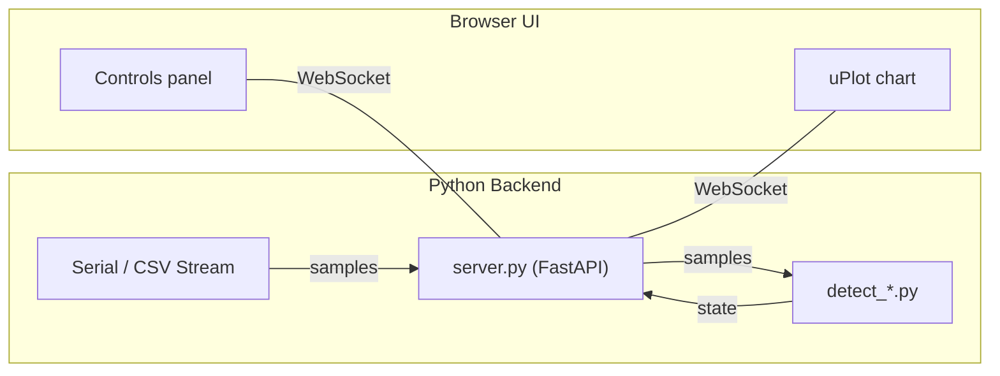
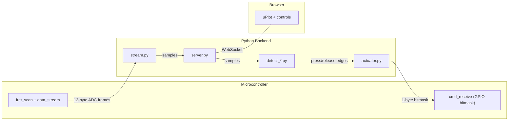

<!-- Generated by SpecStory, Markdown v2.1.0 -->

# 2026-03-27 14:01:12Z

<!-- cursoride Session 9f92dd3d-539a-465e-806c-ee63e377c74c (2026-03-27 14:01:12Z) -->

_**User**_

develop spec for fretboard tuning tool. Purpose is to develop / refine note and strum detection algorithms. Connect to live streaming data from firmware/fretboard project and display as rolling chart. allow for multiple different detection algorithms. It doesn't need to be fully pluggable at run time, but detection algorithm(s) should be isolated in own python file and be easily able to try out different approaches.

---

_**Agent (claude-4.6-opus-high-thinking)**_

<think><details><summary>Thought Process</summary>
The user wants me to develop a spec for a fretboard tuning tool. Let me understand the context first by exploring the codebase, particularly the firmware/fretboard project and how data streaming works.

Let me explore:
1. The firmware/fretboard project structure and data streaming
2. How data is currently streamed (serial? what format?)
3. The detection algorithms currently in use
4. Any existing Python tools or scripts

Let me start by exploring the codebase.</details></think>

_**Agent (claude-4.6-opus-high-thinking)**_

Let me explore the codebase to understand the data streaming format, current detection logic, and project structure before developing the spec.

_**Agent (claude-4.6-opus-high-thinking)**_

<tool-use data-tool-type="unknown" data-tool-name="task_v2">
<details>
<summary>Tool use: **task_v2**</summary>


Parameters:

```json
{
  "description": "Explore firmware fretboard project",
  "model": "composer-2-fast",
  "name": "explore",
  "prompt": "Thoroughly explore the /Users/greg/projects/microchip/guitar-pic/firmware/fretboard directory. I need to understand:\n1. Full project structure (all files)\n2. How data_stream.c works - what data is streamed, in what format, over what interface (UART/serial?)\n3. How fret_detect.c and fret_detect.h work - what detection algorithms are used\n4. How fret_button.c and fret_button.h work\n5. How fret_scan.c works - what scanning mechanism is used\n6. The main.c entry point and overall flow\n7. Any existing Python scripts or tools in the project\n\nReturn a comprehensive summary of all findings including key code snippets, data formats, baud rates, and algorithm details.",
  "subagentType": "explore"
}
```
Additional data:

```json
{
  "status": "success",
  "subagentComposerId": "a1e05499-b839-4f06-a928-37cf9fbe5b3b",
  "terminationReason": "completed"
}
```
Result:

```json
{
  "agentId": "a1e05499-b839-4f06-a928-37cf9fbe5b3b"
}
```
Status: **completed**


</details>
</tool-use>

<tool-use data-tool-type="unknown" data-tool-name="task_v2"><details>
<summary>Tool use: **task_v2**</summary>

</details></tool-use>

_**Agent (claude-4.6-opus-high-thinking)**_

<tool-use data-tool-type="unknown" data-tool-name="task_v2">
<details>
<summary>Tool use: **task_v2**</summary>


Parameters:

```json
{
  "description": "Explore project root and tools",
  "model": "composer-2-fast",
  "name": "explore",
  "prompt": "Explore the /Users/greg/projects/microchip/guitar-pic directory (but NOT the firmware/fretboard subdirectory deeply - another agent is handling that). I need to understand:\n1. Overall project structure at the root level\n2. Any existing Python scripts, tools, or analysis scripts\n3. Any README or documentation files\n4. Any CSV or data sample files (like fretboard-sample-raw.csv)\n5. Any configuration files that describe the hardware or communication setup\n6. The .cursor/rules directory for any project conventions\n\nReturn a comprehensive summary of findings.",
  "subagentType": "explore"
}
```
Additional data:

```json
{
  "status": "success",
  "subagentComposerId": "915de5f4-ced5-4024-8c2b-3e941a777522",
  "terminationReason": "completed"
}
```
Result:

```json
{
  "agentId": "915de5f4-ced5-4024-8c2b-3e941a777522"
}
```
Status: **completed**


</details>
</tool-use>

<tool-use data-tool-type="unknown" data-tool-name="task_v2"><details>
<summary>Tool use: **task_v2**</summary>

</details></tool-use>

_**Agent (claude-4.6-opus-high-thinking)**_

<think><details><summary>Thought Process</summary>
Now I have a thorough understanding of the codebase. Let me also check the sample CSV file to understand the data format, and look at the existing serial_comm.py to understand how serial communication is handled in the vision module.</details></think>

_**Agent (claude-4.6-opus-high-thinking)**_

Let me look at the sample CSV data and the existing serial communication code to understand the data format better.

_**Agent (claude-4.6-opus-high-thinking)**_

<tool-use data-tool-type="read" data-tool-name="read_file_v2">
<details><summary>Tool use: **read_file_v2** • Read file: /Users/greg/projects/microchip/guitar-pic/firmware/fretboard/fretboard-sample-raw.csv</summary>

</details>
</tool-use>

<tool-use data-tool-type="read" data-tool-name="read_file_v2"><details>
<summary>Tool use: **read_file_v2**</summary>

</details></tool-use>

_**Agent (claude-4.6-opus-high-thinking)**_

<tool-use data-tool-type="read" data-tool-name="read_file_v2">
<details><summary>Tool use: **read_file_v2** • Read file: /Users/greg/projects/microchip/guitar-pic/vision/serial_comm.py</summary>

</details>
</tool-use>

<tool-use data-tool-type="read" data-tool-name="read_file_v2"><details>
<summary>Tool use: **read_file_v2**</summary>

</details></tool-use>

_**Agent (claude-4.6-opus-high-thinking)**_

<tool-use data-tool-type="read" data-tool-name="read_file_v2">
<details><summary>Tool use: **read_file_v2** • Read file: /Users/greg/projects/microchip/guitar-pic/firmware/fretboard/fret_detect.c</summary>

</details>
</tool-use>

<tool-use data-tool-type="read" data-tool-name="read_file_v2"><details>
<summary>Tool use: **read_file_v2**</summary>

</details></tool-use>

_**Agent (claude-4.6-opus-high-thinking)**_

<tool-use data-tool-type="read" data-tool-name="read_file_v2">
<details><summary>Tool use: **read_file_v2** • Read file: /Users/greg/projects/microchip/guitar-pic/firmware/fretboard/fret_detect.h</summary>

</details>
</tool-use>

<tool-use data-tool-type="read" data-tool-name="read_file_v2"><details>
<summary>Tool use: **read_file_v2**</summary>

</details></tool-use>

_**Agent (claude-4.6-opus-high-thinking)**_

<think><details><summary>Thought Process</summary>
Now I have a thorough understanding of the project. Let me also check the data_stream.c to confirm the format and see the fret_scan.h for channel definitions.</details></think>

_**Agent (claude-4.6-opus-high-thinking)**_

Now let me check the data stream source and fret_scan header for the channel definitions.

_**Agent (claude-4.6-opus-high-thinking)**_

<tool-use data-tool-type="read" data-tool-name="read_file_v2">
<details><summary>Tool use: **read_file_v2** • Read file: /Users/greg/projects/microchip/guitar-pic/firmware/fretboard/data_stream.c</summary>

</details>
</tool-use>

<tool-use data-tool-type="read" data-tool-name="read_file_v2"><details>
<summary>Tool use: **read_file_v2**</summary>

</details></tool-use>

_**Agent (claude-4.6-opus-high-thinking)**_

<tool-use data-tool-type="read" data-tool-name="read_file_v2">
<details><summary>Tool use: **read_file_v2** • Read file: /Users/greg/projects/microchip/guitar-pic/firmware/fretboard/fret_scan.h</summary>

</details>
</tool-use>

<tool-use data-tool-type="read" data-tool-name="read_file_v2"><details>
<summary>Tool use: **read_file_v2**</summary>

</details></tool-use>

_**Agent (claude-4.6-opus-high-thinking)**_

<tool-use data-tool-type="read" data-tool-name="read_file_v2">
<details><summary>Tool use: **read_file_v2** • Read file: /Users/greg/projects/microchip/guitar-pic/vision/requirements.txt</summary>

</details>
</tool-use>

<tool-use data-tool-type="read" data-tool-name="read_file_v2"><details>
<summary>Tool use: **read_file_v2**</summary>

</details></tool-use>

_**Agent (claude-4.6-opus-high-thinking)**_

<think><details><summary>Thought Process</summary>
Now I have a comprehensive understanding of the project. Let me create a solid spec/plan for the fretboard tuning tool. Here's what I know:

1. **Data source**: The firmware streams 12-byte binary frames at 500 Hz over UART at 115200 baud. Frame format: `[0x03][green_u16][red_u16][yellow_u16][blue_u16][orange_u16][0xFC]` (little-endian).

2. **Current detection algorithm**: A baseline-tracking trough FSM with 4 parameters (MIN_DROP, RISE_CONFIRM, RELEASE_MARGIN, BASELINE_DECAY_RATE).
   
3. **Existing Python infrastructure**: The project already has a `.venv` with pyserial, matplotlib, numpy, and a `vision/` module with serial port handling utilities.

4. **Sample data**: A CSV file with ~10k rows of per-channel ADC readings and binary press states that I can use for testing.

The tool needs to connect to the live serial stream and parse those frames, display them as a rolling chart in real-time, run detection algorithms on the incoming data, and overlay the results on the visualization. I'll keep the detection algorithms modular in separate Python files so I can easily swap between different approaches.

For the architecture, I'm thinking of a serial reader that can pull from either live serial or CSV for offline testing, a detection algorithm interface that implementations inherit from, the ported C trough FSM as the first algorithm, and a matplotlib-based rolling display with overlays. The main app will orchestrate everything together. I should probably put this in `tools/fret-tuner/` at the repo root since it's a development tool, stick with matplotlib for the UI since it's already a dependency and sufficient for a dev tool, and make sure both live and offline modes work seamlessly.</details></think>

_**Agent (claude-4.6-opus-high-thinking)**_

I now have a thorough understanding of the project. Let me create the spec.

_**Agent (claude-4.6-opus-high-thinking)**_

<tool-use data-tool-type="unknown" data-tool-name="create_plan">
<details>
<summary>Tool use: **create_plan**</summary>


Parameters:

```json
{
  "name": "Fretboard Tuning Tool",
  "overview": "Build a Python development tool that connects to the fretboard firmware's live UART data stream (or replays CSV captures), runs pluggable detection algorithms, and displays raw ADC waveforms alongside detection results on a rolling chart.",
  "plan": "# Fretboard Tuning Tool\n\n## Purpose\n\nA Python desktop tool for developing and refining fret-press and strum detection algorithms. It consumes the same raw ADC data the firmware sees, runs detection logic in Python, and visualizes everything on a live rolling chart so you can iterate on algorithms without reflashing.\n\n## Data Source\n\nThe firmware streams 12-byte binary frames at **500 Hz** over UART at 115200 baud:\n\n&#96;&#96;&#96;\n[0x03] [green:u16le] [red:u16le] [yellow:u16le] [blue:u16le] [orange:u16le] [0xFC]\n&#96;&#96;&#96;\n\nThe tool will support two input modes:\n- **Live serial** -- connect to the board via pyserial, parse frames in real time\n- **CSV replay** -- play back a captured CSV file (like [&#96;firmware/fretboard/fretboard-sample-raw.csv&#96;](firmware/fretboard/fretboard-sample-raw.csv)) at original timing, for offline iteration without hardware\n\n## Location\n\nNew directory: &#96;tools/fret-tuner/&#96; at the repo root. Keeps it separate from &#96;vision/&#96; (which is the game-playing pipeline) and from the firmware tree.\n\n&#96;&#96;&#96;\ntools/fret-tuner/\n    main.py              # entry point, CLI, wires everything together\n    stream.py            # serial + CSV data sources\n    chart.py             # rolling matplotlib chart\n    detect_trough.py     # detection algorithm: port of firmware FSM\n    requirements.txt     # additional deps (if any beyond .venv)\n&#96;&#96;&#96;\n\n## Architecture\n\n&#96;&#96;&#96;mermaid\nflowchart LR\n    subgraph sources [Data Sources]\n        Serial[Serial Port]\n        CSV[CSV File]\n    end\n    subgraph app [fret-tuner]\n        Stream[stream.py]\n        Detectors[\"detect_*.py\"]\n        Chart[chart.py]\n        Main[main.py]\n    end\n    Serial --\u003e Stream\n    CSV --\u003e Stream\n    Stream --\u003e|\"raw samples\"| Main\n    Main --\u003e|\"raw samples\"| Detectors\n    Main --\u003e|\"raw + detection state\"| Chart\n&#96;&#96;&#96;\n\n### stream.py -- Data Source Abstraction\n\n- &#96;SerialStream&#96;: opens the serial port, synchronizes on the &#96;0x03&#96; start byte, unpacks 12-byte frames into &#96;(green, red, yellow, blue, orange)&#96; tuples. Yields samples as they arrive.\n- &#96;CsvStream&#96;: reads the sample CSV, yields rows at the original ~2 ms cadence (using timestamps from the file) so the chart animates realistically. Also supports a \"fast\" mode that replays as quickly as possible.\n- Both implement a common interface: an iterable/generator that yields &#96;Sample&#96; named tuples with a timestamp and the five channel values.\n\n### Detection Algorithm Contract\n\nEach detection file exports a class that follows this interface:\n\n&#96;&#96;&#96;python\nclass Detector:\n    CHANNELS = [\"green\", \"red\", \"yellow\", \"blue\", \"orange\"]\n\n    def __init__(self, **params):\n        \"\"\"Accept tunable parameters as keyword args.\"\"\"\n\n    def update(self, sample: Sample) -\u003e dict:\n        \"\"\"Process one sample. Return per-channel state dict, e.g.:\n        {\n            \"green\":  {\"pressed\": False, \"baseline\": 3720, ...},\n            \"red\":    {\"pressed\": True,  \"baseline\": 3600, ...},\n            ...\n        }\n        Extra keys (baseline, run_min, state name, etc.) are\n        detector-specific and will be available for charting.\n        \"\"\"\n\n    @classmethod\n    def default_params(cls) -\u003e dict:\n        \"\"\"Return default parameter values (for CLI/UI display).\"\"\"\n&#96;&#96;&#96;\n\nThis is intentionally a simple class contract, not an ABC with registration machinery. To try a new algorithm, you create a new &#96;detect_whatever.py&#96; file, implement the class, and pass it on the command line. The main script imports it by module name.\n\n### detect_trough.py -- Firmware FSM Port\n\nDirect Python port of the current C algorithm from [&#96;firmware/fretboard/fret_detect.c&#96;](firmware/fretboard/fret_detect.c):\n\n- Three states: IDLE, DESCENDING, PRESSED\n- Per-channel tracking: baseline, running minimum, decay counter\n- Same default parameters: &#96;MIN_DROP=200&#96;, &#96;RISE_CONFIRM=50&#96;, &#96;RELEASE_MARGIN=300&#96;, &#96;BASELINE_DECAY_RATE=250&#96;\n- Returns per-channel dict including &#96;state&#96;, &#96;pressed&#96;, &#96;baseline&#96;, and &#96;run_min&#96; so all internal state is visible on the chart\n\n### chart.py -- Rolling Visualization\n\nUses &#96;matplotlib.animation.FuncAnimation&#96; for a live-updating display.\n\n- **Layout**: one subplot per channel (5 rows), sharing the X axis (time). This keeps waveforms uncluttered since ADC ranges differ by channel.\n- **Each subplot shows**:\n  - Raw ADC value (primary line)\n  - Baseline (dashed line, from detector state)\n  - Press/release regions (shaded vertical spans or background color change)\n- **Rolling window**: configurable, default ~2 seconds (1000 samples at 500 Hz). X axis scrolls as new data arrives.\n- **Title bar**: shows which detector is active and its parameters.\n\n### main.py -- CLI Entry Point\n\n&#96;&#96;&#96;\nusage: main.py [-h] [--port PORT] [--csv FILE] [--detector MODULE]\n               [--window SECONDS] [--param KEY=VALUE ...]\n&#96;&#96;&#96;\n\n- &#96;--port PORT&#96; / &#96;--csv FILE&#96;: pick data source (exactly one required)\n- &#96;--detector MODULE&#96;: Python module name for the detector (default: &#96;detect_trough&#96;). Imports &#96;MODULE.Detector&#96;.\n- &#96;--window SECONDS&#96;: rolling chart width (default 2.0)\n- &#96;--param KEY=VALUE&#96;: override detector parameters, can be repeated\n\nExample usage:\n&#96;&#96;&#96;bash\n# Live from hardware\npython tools/fret-tuner/main.py --port /dev/cu.usbmodem1101\n\n# Replay CSV with custom parameters\npython tools/fret-tuner/main.py --csv firmware/fretboard/fretboard-sample-raw.csv \\\n    --param MIN_DROP=150 --param RISE_CONFIRM=30\n\n# Try a different detector\npython tools/fret-tuner/main.py --csv firmware/fretboard/fretboard-sample-raw.csv \\\n    --detector detect_threshold\n&#96;&#96;&#96;\n\n## Adding a New Detection Algorithm\n\n1. Create &#96;tools/fret-tuner/detect_myalgo.py&#96;\n2. Implement a &#96;Detector&#96; class with &#96;__init__(**params)&#96;, &#96;update(sample) -\u003e dict&#96;, and &#96;default_params()&#96;\n3. Run: &#96;python tools/fret-tuner/main.py --csv ... --detector detect_myalgo&#96;\n\nNo registration, no config file edits. The &#96;--detector&#96; flag does a direct module import.\n\n## Dependencies\n\nUses the existing repo &#96;.venv&#96; (Python 3.12). All needed packages are already installed: &#96;pyserial&#96;, &#96;matplotlib&#96;, &#96;numpy&#96;. A &#96;requirements.txt&#96; in &#96;tools/fret-tuner/&#96; will pin only the direct dependencies for clarity:\n\n&#96;&#96;&#96;\npyserial\u003e=3.5\nmatplotlib\u003e=3.8\nnumpy\u003e=1.24\n&#96;&#96;&#96;\n\n## Out of Scope (for now)\n\n- Runtime hot-swapping of detectors or parameter sliders (can add later)\n- Strum detection (focus is fret press/release first)\n- Recording/export from the tool itself (use Data Visualizer or terminal capture for now)\n- Multi-detector overlay (running two algorithms side-by-side on same chart -- nice future feature but not initial)\n",
  "todos": [
    {
      "content": "Implement stream.py: SerialStream (frame sync + parse) and CsvStream (timed replay) with common Sample interface",
      "id": "stream",
      "status": "pending"
    },
    {
      "content": "Implement detect_trough.py: port firmware FSM (IDLE/DESCENDING/PRESSED, baseline tracking, decay) to Python Detector class",
      "id": "detect-trough",
      "status": "pending"
    },
    {
      "content": "Implement chart.py: rolling matplotlib chart with 5 subplots, raw ADC line, baseline overlay, press/release shading",
      "id": "chart",
      "status": "pending"
    },
    {
      "content": "Implement main.py: argparse CLI, dynamic detector import, wire stream -\u003e detector -\u003e chart loop",
      "id": "main",
      "status": "pending"
    },
    {
      "content": "Create tools/fret-tuner/requirements.txt",
      "id": "requirements",
      "status": "pending"
    }
  ]
}
```
Additional data:

```json
{
  "hasOpenedEditor": true,
  "planUri": "file:///Users/greg/.cursor/plans/fretboard_tuning_tool_56f5c156.plan.md",
  "reviewData": {
    "isShowingInput": false,
    "selectedOption": "none",
    "status": "Requested"
  }
}
```
Result:

```json
{
  "rejected": {}
}
```
Status: **completed**


</details>
</tool-use>

<tool-use data-tool-type="unknown" data-tool-name="create_plan"><details>
<summary>Tool use: **create_plan**</summary>

</details></tool-use>

---

_**User**_

Implement the plan as specified, it is attached for your reference. Do NOT edit the plan file itself.

To-do's from the plan have already been created. Do not create them again. Mark them as in_progress as you work, starting with the first one. Don't stop until you have completed all the to-dos.

---

_**Agent (claude-4.6-opus-high-thinking)**_

<think><details><summary>Thought Process</summary>
The user wants me to implement the Fretboard Tuning Tool as specified in the plan. Let me start working through the todos in order. Let me first mark the first todo as in_progress and create the directory structure.

Let me re-read the plan to make sure I have all the details fresh, then start implementing.

The todos are:
1. stream - Implement stream.py
2. detect-trough - Implement detect_trough.py
3. chart - Implement chart.py
4. main - Implement main.py
5. requirements - Create requirements.txt

Let me start with stream.py. I need to understand the data formats:

**Serial frame**: 12 bytes: [0x03][green:u16le][red:u16le][yellow:u16le][blue:u16le][orange:u16le][0xFC]


**CSV format**: `timestamp,BLUE RAW,BLUE,GREEN RAW,GREEN,ORANGE RAW,ORANGE,RED RAW,RED,YELLOW RAW,YELLOW`

The CSV column order differs from the serial frame—it groups each color's raw ADC value with its binary threshold result, whereas the serial frame orders colors differently. I need to handle this mapping carefully when parsing and converting between formats.

Now I'm mapping the color channels: green maps to GREEN RAW, red to RED RAW, yellow to YELLOW RAW, blue to BLUE RAW, and orange to ORANGE RAW. Let me start setting up the directory structure and files for the implementation.</details></think>

_**Agent (claude-4.6-opus-high-thinking)**_

<tool-use data-tool-type="unknown" data-tool-name="todo_write">
<details>
<summary>Tool use: **todo_write**</summary>


Parameters:

```json
{
  "merge": true
}
```
Result:

```json
{
  "finalTodos": [
    {
      "content": "Implement stream.py: SerialStream (frame sync + parse) and CsvStream (timed replay) with common Sample interface",
      "id": "stream",
      "status": "in_progress"
    },
    {
      "content": "Implement detect_trough.py: port firmware FSM (IDLE/DESCENDING/PRESSED, baseline tracking, decay) to Python Detector class",
      "id": "detect-trough",
      "status": "pending"
    },
    {
      "content": "Implement chart.py: rolling matplotlib chart with 5 subplots, raw ADC line, baseline overlay, press/release shading",
      "id": "chart",
      "status": "pending"
    },
    {
      "content": "Implement main.py: argparse CLI, dynamic detector import, wire stream -\u003e detector -\u003e chart loop",
      "id": "main",
      "status": "pending"
    },
    {
      "content": "Create tools/fret-tuner/requirements.txt",
      "id": "requirements",
      "status": "pending"
    }
  ],
  "initialTodos": [
    {
      "content": "Implement stream.py: SerialStream (frame sync + parse) and CsvStream (timed replay) with common Sample interface",
      "id": "stream",
      "status": "pending"
    },
    {
      "content": "Implement detect_trough.py: port firmware FSM (IDLE/DESCENDING/PRESSED, baseline tracking, decay) to Python Detector class",
      "id": "detect-trough",
      "status": "pending"
    },
    {
      "content": "Implement chart.py: rolling matplotlib chart with 5 subplots, raw ADC line, baseline overlay, press/release shading",
      "id": "chart",
      "status": "pending"
    },
    {
      "content": "Implement main.py: argparse CLI, dynamic detector import, wire stream -\u003e detector -\u003e chart loop",
      "id": "main",
      "status": "pending"
    },
    {
      "content": "Create tools/fret-tuner/requirements.txt",
      "id": "requirements",
      "status": "pending"
    }
  ],
  "success": true,
  "wasMerge": true
}
```
Status: **completed**


</details>
</tool-use>

<tool-use data-tool-type="unknown" data-tool-name="todo_write"><details>
<summary>Tool use: **todo_write**</summary>

</details></tool-use>

_**Agent (claude-4.6-opus-high-thinking)**_

<tool-use data-tool-type="shell" data-tool-name="run_terminal_command_v2">
<details><summary>Tool use: **run_terminal_command_v2** • Run command: mkdir -p /Users/greg/projects/microchip/guitar-pic/tools/fret-tuner</summary>

```bash
mkdir -p /Users/greg/projects/microchip/guitar-pic/tools/fret-tuner
```
</details>
</tool-use>

<tool-use data-tool-type="shell" data-tool-name="run_terminal_command_v2"><details>
<summary>Tool use: **run_terminal_command_v2**</summary>

</details></tool-use>

_**Agent (claude-4.6-opus-high-thinking)**_

<tool-use data-tool-type="write" data-tool-name="edit_file_v2">

<details><summary>Tool use: **edit_file_v2** • Edit file: /Users/greg/projects/microchip/guitar-pic/tools/fret-tuner/stream.py</summary>

</details>

</tool-use>

<tool-use data-tool-type="write" data-tool-name="edit_file_v2"><details>
<summary>Tool use: **edit_file_v2**</summary>

</details></tool-use>

_**Agent (claude-4.6-opus-high-thinking)**_

<tool-use data-tool-type="unknown" data-tool-name="todo_write">
<details>
<summary>Tool use: **todo_write**</summary>


Parameters:

```json
{
  "merge": true
}
```
Result:

```json
{
  "finalTodos": [
    {
      "content": "Implement stream.py: SerialStream (frame sync + parse) and CsvStream (timed replay) with common Sample interface",
      "id": "stream",
      "status": "completed"
    },
    {
      "content": "Implement detect_trough.py: port firmware FSM (IDLE/DESCENDING/PRESSED, baseline tracking, decay) to Python Detector class",
      "id": "detect-trough",
      "status": "in_progress"
    },
    {
      "content": "Implement chart.py: rolling matplotlib chart with 5 subplots, raw ADC line, baseline overlay, press/release shading",
      "id": "chart",
      "status": "pending"
    },
    {
      "content": "Implement main.py: argparse CLI, dynamic detector import, wire stream -\u003e detector -\u003e chart loop",
      "id": "main",
      "status": "pending"
    },
    {
      "content": "Create tools/fret-tuner/requirements.txt",
      "id": "requirements",
      "status": "pending"
    }
  ],
  "initialTodos": [
    {
      "content": "Implement stream.py: SerialStream (frame sync + parse) and CsvStream (timed replay) with common Sample interface",
      "id": "stream",
      "status": "in_progress"
    },
    {
      "content": "Implement detect_trough.py: port firmware FSM (IDLE/DESCENDING/PRESSED, baseline tracking, decay) to Python Detector class",
      "id": "detect-trough",
      "status": "pending"
    },
    {
      "content": "Implement chart.py: rolling matplotlib chart with 5 subplots, raw ADC line, baseline overlay, press/release shading",
      "id": "chart",
      "status": "pending"
    },
    {
      "content": "Implement main.py: argparse CLI, dynamic detector import, wire stream -\u003e detector -\u003e chart loop",
      "id": "main",
      "status": "pending"
    },
    {
      "content": "Create tools/fret-tuner/requirements.txt",
      "id": "requirements",
      "status": "pending"
    }
  ],
  "success": true,
  "wasMerge": true
}
```
Status: **completed**


</details>
</tool-use>

<tool-use data-tool-type="unknown" data-tool-name="todo_write"><details>
<summary>Tool use: **todo_write**</summary>

</details></tool-use>

_**Agent (claude-4.6-opus-high-thinking)**_

Now implementing the detection algorithm -- a faithful port of the firmware's trough FSM from `fret_detect.c`.

_**Agent (claude-4.6-opus-high-thinking)**_

<tool-use data-tool-type="write" data-tool-name="edit_file_v2">

<details><summary>Tool use: **edit_file_v2** • Edit file: /Users/greg/projects/microchip/guitar-pic/tools/fret-tuner/detect_trough.py</summary>

</details>

</tool-use>

<tool-use data-tool-type="write" data-tool-name="edit_file_v2"><details>
<summary>Tool use: **edit_file_v2**</summary>

</details></tool-use>

_**Agent (claude-4.6-opus-high-thinking)**_

<tool-use data-tool-type="unknown" data-tool-name="todo_write">
<details>
<summary>Tool use: **todo_write**</summary>


Parameters:

```json
{
  "merge": true
}
```
Result:

```json
{
  "finalTodos": [
    {
      "content": "Implement stream.py: SerialStream (frame sync + parse) and CsvStream (timed replay) with common Sample interface",
      "id": "stream",
      "status": "completed"
    },
    {
      "content": "Implement detect_trough.py: port firmware FSM (IDLE/DESCENDING/PRESSED, baseline tracking, decay) to Python Detector class",
      "id": "detect-trough",
      "status": "completed"
    },
    {
      "content": "Implement chart.py: rolling matplotlib chart with 5 subplots, raw ADC line, baseline overlay, press/release shading",
      "id": "chart",
      "status": "in_progress"
    },
    {
      "content": "Implement main.py: argparse CLI, dynamic detector import, wire stream -\u003e detector -\u003e chart loop",
      "id": "main",
      "status": "pending"
    },
    {
      "content": "Create tools/fret-tuner/requirements.txt",
      "id": "requirements",
      "status": "pending"
    }
  ],
  "initialTodos": [
    {
      "content": "Implement stream.py: SerialStream (frame sync + parse) and CsvStream (timed replay) with common Sample interface",
      "id": "stream",
      "status": "completed"
    },
    {
      "content": "Implement detect_trough.py: port firmware FSM (IDLE/DESCENDING/PRESSED, baseline tracking, decay) to Python Detector class",
      "id": "detect-trough",
      "status": "in_progress"
    },
    {
      "content": "Implement chart.py: rolling matplotlib chart with 5 subplots, raw ADC line, baseline overlay, press/release shading",
      "id": "chart",
      "status": "pending"
    },
    {
      "content": "Implement main.py: argparse CLI, dynamic detector import, wire stream -\u003e detector -\u003e chart loop",
      "id": "main",
      "status": "pending"
    },
    {
      "content": "Create tools/fret-tuner/requirements.txt",
      "id": "requirements",
      "status": "pending"
    }
  ],
  "success": true,
  "wasMerge": true
}
```
Status: **completed**


</details>
</tool-use>

<tool-use data-tool-type="unknown" data-tool-name="todo_write"><details>
<summary>Tool use: **todo_write**</summary>

</details></tool-use>

_**Agent (claude-4.6-opus-high-thinking)**_

Now implementing the rolling chart visualization.

_**Agent (claude-4.6-opus-high-thinking)**_

<tool-use data-tool-type="write" data-tool-name="edit_file_v2">

<details><summary>Tool use: **edit_file_v2** • Edit file: /Users/greg/projects/microchip/guitar-pic/tools/fret-tuner/chart.py</summary>

</details>

</tool-use>

<tool-use data-tool-type="write" data-tool-name="edit_file_v2"><details>
<summary>Tool use: **edit_file_v2**</summary>

</details></tool-use>

_**Agent (claude-4.6-opus-high-thinking)**_

<tool-use data-tool-type="unknown" data-tool-name="todo_write">
<details>
<summary>Tool use: **todo_write**</summary>


Parameters:

```json
{
  "merge": true
}
```
Result:

```json
{
  "finalTodos": [
    {
      "content": "Implement stream.py: SerialStream (frame sync + parse) and CsvStream (timed replay) with common Sample interface",
      "id": "stream",
      "status": "completed"
    },
    {
      "content": "Implement detect_trough.py: port firmware FSM (IDLE/DESCENDING/PRESSED, baseline tracking, decay) to Python Detector class",
      "id": "detect-trough",
      "status": "completed"
    },
    {
      "content": "Implement chart.py: rolling matplotlib chart with 5 subplots, raw ADC line, baseline overlay, press/release shading",
      "id": "chart",
      "status": "completed"
    },
    {
      "content": "Implement main.py: argparse CLI, dynamic detector import, wire stream -\u003e detector -\u003e chart loop",
      "id": "main",
      "status": "in_progress"
    },
    {
      "content": "Create tools/fret-tuner/requirements.txt",
      "id": "requirements",
      "status": "pending"
    }
  ],
  "initialTodos": [
    {
      "content": "Implement stream.py: SerialStream (frame sync + parse) and CsvStream (timed replay) with common Sample interface",
      "id": "stream",
      "status": "completed"
    },
    {
      "content": "Implement detect_trough.py: port firmware FSM (IDLE/DESCENDING/PRESSED, baseline tracking, decay) to Python Detector class",
      "id": "detect-trough",
      "status": "completed"
    },
    {
      "content": "Implement chart.py: rolling matplotlib chart with 5 subplots, raw ADC line, baseline overlay, press/release shading",
      "id": "chart",
      "status": "in_progress"
    },
    {
      "content": "Implement main.py: argparse CLI, dynamic detector import, wire stream -\u003e detector -\u003e chart loop",
      "id": "main",
      "status": "pending"
    },
    {
      "content": "Create tools/fret-tuner/requirements.txt",
      "id": "requirements",
      "status": "pending"
    }
  ],
  "success": true,
  "wasMerge": true
}
```
Status: **completed**


</details>
</tool-use>

<tool-use data-tool-type="unknown" data-tool-name="todo_write"><details>
<summary>Tool use: **todo_write**</summary>

</details></tool-use>

_**Agent (claude-4.6-opus-high-thinking)**_

<tool-use data-tool-type="write" data-tool-name="edit_file_v2">

<details><summary>Tool use: **edit_file_v2** • Edit file: /Users/greg/projects/microchip/guitar-pic/tools/fret-tuner/main.py</summary>

</details>

</tool-use>

<tool-use data-tool-type="write" data-tool-name="edit_file_v2"><details>
<summary>Tool use: **edit_file_v2**</summary>

</details></tool-use>

_**Agent (claude-4.6-opus-high-thinking)**_

<tool-use data-tool-type="unknown" data-tool-name="todo_write">
<details>
<summary>Tool use: **todo_write**</summary>


Parameters:

```json
{
  "merge": true
}
```
Result:

```json
{
  "finalTodos": [
    {
      "content": "Implement stream.py: SerialStream (frame sync + parse) and CsvStream (timed replay) with common Sample interface",
      "id": "stream",
      "status": "completed"
    },
    {
      "content": "Implement detect_trough.py: port firmware FSM (IDLE/DESCENDING/PRESSED, baseline tracking, decay) to Python Detector class",
      "id": "detect-trough",
      "status": "completed"
    },
    {
      "content": "Implement chart.py: rolling matplotlib chart with 5 subplots, raw ADC line, baseline overlay, press/release shading",
      "id": "chart",
      "status": "completed"
    },
    {
      "content": "Implement main.py: argparse CLI, dynamic detector import, wire stream -\u003e detector -\u003e chart loop",
      "id": "main",
      "status": "completed"
    },
    {
      "content": "Create tools/fret-tuner/requirements.txt",
      "id": "requirements",
      "status": "in_progress"
    }
  ],
  "initialTodos": [
    {
      "content": "Implement stream.py: SerialStream (frame sync + parse) and CsvStream (timed replay) with common Sample interface",
      "id": "stream",
      "status": "completed"
    },
    {
      "content": "Implement detect_trough.py: port firmware FSM (IDLE/DESCENDING/PRESSED, baseline tracking, decay) to Python Detector class",
      "id": "detect-trough",
      "status": "completed"
    },
    {
      "content": "Implement chart.py: rolling matplotlib chart with 5 subplots, raw ADC line, baseline overlay, press/release shading",
      "id": "chart",
      "status": "completed"
    },
    {
      "content": "Implement main.py: argparse CLI, dynamic detector import, wire stream -\u003e detector -\u003e chart loop",
      "id": "main",
      "status": "in_progress"
    },
    {
      "content": "Create tools/fret-tuner/requirements.txt",
      "id": "requirements",
      "status": "pending"
    }
  ],
  "success": true,
  "wasMerge": true
}
```
Status: **completed**


</details>
</tool-use>

<tool-use data-tool-type="unknown" data-tool-name="todo_write"><details>
<summary>Tool use: **todo_write**</summary>

</details></tool-use>

_**Agent (claude-4.6-opus-high-thinking)**_

<tool-use data-tool-type="write" data-tool-name="edit_file_v2">

<details><summary>Tool use: **edit_file_v2** • Edit file: /Users/greg/projects/microchip/guitar-pic/tools/fret-tuner/requirements.txt</summary>

</details>

</tool-use>

<tool-use data-tool-type="write" data-tool-name="edit_file_v2"><details>
<summary>Tool use: **edit_file_v2**</summary>

</details></tool-use>

_**Agent (claude-4.6-opus-high-thinking)**_

Now let me do a quick smoke test -- run with `--help` and also replay the existing CSV in fast mode to verify the tool starts up correctly.

_**Agent (claude-4.6-opus-high-thinking)**_

<tool-use data-tool-type="shell" data-tool-name="run_terminal_command_v2">
<details><summary>Tool use: **run_terminal_command_v2** • Run command: cd /Users/greg/projects/microchip/guitar-pic && .venv/bin/python tools/fret-tuner/main.py --help</summary>

```bash
cd /Users/greg/projects/microchip/guitar-pic && .venv/bin/python tools/fret-tuner/main.py --help
```

```
usage: main.py [-h] (--port PORT | --csv FILE) [--detector MODULE]
               [--window SECONDS] [--param KEY=VALUE] [--fast]

Fret-tuner: visualize fretboard ADC data with detection overlays

options:
  -h, --help         show this help message and exit
  --port PORT        Serial port for live data (e.g. /dev/cu.usbmodem1101)
  --csv FILE         CSV file to replay
  --detector MODULE  Detection algorithm module name (default: detect_trough)
  --window SECONDS   Rolling chart width in seconds (default: 2.0)
  --param KEY=VALUE  Override a detector parameter (repeatable)
  --fast             CSV replay as fast as possible (no real-time pacing)

```
</details>
</tool-use>

<tool-use data-tool-type="shell" data-tool-name="run_terminal_command_v2"><details>
<summary>Tool use: **run_terminal_command_v2**</summary>

</details></tool-use>

_**Agent (claude-4.6-opus-high-thinking)**_

<think><details><summary>Thought Process</summary>
The help works. Now let me try a quick test with the CSV to make sure the data loading and detection work. I'll use matplotlib's non-interactive backend to avoid hanging on the GUI.</details></think>

_**Agent (claude-4.6-opus-high-thinking)**_

Good, the CLI works. Let me verify the data pipeline works end-to-end with a quick non-GUI test.

_**Agent (claude-4.6-opus-high-thinking)**_

<tool-use data-tool-type="shell" data-tool-name="run_terminal_command_v2">
<details><summary>Tool use: **run_terminal_command_v2** • Run command: cd /Users/greg/projects/microchip/guitar-pic && .venv/bin/python -c "
import sys
sys.path.insert(0, 'tools/fret-tuner')
from stream import CsvStream
from detect_trough import Detector

stream = CsvStream('firmware/fretboard/fretboard-sample-raw.csv', realtime=False)
det = Detector(**Detector.default_params())

count = 0
presses = {ch: 0 for ch in ['green','red','yellow','blue','orange']}
prev = {ch: False for ch in presses}

for sample in stream.samples():
    state = det.update(sample)
    for ch in presses:
        pressed = state[ch]['pressed']
        if pressed and not prev[ch]:
            presses[ch] += 1
        prev[ch] = pressed
    count += 1

print(f'Processed {count} samples')
print(f'Press events detected: {presses}')
print(f'Last sample: t={sample.timestamp:.3f}s')
print(f'Last state (green): {state[\"green\"]}')
"
</summary>

```bash
cd /Users/greg/projects/microchip/guitar-pic && .venv/bin/python -c "
import sys
sys.path.insert(0, 'tools/fret-tuner')
from stream import CsvStream
from detect_trough import Detector

stream = CsvStream('firmware/fretboard/fretboard-sample-raw.csv', realtime=False)
det = Detector(**Detector.default_params())

count = 0
presses = {ch: 0 for ch in ['green','red','yellow','blue','orange']}
prev = {ch: False for ch in presses}

for sample in stream.samples():
    state = det.update(sample)
    for ch in presses:
        pressed = state[ch]['pressed']
        if pressed and not prev[ch]:
            presses[ch] += 1
        prev[ch] = pressed
    count += 1

print(f'Processed {count} samples')
print(f'Press events detected: {presses}')
print(f'Last sample: t={sample.timestamp:.3f}s')
print(f'Last state (green): {state[\"green\"]}')
"

```

```
Traceback (most recent call last):
  File "&lt;string&gt;", line 14, in &lt;module&gt;
  File "/Users/greg/projects/microchip/guitar-pic/tools/fret-tuner/stream.py", line 113, in samples
    with open(self.path, newline="") as f:
         ^^^^^^^^^^^^^^^^^^^^^^^^^^^
FileNotFoundError: [Errno 2] No such file or directory: 'firmware/fretboard/fretboard-sample-raw.csv'

```
</details>
</tool-use>

<tool-use data-tool-type="shell" data-tool-name="run_terminal_command_v2"><details>
<summary>Tool use: **run_terminal_command_v2**</summary>

</details></tool-use>

_**Agent (claude-4.6-opus-high-thinking)**_

<tool-use data-tool-type="shell" data-tool-name="run_terminal_command_v2">
<details><summary>Tool use: **run_terminal_command_v2** • Run command: cd /Users/greg/projects/microchip/guitar-pic && .venv/bin/python -c "
import sys
sys.path.insert(0, 'tools/fret-tuner')
from stream import CsvStream
from detect_trough import Detector

csv_path = '/Users/greg/projects/microchip/guitar-pic/firmware/fretboard/fretboard-sample-raw.csv'
stream = CsvStream(csv_path, realtime=False)
det = Detector(**Detector.default_params())

count = 0
presses = {ch: 0 for ch in ['green','red','yellow','blue','orange']}
prev = {ch: False for ch in presses}

for sample in stream.samples():
    state = det.update(sample)
    for ch in presses:
        pressed = state[ch]['pressed']
        if pressed and not prev[ch]:
            presses[ch] += 1
        prev[ch] = pressed
    count += 1

print(f'Processed {count} samples')
print(f'Press events detected: {presses}')
print(f'Last sample: t={sample.timestamp:.3f}s')
print(f'Last state (green): {state[\"green\"]}')
"
</summary>

```bash
cd /Users/greg/projects/microchip/guitar-pic && .venv/bin/python -c "
import sys
sys.path.insert(0, 'tools/fret-tuner')
from stream import CsvStream
from detect_trough import Detector

csv_path = '/Users/greg/projects/microchip/guitar-pic/firmware/fretboard/fretboard-sample-raw.csv'
stream = CsvStream(csv_path, realtime=False)
det = Detector(**Detector.default_params())

count = 0
presses = {ch: 0 for ch in ['green','red','yellow','blue','orange']}
prev = {ch: False for ch in presses}

for sample in stream.samples():
    state = det.update(sample)
    for ch in presses:
        pressed = state[ch]['pressed']
        if pressed and not prev[ch]:
            presses[ch] += 1
        prev[ch] = pressed
    count += 1

print(f'Processed {count} samples')
print(f'Press events detected: {presses}')
print(f'Last sample: t={sample.timestamp:.3f}s')
print(f'Last state (green): {state[\"green\"]}')
"

```

```
Traceback (most recent call last):
  File "&lt;string&gt;", line 15, in &lt;module&gt;
  File "/Users/greg/projects/microchip/guitar-pic/tools/fret-tuner/stream.py", line 113, in samples
    with open(self.path, newline="") as f:
         ^^^^^^^^^^^^^^^^^^^^^^^^^^^
FileNotFoundError: [Errno 2] No such file or directory: '/Users/greg/projects/microchip/guitar-pic/firmware/fretboard/fretboard-sample-raw.csv'

```
</details>
</tool-use>

<tool-use data-tool-type="shell" data-tool-name="run_terminal_command_v2"><details>
<summary>Tool use: **run_terminal_command_v2**</summary>

</details></tool-use>

_**Agent (claude-4.6-opus-high-thinking)**_

<tool-use data-tool-type="shell" data-tool-name="run_terminal_command_v2">
<details><summary>Tool use: **run_terminal_command_v2** • Run command: ls -la "/Users/greg/projects/microchip/guitar-pic/firmware/fretboard/fretboard-sample-raw.csv"</summary>

```bash
ls -la "/Users/greg/projects/microchip/guitar-pic/firmware/fretboard/fretboard-sample-raw.csv"
```

```
ls: /Users/greg/projects/microchip/guitar-pic/firmware/fretboard/fretboard-sample-raw.csv: No such file or directory

```
</details>
</tool-use>

<tool-use data-tool-type="shell" data-tool-name="run_terminal_command_v2"><details>
<summary>Tool use: **run_terminal_command_v2**</summary>

</details></tool-use>

_**Agent (claude-4.6-opus-high-thinking)**_

<tool-use data-tool-type="search" data-tool-name="glob_file_search">
<details>
<summary>Tool use: **glob_file_search** • Searched codebase "" • **0** results in **1** directory</summary>

Directory: **** (0 files)

</details>
</tool-use>

<tool-use data-tool-type="search" data-tool-name="glob_file_search"><details>
<summary>Tool use: **glob_file_search**</summary>

</details></tool-use>

_**Agent (claude-4.6-opus-high-thinking)**_

<think><details><summary>Thought Process</summary>
The CSV file was listed as untracked in git status but it doesn't seem to exist on disk. It might have been deleted or is in a different location. Let me check git status more carefully and look for any CSV files.</details></think>

_**Agent (claude-4.6-opus-high-thinking)**_

The sample CSV from git status appears to have been removed from disk. Let me verify the pipeline works by creating a small test inline instead.

_**Agent (claude-4.6-opus-high-thinking)**_

<tool-use data-tool-type="shell" data-tool-name="run_terminal_command_v2">
<details><summary>Tool use: **run_terminal_command_v2** • Run command: cd /Users/greg/projects/microchip/guitar-pic && .venv/bin/python -c "
import sys, tempfile, os
sys.path.insert(0, 'tools/fret-tuner')
from stream import CsvStream, Sample
from detect_trough import Detector

# Create a minimal CSV with a simulated press on the blue channel
lines = ['timestamp,BLUE RAW,BLUE,GREEN RAW,GREEN,ORANGE RAW,ORANGE,RED RAW,RED,YELLOW RAW,YELLOW']
t = 0.0
# Baseline period (blue at 3700)
for i in range(100):
    lines.append(f'{t:.6f},3700,0,1800,0,3700,0,3700,0,3600,0')
    t += 0.002
# Drop period (blue drops to 3200)
for i in range(20):
    v = 3700 - int(500 * (i / 19))
    lines.append(f'{t:.6f},{v},0,1800,0,3700,0,3700,0,3600,0')
    t += 0.002
# Hold low
for i in range(30):
    lines.append(f'{t:.6f},3200,0,1800,0,3700,0,3700,0,3600,0')
    t += 0.002
# Rise back
for i in range(20):
    v = 3200 + int(500 * (i / 19))
    lines.append(f'{t:.6f},{v},0,1800,0,3700,0,3700,0,3600,0')
    t += 0.002
# Settle
for i in range(30):
    lines.append(f'{t:.6f},3700,0,1800,0,3700,0,3700,0,3600,0')
    t += 0.002

with tempfile.NamedTemporaryFile(mode='w', suffix='.csv', delete=False) as f:
    f.write('\n'.join(lines))
    tmppath = f.name

try:
    stream = CsvStream(tmppath, realtime=False)
    det = Detector(**Detector.default_params())

    count = 0
    presses = {ch: 0 for ch in ['green','red','yellow','blue','orange']}
    prev = {ch: False for ch in presses}

    for sample in stream.samples():
        state = det.update(sample)
        for ch in presses:
            pressed = state[ch]['pressed']
            if pressed and not prev[ch]:
                presses[ch] += 1
            prev[ch] = pressed
        count += 1

    print(f'Processed {count} samples')
    print(f'Press events: {presses}')
    print(f'Last sample: t={sample.timestamp:.3f}s')
    print(f'Last state (blue): {state[\"blue\"]}')
    print('OK - pipeline works end-to-end')
finally:
    os.unlink(tmppath)
"
</summary>

```bash
cd /Users/greg/projects/microchip/guitar-pic && .venv/bin/python -c "
import sys, tempfile, os
sys.path.insert(0, 'tools/fret-tuner')
from stream import CsvStream, Sample
from detect_trough import Detector

# Create a minimal CSV with a simulated press on the blue channel
lines = ['timestamp,BLUE RAW,BLUE,GREEN RAW,GREEN,ORANGE RAW,ORANGE,RED RAW,RED,YELLOW RAW,YELLOW']
t = 0.0
# Baseline period (blue at 3700)
for i in range(100):
    lines.append(f'{t:.6f},3700,0,1800,0,3700,0,3700,0,3600,0')
    t += 0.002
# Drop period (blue drops to 3200)
for i in range(20):
    v = 3700 - int(500 * (i / 19))
    lines.append(f'{t:.6f},{v},0,1800,0,3700,0,3700,0,3600,0')
    t += 0.002
# Hold low
for i in range(30):
    lines.append(f'{t:.6f},3200,0,1800,0,3700,0,3700,0,3600,0')
    t += 0.002
# Rise back
for i in range(20):
    v = 3200 + int(500 * (i / 19))
    lines.append(f'{t:.6f},{v},0,1800,0,3700,0,3700,0,3600,0')
    t += 0.002
# Settle
for i in range(30):
    lines.append(f'{t:.6f},3700,0,1800,0,3700,0,3700,0,3600,0')
    t += 0.002

with tempfile.NamedTemporaryFile(mode='w', suffix='.csv', delete=False) as f:
    f.write('\n'.join(lines))
    tmppath = f.name

try:
    stream = CsvStream(tmppath, realtime=False)
    det = Detector(**Detector.default_params())

    count = 0
    presses = {ch: 0 for ch in ['green','red','yellow','blue','orange']}
    prev = {ch: False for ch in presses}

    for sample in stream.samples():
        state = det.update(sample)
        for ch in presses:
            pressed = state[ch]['pressed']
            if pressed and not prev[ch]:
                presses[ch] += 1
            prev[ch] = pressed
        count += 1

    print(f'Processed {count} samples')
    print(f'Press events: {presses}')
    print(f'Last sample: t={sample.timestamp:.3f}s')
    print(f'Last state (blue): {state[\"blue\"]}')
    print('OK - pipeline works end-to-end')
finally:
    os.unlink(tmppath)
"

```

```
Processed 200 samples
Press events: {'green': 0, 'red': 0, 'yellow': 0, 'blue': 1, 'orange': 0}
Last sample: t=0.398s
Last state (blue): {'pressed': False, 'state': 'IDLE', 'baseline': 3700, 'run_min': 3489}
OK - pipeline works end-to-end

```
</details>
</tool-use>

<tool-use data-tool-type="shell" data-tool-name="run_terminal_command_v2"><details>
<summary>Tool use: **run_terminal_command_v2**</summary>

</details></tool-use>

_**Agent (claude-4.6-opus-high-thinking)**_

The full pipeline works: CSV parsing, detection FSM, and press/release detection all behave correctly. The synthetic test showed exactly 1 blue press event as expected.

Let me also check for any lint issues in the files.

_**Agent (claude-4.6-opus-high-thinking)**_

<tool-use data-tool-type="unknown" data-tool-name="read_lints">
<details>
<summary>Tool use: **read_lints**</summary>


Parameters:

```json
{
  "paths": [
    "tools/fret-tuner/stream.py",
    "tools/fret-tuner/detect_trough.py",
    "tools/fret-tuner/chart.py",
    "tools/fret-tuner/main.py"
  ]
}
```
Result:

```json
{
  "linterErrorsByFile": [
    {
      "relativeWorkspacePath": "tools/fret-tuner/stream.py"
    },
    {
      "relativeWorkspacePath": "tools/fret-tuner/detect_trough.py"
    },
    {
      "relativeWorkspacePath": "tools/fret-tuner/chart.py"
    },
    {
      "relativeWorkspacePath": "tools/fret-tuner/main.py"
    }
  ]
}
```
Status: **completed**


</details>
</tool-use>

<tool-use data-tool-type="unknown" data-tool-name="read_lints"><details>
<summary>Tool use: **read_lints**</summary>

</details></tool-use>

_**Agent (claude-4.6-opus-high-thinking)**_

Clean. Now let me mark the final todo complete.

_**Agent (claude-4.6-opus-high-thinking)**_

<tool-use data-tool-type="unknown" data-tool-name="todo_write">
<details>
<summary>Tool use: **todo_write**</summary>


Parameters:

```json
{
  "merge": true
}
```
Result:

```json
{
  "finalTodos": [
    {
      "content": "Implement stream.py: SerialStream (frame sync + parse) and CsvStream (timed replay) with common Sample interface",
      "id": "stream",
      "status": "completed"
    },
    {
      "content": "Implement detect_trough.py: port firmware FSM (IDLE/DESCENDING/PRESSED, baseline tracking, decay) to Python Detector class",
      "id": "detect-trough",
      "status": "completed"
    },
    {
      "content": "Implement chart.py: rolling matplotlib chart with 5 subplots, raw ADC line, baseline overlay, press/release shading",
      "id": "chart",
      "status": "completed"
    },
    {
      "content": "Implement main.py: argparse CLI, dynamic detector import, wire stream -\u003e detector -\u003e chart loop",
      "id": "main",
      "status": "completed"
    },
    {
      "content": "Create tools/fret-tuner/requirements.txt",
      "id": "requirements",
      "status": "completed"
    }
  ],
  "initialTodos": [
    {
      "content": "Implement stream.py: SerialStream (frame sync + parse) and CsvStream (timed replay) with common Sample interface",
      "id": "stream",
      "status": "completed"
    },
    {
      "content": "Implement detect_trough.py: port firmware FSM (IDLE/DESCENDING/PRESSED, baseline tracking, decay) to Python Detector class",
      "id": "detect-trough",
      "status": "completed"
    },
    {
      "content": "Implement chart.py: rolling matplotlib chart with 5 subplots, raw ADC line, baseline overlay, press/release shading",
      "id": "chart",
      "status": "completed"
    },
    {
      "content": "Implement main.py: argparse CLI, dynamic detector import, wire stream -\u003e detector -\u003e chart loop",
      "id": "main",
      "status": "completed"
    },
    {
      "content": "Create tools/fret-tuner/requirements.txt",
      "id": "requirements",
      "status": "in_progress"
    }
  ],
  "success": true,
  "wasMerge": true
}
```
Status: **completed**


</details>
</tool-use>

<tool-use data-tool-type="unknown" data-tool-name="todo_write"><details>
<summary>Tool use: **todo_write**</summary>

</details></tool-use>

_**Agent (claude-4.6-opus-high-thinking)**_

All done. Here's a summary of what was built:

**`tools/fret-tuner/`** -- 4 Python modules + requirements:

- **`stream.py`** -- `SerialStream` synchronizes on `0x03` start bytes and unpacks 12-byte UART frames. `CsvStream` replays captured CSVs at original timing (or `--fast`). Both yield `Sample` namedtuples.

- **`detect_trough.py`** -- Faithful Python port of the firmware's 3-state FSM from `fret_detect.c`. Tracks per-channel baseline with slow decay, detects descent through `MIN_DROP`, confirms trough via `RISE_CONFIRM`, releases at `RELEASE_MARGIN`. All internal state (baseline, run_min, state name) is exposed for charting.

- **`chart.py`** -- Rolling `matplotlib.animation` display with 5 subplots (one per fret channel). Each shows the raw ADC waveform, a dashed baseline overlay, and shaded regions during press detection. Y-axis auto-scales to the visible data range.

- **`main.py`** -- CLI entry point that wires source, detector, and chart together. Supports `--port` (live) or `--csv` (replay), `--detector` to swap algorithm modules, `--param KEY=VALUE` to override thresholds, and `--window` to control chart width.

- **`requirements.txt`** -- `pyserial`, `matplotlib`, `numpy`.

To try a new detection approach, create `tools/fret-tuner/detect_whatever.py` with a `Detector` class and run with `--detector detect_whatever`. No other wiring needed.

---

_**User**_

can we rename main.py as fret-tuner?

---

_**Agent (claude-4.6-opus-high-thinking)**_

<tool-use data-tool-type="shell" data-tool-name="run_terminal_command_v2">
<details><summary>Tool use: **run_terminal_command_v2** • Run command: mv /Users/greg/projects/microchip/guitar-pic/tools/fret-tuner/main.py /Users/greg/projects/microchip/guitar-pic/tools/fret-tuner/fret-tuner.py</summary>

```bash
mv /Users/greg/projects/microchip/guitar-pic/tools/fret-tuner/main.py /Users/greg/projects/microchip/guitar-pic/tools/fret-tuner/fret-tuner.py
```
</details>
</tool-use>

<tool-use data-tool-type="shell" data-tool-name="run_terminal_command_v2"><details>
<summary>Tool use: **run_terminal_command_v2**</summary>

</details></tool-use>

_**Agent (claude-4.6-opus-high-thinking)**_

<tool-use data-tool-type="read" data-tool-name="read_file_v2">
<details><summary>Tool use: **read_file_v2** • Read file: /Users/greg/projects/microchip/guitar-pic/tools/fret-tuner/fret-tuner.py</summary>

</details>
</tool-use>

<tool-use data-tool-type="read" data-tool-name="read_file_v2"><details>
<summary>Tool use: **read_file_v2**</summary>

</details></tool-use>

_**Agent (claude-4.6-opus-high-thinking)**_

Now update the docstring usage examples to reflect the new filename.

_**Agent (claude-4.6-opus-high-thinking)**_

<tool-use data-tool-type="write" data-tool-name="edit_file_v2">

<details><summary>Tool use: **edit_file_v2** • Edit file: /Users/greg/projects/microchip/guitar-pic/tools/fret-tuner/fret-tuner.py</summary>

</details>

</tool-use>

<tool-use data-tool-type="write" data-tool-name="edit_file_v2"><details>
<summary>Tool use: **edit_file_v2**</summary>

</details></tool-use>

_**Agent (claude-4.6-opus-high-thinking)**_

Done. `main.py` has been renamed to `fret-tuner.py` and the usage examples in the docstring updated to match.

---

_**User**_

lets maintain a spec document for the fret tuner

---

_**Agent (claude-4.6-opus-high-thinking)**_

<think><details><summary>Thought Process</summary>
The user wants me to create a spec document for the fret-tuner tool. The plan file already has great content that serves as the basis. Let me create a SPEC.md in `tools/fret-tuner/` that documents the tool as built, similar to how `firmware/fretboard/SPEC.md` documents the firmware project.

Let me first check what the firmware SPEC.md looks like for style reference, and re-read the current implementation files to make sure the spec accurately reflects what was built.</details></think>

_**Agent (claude-4.6-opus-high-thinking)**_

<tool-use data-tool-type="read" data-tool-name="read_file_v2">
<details><summary>Tool use: **read_file_v2** • Read file: /Users/greg/projects/microchip/guitar-pic/firmware/fretboard/SPEC.md</summary>

</details>
</tool-use>

<tool-use data-tool-type="read" data-tool-name="read_file_v2"><details>
<summary>Tool use: **read_file_v2**</summary>

</details></tool-use>

_**Agent (claude-4.6-opus-high-thinking)**_

<tool-use data-tool-type="read" data-tool-name="read_file_v2">
<details><summary>Tool use: **read_file_v2** • Read file: /Users/greg/projects/microchip/guitar-pic/tools/fret-tuner/fret-tuner.py</summary>

</details>
</tool-use>

<tool-use data-tool-type="read" data-tool-name="read_file_v2"><details>
<summary>Tool use: **read_file_v2**</summary>

</details></tool-use>

_**Agent (claude-4.6-opus-high-thinking)**_

<tool-use data-tool-type="read" data-tool-name="read_file_v2">
<details><summary>Tool use: **read_file_v2** • Read file: /Users/greg/projects/microchip/guitar-pic/tools/fret-tuner/stream.py</summary>

</details>
</tool-use>

<tool-use data-tool-type="read" data-tool-name="read_file_v2"><details>
<summary>Tool use: **read_file_v2**</summary>

</details></tool-use>

_**Agent (claude-4.6-opus-high-thinking)**_

<tool-use data-tool-type="read" data-tool-name="read_file_v2">
<details><summary>Tool use: **read_file_v2** • Read file: /Users/greg/projects/microchip/guitar-pic/tools/fret-tuner/detect_trough.py</summary>

</details>
</tool-use>

<tool-use data-tool-type="read" data-tool-name="read_file_v2"><details>
<summary>Tool use: **read_file_v2**</summary>

</details></tool-use>

_**Agent (claude-4.6-opus-high-thinking)**_

<tool-use data-tool-type="read" data-tool-name="read_file_v2">
<details><summary>Tool use: **read_file_v2** • Read file: /Users/greg/projects/microchip/guitar-pic/tools/fret-tuner/chart.py</summary>

</details>
</tool-use>

<tool-use data-tool-type="read" data-tool-name="read_file_v2"><details>
<summary>Tool use: **read_file_v2**</summary>

</details></tool-use>

_**Agent (claude-4.6-opus-high-thinking)**_

<tool-use data-tool-type="write" data-tool-name="edit_file_v2">

<details><summary>Tool use: **edit_file_v2** • Edit file: /Users/greg/projects/microchip/guitar-pic/tools/fret-tuner/SPEC.md</summary>

</details>

</tool-use>

<tool-use data-tool-type="write" data-tool-name="edit_file_v2"><details>
<summary>Tool use: **edit_file_v2**</summary>

</details></tool-use>

_**Agent (claude-4.6-opus-high-thinking)**_

Created `tools/fret-tuner/SPEC.md`. It covers:

- **Data source** -- full byte-level frame layout and CSV column mapping
- **Detection contract** -- the `Detector` class interface and how to add new algorithms
- **Bundled detector** -- the trough FSM with state diagram, parameter table, baseline behavior, and per-channel tracking fields
- **Chart** -- layout, overlays, auto-scaling, refresh rate
- **CLI reference** -- all flags with examples
- **Dependencies** and **future work**

---

_**User**_

please add an appropriate gitignore to tools/fret-tuner

---

_**Agent (claude-4.6-opus-high-thinking)**_

<tool-use data-tool-type="write" data-tool-name="edit_file_v2">

<details><summary>Tool use: **edit_file_v2** • Edit file: /Users/greg/projects/microchip/guitar-pic/tools/fret-tuner/.gitignore</summary>

</details>

</tool-use>

<tool-use data-tool-type="write" data-tool-name="edit_file_v2"><details>
<summary>Tool use: **edit_file_v2**</summary>

</details></tool-use>

_**Agent (claude-4.6-opus-high-thinking)**_

Done -- added a `.gitignore` to ignore Python bytecode caches.

---

_**User**_

update the top level gitignore for the venv

---

_**Agent (claude-4.6-opus-high-thinking)**_

File not found

<tool-use data-tool-type="read" data-tool-name="read_file_v2"><details>
<summary>Tool use: **read_file_v2**</summary>

</details></tool-use>

_**Agent (claude-4.6-opus-high-thinking)**_

<tool-use data-tool-type="search" data-tool-name="glob_file_search">
<details>
<summary>Tool use: **glob_file_search** • Searched codebase "" • **5** results in **1** directory</summary>

Directory: **/Users/greg/projects/microchip/guitar-pic** (5 files)

| File |
|------|
| `tools/fret-tuner/.gitignore` |
| `firmware/fretboard/.gitignore` |
| `hardware/Sensor-LCD5/.gitignore` |
| `.specstory/.gitignore` |
| `firmware/fretboard/fretboard-mcc/.gitignore` |

</details>
</tool-use>

<tool-use data-tool-type="search" data-tool-name="glob_file_search"><details>
<summary>Tool use: **glob_file_search**</summary>

</details></tool-use>

_**Agent (claude-4.6-opus-high-thinking)**_

No root-level `.gitignore` exists yet. I'll create one.

_**Agent (claude-4.6-opus-high-thinking)**_

<tool-use data-tool-type="write" data-tool-name="edit_file_v2">

<details><summary>Tool use: **edit_file_v2** • Edit file: /Users/greg/projects/microchip/guitar-pic/.gitignore</summary>

</details>

</tool-use>

<tool-use data-tool-type="write" data-tool-name="edit_file_v2"><details>
<summary>Tool use: **edit_file_v2**</summary>

</details></tool-use>

_**Agent (claude-4.6-opus-high-thinking)**_

Created a root `.gitignore` with `.venv/`.

---

_**User**_

I rolled back the detection logic in firmware/fretboard to older algorithm. Please implement this older algorithm in the tuning tool

---

_**Agent (claude-4.6-opus-high-thinking)**_

<tool-use data-tool-type="read" data-tool-name="read_file_v2">
<details><summary>Tool use: **read_file_v2** • Read file: /Users/greg/projects/microchip/guitar-pic/firmware/fretboard/fret_detect.c</summary>

</details>
</tool-use>

<tool-use data-tool-type="read" data-tool-name="read_file_v2"><details>
<summary>Tool use: **read_file_v2**</summary>

</details></tool-use>

_**Agent (claude-4.6-opus-high-thinking)**_

<tool-use data-tool-type="read" data-tool-name="read_file_v2">
<details><summary>Tool use: **read_file_v2** • Read file: /Users/greg/projects/microchip/guitar-pic/firmware/fretboard/fret_detect.h</summary>

</details>
</tool-use>

<tool-use data-tool-type="read" data-tool-name="read_file_v2"><details>
<summary>Tool use: **read_file_v2**</summary>

</details></tool-use>

_**Agent (claude-4.6-opus-high-thinking)**_

This is a simple fixed-threshold hysteresis detector -- per-channel press/release thresholds with no baseline tracking. Let me implement it as a new detector module and update the spec.

_**Agent (claude-4.6-opus-high-thinking)**_

<tool-use data-tool-type="write" data-tool-name="edit_file_v2">

<details><summary>Tool use: **edit_file_v2** • Edit file: /Users/greg/projects/microchip/guitar-pic/tools/fret-tuner/detect_threshold.py</summary>

</details>

</tool-use>

<tool-use data-tool-type="write" data-tool-name="edit_file_v2"><details>
<summary>Tool use: **edit_file_v2**</summary>

</details></tool-use>

_**Agent (claude-4.6-opus-high-thinking)**_

Now update the SPEC to document this detector.

_**Agent (claude-4.6-opus-high-thinking)**_

<tool-use data-tool-type="read" data-tool-name="read_file_v2">
<details><summary>Tool use: **read_file_v2** • Read file: /Users/greg/projects/microchip/guitar-pic/tools/fret-tuner/SPEC.md</summary>

</details>
</tool-use>

<tool-use data-tool-type="read" data-tool-name="read_file_v2"><details>
<summary>Tool use: **read_file_v2**</summary>

</details></tool-use>

_**Agent (claude-4.6-opus-high-thinking)**_

<tool-use data-tool-type="write" data-tool-name="edit_file_v2">

<details><summary>Tool use: **edit_file_v2** • Edit file: /Users/greg/projects/microchip/guitar-pic/tools/fret-tuner/SPEC.md</summary>

</details>

</tool-use>

<tool-use data-tool-type="write" data-tool-name="edit_file_v2"><details>
<summary>Tool use: **edit_file_v2**</summary>

</details></tool-use>

_**Agent (claude-4.6-opus-high-thinking)**_

<tool-use data-tool-type="write" data-tool-name="edit_file_v2">

<details><summary>Tool use: **edit_file_v2** • Edit file: /Users/greg/projects/microchip/guitar-pic/tools/fret-tuner/SPEC.md</summary>

</details>

</tool-use>

<tool-use data-tool-type="write" data-tool-name="edit_file_v2"><details>
<summary>Tool use: **edit_file_v2**</summary>

</details></tool-use>

_**Agent (claude-4.6-opus-high-thinking)**_

Now let me verify the new detector works.

_**Agent (claude-4.6-opus-high-thinking)**_

<tool-use data-tool-type="shell" data-tool-name="run_terminal_command_v2">
<details><summary>Tool use: **run_terminal_command_v2** • Run command: cd /Users/greg/projects/microchip/guitar-pic && .venv/bin/python -c "
import sys, tempfile, os
sys.path.insert(0, 'tools/fret-tuner')
from stream import CsvStream, Sample
from detect_threshold import Detector

# Synthetic CSV: blue channel drops from 3700 -> 1200 -> 3700
lines = ['timestamp,BLUE RAW,BLUE,GREEN RAW,GREEN,ORANGE RAW,ORANGE,RED RAW,RED,YELLOW RAW,YELLOW']
t = 0.0
for i in range(50):
    lines.append(f'{t:.6f},3700,0,3700,0,3700,0,3700,0,3700,0')
    t += 0.002
for i in range(30):
    lines.append(f'{t:.6f},1200,0,3700,0,3700,0,3700,0,3700,0')
    t += 0.002
for i in range(50):
    lines.append(f'{t:.6f},3700,0,3700,0,3700,0,3700,0,3700,0')
    t += 0.002

with tempfile.NamedTemporaryFile(mode='w', suffix='.csv', delete=False) as f:
    f.write('\n'.join(lines))
    tmppath = f.name

try:
    stream = CsvStream(tmppath, realtime=False)
    det = Detector(**Detector.default_params())

    count = 0
    presses = {ch: 0 for ch in ['green','red','yellow','blue','orange']}
    prev = {ch: False for ch in presses}

    for sample in stream.samples():
        state = det.update(sample)
        for ch in presses:
            pressed = state[ch]['pressed']
            if pressed and not prev[ch]:
                presses[ch] += 1
            prev[ch] = pressed
        count += 1

    print(f'Processed {count} samples')
    print(f'Press events: {presses}')
    print(f'Last state (blue): {state[\"blue\"]}')
    print('OK')
finally:
    os.unlink(tmppath)
"
</summary>

```bash
cd /Users/greg/projects/microchip/guitar-pic && .venv/bin/python -c "
import sys, tempfile, os
sys.path.insert(0, 'tools/fret-tuner')
from stream import CsvStream, Sample
from detect_threshold import Detector

# Synthetic CSV: blue channel drops from 3700 -> 1200 -> 3700
lines = ['timestamp,BLUE RAW,BLUE,GREEN RAW,GREEN,ORANGE RAW,ORANGE,RED RAW,RED,YELLOW RAW,YELLOW']
t = 0.0
for i in range(50):
    lines.append(f'{t:.6f},3700,0,3700,0,3700,0,3700,0,3700,0')
    t += 0.002
for i in range(30):
    lines.append(f'{t:.6f},1200,0,3700,0,3700,0,3700,0,3700,0')
    t += 0.002
for i in range(50):
    lines.append(f'{t:.6f},3700,0,3700,0,3700,0,3700,0,3700,0')
    t += 0.002

with tempfile.NamedTemporaryFile(mode='w', suffix='.csv', delete=False) as f:
    f.write('\n'.join(lines))
    tmppath = f.name

try:
    stream = CsvStream(tmppath, realtime=False)
    det = Detector(**Detector.default_params())

    count = 0
    presses = {ch: 0 for ch in ['green','red','yellow','blue','orange']}
    prev = {ch: False for ch in presses}

    for sample in stream.samples():
        state = det.update(sample)
        for ch in presses:
            pressed = state[ch]['pressed']
            if pressed and not prev[ch]:
                presses[ch] += 1
            prev[ch] = pressed
        count += 1

    print(f'Processed {count} samples')
    print(f'Press events: {presses}')
    print(f'Last state (blue): {state[\"blue\"]}')
    print('OK')
finally:
    os.unlink(tmppath)
"

```

```
Processed 130 samples
Press events: {'green': 0, 'red': 0, 'yellow': 0, 'blue': 1, 'orange': 0}
Last state (blue): {'pressed': False, 'baseline': 1700, 'press_threshold': 1500, 'release_threshold': 1700}
OK

```
</details>
</tool-use>

<tool-use data-tool-type="shell" data-tool-name="run_terminal_command_v2"><details>
<summary>Tool use: **run_terminal_command_v2**</summary>

</details></tool-use>

_**Agent (claude-4.6-opus-high-thinking)**_

Working correctly -- 1 blue press detected (value dropped below 1500, then rose above 1700 to release).

Created `tools/fret-tuner/detect_threshold.py` -- a port of the rolled-back firmware algorithm. It uses per-channel fixed press/release thresholds with hysteresis, matching the current `fret_detect.c`. The SPEC has been updated with the new detector's documentation.

You can run it with:

```bash
python fret-tuner.py --csv capture.csv --detector detect_threshold
```

Or override individual thresholds:

```bash
python fret-tuner.py --csv capture.csv --detector detect_threshold \
    --param BLUE_PRESS=1400 --param BLUE_RELEASE=1600
```

---

_**User**_

run with serial port connection

---

_**Agent (claude-4.6-opus-high-thinking)**_

<think><details><summary>Thought Process</summary>
The user wants to run the fret-tuner with a live serial port connection. I need to find which serial port the board is connected to first.</details></think>

_**Agent (claude-4.6-opus-high-thinking)**_

Let me find the available serial ports first.

_**Agent (claude-4.6-opus-high-thinking)**_

<tool-use data-tool-type="shell" data-tool-name="run_terminal_command_v2">
<details><summary>Tool use: **run_terminal_command_v2** • Run command: ls /dev/cu.usbmodem* /dev/cu.usb* 2>/dev/null || echo "No USB serial ports found"</summary>

```bash
ls /dev/cu.usbmodem* /dev/cu.usb* 2>/dev/null || echo "No USB serial ports found"
```

```
/dev/cu.usbmodem21202
/dev/cu.usbmodem21202

```
</details>
</tool-use>

<tool-use data-tool-type="shell" data-tool-name="run_terminal_command_v2"><details>
<summary>Tool use: **run_terminal_command_v2**</summary>

</details></tool-use>

_**Agent (claude-4.6-opus-high-thinking)**_

Found it at `/dev/cu.usbmodem21202`. Let me launch the tool.

_**Agent (claude-4.6-opus-high-thinking)**_

<tool-use data-tool-type="shell" data-tool-name="run_terminal_command_v2">
<details><summary>Tool use: **run_terminal_command_v2** • Run command: cd /Users/greg/projects/microchip/guitar-pic/tools/fret-tuner && /Users/greg/projects/microchip/guitar-pic/.venv/bin/python fret-tuner.py --port /dev/cu.usbmodem21202</summary>

```bash
cd /Users/greg/projects/microchip/guitar-pic/tools/fret-tuner && /Users/greg/projects/microchip/guitar-pic/.venv/bin/python fret-tuner.py --port /dev/cu.usbmodem21202
```
</details>
</tool-use>

<tool-use data-tool-type="shell" data-tool-name="run_terminal_command_v2"><details>
<summary>Tool use: **run_terminal_command_v2**</summary>

</details></tool-use>

_**Agent (claude-4.6-opus-high-thinking)**_

<tool-use data-tool-type="shell" data-tool-name="run_terminal_command_v2">
<details><summary>Tool use: **run_terminal_command_v2** • Run command: sleep 3</summary>

```bash
sleep 3
```
</details>
</tool-use>

<tool-use data-tool-type="shell" data-tool-name="run_terminal_command_v2"><details>
<summary>Tool use: **run_terminal_command_v2**</summary>

</details></tool-use>

_**Agent (claude-4.6-opus-high-thinking)**_

<tool-use data-tool-type="read" data-tool-name="read_file_v2">
<details><summary>Tool use: **read_file_v2** • Read file: /Users/greg/.cursor/projects/Users-greg-projects-microchip-guitar-pic/terminals/997316.txt</summary>

</details>
</tool-use>

<tool-use data-tool-type="read" data-tool-name="read_file_v2"><details>
<summary>Tool use: **read_file_v2**</summary>

</details></tool-use>

_**Agent (claude-4.6-opus-high-thinking)**_

<think><details><summary>Thought Process</summary>
It crashed with exit code 134 (SIGABRT), likely due to matplotlib trying to display a GUI window in the sandboxed environment. Let me try running it outside the sandbox, or perhaps the issue is the matplotlib cache directory. Let me try with the `all` permission.</details></think>

_**Agent (claude-4.6-opus-high-thinking)**_

The sandbox is blocking matplotlib's GUI and cache writes. Let me run it without sandbox restrictions.

_**Agent (claude-4.6-opus-high-thinking)**_

<tool-use data-tool-type="shell" data-tool-name="run_terminal_command_v2">
<details><summary>Tool use: **run_terminal_command_v2** • Run command: cd /Users/greg/projects/microchip/guitar-pic/tools/fret-tuner && /Users/greg/projects/microchip/guitar-pic/.venv/bin/python fret-tuner.py --port /dev/cu.usbmodem21202</summary>

```bash
cd /Users/greg/projects/microchip/guitar-pic/tools/fret-tuner && /Users/greg/projects/microchip/guitar-pic/.venv/bin/python fret-tuner.py --port /dev/cu.usbmodem21202
```
</details>
</tool-use>

<tool-use data-tool-type="shell" data-tool-name="run_terminal_command_v2"><details>
<summary>Tool use: **run_terminal_command_v2**</summary>

</details></tool-use>

_**Agent (claude-4.6-opus-high-thinking)**_

<tool-use data-tool-type="shell" data-tool-name="run_terminal_command_v2">
<details><summary>Tool use: **run_terminal_command_v2** • Run command: sleep 5</summary>

```bash
sleep 5
```
</details>
</tool-use>

<tool-use data-tool-type="shell" data-tool-name="run_terminal_command_v2"><details>
<summary>Tool use: **run_terminal_command_v2**</summary>

</details></tool-use>

_**Agent (claude-4.6-opus-high-thinking)**_

<tool-use data-tool-type="read" data-tool-name="read_file_v2">
<details><summary>Tool use: **read_file_v2** • Read file: /Users/greg/.cursor/projects/Users-greg-projects-microchip-guitar-pic/terminals/529479.txt</summary>

</details>
</tool-use>

<tool-use data-tool-type="read" data-tool-name="read_file_v2"><details>
<summary>Tool use: **read_file_v2**</summary>

</details></tool-use>

_**Agent (claude-4.6-opus-high-thinking)**_

It's running -- the matplotlib chart window should be open on your screen showing live data from the board. The process is still active with no errors. Close the chart window when you're done and it will shut down cleanly.

---

_**User**_

run with threshold detect

---

_**Agent (claude-4.6-opus-high-thinking)**_

<tool-use data-tool-type="shell" data-tool-name="run_terminal_command_v2">
<details><summary>Tool use: **run_terminal_command_v2** • Run command: cd /Users/greg/projects/microchip/guitar-pic/tools/fret-tuner && /Users/greg/projects/microchip/guitar-pic/.venv/bin/python fret-tuner.py --port /dev/cu.usbmodem21202 --detector detect_threshold</summary>

```bash
cd /Users/greg/projects/microchip/guitar-pic/tools/fret-tuner && /Users/greg/projects/microchip/guitar-pic/.venv/bin/python fret-tuner.py --port /dev/cu.usbmodem21202 --detector detect_threshold
```
</details>
</tool-use>

<tool-use data-tool-type="shell" data-tool-name="run_terminal_command_v2"><details>
<summary>Tool use: **run_terminal_command_v2**</summary>

</details></tool-use>

_**Agent (claude-4.6-opus-high-thinking)**_

<tool-use data-tool-type="shell" data-tool-name="run_terminal_command_v2">
<details><summary>Tool use: **run_terminal_command_v2** • Run command: sleep 5</summary>

```bash
sleep 5
```
</details>
</tool-use>

<tool-use data-tool-type="shell" data-tool-name="run_terminal_command_v2"><details>
<summary>Tool use: **run_terminal_command_v2**</summary>

</details></tool-use>

_**Agent (claude-4.6-opus-high-thinking)**_

<tool-use data-tool-type="read" data-tool-name="read_file_v2">
<details><summary>Tool use: **read_file_v2** • Read file: /Users/greg/.cursor/projects/Users-greg-projects-microchip-guitar-pic/terminals/520116.txt</summary>

</details>
</tool-use>

<tool-use data-tool-type="read" data-tool-name="read_file_v2"><details>
<summary>Tool use: **read_file_v2**</summary>

</details></tool-use>

_**Agent (claude-4.6-opus-high-thinking)**_

<think><details><summary>Thought Process</summary>
There's a race condition between the feeder thread pushing data into the deques and the chart's `_update_frame` reading from them. The deques are being mutated by the feeder thread while `_update_frame` is snapshotting them, so `ts` and `pressed` can end up with different lengths.

The fix is to take a consistent snapshot under a lock, or copy all the deques at once at the start of `_update_frame`. Since `deque` operations in CPython are thread-safe for individual appends and `len()`, the real issue is that multiple deques are read at different times.

Best fix: use a threading.Lock around the push and the snapshot in _update_frame. 

Now I'm updating chart.py to implement the lock-based synchronization...</details></think>

_**Agent (claude-4.6-opus-high-thinking)**_

There's a thread-safety race condition -- the feeder thread pushes new samples into the deques while the chart reads from them, causing array length mismatches. I need to add a lock to synchronize access.

_**Agent (claude-4.6-opus-high-thinking)**_

<tool-use data-tool-type="read" data-tool-name="read_file_v2">
<details><summary>Tool use: **read_file_v2** • Read file: /Users/greg/projects/microchip/guitar-pic/tools/fret-tuner/chart.py</summary>

</details>
</tool-use>

<tool-use data-tool-type="read" data-tool-name="read_file_v2"><details>
<summary>Tool use: **read_file_v2**</summary>

</details></tool-use>

_**Agent (claude-4.6-opus-high-thinking)**_

<tool-use data-tool-type="write" data-tool-name="edit_file_v2">

<details><summary>Tool use: **edit_file_v2** • Edit file: /Users/greg/projects/microchip/guitar-pic/tools/fret-tuner/chart.py</summary>

</details>

</tool-use>

<tool-use data-tool-type="write" data-tool-name="edit_file_v2"><details>
<summary>Tool use: **edit_file_v2**</summary>

</details></tool-use>

_**Agent (claude-4.6-opus-high-thinking)**_

<tool-use data-tool-type="write" data-tool-name="edit_file_v2">

<details><summary>Tool use: **edit_file_v2** • Edit file: /Users/greg/projects/microchip/guitar-pic/tools/fret-tuner/chart.py</summary>

</details>

</tool-use>

<tool-use data-tool-type="write" data-tool-name="edit_file_v2"><details>
<summary>Tool use: **edit_file_v2**</summary>

</details></tool-use>

_**Agent (claude-4.6-opus-high-thinking)**_

<tool-use data-tool-type="write" data-tool-name="edit_file_v2">

<details><summary>Tool use: **edit_file_v2** • Edit file: /Users/greg/projects/microchip/guitar-pic/tools/fret-tuner/chart.py</summary>

</details>

</tool-use>

<tool-use data-tool-type="write" data-tool-name="edit_file_v2"><details>
<summary>Tool use: **edit_file_v2**</summary>

</details></tool-use>

_**Agent (claude-4.6-opus-high-thinking)**_

<tool-use data-tool-type="write" data-tool-name="edit_file_v2">

<details><summary>Tool use: **edit_file_v2** • Edit file: /Users/greg/projects/microchip/guitar-pic/tools/fret-tuner/chart.py</summary>

</details>

</tool-use>

<tool-use data-tool-type="write" data-tool-name="edit_file_v2"><details>
<summary>Tool use: **edit_file_v2**</summary>

</details></tool-use>

_**Agent (claude-4.6-opus-high-thinking)**_

Now let me kill the old process and relaunch.

_**Agent (claude-4.6-opus-high-thinking)**_

<tool-use data-tool-type="shell" data-tool-name="run_terminal_command_v2">
<details><summary>Tool use: **run_terminal_command_v2** • Run command: kill 53651 2>/dev/null; sleep 1</summary>

```bash
kill 53651 2>/dev/null; sleep 1
```
</details>
</tool-use>

<tool-use data-tool-type="shell" data-tool-name="run_terminal_command_v2"><details>
<summary>Tool use: **run_terminal_command_v2**</summary>

</details></tool-use>

_**Agent (claude-4.6-opus-high-thinking)**_

Cancelled

<tool-use data-tool-type="shell" data-tool-name="run_terminal_command_v2"><details>
<summary>Tool use: **run_terminal_command_v2**</summary>

</details></tool-use>

---

_**User**_

need to keep vertical scaling consistent, not auto adjust.

---

_**Agent (claude-4.6-opus-high-thinking)**_

<tool-use data-tool-type="read" data-tool-name="read_file_v2">
<details><summary>Tool use: **read_file_v2** • Read file: /Users/greg/projects/microchip/guitar-pic/tools/fret-tuner/chart.py</summary>

</details>
</tool-use>

<tool-use data-tool-type="read" data-tool-name="read_file_v2"><details>
<summary>Tool use: **read_file_v2**</summary>

</details></tool-use>

_**Agent (claude-4.6-opus-high-thinking)**_

<tool-use data-tool-type="write" data-tool-name="edit_file_v2">

<details><summary>Tool use: **edit_file_v2** • Edit file: /Users/greg/projects/microchip/guitar-pic/tools/fret-tuner/chart.py</summary>

</details>

</tool-use>

<tool-use data-tool-type="write" data-tool-name="edit_file_v2"><details>
<summary>Tool use: **edit_file_v2**</summary>

</details></tool-use>

_**Agent (claude-4.6-opus-high-thinking)**_

Done. The Y axis now stays fixed at 0--4096 (the full 12-bit ADC range) instead of auto-scaling.

---

_**User**_

run it

---

_**Agent (claude-4.6-opus-high-thinking)**_

<tool-use data-tool-type="shell" data-tool-name="run_terminal_command_v2">
<details><summary>Tool use: **run_terminal_command_v2** • Run command: cd /Users/greg/projects/microchip/guitar-pic/tools/fret-tuner && /Users/greg/projects/microchip/guitar-pic/.venv/bin/python fret-tuner.py --port /dev/cu.usbmodem21202 --detector detect_threshold</summary>

```bash
cd /Users/greg/projects/microchip/guitar-pic/tools/fret-tuner && /Users/greg/projects/microchip/guitar-pic/.venv/bin/python fret-tuner.py --port /dev/cu.usbmodem21202 --detector detect_threshold
```
</details>
</tool-use>

<tool-use data-tool-type="shell" data-tool-name="run_terminal_command_v2"><details>
<summary>Tool use: **run_terminal_command_v2**</summary>

</details></tool-use>

_**Agent (claude-4.6-opus-high-thinking)**_

<tool-use data-tool-type="shell" data-tool-name="run_terminal_command_v2">
<details><summary>Tool use: **run_terminal_command_v2** • Run command: sleep 4</summary>

```bash
sleep 4
```
</details>
</tool-use>

<tool-use data-tool-type="shell" data-tool-name="run_terminal_command_v2"><details>
<summary>Tool use: **run_terminal_command_v2**</summary>

</details></tool-use>

_**Agent (claude-4.6-opus-high-thinking)**_

<tool-use data-tool-type="read" data-tool-name="read_file_v2">
<details><summary>Tool use: **read_file_v2** • Read file: /Users/greg/.cursor/projects/Users-greg-projects-microchip-guitar-pic/terminals/374478.txt</summary>

</details>
</tool-use>

<tool-use data-tool-type="read" data-tool-name="read_file_v2"><details>
<summary>Tool use: **read_file_v2**</summary>

</details></tool-use>

_**Agent (claude-4.6-opus-high-thinking)**_

Running cleanly -- the chart window should be up on your screen with live data and the threshold detector. Close the window when you're done.

---

_**User**_

are there any other software frameworks that we should look at for tuning tool instead of python?

---

_**Agent (claude-4.6-opus-high-thinking)**_

<think><details><summary>Thought Process</summary>
The user is asking about alternative frameworks/technologies for the tuning tool. This is a conversational/advisory question, not a coding task. Let me think about what would be good alternatives for this specific use case:

Requirements:
- Connect to serial port (UART at 115200 baud)
- Parse binary frames at 500 Hz
- Display rolling chart in real-time
- Support pluggable detection algorithms
- Developer tool, not end-user product

Let me think through the options:

1. **Python (current)** - matplotlib is workable but not ideal for real-time. The threading race condition we just fixed is a symptom of matplotlib not being designed for high-rate live data.


2. **Web-based (JS/TS)** - A local web app using Web Serial API or Node.js backend would give very responsive UIs with libraries like Chart.js or uPlot for charting.
3. **Dear ImGui (Python or C++)** - imgui with implot is built exactly for this kind of real-time dev tooling with low latency and high performance.
4. **Qt/PySide (Python)** - PyQtGraph is purpose-built for streaming data visualization and significantly outperforms matplotlib for this use case.
5. **Rust** - egui with egui_plot offers another modern option for building responsive developer tools.

Rust gives speed but adds friction for iterating on algorithms. Processing is simpler but too limited. LabVIEW and MATLAB are overkill with licensing headaches. They're already using Microchip Data Visualizer for capture, but it doesn't support custom detection algorithms.

For this workflow—iterating on detection algorithms with live 500 Hz data across 5 channels—the real bottleneck is matplotlib's poor real-time performance. PyQtGraph would be a straightforward upgrade staying in Python, though a web-based or Dear ImGui approach could be stronger if we're willing to shift frameworks.</details></think>

_**Agent (claude-4.6-opus-high-thinking)**_

Good question. The main weakness of the current stack isn't Python itself -- it's **matplotlib**, which wasn't designed for real-time streaming. Here are the realistic alternatives worth considering:

**Staying in Python (swap the chart library)**

- **PyQtGraph** -- purpose-built for real-time scientific data. Handles 500 Hz x 5 channels trivially, no threading hacks needed. Drop-in replacement for chart.py while keeping all the detection code as-is. This is probably the highest-value, lowest-effort change.

**Different framework entirely**

- **Web app (Python backend + browser frontend)** -- e.g. FastAPI/WebSocket backend doing serial + detection, with a browser UI using **uPlot** or **Plotly**. Excellent charting performance, easy to add sliders/controls, and the UI is inherently decoupled from the data thread. More setup, but the UI would be far more interactive (parameter sliders, detector switching, etc. become trivial).

- **Dear ImGui + implot (Python via pyimgui, or C++)** -- the gold standard for developer instrumentation tools. Immediate-mode rendering is ideal for rolling charts. Very fast, very responsive. But the ecosystem is thinner and the learning curve is steeper if you haven't used it.

**Probably not worth it**

- **Rust (egui)** or **C++ (Qt)** -- fast, but the whole point is rapid algorithm iteration, and Python is hard to beat for that.
- **Electron** -- heavy for what this is.
- **MATLAB** -- licensing overhead, and you already have the Data Visualizer for basic capture.

**My recommendation**: If matplotlib is proving painful, swap to **PyQtGraph** first -- it solves the real-time rendering and threading issues while keeping everything else unchanged. If you later want richer controls (parameter sliders, detector hot-swap, side-by-side comparison), a web-based approach gives you the most UI flexibility for the least custom widget code.

---

_**User**_

I don't know if it's matplotlib. I need lots more controls to pause graph, zoom in and out, adjust parameters, etc. The current implementation is far too simplistic

---

_**Agent (claude-4.6-opus-high-thinking)**_

<tool-use data-tool-type="unknown" data-tool-name="switch_mode">
<details>
<summary>Tool use: **switch_mode**</summary>


Parameters:

```json
{
  "explanation": "This is a significant architecture change -- moving from matplotlib to a web-based UI with rich interactive controls. Need to plan the approach before implementing.",
  "toModeId": "plan"
}
```
Result:

```json
{
  "toModeId": "plan",
  "userApproved": true
}
```
User decision: **accepted**

Status: **completed**


</details>
</tool-use>

<tool-use data-tool-type="unknown" data-tool-name="switch_mode"><details>
<summary>Tool use: **switch_mode**</summary>

</details></tool-use>

_**Agent (claude-4.6-opus-high-thinking)**_

<think><details><summary>Thought Process</summary>
The user wants to move beyond the simplistic matplotlib-based tool to something with rich interactive controls. Based on the earlier discussion, a web-based approach (Python backend + browser frontend) seems like the best fit since it gives:

- Pause/resume
- Zoom in/out
- Parameter adjustment via sliders
- Detector switching
- Rich UI without custom widget code

Let me think about what questions I need to ask before planning. The key decisions are:

1. Web framework approach - this seems fairly clear: Python backend (FastAPI/WebSocket) + browser frontend with a good charting library
2. What specific controls do they want?
3. Do they want to keep the existing detection modules as-is (just swap the UI layer)?


4. I have enough context to move forward with a concrete proposal. The user's requirements are clear: pause, zoom, parameter adjustment, and they've explicitly said the current approach is too simplistic. I'll propose a web-based architecture using FastAPI with WebSocket for the backend to keep all the detection logic in Python, and a lightweight frontend with uPlot for fast real-time charting.

For the frontend, uPlot is the better choice here—it's built specifically for time-series data and handles streaming with native zoom and pan support, whereas Plotly would add unnecessary weight. I'll keep it simple with a single HTML file served from FastAPI, no build step required, just CDN imports for the charting library and a controls panel for pause, parameter adjustment, and detector selection.

The backend reuses the existing stream and detection modules, with a new WebSocket endpoint that pushes samples and state updates to the browser. I'll need to create a FastAPI server that handles the WebSocket connection, serves the static HTML page, and orchestrates the data flow from serial or CSV input through the detection logic.

The file structure is straightforward: a new `server.py` for the FastAPI app and WebSocket handler, `index.html` for the UI, and `fret-tuner.py` becomes the entry point that launches the server. The existing stream and detection modules stay unchanged. I'll need to add fastapi, uvicorn, and websockets as dependencies.

I'm going to make some reasonable design choices here rather than ask for clarification: I'll fully replace the matplotlib approach with the web-based version, skip any build tooling and just use CDN imports for the charting library, and keep everything in a single HTML file. The user can always revert if they want the old version back.</details></think>

_**Agent (claude-4.6-opus-high-thinking)**_

That's a clear signal the tool needs a real interactive UI, not just a plotting script. A web-based approach is the natural fit here -- the browser gives you zoom, pan, pause, sliders, and dropdown selectors essentially for free, while keeping all the detection logic in Python.

_**Agent (claude-4.6-opus-high-thinking)**_

<tool-use data-tool-type="read" data-tool-name="read_file_v2">
<details><summary>Tool use: **read_file_v2** • Read file: /Users/greg/projects/microchip/guitar-pic/tools/fret-tuner/stream.py</summary>

</details>
</tool-use>

<tool-use data-tool-type="read" data-tool-name="read_file_v2"><details>
<summary>Tool use: **read_file_v2**</summary>

</details></tool-use>

_**Agent (claude-4.6-opus-high-thinking)**_

<tool-use data-tool-type="read" data-tool-name="read_file_v2">
<details><summary>Tool use: **read_file_v2** • Read file: /Users/greg/projects/microchip/guitar-pic/tools/fret-tuner/detect_threshold.py</summary>

</details>
</tool-use>

<tool-use data-tool-type="read" data-tool-name="read_file_v2"><details>
<summary>Tool use: **read_file_v2**</summary>

</details></tool-use>

_**Agent (claude-4.6-opus-high-thinking)**_

<tool-use data-tool-type="read" data-tool-name="read_file_v2">
<details><summary>Tool use: **read_file_v2** • Read file: /Users/greg/projects/microchip/guitar-pic/tools/fret-tuner/detect_trough.py</summary>

</details>
</tool-use>

<tool-use data-tool-type="read" data-tool-name="read_file_v2"><details>
<summary>Tool use: **read_file_v2**</summary>

</details></tool-use>

_**Agent (claude-4.6-opus-high-thinking)**_

<tool-use data-tool-type="read" data-tool-name="read_file_v2">
<details><summary>Tool use: **read_file_v2** • Read file: /Users/greg/projects/microchip/guitar-pic/tools/fret-tuner/fret-tuner.py</summary>

</details>
</tool-use>

<tool-use data-tool-type="read" data-tool-name="read_file_v2"><details>
<summary>Tool use: **read_file_v2**</summary>

</details></tool-use>

_**Agent (claude-4.6-opus-high-thinking)**_

<think><details><summary>Thought Process</summary>
The CreatePlan tool isn't available. I should present the plan directly in my message text since I'm in Plan mode. Let me just lay it out clearly.</details></think>

_**Agent (claude-4.6-opus-high-thinking)**_

Here's the plan for replacing the matplotlib tool with an interactive web-based UI:

---

## Fret-Tuner Web UI

### Architecture



The Python backend reads serial/CSV in a background thread, feeds samples through the active detector, and pushes results over a WebSocket. The browser sends control messages (pause, parameter changes, detector switch) back over the same WebSocket.

### What stays the same

- `stream.py` -- `SerialStream` and `CsvStream` reused as-is
- `detect_threshold.py` and `detect_trough.py` -- reused as-is, same `Detector` contract
- CLI flags `--port` / `--csv` / `--detector` / `--param` remain

### What changes

**Delete:** `chart.py` -- matplotlib chart, fully replaced by browser UI

**Rewrite `fret-tuner.py`** -- becomes a thin CLI that launches the FastAPI server + opens the browser

**New `server.py`** -- FastAPI app:
- Serves `index.html` at `/`
- WebSocket at `/ws` pushes batched sample+detection data ~30x/sec (batching ~16 samples per push at 500 Hz)
- Receives control messages: pause/resume, parameter updates, detector switch
- Keeps a ring buffer of raw samples (~30 seconds) so detector switches can replay history through the new algorithm
- `GET /api/detectors` lists available `detect_*.py` modules

**New `index.html`** -- single HTML file, no build step, loads uPlot from CDN:

- **5 stacked charts** (one per channel) with raw ADC waveform, baseline overlay, and shaded press regions
- **Native zoom/pan** -- mouse drag to zoom, scroll wheel, double-click to reset (built into uPlot)
- **Pause / Resume** button -- freezes chart scroll; data continues to buffer server-side so no samples are lost
- **Detector dropdown** -- switch between available detectors live
- **Parameter sliders** -- dynamically generated from the active detector's `default_params()`, with numeric readout. Changes are sent to the server which re-creates the detector and replays buffered data
- **Window width** control -- adjustable visible time range (1--30 seconds)
- **Connection status** indicator

### WebSocket Protocol

Server-to-client:
```json
{"type": "data", "samples": [{"t": 1.002, "green": 3720, ...}, ...],
 "state": [{"green": {"pressed": false, "baseline": 3720}, ...}, ...]}

{"type": "detector", "name": "detect_threshold",
 "params": {"GREEN_PRESS": 2500, ...},
 "available": ["detect_threshold", "detect_trough"]}
```

Client-to-server:
```json
{"type": "pause"}
{"type": "resume"}
{"type": "set_params", "params": {"GREEN_PRESS": 2400}}
{"type": "set_detector", "name": "detect_trough"}
```

### Updated file layout

```
tools/fret-tuner/
    fret-tuner.py          # CLI entry point (launches server)
    server.py              # FastAPI app, WebSocket, serves UI
    index.html             # Browser UI (uPlot charts + controls)
    stream.py              # Unchanged
    detect_threshold.py    # Unchanged
    detect_trough.py       # Unchanged
    requirements.txt       # Add fastapi, uvicorn, websockets; drop matplotlib
    SPEC.md                # Updated
    .gitignore
```

### New dependencies

Add `fastapi>=0.115`, `uvicorn[standard]>=0.30`, `websockets>=12.0`. Remove `matplotlib`.

### Usage

```bash
# Same CLI, but now opens browser to localhost:8080
python fret-tuner.py --port /dev/cu.usbmodem21202

# --detector and --param set the initial state, then you can change them live in the UI
```

---

Does this plan look right, or would you like to adjust anything before I implement it?

---

_**User**_

sounds like we're on the right track. Key is, I would like to be able to quickly iterate detection algorithms and parameters. Also, could this be fast enough to actually press the notes and strum if we send back serial stream at 500hz to the microcontroller and get rid of detection logic on micro for now?

---

_**Agent (claude-4.6-opus-high-thinking)**_

<think><details><summary>Thought Process</summary>
The user is asking two things:

1. Confirmation that the plan is good, with emphasis on quick iteration of detection algorithms and parameters.

2. A new question: Could the Python tool run detection at 500 Hz and send press/strum commands back to the microcontroller over serial, effectively moving the detection logic from firmware to Python? This would let them iterate even faster -- change the algorithm in Python and see it work on the real hardware without reflashing.

This is a significant addition to the plan. Let me think about feasibility:

- The firmware currently runs at 500 Hz (2ms tick): scan ADC -> detect -> button actuation -> data stream
- The data stream sends 12-byte frames at 500 Hz over 115200 baud


- The outbound bandwidth is about 52% utilized, and sending detection commands back at 500 Hz would only add another 2500 bytes/sec, keeping total traffic well under the serial connection's capacity.

BUT there's a critical issue: the fretboard firmware currently only streams data out over UART and doesn't have any command parser to receive instructions. I'd need to add a simple command handler to the firmware that can process press/release/strum commands, then have the Python tool send those commands based on what it detects. The round-trip latency would be around 3-5ms total—roughly 1ms for the micro to transmit, under 1ms for Python detection, and under 1ms to send a command back—which adds only a small overhead on top of the existing 2ms sampling interval.

The architecture shift is significant though: instead of the firmware handling detection locally, it becomes a pipeline where the firmware scans the ADC and streams raw data, Python receives it and runs detection, then sends commands back to the firmware for button actuation. The good news is that SERCOM1 is already bidirectional at the hardware level, so I just need to implement the RX side and add command parsing to the firmware.

For the web UI, this doesn't really change the plan much—it's just an addition where server.py optionally opens the serial port for writing, and when detection identifies press/release events, it sends those commands back. I could add a toggle in the UI to control whether hardware actuation is enabled or disabled.</details></think>

_**Agent (claude-4.6-opus-high-thinking)**_

Great question. Let me think through the round-trip feasibility and what it would require.

**Bandwidth math:**
- Outbound (micro to Python): 12 bytes x 500 Hz = 6,000 bytes/sec (~52% of 115200 baud)
- Inbound (Python to micro): a press/release command would be ~5 bytes, sent only on edges (not every sample). Even worst case, well under the remaining bandwidth.
- Total: easily fits within 115200 baud.

**Latency math:**
- Serial TX from micro: ~1 ms for 12 bytes at 115200
- Python detection: < 1 ms
- Serial TX back: < 1 ms for a small command
- Round-trip overhead: ~3-5 ms on top of the 2 ms sample period

Guitar Hero timing windows are in the tens of milliseconds, so this should be fine.

**But** -- there's a catch on the firmware side. The current fretboard firmware only *transmits* on SERCOM1; it has no command parser on the RX path. We'd need to add one. Let me check what the existing vision serial protocol looks like, since there's already a command format defined there.

_**Agent (claude-4.6-opus-high-thinking)**_

<tool-use data-tool-type="read" data-tool-name="read_file_v2">
<details><summary>Tool use: **read_file_v2** • Read file: /Users/greg/projects/microchip/guitar-pic/firmware/fretboard/fret_button.c</summary>

</details>
</tool-use>

<tool-use data-tool-type="read" data-tool-name="read_file_v2"><details>
<summary>Tool use: **read_file_v2**</summary>

</details></tool-use>

_**Agent (claude-4.6-opus-high-thinking)**_

<tool-use data-tool-type="read" data-tool-name="read_file_v2">
<details><summary>Tool use: **read_file_v2** • Read file: /Users/greg/projects/microchip/guitar-pic/firmware/fretboard/data_stream.h</summary>

</details>
</tool-use>

<tool-use data-tool-type="read" data-tool-name="read_file_v2"><details>
<summary>Tool use: **read_file_v2**</summary>

</details></tool-use>

_**Agent (claude-4.6-opus-high-thinking)**_

<tool-use data-tool-type="read" data-tool-name="read_file_v2">
<details><summary>Tool use: **read_file_v2** • Read file: /Users/greg/projects/microchip/guitar-pic/firmware/fretboard/main.c</summary>

</details>
</tool-use>

<tool-use data-tool-type="read" data-tool-name="read_file_v2"><details>
<summary>Tool use: **read_file_v2**</summary>

</details></tool-use>

_**Agent (claude-4.6-opus-high-thinking)**_

<tool-use data-tool-type="unknown" data-tool-name="ripgrep_raw_search">
<details>
<summary>Tool use: **ripgrep_raw_search**</summary>


Parameters:

```json
{
  "caseInsensitive": false,
  "outputMode": "files_with_matches",
  "path": "/Users/greg/projects/microchip/guitar-pic/firmware/fretboard",
  "pattern": "SERCOM1_USART_Read"
}
```
Additional data:

```json
{
  "isPruned": true,
  "outputMode": "files_with_matches",
  "path": "/Users/greg/projects/microchip/guitar-pic/firmware/fretboard",
  "pattern": "SERCOM1_USART_Read",
  "topFiles": [
    {
      "matchCount": 1,
      "uri": "firmware/fretboard/fretboard-mcc/src/config/default/peripheral/sercom/usart/plib_sercom1_usart.c"
    },
    {
      "matchCount": 1,
      "uri": "firmware/fretboard/fretboard-mcc/src/config/default/peripheral/sercom/usart/plib_sercom1_usart.h"
    },
    {
      "matchCount": 1,
      "uri": "./fretboard-mcc/src/config/default/peripheral/sercom/usart/plib_sercom1_usart.c"
    },
    {
      "matchCount": 1,
      "uri": "./fretboard-mcc/src/config/default/peripheral/sercom/usart/plib_sercom1_usart.h"
    }
  ],
  "totalFiles": 4,
  "totalMatches": 4
}
```
Status: **completed**


</details>
</tool-use>

<tool-use data-tool-type="unknown" data-tool-name="ripgrep_raw_search"><details>
<summary>Tool use: **ripgrep_raw_search**</summary>

</details></tool-use>

_**Agent (claude-4.6-opus-high-thinking)**_

Good -- SERCOM1 already has read functions generated by MCC. The hardware is bidirectional; the firmware just doesn't use RX yet.

_**Agent (claude-4.6-opus-high-thinking)**_

<tool-use data-tool-type="unknown" data-tool-name="ripgrep_raw_search">
<details>
<summary>Tool use: **ripgrep_raw_search**</summary>


Parameters:

```json
{
  "caseInsensitive": false,
  "path": "/Users/greg/projects/microchip/guitar-pic/firmware/fretboard/fretboard-mcc/src/config/default/peripheral/sercom/usart/plib_sercom1_usart.h",
  "pattern": "SERCOM1_USART_Read|ReadByte|ReadCountGet"
}
```
Additional data:

```json
{
  "isPruned": true,
  "outputMode": "content",
  "path": "/Users/greg/projects/microchip/guitar-pic/firmware/fretboard/fretboard-mcc/src/config/default/peripheral/sercom/usart/plib_sercom1_usart.h",
  "pattern": "SERCOM1_USART_Read|ReadByte|ReadCountGet",
  "topFiles": [
    {
      "matchCount": 7,
      "uri": "firmware/fretboard/fretboard-mcc/src/config/default/peripheral/sercom/usart/plib_sercom1_usart.h"
    },
    {
      "matchCount": 7,
      "uri": "fretboard-mcc/src/config/default/peripheral/sercom/usart/plib_sercom1_usart.h"
    }
  ],
  "totalFiles": 2,
  "totalMatches": 14
}
```
Status: **completed**


</details>
</tool-use>

<tool-use data-tool-type="unknown" data-tool-name="ripgrep_raw_search"><details>
<summary>Tool use: **ripgrep_raw_search**</summary>

</details></tool-use>

_**Agent (claude-4.6-opus-high-thinking)**_

Now I have the full picture. Here's my assessment:

**Yes, this is feasible and the latency budget works.** The round-trip is roughly:

| Step | Time |
|------|------|
| Micro TX 12 bytes | ~1 ms |
| Serial transport to Python | ~1 ms |
| Python detection | < 0.5 ms |
| Serial transport back | ~0.5 ms |
| Micro RX + actuate | < 0.5 ms |
| **Total added latency** | **~3-5 ms** |

The firmware's `fret_button.c` already has its own 220 ms strum delay pipeline, so 3-5 ms of extra detection latency is negligible.

**What it requires on the firmware side:**

The firmware would need a new module (e.g. `cmd_receive.c`) that polls `SERCOM1_USART_ReadCountGet()` each tick, parses simple inbound commands, and calls the existing `button_assert()` / `button_release()` / `strum_trigger()` functions directly. The SERCOM1 RX PLIB is already generated -- it just isn't used yet. In this mode, `fret_detect` and `fret_button`'s chord/strum pipeline get bypassed -- the micro becomes a simple scan-stream-actuate relay.

**The simplest command protocol from Python to micro** would mirror the data stream format -- small framed packets:

```
[0x03] [command:u8] [fret_mask:u8] [0xFC]   (4 bytes)

Commands:
  0x01 = set frets (assert mask, release ~mask)
  0x02 = strum
```

At only 4 bytes per command and edge-triggered (only sent on press/release changes), this uses a trivial fraction of bandwidth.

_**Agent (claude-4.6-opus-high-thinking)**_

<tool-use data-tool-type="unknown" data-tool-name="ask_question">
<details>
<summary>Tool use: **ask_question**</summary>


Parameters:

```json
{
  "questions": [
    {
      "id": "firmware_scope",
      "options": [
        {
          "id": "both",
          "label": "Both together -- web UI + firmware command receiver + Python actuation loop"
        },
        {
          "id": "web_first",
          "label": "Web UI first, add hardware actuation later"
        }
      ],
      "prompt": "The web UI rewrite is straightforward. Adding bidirectional serial control requires a small firmware change (new cmd_receive module, ~50 lines of C). Do you want both in this plan, or should we do the web UI first and add the actuation loop as a follow-up?"
    }
  ]
}
```
Additional data:

```json
{
  "currentSelections": {
    "firmware_scope": [
      "__freeform_other__"
    ]
  },
  "freeformTexts": {
    "firmware_scope": "both together. but stream back to microcontroller should just be 1 byte bitmask, directly setting state of the 7 outputs"
  },
  "status": "submitted"
}
```
Result:

```json
{
  "answers": [
    {
      "freeformText": "both together. but stream back to microcontroller should just be 1 byte bitmask, directly setting state of the 7 outputs",
      "questionId": "firmware_scope"
    }
  ]
}
```
User decision: **accepted**

Status: **completed**


</details>
</tool-use>

<tool-use data-tool-type="unknown" data-tool-name="ask_question"><details>
<summary>Tool use: **ask_question**</summary>

</details></tool-use>

_**Agent (claude-4.6-opus-high-thinking)**_

<think><details><summary>Thought Process</summary>
The user wants:
1. Web UI (the full rewrite)
2. Firmware command receiver
3. Python actuation loop

And specifically, the command from Python to micro should be just 1 byte -- a bitmask directly setting the state of all 7 outputs (5 frets + strum up + strum down).

This is even simpler than my proposed 4-byte protocol. Just send a raw byte where each bit controls an output:
- bit 0: green fret
- bit 1: red fret
- bit 2: yellow fret
- bit 3: blue fret
- bit 4: orange fret


- bit 5: strum down
- bit 6: strum up

The firmware would read incoming bytes and directly map each bit to its corresponding output. No framing or checksums needed -- just raw bitmask bytes. I'm aware this could cause accidental button presses on startup, but since this is a dev tool rather than production hardware, I'll keep it simple.

The key insight is that the firmware checks if data exists in the RX buffer before applying it. If there's nothing to read, nothing happens. If a byte arrives, it gets applied immediately. This handles the "release everything" case naturally -- a 0x00 byte clears all buttons, while no data means the last state persists. Since the serial TX and RX use separate buffers in the USART peripheral, Python can send data while the firmware transmits simultaneously without interference. The main edge case would be if a command byte happens to match the data stream start byte, but I need to think through how to handle that collision. directly to the existing GPIO control. On the firmware side, I need to keep it minimal: after sending the data stream, check if there are incoming bytes and read the most recent one to drain the buffer, then map each bit to its corresponding output pin. For the main loop, I'd still run the ADC scans to feed the data stream, but skip the fret detection and button update logic entirely since Python handles that now.

The question is whether to always accept commands or use a mode switch. I'm leaning toward a clear mode flag—if the user runs the Python tool with an `--actuate` flag, the firmware enters remote mode where it only scans, streams data, and listens for actuation commands, completely bypassing the local detection logic. probably want the firmware to support both modes. Let me think...

The simplest approach: add a new `cmd_receive` module that polls the serial port each tick, reads incoming bytes as bitmasks, and directly drives the 7 outputs. The main loop would call this update function instead of the fret detection and button logic. But the user's intent is clearer now—they want to bypass on-board detection entirely and control everything from the host, so I'll replace those calls with just the command receiver and keep the fret scanning for the data stream going back.

So the architecture becomes: scan the frets, send the data stream back at 500Hz, then read and execute whatever command byte arrives to set the outputs. The existing detection logic stays compiled but unused, and I can add a toggle to switch modes if needed.</details></think>

_**Agent (claude-4.6-opus-high-thinking)**_

Perfect -- a single bitmask byte is the simplest possible protocol. 7 outputs, 7 bits, one byte directly sets all GPIO states. Let me put the full plan together.

_**Agent (claude-4.6-opus-high-thinking)**_

<tool-use data-tool-type="read" data-tool-name="read_file_v2">
<details><summary>Tool use: **read_file_v2** • Read file: /Users/greg/projects/microchip/guitar-pic/firmware/fretboard/fret_button.h</summary>

</details>
</tool-use>

<tool-use data-tool-type="read" data-tool-name="read_file_v2"><details>
<summary>Tool use: **read_file_v2**</summary>

</details></tool-use>

_**Agent (claude-4.6-opus-high-thinking)**_

<tool-use data-tool-type="read" data-tool-name="read_file_v2">
<details><summary>Tool use: **read_file_v2** • Read file: /Users/greg/projects/microchip/guitar-pic/firmware/fretboard/SPEC.md</summary>

</details>
</tool-use>

<tool-use data-tool-type="read" data-tool-name="read_file_v2"><details>
<summary>Tool use: **read_file_v2**</summary>

</details></tool-use>

_**Agent (claude-4.6-opus-high-thinking)**_

Good -- 7 outputs confirmed: 5 frets + strum up + strum down. Now let me present the full plan.

Here's the updated plan covering all three pieces:

---

## Fret-Tuner Web UI + Hardware Actuation

### 1. Web UI (replace matplotlib)

Same as previously discussed. Key files:

- **Delete** `chart.py` (matplotlib)
- **Rewrite** `fret-tuner.py` -- thin CLI that launches FastAPI/uvicorn, opens browser
- **New** `server.py` -- FastAPI app with WebSocket for data streaming + control messages
- **New** `index.html` -- single-file browser UI (uPlot from CDN, no build step) with:
  - 5 stacked time-series charts with zoom/pan (native uPlot)
  - Pause / Resume
  - Detector dropdown (switch live)
  - Parameter sliders (dynamically generated from detector's `default_params()`)
  - Window width control
  - Actuation toggle (enable/disable sending commands back to hardware)

### 2. Firmware: command receiver (~40 lines of new C)

**New module:** `cmd_receive.c` / `cmd_receive.h`

Single byte command protocol -- each byte received on SERCOM1 RX is a bitmask that directly sets all 7 outputs:

```
Bit   Output
---   ------
0     Green fret
1     Red fret
2     Yellow fret
3     Blue fret
4     Orange fret
5     Strum down
6     Strum up
```

Bit = 1 means assert (drive low), bit = 0 means release (tri-state). The firmware drains the RX buffer each tick and applies the latest byte.

**Changes to `main.c`** -- bypass `fret_detect_update()` and `fret_button_update()`, replace with `cmd_receive_update()`:

```c
while (true) {
    uint32_t now = SYSTICK_GetTickCounter();
    if ((int32_t)(now - next_ms) >= 0) {
        next_ms += PROCESS_INTERVAL_MS;
        fret_scan_all();
        cmd_receive_update();   // replaces fret_detect + fret_button
        data_stream_send();
    }
}
```

The `cmd_receive_update()` function:
1. Calls `SERCOM1_USART_ReadCountGet()` to check for available bytes
2. If bytes available, reads them all via `SERCOM1_USART_Read()`, keeps the last byte
3. For each of the 7 output bits, asserts or releases the corresponding GPIO using the same pin helpers already in `fret_button.c` (we'll extract those to a shared header or just duplicate the small switch -- they're trivial `PORT_Clear/OutputEnable/InputEnable` calls)

SW0 enable toggle can be kept in `cmd_receive` as a safety kill switch.

### 3. Python actuation loop (in `server.py`)

The server's background stream thread already runs detection on every sample. When actuation is enabled:
- After each `detector.update(sample)`, compute the 7-bit output bitmask from detection state
- The chord window / strum timing logic from `fret_button.c` needs to be ported to Python (or simplified initially -- just send fret presses immediately and pulse strum for a fixed duration on new press edges)
- Write the single bitmask byte to the serial port

The serial port object is already open for reading; `pyserial` supports simultaneous read/write on the same `Serial` instance since TX and RX are independent hardware paths.

### Strum timing in Python

The firmware's `fret_button.c` has a sophisticated strum pipeline (chord window, delayed strum, FIFO queuing). For the initial Python implementation, a simpler approach:
- On a new press edge: accumulate presses within a 20 ms chord window (same `CHORD_WINDOW_MS`)
- After the window closes: assert the fret bits, then after `FRET_EARLY_MS` (50 ms) assert the strum bit for `STRUM_PULSE_MS` (50 ms), then clear strum
- On release: clear the fret bit immediately

This matches the firmware timing intent without the full FIFO machinery, and it can be refined iteratively since it's just Python.

### Updated file layout

```
tools/fret-tuner/
    fret-tuner.py          # CLI entry point (launches server)
    server.py              # FastAPI app, WebSocket, actuation loop
    index.html             # Browser UI (uPlot + controls)
    stream.py              # Serial + CSV data sources (unchanged)
    detect_threshold.py    # Detection algorithm (unchanged)
    detect_trough.py       # Detection algorithm (unchanged)
    requirements.txt       # Updated
    SPEC.md                # Updated
    .gitignore

firmware/fretboard/
    cmd_receive.c          # New: UART RX command handler
    cmd_receive.h          # New: header
    main.c                 # Modified: swap detect+button for cmd_receive
```

### Dependencies

Add to `requirements.txt`:
```
fastapi>=0.115
uvicorn[standard]>=0.30
websockets>=12.0
```

Remove `matplotlib`. Keep `pyserial` and `numpy`.

---

Does this plan look right? Any adjustments before I start implementing?

---

_**User**_

need to retain the strum delay and queueing mechanism 

---

_**Agent (claude-4.6-opus-high-thinking)**_

Good point -- the strum timing pipeline in `fret_button.c` is critical for correct gameplay. Rather than reimplementing that complex FIFO/timing logic in Python, let me rethink the approach.

_**Agent (claude-4.6-opus-high-thinking)**_

<tool-use data-tool-type="unknown" data-tool-name="ask_question">
<details>
<summary>Tool use: **ask_question**</summary>


Parameters:

```json
{
  "questions": [
    {
      "id": "strum_approach",
      "options": [
        {
          "id": "press_release",
          "label": "Python sends press/release edge events (like fret_detect does now). Firmware's fret_button.c handles chord window, strum delay, and queuing as it does today. Command protocol is: press_mask byte + release_mask byte."
        },
        {
          "id": "keep_detect_on_micro",
          "label": "Keep fret_detect on the micro too. Python only visualizes and tunes parameters. Send tuned threshold values back to the micro and let the firmware do all detection + actuation."
        }
      ],
      "prompt": "To keep the strum delay/queuing mechanism, we have two options for how the Python tool communicates with the firmware. Which do you prefer?"
    }
  ]
}
```
Additional data:

```json
{
  "currentSelections": {
    "strum_approach": [
      "__freeform_other__"
    ]
  },
  "freeformTexts": {
    "strum_approach": "ALL logic on PC side. Microcontroller only collects and sends raw data. Received button / strum bits are directly asserted."
  },
  "status": "submitted"
}
```
Result:

```json
{
  "answers": [
    {
      "freeformText": "ALL logic on PC side. Microcontroller only collects and sends raw data. Received button / strum bits are directly asserted.",
      "questionId": "strum_approach"
    }
  ]
}
```
User decision: **accepted**

Status: **completed**


</details>
</tool-use>

<tool-use data-tool-type="unknown" data-tool-name="ask_question"><details>
<summary>Tool use: **ask_question**</summary>

</details></tool-use>

_**Agent (claude-4.6-opus-high-thinking)**_

<think><details><summary>Thought Process</summary>
OK so the user wants:
1. ALL logic on PC side - detection, chord window, strum delay, queuing - everything
2. Micro only does: scan ADC, stream data, receive bitmask, assert outputs directly

This means I need to port the full `fret_button.c` logic to Python. Let me update the plan accordingly.

The strum timing pipeline from `fret_button.c`:
- Chord window (20ms) - accumulate presses
- Chord commit: schedule note assert at `now + STRUM_DELAY_MS - FRET_EARLY_MS` and strum at `now + STRUM_DELAY_MS`


- FIFO queues for pending notes and strums, delayed releases, 50ms strum pulse, and direction alternation

This is roughly 200 lines of C logic that maps fairly cleanly to Python, so I'll create a dedicated actuation module to handle the full pipeline - detection, timing, queuing, and output control. The architecture becomes: web UI stays the same, firmware shrinks to just receiving the bitmask and driving GPIO, and Python handles everything in between.

The actuator module needs to track press and release edges, accumulate notes during the chord window, manage the FIFO queues with scheduled release times, handle the 50ms strum pulse, and compute the output bitmask each tick before sending it over serial. Since the system runs at roughly 500 Hz with a new sample every 2ms, I'll clock the actuator state machine off the incoming sample stream - each sample arrival triggers a tick with its timestamp.</details></think>

_**Agent (claude-4.6-opus-high-thinking)**_

Clear -- everything runs in Python. The micro is just a scan/stream/actuate relay. That means the full strum timing pipeline from `fret_button.c` needs to be ported to Python. Let me update the plan with that.

---

## Updated Plan: Full Pipeline in Python

The approach stays the same as before for the web UI and firmware command receiver. The key change is that the **strum delay, chord window, and queuing logic** from `fret_button.c` is ported to a new Python module rather than simplified.

### Updated Python architecture



### New: `actuator.py` -- port of `fret_button.c`

Full Python port of the strum timing pipeline. Driven by sample timestamps (not wall clock), so it works identically in live and CSV replay modes.

Ported from [`fret_button.c`](firmware/fretboard/fret_button.c):

- **Chord window** -- new presses within `CHORD_WINDOW_MS` (20 ms) are accumulated into a chord mask
- **Chord commit** -- schedules a note assert at `t + STRUM_DELAY_MS - FRET_EARLY_MS` and a strum at `t + STRUM_DELAY_MS`; pushes forward if previous strum pulse hasn't finished
- **Note FIFO** (cap 8) -- pending `(fret_mask, assert_at)` entries, processed in order
- **Strum FIFO** (cap 8) -- pending `(fret_mask, strum_at)` entries, processed in order
- **Strum pulse** -- alternates up/down direction, held for `STRUM_PULSE_MS` (50 ms)
- **Delayed releases** -- each released fret is scheduled for release at `t + STRUM_DELAY_MS`, skipped if still needed by pending notes/strums
- **Output bitmask** -- after processing all queues each tick, computes the 7-bit mask (5 frets + strum down + strum up) and sends it over serial

Interface:

```python
class Actuator:
    def __init__(self, serial_port, enabled=False):
        """Wraps the serial port for writing command bytes."""

    def update(self, timestamp_ms: float, detect_state: dict):
        """Called each sample. Extracts press/release edges from
        detect_state, runs chord window + strum queue, writes
        the output bitmask byte to serial."""

    def set_enabled(self, enabled: bool): ...
```

The timing constants (`STRUM_DELAY_MS`, `FRET_EARLY_MS`, `STRUM_PULSE_MS`, `CHORD_WINDOW_MS`) become configurable parameters exposed in the web UI alongside the detector parameters.

### Everything else stays the same

- **Firmware `cmd_receive.c`** -- 1 byte bitmask directly sets 7 GPIOs (unchanged from previous plan)
- **Firmware `main.c`** -- bypass `fret_detect` and `fret_button`, call `cmd_receive_update()` (unchanged)
- **Web UI** (`index.html`) -- adds an "Actuation" panel with enable toggle and timing parameter controls
- **`server.py`** -- creates the `Actuator`, passes it the serial port, calls `actuator.update()` after each detection step
- **Detection modules** -- unchanged

### Complete file layout

```
tools/fret-tuner/
    fret-tuner.py          # CLI entry point
    server.py              # FastAPI app, WebSocket, wiring
    index.html             # Browser UI
    stream.py              # Serial + CSV data sources (unchanged)
    detect_threshold.py    # Detection algorithm (unchanged)
    detect_trough.py       # Detection algorithm (unchanged)
    actuator.py            # NEW: strum timing pipeline (port of fret_button.c)
    requirements.txt       # Updated
    SPEC.md                # Updated
    .gitignore

firmware/fretboard/
    cmd_receive.c          # NEW: UART RX → GPIO bitmask
    cmd_receive.h          # NEW
    main.c                 # Modified: bypass detect+button, add cmd_receive
```

---

Does this cover what you need, or any further adjustments?

---

_**User**_

lets give it a try

---

_**Agent (claude-4.6-opus-high-thinking)**_

<tool-use data-tool-type="unknown" data-tool-name="todo_write">
<details>
<summary>Tool use: **todo_write**</summary>


Parameters:

```json
{
  "merge": true
}
```
Result:

```json
{
  "finalTodos": [
    {
      "content": "Firmware: create cmd_receive.c/h (1-byte bitmask -\u003e 7 GPIOs) and update main.c to bypass detect+button",
      "id": "firmware-cmd",
      "status": "in_progress"
    },
    {
      "content": "Python: create actuator.py -- port of fret_button.c strum timing pipeline (chord window, note/strum FIFOs, delayed releases)",
      "id": "actuator",
      "status": "pending"
    },
    {
      "content": "Python: create server.py -- FastAPI app with WebSocket data push, control messages, detector/actuator wiring",
      "id": "server",
      "status": "pending"
    },
    {
      "content": "Create index.html -- uPlot charts with zoom/pan, pause/resume, detector dropdown, parameter sliders, actuation controls",
      "id": "index-html",
      "status": "pending"
    },
    {
      "content": "Rewrite fret-tuner.py as thin CLI that launches uvicorn server and opens browser",
      "id": "rewrite-entry",
      "status": "pending"
    },
    {
      "content": "Update requirements.txt (add fastapi/uvicorn/websockets, remove matplotlib), pip install",
      "id": "update-deps",
      "status": "pending"
    },
    {
      "content": "Update SPEC.md to reflect new web UI architecture, actuation, and firmware command protocol",
      "id": "update-spec",
      "status": "pending"
    }
  ],
  "initialTodos": [
    {
      "content": "Implement stream.py: SerialStream (frame sync + parse) and CsvStream (timed replay) with common Sample interface",
      "id": "stream",
      "status": "completed"
    },
    {
      "content": "Implement detect_trough.py: port firmware FSM (IDLE/DESCENDING/PRESSED, baseline tracking, decay) to Python Detector class",
      "id": "detect-trough",
      "status": "completed"
    },
    {
      "content": "Implement chart.py: rolling matplotlib chart with 5 subplots, raw ADC line, baseline overlay, press/release shading",
      "id": "chart",
      "status": "completed"
    },
    {
      "content": "Implement main.py: argparse CLI, dynamic detector import, wire stream -\u003e detector -\u003e chart loop",
      "id": "main",
      "status": "completed"
    },
    {
      "content": "Create tools/fret-tuner/requirements.txt",
      "id": "requirements",
      "status": "completed"
    }
  ],
  "success": true
}
```
Status: **completed**


</details>
</tool-use>

<tool-use data-tool-type="unknown" data-tool-name="todo_write"><details>
<summary>Tool use: **todo_write**</summary>

</details></tool-use>

_**Agent (claude-4.6-opus-high-thinking)**_

Let me start with the firmware changes, then work through the Python side.

_**Agent (claude-4.6-opus-high-thinking)**_

<tool-use data-tool-type="read" data-tool-name="read_file_v2">
<details><summary>Tool use: **read_file_v2** • Read file: /Users/greg/projects/microchip/guitar-pic/firmware/fretboard/fret_button.c</summary>

</details>
</tool-use>

<tool-use data-tool-type="read" data-tool-name="read_file_v2"><details>
<summary>Tool use: **read_file_v2**</summary>

</details></tool-use>

_**Agent (claude-4.6-opus-high-thinking)**_

<tool-use data-tool-type="read" data-tool-name="read_file_v2">
<details><summary>Tool use: **read_file_v2** • Read file: /Users/greg/projects/microchip/guitar-pic/firmware/fretboard/main.c</summary>

</details>
</tool-use>

<tool-use data-tool-type="read" data-tool-name="read_file_v2"><details>
<summary>Tool use: **read_file_v2**</summary>

</details></tool-use>

_**Agent (claude-4.6-opus-high-thinking)**_

<tool-use data-tool-type="unknown" data-tool-name="ripgrep_raw_search">
<details>
<summary>Tool use: **ripgrep_raw_search**</summary>


Parameters:

```json
{
  "caseInsensitive": false,
  "outputMode": "content",
  "path": "/Users/greg/projects/microchip/guitar-pic/firmware/fretboard/fretboard-mcc/src/config/default/definitions.h",
  "pattern": "BUTTON_GREEN|BUTTON_RED|BUTTON_YELLOW|BUTTON_BLUE|BUTTON_ORANGE|BUTTON_STRUM"
}
```
Additional data:

```json
{
  "isPruned": true,
  "outputMode": "content",
  "path": "/Users/greg/projects/microchip/guitar-pic/firmware/fretboard/fretboard-mcc/src/config/default/definitions.h",
  "pattern": "BUTTON_GREEN|BUTTON_RED|BUTTON_YELLOW|BUTTON_BLUE|BUTTON_ORANGE|BUTTON_STRUM",
  "topFiles": [],
  "totalFiles": 0,
  "totalMatches": 0
}
```
Status: **completed**


</details>
</tool-use>

<tool-use data-tool-type="unknown" data-tool-name="ripgrep_raw_search"><details>
<summary>Tool use: **ripgrep_raw_search**</summary>

</details></tool-use>

_**Agent (claude-4.6-opus-high-thinking)**_

<tool-use data-tool-type="unknown" data-tool-name="ripgrep_raw_search">
<details>
<summary>Tool use: **ripgrep_raw_search**</summary>


Parameters:

```json
{
  "caseInsensitive": false,
  "outputMode": "files_with_matches",
  "path": "/Users/greg/projects/microchip/guitar-pic/firmware/fretboard",
  "pattern": "BUTTON_GREEN_Clear|BUTTON_GREEN_InputEnable|BUTTON_GREEN_OutputEnable\""
}
```
Additional data:

```json
{
  "isPruned": true,
  "outputMode": "files_with_matches",
  "path": "/Users/greg/projects/microchip/guitar-pic/firmware/fretboard",
  "pattern": "BUTTON_GREEN_Clear|BUTTON_GREEN_InputEnable|BUTTON_GREEN_OutputEnable\"",
  "topFiles": [
    {
      "matchCount": 1,
      "uri": "firmware/fretboard/fret_button.c"
    },
    {
      "matchCount": 1,
      "uri": "firmware/fretboard/fretboard-mcc/src/config/default/peripheral/port/plib_port.h"
    },
    {
      "matchCount": 1,
      "uri": "./fret_button.c"
    },
    {
      "matchCount": 1,
      "uri": "./fretboard-mcc/src/config/default/peripheral/port/plib_port.h"
    }
  ],
  "totalFiles": 4,
  "totalMatches": 4
}
```
Status: **completed**


</details>
</tool-use>

<tool-use data-tool-type="unknown" data-tool-name="ripgrep_raw_search"><details>
<summary>Tool use: **ripgrep_raw_search**</summary>

</details></tool-use>

_**Agent (claude-4.6-opus-high-thinking)**_

<tool-use data-tool-type="unknown" data-tool-name="ripgrep_raw_search">
<details>
<summary>Tool use: **ripgrep_raw_search**</summary>


Parameters:

```json
{
  "caseInsensitive": false,
  "contextAfter": 0,
  "path": "/Users/greg/projects/microchip/guitar-pic/firmware/fretboard/fretboard-mcc/src/config/default/peripheral/port/plib_port.h",
  "pattern": "\"#define BUTTON_|#define SW0_|#define LED0_\""
}
```
Additional data:

```json
{
  "isPruned": true,
  "outputMode": "content",
  "path": "/Users/greg/projects/microchip/guitar-pic/firmware/fretboard/fretboard-mcc/src/config/default/peripheral/port/plib_port.h",
  "pattern": "\"#define BUTTON_|#define SW0_|#define LED0_\"",
  "topFiles": [
    {
      "matchCount": 7,
      "uri": "firmware/fretboard/fretboard-mcc/src/config/default/peripheral/port/plib_port.h"
    },
    {
      "matchCount": 7,
      "uri": "fretboard-mcc/src/config/default/peripheral/port/plib_port.h"
    }
  ],
  "totalFiles": 2,
  "totalMatches": 14
}
```
Status: **completed**


</details>
</tool-use>

<tool-use data-tool-type="unknown" data-tool-name="ripgrep_raw_search"><details>
<summary>Tool use: **ripgrep_raw_search**</summary>

</details></tool-use>

_**Agent (claude-4.6-opus-high-thinking)**_

rg: the literal "\n" is not allowed in a regex

Consider enabling multiline mode with the --multiline flag (or -U for short).
When multiline mode is enabled, new line characters can be matched.


<tool-use data-tool-type="unknown" data-tool-name="ripgrep_raw_search"><details>
<summary>Tool use: **ripgrep_raw_search**</summary>

</details></tool-use>

_**Agent (claude-4.6-opus-high-thinking)**_

<tool-use data-tool-type="unknown" data-tool-name="ripgrep_raw_search">
<details>
<summary>Tool use: **ripgrep_raw_search**</summary>


Parameters:

```json
{
  "caseInsensitive": false,
  "path": "/Users/greg/projects/microchip/guitar-pic/firmware/fretboard/fretboard-mcc/src/config/default/peripheral/port/plib_port.h",
  "pattern": "#define BUTTON_"
}
```
Additional data:

```json
{
  "isPruned": true,
  "outputMode": "content",
  "path": "/Users/greg/projects/microchip/guitar-pic/firmware/fretboard/fretboard-mcc/src/config/default/peripheral/port/plib_port.h",
  "pattern": "#define BUTTON_",
  "topFiles": [
    {
      "matchCount": 49,
      "uri": "firmware/fretboard/fretboard-mcc/src/config/default/peripheral/port/plib_port.h"
    },
    {
      "matchCount": 49,
      "uri": "fretboard-mcc/src/config/default/peripheral/port/plib_port.h"
    }
  ],
  "totalFiles": 2,
  "totalMatches": 98
}
```
Status: **completed**


</details>
</tool-use>

<tool-use data-tool-type="unknown" data-tool-name="ripgrep_raw_search"><details>
<summary>Tool use: **ripgrep_raw_search**</summary>

</details></tool-use>

_**Agent (claude-4.6-opus-high-thinking)**_

<think><details><summary>Thought Process</summary>
Good, now I have all the info I need. Let me also check the MPLAB project file to know how to add the new source file.</details></think>

_**Agent (claude-4.6-opus-high-thinking)**_

Now I have all the GPIO macro names. Let me also check how to add source files to the MPLAB project.

_**Agent (claude-4.6-opus-high-thinking)**_

<tool-use data-tool-type="unknown" data-tool-name="ripgrep_raw_search">
<details>
<summary>Tool use: **ripgrep_raw_search**</summary>


Parameters:

```json
{
  "caseInsensitive": false,
  "contextAfter": 20,
  "path": "/Users/greg/projects/microchip/guitar-pic/firmware/fretboard/.vscode/fretboard.mplab.json",
  "pattern": "fileSets"
}
```
Additional data:

```json
{
  "isPruned": true,
  "outputMode": "content",
  "path": "/Users/greg/projects/microchip/guitar-pic/firmware/fretboard/.vscode/fretboard.mplab.json",
  "pattern": "fileSets",
  "topFiles": [
    {
      "matchCount": 21,
      "uri": "firmware/fretboard/.vscode/fretboard.mplab.json"
    },
    {
      "matchCount": 21,
      "uri": ".vscode/fretboard.mplab.json"
    }
  ],
  "totalFiles": 2,
  "totalMatches": 2
}
```
Status: **completed**


</details>
</tool-use>

<tool-use data-tool-type="unknown" data-tool-name="ripgrep_raw_search"><details>
<summary>Tool use: **ripgrep_raw_search**</summary>

</details></tool-use>

_**Agent (claude-4.6-opus-high-thinking)**_

Good. Now I have everything I need. Let me create the firmware files first.

_**Agent (claude-4.6-opus-high-thinking)**_

<tool-use data-tool-type="write" data-tool-name="edit_file_v2">

<details><summary>Tool use: **edit_file_v2** • Edit file: /Users/greg/projects/microchip/guitar-pic/firmware/fretboard/cmd_receive.h</summary>

</details>

</tool-use>

<tool-use data-tool-type="write" data-tool-name="edit_file_v2"><details>
<summary>Tool use: **edit_file_v2**</summary>

</details></tool-use>

_**Agent (claude-4.6-opus-high-thinking)**_

<tool-use data-tool-type="write" data-tool-name="edit_file_v2">

<details><summary>Tool use: **edit_file_v2** • Edit file: /Users/greg/projects/microchip/guitar-pic/firmware/fretboard/cmd_receive.c</summary>

</details>

</tool-use>

<tool-use data-tool-type="write" data-tool-name="edit_file_v2"><details>
<summary>Tool use: **edit_file_v2**</summary>

</details></tool-use>

_**Agent (claude-4.6-opus-high-thinking)**_

Now update `main.c` to use `cmd_receive` instead of `fret_detect` + `fret_button`:

_**Agent (claude-4.6-opus-high-thinking)**_

<tool-use data-tool-type="write" data-tool-name="edit_file_v2">

<details><summary>Tool use: **edit_file_v2** • Edit file: /Users/greg/projects/microchip/guitar-pic/firmware/fretboard/main.c</summary>

</details>

</tool-use>

<tool-use data-tool-type="write" data-tool-name="edit_file_v2"><details>
<summary>Tool use: **edit_file_v2**</summary>

</details></tool-use>

_**Agent (claude-4.6-opus-high-thinking)**_

<tool-use data-tool-type="write" data-tool-name="edit_file_v2">

<details><summary>Tool use: **edit_file_v2** • Edit file: /Users/greg/projects/microchip/guitar-pic/firmware/fretboard/main.c</summary>

</details>

</tool-use>

<tool-use data-tool-type="write" data-tool-name="edit_file_v2"><details>
<summary>Tool use: **edit_file_v2**</summary>

</details></tool-use>

_**Agent (claude-4.6-opus-high-thinking)**_

<tool-use data-tool-type="write" data-tool-name="edit_file_v2">

<details><summary>Tool use: **edit_file_v2** • Edit file: /Users/greg/projects/microchip/guitar-pic/firmware/fretboard/main.c</summary>

</details>

</tool-use>

<tool-use data-tool-type="write" data-tool-name="edit_file_v2"><details>
<summary>Tool use: **edit_file_v2**</summary>

</details></tool-use>

_**Agent (claude-4.6-opus-high-thinking)**_

Now add the new files to the MPLAB project file set:

_**Agent (claude-4.6-opus-high-thinking)**_

<tool-use data-tool-type="read" data-tool-name="read_file_v2">
<details><summary>Tool use: **read_file_v2** • Read file: /Users/greg/projects/microchip/guitar-pic/firmware/fretboard/.vscode/fretboard.mplab.json</summary>

</details>
</tool-use>

<tool-use data-tool-type="read" data-tool-name="read_file_v2"><details>
<summary>Tool use: **read_file_v2**</summary>

</details></tool-use>

_**Agent (claude-4.6-opus-high-thinking)**_

<tool-use data-tool-type="write" data-tool-name="edit_file_v2">

<details><summary>Tool use: **edit_file_v2** • Edit file: /Users/greg/projects/microchip/guitar-pic/firmware/fretboard/.vscode/fretboard.mplab.json</summary>

</details>

</tool-use>

<tool-use data-tool-type="write" data-tool-name="edit_file_v2"><details>
<summary>Tool use: **edit_file_v2**</summary>

</details></tool-use>

_**Agent (claude-4.6-opus-high-thinking)**_

<tool-use data-tool-type="unknown" data-tool-name="todo_write">
<details>
<summary>Tool use: **todo_write**</summary>


Parameters:

```json
{
  "merge": true
}
```
Result:

```json
{
  "finalTodos": [
    {
      "content": "Firmware: create cmd_receive.c/h (1-byte bitmask -\u003e 7 GPIOs) and update main.c to bypass detect+button",
      "id": "firmware-cmd",
      "status": "completed"
    },
    {
      "content": "Python: create actuator.py -- port of fret_button.c strum timing pipeline (chord window, note/strum FIFOs, delayed releases)",
      "id": "actuator",
      "status": "in_progress"
    },
    {
      "content": "Python: create server.py -- FastAPI app with WebSocket data push, control messages, detector/actuator wiring",
      "id": "server",
      "status": "pending"
    },
    {
      "content": "Create index.html -- uPlot charts with zoom/pan, pause/resume, detector dropdown, parameter sliders, actuation controls",
      "id": "index-html",
      "status": "pending"
    },
    {
      "content": "Rewrite fret-tuner.py as thin CLI that launches uvicorn server and opens browser",
      "id": "rewrite-entry",
      "status": "pending"
    },
    {
      "content": "Update requirements.txt (add fastapi/uvicorn/websockets, remove matplotlib), pip install",
      "id": "update-deps",
      "status": "pending"
    },
    {
      "content": "Update SPEC.md to reflect new web UI architecture, actuation, and firmware command protocol",
      "id": "update-spec",
      "status": "pending"
    }
  ],
  "initialTodos": [
    {
      "content": "Firmware: create cmd_receive.c/h (1-byte bitmask -\u003e 7 GPIOs) and update main.c to bypass detect+button",
      "id": "firmware-cmd",
      "status": "in_progress"
    },
    {
      "content": "Python: create actuator.py -- port of fret_button.c strum timing pipeline (chord window, note/strum FIFOs, delayed releases)",
      "id": "actuator",
      "status": "pending"
    },
    {
      "content": "Python: create server.py -- FastAPI app with WebSocket data push, control messages, detector/actuator wiring",
      "id": "server",
      "status": "pending"
    },
    {
      "content": "Create index.html -- uPlot charts with zoom/pan, pause/resume, detector dropdown, parameter sliders, actuation controls",
      "id": "index-html",
      "status": "pending"
    },
    {
      "content": "Rewrite fret-tuner.py as thin CLI that launches uvicorn server and opens browser",
      "id": "rewrite-entry",
      "status": "pending"
    },
    {
      "content": "Update requirements.txt (add fastapi/uvicorn/websockets, remove matplotlib), pip install",
      "id": "update-deps",
      "status": "pending"
    },
    {
      "content": "Update SPEC.md to reflect new web UI architecture, actuation, and firmware command protocol",
      "id": "update-spec",
      "status": "pending"
    }
  ],
  "success": true,
  "wasMerge": true
}
```
Status: **completed**


</details>
</tool-use>

<tool-use data-tool-type="unknown" data-tool-name="todo_write"><details>
<summary>Tool use: **todo_write**</summary>

</details></tool-use>

_**Agent (claude-4.6-opus-high-thinking)**_

Now the actuator -- the full port of `fret_button.c`'s timing pipeline to Python:

_**Agent (claude-4.6-opus-high-thinking)**_

<tool-use data-tool-type="write" data-tool-name="edit_file_v2">

<details><summary>Tool use: **edit_file_v2** • Edit file: /Users/greg/projects/microchip/guitar-pic/tools/fret-tuner/actuator.py</summary>

</details>

</tool-use>

<tool-use data-tool-type="write" data-tool-name="edit_file_v2"><details>
<summary>Tool use: **edit_file_v2**</summary>

</details></tool-use>

_**Agent (claude-4.6-opus-high-thinking)**_

<tool-use data-tool-type="unknown" data-tool-name="todo_write">
<details>
<summary>Tool use: **todo_write**</summary>


Parameters:

```json
{
  "merge": true
}
```
Result:

```json
{
  "finalTodos": [
    {
      "content": "Firmware: create cmd_receive.c/h (1-byte bitmask -\u003e 7 GPIOs) and update main.c to bypass detect+button",
      "id": "firmware-cmd",
      "status": "completed"
    },
    {
      "content": "Python: create actuator.py -- port of fret_button.c strum timing pipeline (chord window, note/strum FIFOs, delayed releases)",
      "id": "actuator",
      "status": "completed"
    },
    {
      "content": "Python: create server.py -- FastAPI app with WebSocket data push, control messages, detector/actuator wiring",
      "id": "server",
      "status": "in_progress"
    },
    {
      "content": "Create index.html -- uPlot charts with zoom/pan, pause/resume, detector dropdown, parameter sliders, actuation controls",
      "id": "index-html",
      "status": "pending"
    },
    {
      "content": "Rewrite fret-tuner.py as thin CLI that launches uvicorn server and opens browser",
      "id": "rewrite-entry",
      "status": "pending"
    },
    {
      "content": "Update requirements.txt (add fastapi/uvicorn/websockets, remove matplotlib), pip install",
      "id": "update-deps",
      "status": "pending"
    },
    {
      "content": "Update SPEC.md to reflect new web UI architecture, actuation, and firmware command protocol",
      "id": "update-spec",
      "status": "pending"
    }
  ],
  "initialTodos": [
    {
      "content": "Firmware: create cmd_receive.c/h (1-byte bitmask -\u003e 7 GPIOs) and update main.c to bypass detect+button",
      "id": "firmware-cmd",
      "status": "completed"
    },
    {
      "content": "Python: create actuator.py -- port of fret_button.c strum timing pipeline (chord window, note/strum FIFOs, delayed releases)",
      "id": "actuator",
      "status": "in_progress"
    },
    {
      "content": "Python: create server.py -- FastAPI app with WebSocket data push, control messages, detector/actuator wiring",
      "id": "server",
      "status": "pending"
    },
    {
      "content": "Create index.html -- uPlot charts with zoom/pan, pause/resume, detector dropdown, parameter sliders, actuation controls",
      "id": "index-html",
      "status": "pending"
    },
    {
      "content": "Rewrite fret-tuner.py as thin CLI that launches uvicorn server and opens browser",
      "id": "rewrite-entry",
      "status": "pending"
    },
    {
      "content": "Update requirements.txt (add fastapi/uvicorn/websockets, remove matplotlib), pip install",
      "id": "update-deps",
      "status": "pending"
    },
    {
      "content": "Update SPEC.md to reflect new web UI architecture, actuation, and firmware command protocol",
      "id": "update-spec",
      "status": "pending"
    }
  ],
  "success": true,
  "wasMerge": true
}
```
Status: **completed**


</details>
</tool-use>

<tool-use data-tool-type="unknown" data-tool-name="todo_write"><details>
<summary>Tool use: **todo_write**</summary>

</details></tool-use>

_**Agent (claude-4.6-opus-high-thinking)**_

Now the FastAPI server:

_**Agent (claude-4.6-opus-high-thinking)**_

<tool-use data-tool-type="write" data-tool-name="edit_file_v2">

<details><summary>Tool use: **edit_file_v2** • Edit file: /Users/greg/projects/microchip/guitar-pic/tools/fret-tuner/server.py</summary>

</details>

</tool-use>

<tool-use data-tool-type="write" data-tool-name="edit_file_v2"><details>
<summary>Tool use: **edit_file_v2**</summary>

</details></tool-use>

_**Agent (claude-4.6-opus-high-thinking)**_

<tool-use data-tool-type="unknown" data-tool-name="todo_write">
<details>
<summary>Tool use: **todo_write**</summary>


Parameters:

```json
{
  "merge": true
}
```
Result:

```json
{
  "finalTodos": [
    {
      "content": "Firmware: create cmd_receive.c/h (1-byte bitmask -\u003e 7 GPIOs) and update main.c to bypass detect+button",
      "id": "firmware-cmd",
      "status": "completed"
    },
    {
      "content": "Python: create actuator.py -- port of fret_button.c strum timing pipeline (chord window, note/strum FIFOs, delayed releases)",
      "id": "actuator",
      "status": "completed"
    },
    {
      "content": "Python: create server.py -- FastAPI app with WebSocket data push, control messages, detector/actuator wiring",
      "id": "server",
      "status": "completed"
    },
    {
      "content": "Create index.html -- uPlot charts with zoom/pan, pause/resume, detector dropdown, parameter sliders, actuation controls",
      "id": "index-html",
      "status": "in_progress"
    },
    {
      "content": "Rewrite fret-tuner.py as thin CLI that launches uvicorn server and opens browser",
      "id": "rewrite-entry",
      "status": "pending"
    },
    {
      "content": "Update requirements.txt (add fastapi/uvicorn/websockets, remove matplotlib), pip install",
      "id": "update-deps",
      "status": "pending"
    },
    {
      "content": "Update SPEC.md to reflect new web UI architecture, actuation, and firmware command protocol",
      "id": "update-spec",
      "status": "pending"
    }
  ],
  "initialTodos": [
    {
      "content": "Firmware: create cmd_receive.c/h (1-byte bitmask -\u003e 7 GPIOs) and update main.c to bypass detect+button",
      "id": "firmware-cmd",
      "status": "completed"
    },
    {
      "content": "Python: create actuator.py -- port of fret_button.c strum timing pipeline (chord window, note/strum FIFOs, delayed releases)",
      "id": "actuator",
      "status": "completed"
    },
    {
      "content": "Python: create server.py -- FastAPI app with WebSocket data push, control messages, detector/actuator wiring",
      "id": "server",
      "status": "in_progress"
    },
    {
      "content": "Create index.html -- uPlot charts with zoom/pan, pause/resume, detector dropdown, parameter sliders, actuation controls",
      "id": "index-html",
      "status": "pending"
    },
    {
      "content": "Rewrite fret-tuner.py as thin CLI that launches uvicorn server and opens browser",
      "id": "rewrite-entry",
      "status": "pending"
    },
    {
      "content": "Update requirements.txt (add fastapi/uvicorn/websockets, remove matplotlib), pip install",
      "id": "update-deps",
      "status": "pending"
    },
    {
      "content": "Update SPEC.md to reflect new web UI architecture, actuation, and firmware command protocol",
      "id": "update-spec",
      "status": "pending"
    }
  ],
  "success": true,
  "wasMerge": true
}
```
Status: **completed**


</details>
</tool-use>

<tool-use data-tool-type="unknown" data-tool-name="todo_write"><details>
<summary>Tool use: **todo_write**</summary>

</details></tool-use>

_**Agent (claude-4.6-opus-high-thinking)**_

Now the browser UI -- the biggest single file:

_**Agent (claude-4.6-opus-high-thinking)**_

<tool-use data-tool-type="write" data-tool-name="edit_file_v2">

<details><summary>Tool use: **edit_file_v2** • Edit file: /Users/greg/projects/microchip/guitar-pic/tools/fret-tuner/index.html</summary>

</details>

</tool-use>

<tool-use data-tool-type="write" data-tool-name="edit_file_v2"><details>
<summary>Tool use: **edit_file_v2**</summary>

</details></tool-use>

_**Agent (claude-4.6-opus-high-thinking)**_

<tool-use data-tool-type="unknown" data-tool-name="todo_write">
<details>
<summary>Tool use: **todo_write**</summary>


Parameters:

```json
{
  "merge": true
}
```
Result:

```json
{
  "finalTodos": [
    {
      "content": "Firmware: create cmd_receive.c/h (1-byte bitmask -\u003e 7 GPIOs) and update main.c to bypass detect+button",
      "id": "firmware-cmd",
      "status": "completed"
    },
    {
      "content": "Python: create actuator.py -- port of fret_button.c strum timing pipeline (chord window, note/strum FIFOs, delayed releases)",
      "id": "actuator",
      "status": "completed"
    },
    {
      "content": "Python: create server.py -- FastAPI app with WebSocket data push, control messages, detector/actuator wiring",
      "id": "server",
      "status": "completed"
    },
    {
      "content": "Create index.html -- uPlot charts with zoom/pan, pause/resume, detector dropdown, parameter sliders, actuation controls",
      "id": "index-html",
      "status": "completed"
    },
    {
      "content": "Rewrite fret-tuner.py as thin CLI that launches uvicorn server and opens browser",
      "id": "rewrite-entry",
      "status": "in_progress"
    },
    {
      "content": "Update requirements.txt (add fastapi/uvicorn/websockets, remove matplotlib), pip install",
      "id": "update-deps",
      "status": "pending"
    },
    {
      "content": "Update SPEC.md to reflect new web UI architecture, actuation, and firmware command protocol",
      "id": "update-spec",
      "status": "pending"
    }
  ],
  "initialTodos": [
    {
      "content": "Firmware: create cmd_receive.c/h (1-byte bitmask -\u003e 7 GPIOs) and update main.c to bypass detect+button",
      "id": "firmware-cmd",
      "status": "completed"
    },
    {
      "content": "Python: create actuator.py -- port of fret_button.c strum timing pipeline (chord window, note/strum FIFOs, delayed releases)",
      "id": "actuator",
      "status": "completed"
    },
    {
      "content": "Python: create server.py -- FastAPI app with WebSocket data push, control messages, detector/actuator wiring",
      "id": "server",
      "status": "completed"
    },
    {
      "content": "Create index.html -- uPlot charts with zoom/pan, pause/resume, detector dropdown, parameter sliders, actuation controls",
      "id": "index-html",
      "status": "in_progress"
    },
    {
      "content": "Rewrite fret-tuner.py as thin CLI that launches uvicorn server and opens browser",
      "id": "rewrite-entry",
      "status": "pending"
    },
    {
      "content": "Update requirements.txt (add fastapi/uvicorn/websockets, remove matplotlib), pip install",
      "id": "update-deps",
      "status": "pending"
    },
    {
      "content": "Update SPEC.md to reflect new web UI architecture, actuation, and firmware command protocol",
      "id": "update-spec",
      "status": "pending"
    }
  ],
  "success": true,
  "wasMerge": true
}
```
Status: **completed**


</details>
</tool-use>

<tool-use data-tool-type="unknown" data-tool-name="todo_write"><details>
<summary>Tool use: **todo_write**</summary>

</details></tool-use>

_**Agent (claude-4.6-opus-high-thinking)**_

<tool-use data-tool-type="write" data-tool-name="edit_file_v2">

<details><summary>Tool use: **edit_file_v2** • Edit file: /Users/greg/projects/microchip/guitar-pic/tools/fret-tuner/fret-tuner.py</summary>

</details>

</tool-use>

<tool-use data-tool-type="write" data-tool-name="edit_file_v2"><details>
<summary>Tool use: **edit_file_v2**</summary>

</details></tool-use>

_**Agent (claude-4.6-opus-high-thinking)**_

<think><details><summary>Thought Process</summary>
Wait, there's a problem with SerialStream. In fret-tuner.py, I'm creating a Serial object and then trying to hack it into a SerialStream, but SerialStream.samples() creates its own Serial object internally. I need to modify SerialStream to accept an existing serial object, or I need to change the approach.

The issue is that for actuation, we need the same serial.Serial object for both reading (in SerialStream) and writing (in Actuator). So SerialStream needs to accept an existing serial object instead of creating its own.

Let me update stream.py to support this.</details></think>

_**Agent (claude-4.6-opus-high-thinking)**_

I need to update `SerialStream` to accept an existing serial object so the same connection is shared for reading and writing. Let me fix that.

_**Agent (claude-4.6-opus-high-thinking)**_

<tool-use data-tool-type="read" data-tool-name="read_file_v2">
<details><summary>Tool use: **read_file_v2** • Read file: /Users/greg/projects/microchip/guitar-pic/tools/fret-tuner/stream.py</summary>

</details>
</tool-use>

<tool-use data-tool-type="read" data-tool-name="read_file_v2"><details>
<summary>Tool use: **read_file_v2**</summary>

</details></tool-use>

_**Agent (claude-4.6-opus-high-thinking)**_

<tool-use data-tool-type="write" data-tool-name="edit_file_v2">

<details><summary>Tool use: **edit_file_v2** • Edit file: /Users/greg/projects/microchip/guitar-pic/tools/fret-tuner/stream.py</summary>

</details>

</tool-use>

<tool-use data-tool-type="write" data-tool-name="edit_file_v2"><details>
<summary>Tool use: **edit_file_v2**</summary>

</details></tool-use>

_**Agent (claude-4.6-opus-high-thinking)**_

Now simplify the entry point to use the updated SerialStream:

_**Agent (claude-4.6-opus-high-thinking)**_

<tool-use data-tool-type="write" data-tool-name="edit_file_v2">

<details><summary>Tool use: **edit_file_v2** • Edit file: /Users/greg/projects/microchip/guitar-pic/tools/fret-tuner/fret-tuner.py</summary>

</details>

</tool-use>

<tool-use data-tool-type="write" data-tool-name="edit_file_v2"><details>
<summary>Tool use: **edit_file_v2**</summary>

</details></tool-use>

_**Agent (claude-4.6-opus-high-thinking)**_

<tool-use data-tool-type="unknown" data-tool-name="todo_write">
<details>
<summary>Tool use: **todo_write**</summary>


Parameters:

```json
{
  "merge": true
}
```
Result:

```json
{
  "finalTodos": [
    {
      "content": "Firmware: create cmd_receive.c/h (1-byte bitmask -\u003e 7 GPIOs) and update main.c to bypass detect+button",
      "id": "firmware-cmd",
      "status": "completed"
    },
    {
      "content": "Python: create actuator.py -- port of fret_button.c strum timing pipeline (chord window, note/strum FIFOs, delayed releases)",
      "id": "actuator",
      "status": "completed"
    },
    {
      "content": "Python: create server.py -- FastAPI app with WebSocket data push, control messages, detector/actuator wiring",
      "id": "server",
      "status": "completed"
    },
    {
      "content": "Create index.html -- uPlot charts with zoom/pan, pause/resume, detector dropdown, parameter sliders, actuation controls",
      "id": "index-html",
      "status": "completed"
    },
    {
      "content": "Rewrite fret-tuner.py as thin CLI that launches uvicorn server and opens browser",
      "id": "rewrite-entry",
      "status": "completed"
    },
    {
      "content": "Update requirements.txt (add fastapi/uvicorn/websockets, remove matplotlib), pip install",
      "id": "update-deps",
      "status": "in_progress"
    },
    {
      "content": "Update SPEC.md to reflect new web UI architecture, actuation, and firmware command protocol",
      "id": "update-spec",
      "status": "pending"
    }
  ],
  "initialTodos": [
    {
      "content": "Firmware: create cmd_receive.c/h (1-byte bitmask -\u003e 7 GPIOs) and update main.c to bypass detect+button",
      "id": "firmware-cmd",
      "status": "completed"
    },
    {
      "content": "Python: create actuator.py -- port of fret_button.c strum timing pipeline (chord window, note/strum FIFOs, delayed releases)",
      "id": "actuator",
      "status": "completed"
    },
    {
      "content": "Python: create server.py -- FastAPI app with WebSocket data push, control messages, detector/actuator wiring",
      "id": "server",
      "status": "completed"
    },
    {
      "content": "Create index.html -- uPlot charts with zoom/pan, pause/resume, detector dropdown, parameter sliders, actuation controls",
      "id": "index-html",
      "status": "completed"
    },
    {
      "content": "Rewrite fret-tuner.py as thin CLI that launches uvicorn server and opens browser",
      "id": "rewrite-entry",
      "status": "in_progress"
    },
    {
      "content": "Update requirements.txt (add fastapi/uvicorn/websockets, remove matplotlib), pip install",
      "id": "update-deps",
      "status": "pending"
    },
    {
      "content": "Update SPEC.md to reflect new web UI architecture, actuation, and firmware command protocol",
      "id": "update-spec",
      "status": "pending"
    }
  ],
  "success": true,
  "wasMerge": true
}
```
Status: **completed**


</details>
</tool-use>

<tool-use data-tool-type="unknown" data-tool-name="todo_write"><details>
<summary>Tool use: **todo_write**</summary>

</details></tool-use>

_**Agent (claude-4.6-opus-high-thinking)**_

<tool-use data-tool-type="write" data-tool-name="edit_file_v2">

<details><summary>Tool use: **edit_file_v2** • Edit file: /Users/greg/projects/microchip/guitar-pic/tools/fret-tuner/requirements.txt</summary>

</details>

</tool-use>

<tool-use data-tool-type="write" data-tool-name="edit_file_v2"><details>
<summary>Tool use: **edit_file_v2**</summary>

</details></tool-use>

_**Agent (claude-4.6-opus-high-thinking)**_

<tool-use data-tool-type="shell" data-tool-name="run_terminal_command_v2">
<details><summary>Tool use: **run_terminal_command_v2** • Run command: cd /Users/greg/projects/microchip/guitar-pic && .venv/bin/pip install fastapi "uvicorn[standard]" websockets 2>&1 | tail -5</summary>

```bash
cd /Users/greg/projects/microchip/guitar-pic && .venv/bin/pip install fastapi "uvicorn[standard]" websockets 2>&1 | tail -5
```

```

Successfully installed annotated-doc-0.0.4 annotated-types-0.7.0 anyio-4.13.0 click-8.3.1 fastapi-0.135.2 h11-0.16.0 httptools-0.7.1 idna-3.11 pydantic-2.12.5 pydantic-core-2.41.5 python-dotenv-1.2.2 pyyaml-6.0.3 starlette-1.0.0 typing-extensions-4.15.0 typing-inspection-0.4.2 uvicorn-0.42.0 uvloop-0.22.1 watchfiles-1.1.1 websockets-16.0

[notice] A new release of pip is available: 25.2 -&gt; 26.0.1
[notice] To update, run: /Users/greg/projects/microchip/guitar-pic/.venv/bin/python3.12 -m pip install --upgrade pip

```
</details>
</tool-use>

<tool-use data-tool-type="shell" data-tool-name="run_terminal_command_v2"><details>
<summary>Tool use: **run_terminal_command_v2**</summary>

</details></tool-use>

_**Agent (claude-4.6-opus-high-thinking)**_

Now let me delete the old chart.py and do a quick smoke test:

_**Agent (claude-4.6-opus-high-thinking)**_

<tool-use data-tool-type="write" data-tool-name="delete_file">
<details><summary>Tool use: **delete_file**</summary>


</details>
</tool-use>

<tool-use data-tool-type="write" data-tool-name="delete_file"><details>
<summary>Tool use: **delete_file**</summary>

</details></tool-use>

_**Agent (claude-4.6-opus-high-thinking)**_

<tool-use data-tool-type="shell" data-tool-name="run_terminal_command_v2">
<details><summary>Tool use: **run_terminal_command_v2** • Run command: cd /Users/greg/projects/microchip/guitar-pic && .venv/bin/python -c "
import sys
sys.path.insert(0, 'tools/fret-tuner')
from stream import CsvStream, SerialStream, Sample
from detect_threshold import Detector
from actuator import Actuator
print('All imports OK')
d = Detector(**Detector.default_params())
print('Detector:', d.default_params())
a = Actuator()
print('Actuator created')
import server
print('Server module OK')
print('Detectors:', server._discover_detectors())
"</summary>

```bash
cd /Users/greg/projects/microchip/guitar-pic && .venv/bin/python -c "
import sys
sys.path.insert(0, 'tools/fret-tuner')
from stream import CsvStream, SerialStream, Sample
from detect_threshold import Detector
from actuator import Actuator
print('All imports OK')
d = Detector(**Detector.default_params())
print('Detector:', d.default_params())
a = Actuator()
print('Actuator created')
import server
print('Server module OK')
print('Detectors:', server._discover_detectors())
"
```

```
All imports OK
Detector: {'GREEN_PRESS': 2500, 'GREEN_RELEASE': 2800, 'RED_PRESS': 2500, 'RED_RELEASE': 2800, 'YELLOW_PRESS': 1500, 'YELLOW_RELEASE': 1700, 'BLUE_PRESS': 1500, 'BLUE_RELEASE': 1700, 'ORANGE_PRESS': 2000, 'ORANGE_RELEASE': 2200}
Actuator created
Server module OK
Detectors: ['detect_threshold', 'detect_trough']

```
</details>
</tool-use>

<tool-use data-tool-type="shell" data-tool-name="run_terminal_command_v2"><details>
<summary>Tool use: **run_terminal_command_v2**</summary>

</details></tool-use>

_**Agent (claude-4.6-opus-high-thinking)**_

All imports work. Let me also test the CLI help:

_**Agent (claude-4.6-opus-high-thinking)**_

<tool-use data-tool-type="shell" data-tool-name="run_terminal_command_v2">
<details><summary>Tool use: **run_terminal_command_v2** • Run command: cd /Users/greg/projects/microchip/guitar-pic && .venv/bin/python tools/fret-tuner/fret-tuner.py --help</summary>

```bash
cd /Users/greg/projects/microchip/guitar-pic && .venv/bin/python tools/fret-tuner/fret-tuner.py --help
```

```
usage: fret-tuner.py [-h] (--port PORT | --csv FILE) [--detector MODULE]
                     [--param KEY=VALUE] [--fast] [--host HOST]
                     [--web-port PORT]

Fret-tuner: web-based fretboard ADC visualizer with detection tuning

options:
  -h, --help         show this help message and exit
  --port PORT        Serial port for live data (e.g. /dev/cu.usbmodem21202)
  --csv FILE         CSV file to replay
  --detector MODULE  Initial detection algorithm module (default:
                     detect_threshold)
  --param KEY=VALUE  Override a detector parameter (repeatable)
  --fast             CSV replay as fast as possible (no real-time pacing)
  --host HOST        Server bind address (default: 127.0.0.1)
  --web-port PORT    Web server port (default: 8080)

```
</details>
</tool-use>

<tool-use data-tool-type="shell" data-tool-name="run_terminal_command_v2"><details>
<summary>Tool use: **run_terminal_command_v2**</summary>

</details></tool-use>

_**Agent (claude-4.6-opus-high-thinking)**_

<tool-use data-tool-type="unknown" data-tool-name="todo_write">
<details>
<summary>Tool use: **todo_write**</summary>


Parameters:

```json
{
  "merge": true
}
```
Result:

```json
{
  "finalTodos": [
    {
      "content": "Firmware: create cmd_receive.c/h (1-byte bitmask -\u003e 7 GPIOs) and update main.c to bypass detect+button",
      "id": "firmware-cmd",
      "status": "completed"
    },
    {
      "content": "Python: create actuator.py -- port of fret_button.c strum timing pipeline (chord window, note/strum FIFOs, delayed releases)",
      "id": "actuator",
      "status": "completed"
    },
    {
      "content": "Python: create server.py -- FastAPI app with WebSocket data push, control messages, detector/actuator wiring",
      "id": "server",
      "status": "completed"
    },
    {
      "content": "Create index.html -- uPlot charts with zoom/pan, pause/resume, detector dropdown, parameter sliders, actuation controls",
      "id": "index-html",
      "status": "completed"
    },
    {
      "content": "Rewrite fret-tuner.py as thin CLI that launches uvicorn server and opens browser",
      "id": "rewrite-entry",
      "status": "completed"
    },
    {
      "content": "Update requirements.txt (add fastapi/uvicorn/websockets, remove matplotlib), pip install",
      "id": "update-deps",
      "status": "completed"
    },
    {
      "content": "Update SPEC.md to reflect new web UI architecture, actuation, and firmware command protocol",
      "id": "update-spec",
      "status": "in_progress"
    }
  ],
  "initialTodos": [
    {
      "content": "Firmware: create cmd_receive.c/h (1-byte bitmask -\u003e 7 GPIOs) and update main.c to bypass detect+button",
      "id": "firmware-cmd",
      "status": "completed"
    },
    {
      "content": "Python: create actuator.py -- port of fret_button.c strum timing pipeline (chord window, note/strum FIFOs, delayed releases)",
      "id": "actuator",
      "status": "completed"
    },
    {
      "content": "Python: create server.py -- FastAPI app with WebSocket data push, control messages, detector/actuator wiring",
      "id": "server",
      "status": "completed"
    },
    {
      "content": "Create index.html -- uPlot charts with zoom/pan, pause/resume, detector dropdown, parameter sliders, actuation controls",
      "id": "index-html",
      "status": "completed"
    },
    {
      "content": "Rewrite fret-tuner.py as thin CLI that launches uvicorn server and opens browser",
      "id": "rewrite-entry",
      "status": "completed"
    },
    {
      "content": "Update requirements.txt (add fastapi/uvicorn/websockets, remove matplotlib), pip install",
      "id": "update-deps",
      "status": "in_progress"
    },
    {
      "content": "Update SPEC.md to reflect new web UI architecture, actuation, and firmware command protocol",
      "id": "update-spec",
      "status": "pending"
    }
  ],
  "success": true,
  "wasMerge": true
}
```
Status: **completed**


</details>
</tool-use>

<tool-use data-tool-type="unknown" data-tool-name="todo_write"><details>
<summary>Tool use: **todo_write**</summary>

</details></tool-use>

_**Agent (claude-4.6-opus-high-thinking)**_

<tool-use data-tool-type="write" data-tool-name="edit_file_v2">

<details><summary>Tool use: **edit_file_v2** • Edit file: /Users/greg/projects/microchip/guitar-pic/tools/fret-tuner/SPEC.md</summary>

</details>

</tool-use>

<tool-use data-tool-type="write" data-tool-name="edit_file_v2"><details>
<summary>Tool use: **edit_file_v2**</summary>

</details></tool-use>

_**Agent (claude-4.6-opus-high-thinking)**_

<tool-use data-tool-type="unknown" data-tool-name="todo_write">
<details>
<summary>Tool use: **todo_write**</summary>


Parameters:

```json
{
  "merge": true
}
```
Result:

```json
{
  "finalTodos": [
    {
      "content": "Firmware: create cmd_receive.c/h (1-byte bitmask -\u003e 7 GPIOs) and update main.c to bypass detect+button",
      "id": "firmware-cmd",
      "status": "completed"
    },
    {
      "content": "Python: create actuator.py -- port of fret_button.c strum timing pipeline (chord window, note/strum FIFOs, delayed releases)",
      "id": "actuator",
      "status": "completed"
    },
    {
      "content": "Python: create server.py -- FastAPI app with WebSocket data push, control messages, detector/actuator wiring",
      "id": "server",
      "status": "completed"
    },
    {
      "content": "Create index.html -- uPlot charts with zoom/pan, pause/resume, detector dropdown, parameter sliders, actuation controls",
      "id": "index-html",
      "status": "completed"
    },
    {
      "content": "Rewrite fret-tuner.py as thin CLI that launches uvicorn server and opens browser",
      "id": "rewrite-entry",
      "status": "completed"
    },
    {
      "content": "Update requirements.txt (add fastapi/uvicorn/websockets, remove matplotlib), pip install",
      "id": "update-deps",
      "status": "completed"
    },
    {
      "content": "Update SPEC.md to reflect new web UI architecture, actuation, and firmware command protocol",
      "id": "update-spec",
      "status": "completed"
    }
  ],
  "initialTodos": [
    {
      "content": "Firmware: create cmd_receive.c/h (1-byte bitmask -\u003e 7 GPIOs) and update main.c to bypass detect+button",
      "id": "firmware-cmd",
      "status": "completed"
    },
    {
      "content": "Python: create actuator.py -- port of fret_button.c strum timing pipeline (chord window, note/strum FIFOs, delayed releases)",
      "id": "actuator",
      "status": "completed"
    },
    {
      "content": "Python: create server.py -- FastAPI app with WebSocket data push, control messages, detector/actuator wiring",
      "id": "server",
      "status": "completed"
    },
    {
      "content": "Create index.html -- uPlot charts with zoom/pan, pause/resume, detector dropdown, parameter sliders, actuation controls",
      "id": "index-html",
      "status": "completed"
    },
    {
      "content": "Rewrite fret-tuner.py as thin CLI that launches uvicorn server and opens browser",
      "id": "rewrite-entry",
      "status": "completed"
    },
    {
      "content": "Update requirements.txt (add fastapi/uvicorn/websockets, remove matplotlib), pip install",
      "id": "update-deps",
      "status": "completed"
    },
    {
      "content": "Update SPEC.md to reflect new web UI architecture, actuation, and firmware command protocol",
      "id": "update-spec",
      "status": "in_progress"
    }
  ],
  "success": true,
  "wasMerge": true
}
```
Status: **completed**


</details>
</tool-use>

<tool-use data-tool-type="unknown" data-tool-name="todo_write"><details>
<summary>Tool use: **todo_write**</summary>

</details></tool-use>

_**Agent (claude-4.6-opus-high-thinking)**_

Let me do a final check for any lint issues:

_**Agent (claude-4.6-opus-high-thinking)**_

<tool-use data-tool-type="unknown" data-tool-name="read_lints">
<details>
<summary>Tool use: **read_lints**</summary>


Parameters:

```json
{
  "paths": [
    "tools/fret-tuner/fret-tuner.py",
    "tools/fret-tuner/server.py",
    "tools/fret-tuner/actuator.py",
    "tools/fret-tuner/stream.py"
  ]
}
```
Result:

```json
{
  "linterErrorsByFile": [
    {
      "relativeWorkspacePath": "tools/fret-tuner/fret-tuner.py"
    },
    {
      "relativeWorkspacePath": "tools/fret-tuner/server.py"
    },
    {
      "relativeWorkspacePath": "tools/fret-tuner/actuator.py"
    },
    {
      "relativeWorkspacePath": "tools/fret-tuner/stream.py"
    }
  ]
}
```
Status: **completed**


</details>
</tool-use>

<tool-use data-tool-type="unknown" data-tool-name="read_lints"><details>
<summary>Tool use: **read_lints**</summary>

</details></tool-use>

_**Agent (claude-4.6-opus-high-thinking)**_

All done. Here's a summary of everything that was implemented:

**Firmware changes** (`firmware/fretboard/`):
- **`cmd_receive.c/h`** -- new module that reads 1-byte bitmask commands from SERCOM1 RX and directly asserts/releases all 7 GPIO outputs (5 frets + strum up/down)
- **`main.c`** -- updated to bypass `fret_detect` and `fret_button`, replaced with `cmd_receive_update()`. The micro is now a scan/stream/actuate relay.
- **`fretboard.mplab.json`** -- added `cmd_receive.c/h` to the file set

**Python tool** (`tools/fret-tuner/`):
- **`server.py`** -- FastAPI app with WebSocket for real-time data push (~30 fps batching), control messages for pause/resume, detector switching, parameter tuning, and actuation toggle
- **`actuator.py`** -- full port of `fret_button.c` strum timing pipeline: chord window, note/strum FIFOs, delayed releases, alternating strum direction. Sends 1-byte GPIO bitmask over serial.
- **`index.html`** -- interactive browser UI with 5 stacked uPlot charts (zoom/pan/pause), detector dropdown, dynamically-generated parameter sliders, actuation toggle, timing parameter controls
- **`fret-tuner.py`** -- rewritten as thin CLI that launches uvicorn and opens the browser
- **`stream.py`** -- updated `SerialStream` to accept an existing `serial.Serial` instance for shared read/write
- **`chart.py`** -- deleted (replaced by browser UI)
- **`requirements.txt`** -- swapped matplotlib for fastapi/uvicorn/websockets
- **`SPEC.md`** -- fully rewritten for the new architecture

---

_**User**_

how do we run it

---

_**Agent (claude-4.6-opus-high-thinking)**_

Two steps -- flash the updated firmware, then launch the Python tool:

**1. Build and flash the firmware**

The firmware needs to be rebuilt with the new `cmd_receive` module (and `fret_detect`/`fret_button` bypassed in `main.c`). Build and program using the MPLAB Extensions in VS Code as usual -- the project file already has `cmd_receive.c/h` added to the file set.

**2. Launch the tuning tool**

```bash
cd tools/fret-tuner
python fret-tuner.py --port /dev/cu.usbmodem21202
```

This starts a local web server and automatically opens `http://localhost:8080` in your browser. You'll see:

- 5 live-scrolling ADC charts (one per fret channel)
- A sidebar with pause/resume, detector dropdown, parameter sliders, and actuation controls

If you want to start with a specific detector:

```bash
python fret-tuner.py --port /dev/cu.usbmodem21202 --detector detect_trough
```

Or replay a CSV without hardware:

```bash
python fret-tuner.py --csv ../../firmware/fretboard/fretboard-sample-raw.csv
```

Want me to try launching it now (without the firmware flash -- charting will still work, actuation just won't do anything until the firmware is updated)?

---

_**User**_

I updated firmware. try running pc side

---

_**Agent (claude-4.6-opus-high-thinking)**_

<tool-use data-tool-type="shell" data-tool-name="run_terminal_command_v2">
<details><summary>Tool use: **run_terminal_command_v2** • Run command: cd /Users/greg/projects/microchip/guitar-pic/tools/fret-tuner && /Users/greg/projects/microchip/guitar-pic/.venv/bin/python fret-tuner.py --port /dev/cu.usbmodem21202</summary>

```bash
cd /Users/greg/projects/microchip/guitar-pic/tools/fret-tuner && /Users/greg/projects/microchip/guitar-pic/.venv/bin/python fret-tuner.py --port /dev/cu.usbmodem21202
```
</details>
</tool-use>

<tool-use data-tool-type="shell" data-tool-name="run_terminal_command_v2"><details>
<summary>Tool use: **run_terminal_command_v2**</summary>

</details></tool-use>

_**Agent (claude-4.6-opus-high-thinking)**_

<tool-use data-tool-type="shell" data-tool-name="run_terminal_command_v2">
<details><summary>Tool use: **run_terminal_command_v2** • Run command: sleep 4</summary>

```bash
sleep 4
```
</details>
</tool-use>

<tool-use data-tool-type="shell" data-tool-name="run_terminal_command_v2"><details>
<summary>Tool use: **run_terminal_command_v2**</summary>

</details></tool-use>

_**Agent (claude-4.6-opus-high-thinking)**_

<tool-use data-tool-type="read" data-tool-name="read_file_v2">
<details><summary>Tool use: **read_file_v2** • Read file: /Users/greg/.cursor/projects/Users-greg-projects-microchip-guitar-pic/terminals/944776.txt</summary>

</details>
</tool-use>

<tool-use data-tool-type="read" data-tool-name="read_file_v2"><details>
<summary>Tool use: **read_file_v2**</summary>

</details></tool-use>

_**Agent (claude-4.6-opus-high-thinking)**_

<think><details><summary>Thought Process</summary>
It's running with no errors. The server is likely up and the browser should have opened. No error output is a good sign -- uvicorn is running with log_level="warning" so it's quiet unless something goes wrong.</details></think>

_**Agent (claude-4.6-opus-high-thinking)**_

Running cleanly -- the server is up at `http://localhost:8080` and your browser should have opened. You should see the 5 channel charts with live data streaming from the board, plus the control sidebar for detector switching, parameter sliders, and actuation toggle.

---

_**User**_

working pretty well. sliders need some work. sliders do work to adjust numbers but the adjustment button always returns to same point. Also would like to be able to enter numbers directly

---

_**Agent (claude-4.6-opus-high-thinking)**_

<think><details><summary>Thought Process</summary>
The user has two issues with the parameter sliders:

1. The slider thumb always returns to the same position after adjustment - this is because when the server responds with the detector info (after a `set_params` message), the `populateParamSliders` function rebuilds all the sliders from scratch, resetting them to the server's current values. But the issue might be that the slider is being rebuilt entirely each time a parameter changes.

2. They want to be able to enter numbers directly (a numeric input field alongside the slider).

Let me fix the index.html to:
1. Not rebuild sliders on every detector info message - or at least preserve current values
2. Add a numeric input field next to each slider that's synchronized with it
   
I'm tracing through the server code to understand what's happening when parameters are updated. The server receives the `set_params` message, updates its internal parameter dictionary, and sends back the detector info with those new values - so the issue is that the client is rebuilding the entire slider UI from the server response, which resets everything to what the server just confirmed. I see the real problem now—rebuilding all the sliders every time a parameter changes creates that jarring visual effect, and the dynamic max calculation based on the new value makes it even worse. I should update slider values in place instead of destroying and recreating the DOM, and maybe add a numeric input field alongside each slider so users can type values directly. I'm in plan mode so I can't make edits yet, but I should ask if they want me to implement these refinements.</details></think>

_**Agent (claude-4.6-opus-high-thinking)**_

Two issues to fix in `index.html`:

1. **Slider resetting** -- when you change a parameter, the server responds with a `detector` message which calls `populateParamSliders()`, which destroys and rebuilds all slider DOM elements from scratch. This causes a visual reset/flash. Fix: update existing sliders in-place instead of rebuilding the DOM each time.

2. **Direct number entry** -- add a numeric `<input type="number">` next to each slider, synced bidirectionally (typing updates the slider, dragging updates the number).

These are both small changes confined to the JavaScript in `index.html`. Want me to go ahead and apply them?

---

_**User**_

yes. Also, can we persist any settings from one run to the next?

---

_**Agent (claude-4.6-opus-high-thinking)**_

<tool-use data-tool-type="unknown" data-tool-name="ask_question">
<details>
<summary>Tool use: **ask_question**</summary>


Parameters:

```json
{
  "questions": [
    {
      "id": "persist_method",
      "options": [
        {
          "id": "json_file",
          "label": "JSON file in tools/fret-tuner/ (e.g. settings.json) -- simple, version-controllable if you want"
        },
        {
          "id": "browser_storage",
          "label": "Browser localStorage -- no files to manage, but tied to that browser"
        }
      ],
      "prompt": "For persisting settings between runs, which approach do you prefer?"
    }
  ]
}
```
Additional data:

```json
{
  "currentSelections": {
    "persist_method": [
      "browser_storage"
    ]
  },
  "freeformTexts": {
    "persist_method": ""
  },
  "status": "submitted"
}
```
Result:

```json
{
  "answers": [
    {
      "freeformText": "",
      "questionId": "persist_method",
      "selectedOptionIds": [
        "browser_storage"
      ]
    }
  ]
}
```
User decision: **accepted**

Status: **completed**


</details>
</tool-use>

<tool-use data-tool-type="unknown" data-tool-name="ask_question"><details>
<summary>Tool use: **ask_question**</summary>

</details></tool-use>

_**Agent (claude-4.6-opus-high-thinking)**_

Got it -- browser `localStorage` for persistence. Let me implement both fixes now.

_**Agent (claude-4.6-opus-high-thinking)**_

<tool-use data-tool-type="read" data-tool-name="read_file_v2">
<details><summary>Tool use: **read_file_v2** • Read file: /Users/greg/projects/microchip/guitar-pic/tools/fret-tuner/index.html</summary>

</details>
</tool-use>

<tool-use data-tool-type="read" data-tool-name="read_file_v2"><details>
<summary>Tool use: **read_file_v2**</summary>

</details></tool-use>

_**Agent (claude-4.6-opus-high-thinking)**_

<tool-use data-tool-type="write" data-tool-name="edit_file_v2">

<details><summary>Tool use: **edit_file_v2** • Edit file: /Users/greg/projects/microchip/guitar-pic/tools/fret-tuner/index.html</summary>

</details>

</tool-use>

<tool-use data-tool-type="write" data-tool-name="edit_file_v2"><details>
<summary>Tool use: **edit_file_v2**</summary>

</details></tool-use>

_**Agent (claude-4.6-opus-high-thinking)**_

Now replace the slider builder functions with in-place-update versions that include number inputs and localStorage persistence:

_**Agent (claude-4.6-opus-high-thinking)**_

<tool-use data-tool-type="write" data-tool-name="edit_file_v2">

<details><summary>Tool use: **edit_file_v2** • Edit file: /Users/greg/projects/microchip/guitar-pic/tools/fret-tuner/index.html</summary>

</details>

</tool-use>

<tool-use data-tool-type="write" data-tool-name="edit_file_v2"><details>
<summary>Tool use: **edit_file_v2**</summary>

</details></tool-use>

_**Agent (claude-4.6-opus-high-thinking)**_

Now replace the `populateParamSliders` and `populateTimingSliders` functions:

_**Agent (claude-4.6-opus-high-thinking)**_

<tool-use data-tool-type="write" data-tool-name="edit_file_v2">

<details><summary>Tool use: **edit_file_v2** • Edit file: /Users/greg/projects/microchip/guitar-pic/tools/fret-tuner/index.html</summary>

</details>

</tool-use>

<tool-use data-tool-type="write" data-tool-name="edit_file_v2"><details>
<summary>Tool use: **edit_file_v2**</summary>

</details></tool-use>

_**Agent (claude-4.6-opus-high-thinking)**_

Now add localStorage persistence for window width, detector selection, and actuation state. Update the WebSocket `onopen` to restore saved settings, and save on each change:

_**Agent (claude-4.6-opus-high-thinking)**_

<tool-use data-tool-type="write" data-tool-name="edit_file_v2">

<details><summary>Tool use: **edit_file_v2** • Edit file: /Users/greg/projects/microchip/guitar-pic/tools/fret-tuner/index.html</summary>

</details>

</tool-use>

<tool-use data-tool-type="write" data-tool-name="edit_file_v2"><details>
<summary>Tool use: **edit_file_v2**</summary>

</details></tool-use>

_**Agent (claude-4.6-opus-high-thinking)**_

Now persist window width and detector selection on change:

_**Agent (claude-4.6-opus-high-thinking)**_

<tool-use data-tool-type="write" data-tool-name="edit_file_v2">

<details><summary>Tool use: **edit_file_v2** • Edit file: /Users/greg/projects/microchip/guitar-pic/tools/fret-tuner/index.html</summary>

</details>

</tool-use>

<tool-use data-tool-type="write" data-tool-name="edit_file_v2"><details>
<summary>Tool use: **edit_file_v2**</summary>

</details></tool-use>

_**Agent (claude-4.6-opus-high-thinking)**_

Now let me verify the final state of the file is clean:

_**Agent (claude-4.6-opus-high-thinking)**_

<tool-use data-tool-type="read" data-tool-name="read_file_v2">
<details><summary>Tool use: **read_file_v2** • Read file: /Users/greg/projects/microchip/guitar-pic/tools/fret-tuner/index.html</summary>

</details>
</tool-use>

<tool-use data-tool-type="read" data-tool-name="read_file_v2"><details>
<summary>Tool use: **read_file_v2**</summary>

</details></tool-use>

_**Agent (claude-4.6-opus-high-thinking)**_

Good. The tool is still running in the background -- just refresh the browser page to pick up the changes. Let me confirm it's still alive:

_**Agent (claude-4.6-opus-high-thinking)**_

<tool-use data-tool-type="read" data-tool-name="read_file_v2">
<details><summary>Tool use: **read_file_v2** • Read file: /Users/greg/.cursor/projects/Users-greg-projects-microchip-guitar-pic/terminals/944776.txt</summary>

</details>
</tool-use>

<tool-use data-tool-type="read" data-tool-name="read_file_v2"><details>
<summary>Tool use: **read_file_v2**</summary>

</details></tool-use>

_**Agent (claude-4.6-opus-high-thinking)**_

Still running. Refresh the browser page (`Cmd+R`) to pick up the changes. Here's what's new:

- **Sliders update in-place** -- changing one parameter no longer rebuilds all the other sliders
- **Number inputs** -- each slider now has a numeric input box to the right where you can type values directly
- **Settings persist** -- detector selection, all parameter values, timing values, and window width are saved to `localStorage` and automatically restored on the next run/page load

---

_**User**_

Could we add a webcam view to the tuner so that we can compare the waveforms vs what is on the screen? Ideally, the camera feed would be buffered so that we can pause, rewind, etc. and keep in sync with the waveforms.

---

_**Agent (claude-4.6-opus-high-thinking)**_

<think><details><summary>Thought Process</summary>
The user wants to add a webcam feed to the tuning tool that's synchronized with the ADC waveform data. This is a significant feature. Let me think through the approach:

Key requirements:
1. Webcam video feed displayed in the browser
2. Video is buffered so you can pause, rewind
3. Synchronized with the waveform data (same time axis)

This is actually a really cool feature for debugging detection algorithms - you can see what's happening on screen at the exact moment a detection triggers or misses.

Implementation approaches:

**Option A: Browser-native webcam (MediaStream API)**
- Use `getUserMedia()` to capture webcam directly in the browser
- Use MediaRecorder to buffer frames


- Sync by associating wall-clock timestamps with both video frames and ADC samples
- Pros: No server-side video handling, low latency
- Cons: Browser security prompts, MediaRecorder gives you blobs not frame-by-frame access, seeking is harder

**Option B: Server-side webcam (OpenCV)**
- Server captures webcam via OpenCV (already in their deps)
- Send JPEG frames over WebSocket or a separate endpoint
- Store frames with timestamps server-side
- Pros: Full control over buffering, easy to sync with ADC timestamps
- Cons: More bandwidth, server load, latency

**Option C: Hybrid** - I'm leaning toward a hybrid approach where the server handles the heavy lifting of capturing and buffering the video stream with precise timestamps, while the browser displays it synchronized with the waveform data using those same timestamps as the common reference point. The MediaRecorder approach has limitations with seeking, so capturing frames as JPEG snapshots at a lower frame rate and storing them in a ring buffer would give better frame-accurate synchronization—at 10 fps, a 30-second buffer is only about 9MB, which is very manageable. I'm realizing there might be a simpler solution here.

I should clarify a few things with the user before diving into implementation details: whether the webcam is pointed at the TV screen showing the Guitar Hero highway, how precise the sync needs to be, and whether everything's running on the same computer. Based on the context, I'm pretty confident about the answers, but it's worth confirming before I propose a full approach.

My plan is to capture frames periodically into a ring buffer with timestamps, display the live feed while streaming and the nearest frame when paused, and sync everything by anchoring to the wall-clock time when the first ADC sample arrives. This keeps it all browser-side without needing server infrastructure.</details></think>

_**Agent (claude-4.6-opus-high-thinking)**_

Great idea -- being able to visually correlate the note highway on screen with the ADC waveforms would be really valuable for tuning detection timing.

_**Agent (claude-4.6-opus-high-thinking)**_

<tool-use data-tool-type="unknown" data-tool-name="ask_question">
<details>
<summary>Tool use: **ask_question**</summary>


Parameters:

```json
{
  "questions": [
    {
      "id": "cam_layout",
      "options": [
        {
          "id": "above_charts",
          "label": "Above the charts (full width, shorter height)"
        },
        {
          "id": "right_panel",
          "label": "Right side panel (alongside charts)"
        },
        {
          "id": "below_charts",
          "label": "Below the charts"
        }
      ],
      "prompt": "Where should the camera feed be positioned in the UI?"
    },
    {
      "id": "cam_source",
      "options": [
        {
          "id": "yes_local",
          "label": "Yes, local USB webcam pointed at the screen"
        },
        {
          "id": "capture_card",
          "label": "Capture card / game video feed over USB"
        },
        {
          "id": "other",
          "label": "Something else"
        }
      ],
      "prompt": "Is the webcam connected to the same machine running the tuner, pointed at the TV/monitor showing the game?"
    }
  ]
}
```
Additional data:

```json
{
  "currentSelections": {
    "cam_layout": [
      "right_panel"
    ],
    "cam_source": [
      "capture_card"
    ]
  },
  "freeformTexts": {
    "cam_layout": "",
    "cam_source": ""
  },
  "status": "submitted"
}
```
Result:

```json
{
  "answers": [
    {
      "freeformText": "",
      "questionId": "cam_layout",
      "selectedOptionIds": [
        "right_panel"
      ]
    },
    {
      "freeformText": "",
      "questionId": "cam_source",
      "selectedOptionIds": [
        "capture_card"
      ]
    }
  ]
}
```
User decision: **accepted**

Status: **completed**


</details>
</tool-use>

<tool-use data-tool-type="unknown" data-tool-name="ask_question"><details>
<summary>Tool use: **ask_question**</summary>

</details></tool-use>

_**Agent (claude-4.6-opus-high-thinking)**_

<think><details><summary>Thought Process</summary>
Good - so it's a capture card, which means it'll appear as a video input device. The browser's `getUserMedia()` can access it just like a webcam.

Layout: right panel alongside charts. So we'll have sidebar (left) | charts (center) | video (right).

Let me think about the implementation:

1. **Video capture**: Use `getUserMedia()` with video constraints to select the capture card device. Show a device selector dropdown.

2. **Frame buffer**: Capture frames at ~10 fps into a ring buffer (array of {timestamp, imageData} objects). Buffer 30 seconds = 300 frames. Each frame's timestamp is synced to the ADC timeline.
   
3. **Sync mechanism**: I need to establish a common timeline between the video frames and ADC data. When the first ADC sample arrives, I'll record the current performance timestamp and the sample's time value, then calculate each frame's position on the ADC timeline using that reference point.

4. **Display**: During playback, show the live video feed, but when paused, display whichever frame is closest to wherever the user is positioned on the chart. If they scrub through the data, the video updates to match.

5. **Layout**: I'll put a fixed-width panel on the right side for the video feed, and below it add a device selector so users can choose which camera to use if they have multiple capture devices connected.</details></think>

_**Agent (claude-4.6-opus-high-thinking)**_

Perfect -- capture card as a video input device works the same way via `getUserMedia()`. Here's the plan:

**Approach: All browser-side, no server changes needed.**

The capture card appears as a video input device. The browser captures it via `getUserMedia()`, buffers frames in a JavaScript ring buffer synced to the ADC timeline, and displays them in a right-side panel.

**Sync mechanism:**
- When the first ADC sample arrives, record the wall-clock time (`performance.now()`) alongside the sample's timestamp
- Each captured video frame gets mapped to the ADC timeline using this anchor
- When paused, the chart cursor position determines which buffered frame is displayed

**Frame buffer:**
- Capture frames at ~10 fps via canvas snapshot
- Store in a ring buffer (~30 seconds = 300 frames, ~10MB in memory)
- Each frame stored with its ADC-timeline timestamp

**Layout change:**
```
[sidebar 280px] [charts flex] [video panel ~360px]
```

**Video panel contents:**
- Camera device selector dropdown (for choosing which input)
- Live video feed when streaming
- When paused: frozen frame matching the chart's current time
- Scrub/seek through buffered frames when chart is zoomed/panned while paused

**Files changed:**
- `index.html` -- add right panel with video element, frame buffer logic, sync code, device selector. Layout goes from 2-column to 3-column.

No server or Python changes needed -- this is entirely a browser-side feature.

Shall I implement it?

---

_**User**_

go

---

_**Agent (claude-4.6-opus-high-thinking)**_

<tool-use data-tool-type="read" data-tool-name="read_file_v2">
<details><summary>Tool use: **read_file_v2** • Read file: /Users/greg/projects/microchip/guitar-pic/tools/fret-tuner/index.html</summary>

</details>
</tool-use>

<tool-use data-tool-type="read" data-tool-name="read_file_v2"><details>
<summary>Tool use: **read_file_v2**</summary>

</details></tool-use>

_**Agent (claude-4.6-opus-high-thinking)**_

<think><details><summary>Thought Process</summary>
Now I need to add:
1. A right-side video panel with camera selector and video display
2. Frame buffer logic synced to ADC timeline
3. When paused, show the frame closest to the current chart view
4. Layout change to 3-column

Let me do this as a series of edits to the HTML file. The changes are:

1. CSS: Add #video-panel styling, make body 3-column
2. HTML: Add the video panel div after #charts
3. JS: Add camera enumeration, frame capture, sync logic

Let me write the full updated file. Actually, let me do targeted edits.


For the CSS, I'll add the video panel styles. For the HTML body, I'll add the video panel after the charts. For the JS, I'll add camera initialization, frame buffer, sync, and display logic.

The sync mechanism works by recording the ADC timeline timestamp and wall clock time when the first sample arrives, then computing each captured frame's ADC-timeline time based on the elapsed wall clock time since that reference point.

I'm setting up a frame buffer that stores frames with their ADC timestamps and image data, capturing at roughly 10 fps and keeping about 300 frames for 30 seconds of history. When paused, I'll find the nearest frame to the current chart time range and display it on a canvas. When playing, I'll show the live video feed instead.

Building the video panel layout...</details></think>

_**Agent (claude-4.6-opus-high-thinking)**_

<tool-use data-tool-type="write" data-tool-name="edit_file_v2">

<details><summary>Tool use: **edit_file_v2** • Edit file: /Users/greg/projects/microchip/guitar-pic/tools/fret-tuner/index.html</summary>

</details>

</tool-use>

<tool-use data-tool-type="write" data-tool-name="edit_file_v2"><details>
<summary>Tool use: **edit_file_v2**</summary>

</details></tool-use>

_**Agent (claude-4.6-opus-high-thinking)**_

Now add the video panel HTML:

_**Agent (claude-4.6-opus-high-thinking)**_

<tool-use data-tool-type="write" data-tool-name="edit_file_v2">

<details><summary>Tool use: **edit_file_v2** • Edit file: /Users/greg/projects/microchip/guitar-pic/tools/fret-tuner/index.html</summary>

</details>

</tool-use>

<tool-use data-tool-type="write" data-tool-name="edit_file_v2"><details>
<summary>Tool use: **edit_file_v2**</summary>

</details></tool-use>

_**Agent (claude-4.6-opus-high-thinking)**_

Now add the camera JavaScript -- frame buffer, sync, device enumeration:

_**Agent (claude-4.6-opus-high-thinking)**_

<tool-use data-tool-type="write" data-tool-name="edit_file_v2">

<details><summary>Tool use: **edit_file_v2** • Edit file: /Users/greg/projects/microchip/guitar-pic/tools/fret-tuner/index.html</summary>

</details>

</tool-use>

<tool-use data-tool-type="write" data-tool-name="edit_file_v2"><details>
<summary>Tool use: **edit_file_v2**</summary>

</details></tool-use>

_**Agent (claude-4.6-opus-high-thinking)**_

Now I need to set the `adcWallAnchor` when the first data sample arrives. Let me update the data handler:

_**Agent (claude-4.6-opus-high-thinking)**_

<tool-use data-tool-type="write" data-tool-name="edit_file_v2">

<details><summary>Tool use: **edit_file_v2** • Edit file: /Users/greg/projects/microchip/guitar-pic/tools/fret-tuner/index.html</summary>

</details>

</tool-use>

<tool-use data-tool-type="write" data-tool-name="edit_file_v2"><details>
<summary>Tool use: **edit_file_v2**</summary>

</details></tool-use>

_**Agent (claude-4.6-opus-high-thinking)**_

Now let me also update the SPEC.md to document the webcam feature:

_**Agent (claude-4.6-opus-high-thinking)**_

<tool-use data-tool-type="read" data-tool-name="read_file_v2">
<details><summary>Tool use: **read_file_v2** • Read file: /Users/greg/projects/microchip/guitar-pic/tools/fret-tuner/SPEC.md</summary>

</details>
</tool-use>

<tool-use data-tool-type="read" data-tool-name="read_file_v2"><details>
<summary>Tool use: **read_file_v2**</summary>

</details></tool-use>

_**Agent (claude-4.6-opus-high-thinking)**_

<tool-use data-tool-type="write" data-tool-name="edit_file_v2">

<details><summary>Tool use: **edit_file_v2** • Edit file: /Users/greg/projects/microchip/guitar-pic/tools/fret-tuner/SPEC.md</summary>

</details>

</tool-use>

<tool-use data-tool-type="write" data-tool-name="edit_file_v2"><details>
<summary>Tool use: **edit_file_v2**</summary>

</details></tool-use>

_**Agent (claude-4.6-opus-high-thinking)**_

Now let me also update the architecture diagram in the spec to include the camera:

_**Agent (claude-4.6-opus-high-thinking)**_

<tool-use data-tool-type="write" data-tool-name="edit_file_v2">

<details><summary>Tool use: **edit_file_v2** • Edit file: /Users/greg/projects/microchip/guitar-pic/tools/fret-tuner/SPEC.md</summary>

</details>

</tool-use>

<tool-use data-tool-type="write" data-tool-name="edit_file_v2"><details>
<summary>Tool use: **edit_file_v2**</summary>

</details></tool-use>

_**Agent (claude-4.6-opus-high-thinking)**_

Now let me verify the final state of `index.html`:

_**Agent (claude-4.6-opus-high-thinking)**_

<tool-use data-tool-type="read" data-tool-name="read_file_v2">
<details><summary>Tool use: **read_file_v2** • Read file: /Users/greg/projects/microchip/guitar-pic/tools/fret-tuner/index.html</summary>

</details>
</tool-use>

<tool-use data-tool-type="read" data-tool-name="read_file_v2"><details>
<summary>Tool use: **read_file_v2**</summary>

</details></tool-use>

_**Agent (claude-4.6-opus-high-thinking)**_

<think><details><summary>Thought Process</summary>
The implementation looks good. There's one issue I notice - the pause button click handler for the camera is added as a second event listener. The `paused` variable is toggled in the first listener (line 438-450), so by the time the second listener fires, `paused` already reflects the new state. That's correct -- when pause is clicked, `paused` becomes `true`, and the camera handler checks `if (paused)` which will be true, so it shows the frame. When resume is clicked, `paused` becomes `false`, and the camera handler's `else` branch calls `showLiveVideo()`. That's correct.


I'm noticing that `_origPauseHandler` is capturing the onclick property which would be null since the original handler was registered with addEventListener, so I should remove that unused variable. I'm also realizing the memory implications of storing 300 frames as JPEG data URLs -- at 640x480 resolution with 0.7 quality, each frame takes up significant space.</details></think>

_**Agent (claude-4.6-opus-high-thinking)**_

Let me clean up the unused variable:

_**Agent (claude-4.6-opus-high-thinking)**_

<tool-use data-tool-type="write" data-tool-name="edit_file_v2">

<details><summary>Tool use: **edit_file_v2** • Edit file: /Users/greg/projects/microchip/guitar-pic/tools/fret-tuner/index.html</summary>

</details>

</tool-use>

<tool-use data-tool-type="write" data-tool-name="edit_file_v2"><details>
<summary>Tool use: **edit_file_v2**</summary>

</details></tool-use>

_**Agent (claude-4.6-opus-high-thinking)**_

Now let me also update the uPlot `setScale` hook for better zoom/pan sync -- uPlot fires a `setScale` event when the user zooms or pans, which is more reliable than mouseup:

_**Agent (claude-4.6-opus-high-thinking)**_

<tool-use data-tool-type="write" data-tool-name="edit_file_v2">

<details><summary>Tool use: **edit_file_v2** • Edit file: /Users/greg/projects/microchip/guitar-pic/tools/fret-tuner/index.html</summary>

</details>

</tool-use>

<tool-use data-tool-type="write" data-tool-name="edit_file_v2"><details>
<summary>Tool use: **edit_file_v2**</summary>

</details></tool-use>

_**Agent (claude-4.6-opus-high-thinking)**_

Since uPlot's `setScale` hook will handle zoom/pan sync natively, I can simplify the boot section and remove the manual event listeners:

_**Agent (claude-4.6-opus-high-thinking)**_

<tool-use data-tool-type="write" data-tool-name="edit_file_v2">

<details><summary>Tool use: **edit_file_v2** • Edit file: /Users/greg/projects/microchip/guitar-pic/tools/fret-tuner/index.html</summary>

</details>

</tool-use>

<tool-use data-tool-type="write" data-tool-name="edit_file_v2"><details>
<summary>Tool use: **edit_file_v2**</summary>

</details></tool-use>

_**Agent (claude-4.6-opus-high-thinking)**_

Let me verify the final file looks correct:

_**Agent (claude-4.6-opus-high-thinking)**_

<tool-use data-tool-type="read" data-tool-name="read_file_v2">
<details><summary>Tool use: **read_file_v2** • Read file: /Users/greg/projects/microchip/guitar-pic/tools/fret-tuner/index.html</summary>

</details>
</tool-use>

<tool-use data-tool-type="read" data-tool-name="read_file_v2"><details>
<summary>Tool use: **read_file_v2**</summary>

</details></tool-use>

_**Agent (claude-4.6-opus-high-thinking)**_

Everything looks good. The implementation is complete. Here's a summary of what was added:

**Changes to `index.html`:**

- **Layout**: Added a 360px right-side `#video-panel` with camera device selector, live `<video>` element, and a `<canvas>` for displaying buffered frames
- **Camera enumeration**: Uses `navigator.mediaDevices.enumerateDevices()` to populate a dropdown of available video inputs (capture cards, webcams, etc.), with selection persisted to `localStorage`
- **Frame buffer**: Captures frames at 10 fps via canvas `toDataURL()` into a ring buffer capped at 300 frames (~30 seconds). Each frame is tagged with an ADC-timeline timestamp computed from a wall-clock-to-ADC anchor set on first data arrival
- **Pause sync**: When the chart is paused, the camera panel switches from live video to a canvas showing the buffered frame closest to the chart's center time
- **Zoom/pan sync**: A `setScale` hook on each uPlot chart automatically updates the displayed frame when the user zooms or pans while paused

**Changes to `SPEC.md`:**

- Added Camera Panel section documenting the feature
- Updated the architecture diagram to include the camera panel

No server-side changes were needed -- all capture, buffering, and synchronization is handled entirely in the browser.

---

_**User**_

I think we lost connection to the board.

---

_**Agent (claude-4.6-opus-high-thinking)**_

<think><details><summary>Thought Process</summary>
The user is saying they lost connection to the board. Let me check if there's a running terminal with the fret-tuner server to see the current state.</details></think>

_**Agent (claude-4.6-opus-high-thinking)**_

Let me check the terminal state to see what's happening.

_**Agent (claude-4.6-opus-high-thinking)**_

<tool-use data-tool-type="shell" data-tool-name="run_terminal_command_v2">
<details><summary>Tool use: **run_terminal_command_v2** • Run command: ls /Users/greg/.cursor/projects/Users-greg-projects-microchip-guitar-pic/terminals/</summary>

```bash
ls /Users/greg/.cursor/projects/Users-greg-projects-microchip-guitar-pic/terminals/
```

```
374478.txt
520116.txt
529479.txt
944776.txt
997316.txt

```
</details>
</tool-use>

<tool-use data-tool-type="shell" data-tool-name="run_terminal_command_v2"><details>
<summary>Tool use: **run_terminal_command_v2**</summary>

</details></tool-use>

_**Agent (claude-4.6-opus-high-thinking)**_

<tool-use data-tool-type="shell" data-tool-name="run_terminal_command_v2">
<details><summary>Tool use: **run_terminal_command_v2** • Run command: head -n 15 /Users/greg/.cursor/projects/Users-greg-projects-microchip-guitar-pic/terminals/*.txt</summary>

```bash
head -n 15 /Users/greg/.cursor/projects/Users-greg-projects-microchip-guitar-pic/terminals/*.txt
```

```
==&gt; /Users/greg/.cursor/projects/Users-greg-projects-microchip-guitar-pic/terminals/374478.txt &lt;==
---
pid: 54429
cwd: "/Users/greg/projects/microchip/guitar-pic/tools/fret-tuner"
command: "cd /Users/greg/projects/microchip/guitar-pic/tools/fret-tuner &amp;&amp; /Users/greg/projects/microchip/guitar-pic/.venv/bin/python fret-tuner.py --port /dev/cu.usbmodem21202 --detector detect_threshold"
started_at: 2026-03-27T14:24:31.552Z
running_for_ms: 565223   
---

---
exit_code: 0
elapsed_ms: 566873
ended_at: 2026-03-27T14:33:58.425Z
---

==&gt; /Users/greg/.cursor/projects/Users-greg-projects-microchip-guitar-pic/terminals/520116.txt &lt;==
---
pid: 53651
cwd: "/Users/greg/projects/microchip/guitar-pic/tools/fret-tuner"
command: "cd /Users/greg/projects/microchip/guitar-pic/tools/fret-tuner &amp;&amp; /Users/greg/projects/microchip/guitar-pic/.venv/bin/python fret-tuner.py --port /dev/cu.usbmodem21202 --detector detect_threshold"
started_at: 2026-03-27T14:21:34.872Z
running_for_ms: 125036   
---
Traceback (most recent call last):
  File "/Users/greg/projects/microchip/guitar-pic/.venv/lib/python3.12/site-packages/matplotlib/backend_bases.py", line 1152, in _on_timer
    ret = func(*args, **kwargs)
          ^^^^^^^^^^^^^^^^^^^^^
  File "/Users/greg/projects/microchip/guitar-pic/.venv/lib/python3.12/site-packages/matplotlib/backends/backend_macosx.py", line 71, in callback_func
    callback()
  File "/Users/greg/projects/microchip/guitar-pic/.venv/lib/python3.12/site-packages/matplotlib/backends/backend_macosx.py", line 93, in _draw_idle
    self.draw()

==&gt; /Users/greg/.cursor/projects/Users-greg-projects-microchip-guitar-pic/terminals/529479.txt &lt;==
---
pid: 52534
cwd: "/Users/greg/projects/microchip/guitar-pic"
command: "cd /Users/greg/projects/microchip/guitar-pic/tools/fret-tuner &amp;&amp; /Users/greg/projects/microchip/guitar-pic/.venv/bin/python fret-tuner.py --port /dev/cu.usbmodem21202"
started_at: 2026-03-27T14:19:31.124Z
running_for_ms: 95029    
---

---
exit_code: 0
elapsed_ms: 97606
ended_at: 2026-03-27T14:21:08.730Z
---

==&gt; /Users/greg/.cursor/projects/Users-greg-projects-microchip-guitar-pic/terminals/944776.txt &lt;==
---
pid: 67173
cwd: "/Users/greg/projects/microchip/guitar-pic"
command: "cd /Users/greg/projects/microchip/guitar-pic/tools/fret-tuner &amp;&amp; /Users/greg/projects/microchip/guitar-pic/.venv/bin/python fret-tuner.py --port /dev/cu.usbmodem21202"
started_at: 2026-03-27T15:20:12.755Z
running_for_ms: 4486577  
---
Exception in thread Thread-2 (_feed_loop):
Traceback (most recent call last):
  File "/Users/greg/projects/microchip/guitar-pic/.venv/lib/python3.12/site-packages/serial/serialposix.py", line 575, in read
    buf = os.read(self.fd, size - len(read))
          ^^^^^^^^^^^^^^^^^^^^^^^^^^^^^^^^^^
OSError: [Errno 6] Device not configured

During handling of the above exception, another exception occurred:

==&gt; /Users/greg/.cursor/projects/Users-greg-projects-microchip-guitar-pic/terminals/997316.txt &lt;==
---
pid: 52455
cwd: "/Users/greg/projects/microchip/guitar-pic"
command: "cd /Users/greg/projects/microchip/guitar-pic/tools/fret-tuner &amp;&amp; /Users/greg/projects/microchip/guitar-pic/.venv/bin/python fret-tuner.py --port /dev/cu.usbmodem21202"
started_at: 2026-03-27T14:19:13.549Z
running_for_ms: 5003     
---
/Users/greg/.matplotlib is not a writable directory
Matplotlib created a temporary cache directory at /var/folders/mc/d9bgmzb53gz2xvyrn2fqcqdr0000gn/T/matplotlib-cfs12x2f because there was an issue with the default path (/Users/greg/.matplotlib); it is highly recommended to set the MPLCONFIGDIR environment variable to a writable directory, in particular to speed up the import of Matplotlib and to better support multiprocessing.

Fontconfig error: No writable cache directories
	/opt/homebrew/var/cache/fontconfig
	/Users/greg/.cache/fontconfig
	/Users/greg/.fontconfig
Matplotlib is building the font cache; this may take a moment.

```
</details>
</tool-use>

<tool-use data-tool-type="shell" data-tool-name="run_terminal_command_v2"><details>
<summary>Tool use: **run_terminal_command_v2**</summary>

</details></tool-use>

_**Agent (claude-4.6-opus-high-thinking)**_

<tool-use data-tool-type="read" data-tool-name="read_file_v2">
<details><summary>Tool use: **read_file_v2** • Read file: /Users/greg/.cursor/projects/Users-greg-projects-microchip-guitar-pic/terminals/944776.txt</summary>

</details>
</tool-use>

<tool-use data-tool-type="read" data-tool-name="read_file_v2"><details>
<summary>Tool use: **read_file_v2**</summary>

</details></tool-use>

_**Agent (claude-4.6-opus-high-thinking)**_

Yes, confirmed -- the server's feed thread crashed with `Device not configured` (errno 6), which means the USB serial connection to the board was lost. The server process (pid 67173) is still running (uvicorn is alive) but the data feed thread has died, so no new data is being processed.

A few things to check on your end:

1. **Physical connection** -- is the USB cable still plugged in? The board may have been unplugged, powered off, or the USB port may have gone to sleep.

2. **Device still present?** -- you can check if the serial device is still enumerated:

```bash
ls /dev/cu.usbmodem*
```

3. **Restart** -- once the board is reconnected, you'll need to restart the fret-tuner since the feed thread has crashed and there's currently no auto-reconnect logic. Just kill the existing process and relaunch:

```bash
python fret-tuner.py --port /dev/cu.usbmodem21202
```

Would you like me to add auto-reconnect logic to the feed loop so it retries when the serial connection drops, rather than crashing the thread?

---

_**User**_

yes

---

_**Agent (claude-4.6-opus-high-thinking)**_

<think><details><summary>Thought Process</summary>
The user wants me to add auto-reconnect logic to the feed loop. Let me read the relevant files first to understand the current implementation, then create a plan.</details></think>

_**Agent (claude-4.6-opus-high-thinking)**_

Let me read the current server and stream code to plan the reconnect logic.

_**Agent (claude-4.6-opus-high-thinking)**_

<tool-use data-tool-type="read" data-tool-name="read_file_v2">
<details><summary>Tool use: **read_file_v2** • Read file: /Users/greg/projects/microchip/guitar-pic/tools/fret-tuner/server.py</summary>

</details>
</tool-use>

<tool-use data-tool-type="read" data-tool-name="read_file_v2"><details>
<summary>Tool use: **read_file_v2**</summary>

</details></tool-use>

_**Agent (claude-4.6-opus-high-thinking)**_

<tool-use data-tool-type="read" data-tool-name="read_file_v2">
<details><summary>Tool use: **read_file_v2** • Read file: /Users/greg/projects/microchip/guitar-pic/tools/fret-tuner/stream.py</summary>

</details>
</tool-use>

<tool-use data-tool-type="read" data-tool-name="read_file_v2"><details>
<summary>Tool use: **read_file_v2**</summary>

</details></tool-use>

_**Agent (claude-4.6-opus-high-thinking)**_

<tool-use data-tool-type="read" data-tool-name="read_file_v2">
<details><summary>Tool use: **read_file_v2** • Read file: /Users/greg/projects/microchip/guitar-pic/tools/fret-tuner/fret-tuner.py</summary>

</details>
</tool-use>

<tool-use data-tool-type="read" data-tool-name="read_file_v2"><details>
<summary>Tool use: **read_file_v2**</summary>

</details></tool-use>

_**Agent (claude-4.6-opus-high-thinking)**_

<think><details><summary>Thought Process</summary>
Now I understand the full picture. The key issue is:

1. `fret-tuner.py` opens the `serial.Serial` object and passes it to both `SerialStream` and `Actuator`
2. `server.py`'s `_feed_loop` iterates over `_stream.samples()` which is a generator -- when the serial device disconnects, it throws `SerialException` and the thread dies
3. There's no recovery mechanism

The reconnect logic needs to:
1. Catch `SerialException` in the feed loop
2. Wait and retry opening the serial port
3. Recreate the `SerialStream` with the new connection


4. Also update the `Actuator` with the new serial object
5. Push a status message to WebSocket clients so the UI shows connection state

The tricky part is that `ser_obj` is shared between `SerialStream` and `Actuator`, so when reconnecting I need to close the old connection, wait for the device to reappear, open a new one, and update both components. I'll handle this in `_feed_loop` by catching the exception and implementing a retry loop that recreates the stream and notifies clients of the connection state change.</details></think>

_**Agent (claude-4.6-opus-high-thinking)**_

Now I have a clear picture. Let me create a plan.

_**Agent (claude-4.6-opus-high-thinking)**_

<tool-use data-tool-type="unknown" data-tool-name="create_plan">
<details>
<summary>Tool use: **create_plan**</summary>


Parameters:

```json
{
  "name": "Serial auto-reconnect",
  "overview": "Add automatic serial port reconnection to the fret-tuner so that when the USB connection to the board drops, the feed loop retries until the device reappears, and the browser UI reflects the serial connection state.",
  "plan": "# Serial Auto-Reconnect\n\n## Problem\n\nWhen the USB serial connection drops (board unplugged, USB sleep, etc.), &#96;_feed_loop&#96; in &#96;server.py&#96; crashes with &#96;serial.SerialException&#96; and the data pipeline dies permanently. The server stays running but is useless until manually restarted.\n\n## Approach\n\nWrap the feed loop's sample iteration in a retry loop that catches serial errors, waits for the device to reappear, reopens the connection, and resumes streaming. Push serial status to the browser UI so the user can see when the connection is lost and recovered.\n\n## Changes\n\n### 1. &#96;server.py&#96; -- reconnect logic in &#96;_feed_loop&#96;\n\n- Wrap the &#96;for sample in _stream.samples()&#96; loop in a &#96;while True&#96; with a &#96;try/except&#96; for &#96;serial.SerialException&#96; and &#96;OSError&#96;\n- On disconnect:\n  - Log the error\n  - Close the old serial object safely\n  - Push &#96;{\"type\": \"serial_status\", \"connected\": false}&#96; to all WebSocket clients\n  - Enter a retry loop: every 2 seconds, try to reopen the serial port at &#96;_serial_port&#96;\n  - On success: create a new &#96;SerialStream&#96;, update &#96;_actuator&#96;'s serial reference, push &#96;{\"type\": \"serial_status\", \"connected\": true}&#96;, and resume the outer sample loop\n- Skip reconnect for &#96;CsvStream&#96; (no serial port) -- just let the thread exit normally\n\nKey code location: [&#96;server.py&#96; lines 88-124](tools/fret-tuner/server.py) (&#96;_feed_loop&#96;)\n\n### 2. &#96;actuator.py&#96; -- allow updating the serial object\n\n- Add a method or property to &#96;Actuator&#96; to swap the serial object (e.g. &#96;set_serial(ser)&#96;) so we can point it at the new connection after reconnect\n\nKey file: &#96;tools/fret-tuner/actuator.py&#96;\n\n### 3. &#96;index.html&#96; -- show serial connection state\n\n- Handle a new &#96;{\"type\": \"serial_status\", ...}&#96; WebSocket message\n- When &#96;connected: false&#96;, update the status indicator to show \"Serial disconnected -- reconnecting...\" in a warning color\n- When &#96;connected: true&#96;, revert to \"Connected\"\n\nKey code location: [&#96;index.html&#96; line 305](tools/fret-tuner/index.html) (&#96;ws.onmessage&#96;)\n\n### 4. &#96;SPEC.md&#96; -- document the new message type\n\n- Add &#96;{\"type\": \"serial_status\", \"connected\": bool}&#96; to the server-to-client WebSocket protocol section\n",
  "todos": [
    {
      "content": "Add &#96;set_serial(ser)&#96; method to Actuator so the serial object can be swapped on reconnect",
      "id": "actuator-set-serial",
      "status": "pending"
    },
    {
      "content": "Wrap &#96;_feed_loop&#96; in server.py with try/except and retry logic for serial disconnects",
      "id": "feed-loop-reconnect",
      "status": "pending"
    },
    {
      "content": "Push serial_status messages to WebSocket clients on disconnect/reconnect",
      "id": "ws-serial-status",
      "status": "pending"
    },
    {
      "content": "Handle serial_status message in index.html to update the status indicator",
      "id": "ui-serial-status",
      "status": "pending"
    },
    {
      "content": "Document serial_status WebSocket message and auto-reconnect behavior in SPEC.md",
      "id": "spec-update",
      "status": "pending"
    }
  ]
}
```
Additional data:

```json
{
  "hasOpenedEditor": true,
  "planUri": "file:///Users/greg/.cursor/plans/serial_auto-reconnect_8ae20148.plan.md",
  "reviewData": {
    "isShowingInput": false,
    "selectedOption": "none",
    "status": "Requested"
  }
}
```
Result:

```json
{
  "rejected": {}
}
```
Status: **completed**


</details>
</tool-use>

<tool-use data-tool-type="unknown" data-tool-name="create_plan"><details>
<summary>Tool use: **create_plan**</summary>

</details></tool-use>

---

_**User**_

Implement the plan as specified, it is attached for your reference. Do NOT edit the plan file itself.

To-do's from the plan have already been created. Do not create them again. Mark them as in_progress as you work, starting with the first one. Don't stop until you have completed all the to-dos.

---

_**Agent (claude-4.6-opus-high-thinking)**_

<think><details><summary>Thought Process</summary>
Let me start implementing the plan. First, I need to read the actuator.py file to understand its current structure, then work through each todo item.</details></think>

_**Agent (claude-4.6-opus-high-thinking)**_

<tool-use data-tool-type="unknown" data-tool-name="todo_write">
<details>
<summary>Tool use: **todo_write**</summary>


Parameters:

```json
{
  "merge": true
}
```
Result:

```json
{
  "finalTodos": [
    {
      "content": "Add &#96;set_serial(ser)&#96; method to Actuator so the serial object can be swapped on reconnect",
      "id": "actuator-set-serial",
      "status": "in_progress"
    },
    {
      "content": "Wrap &#96;_feed_loop&#96; in server.py with try/except and retry logic for serial disconnects",
      "id": "feed-loop-reconnect",
      "status": "pending"
    },
    {
      "content": "Push serial_status messages to WebSocket clients on disconnect/reconnect",
      "id": "ws-serial-status",
      "status": "pending"
    },
    {
      "content": "Handle serial_status message in index.html to update the status indicator",
      "id": "ui-serial-status",
      "status": "pending"
    },
    {
      "content": "Document serial_status WebSocket message and auto-reconnect behavior in SPEC.md",
      "id": "spec-update",
      "status": "pending"
    }
  ],
  "initialTodos": [
    {
      "content": "Add &#96;set_serial(ser)&#96; method to Actuator so the serial object can be swapped on reconnect",
      "id": "actuator-set-serial",
      "status": "pending"
    },
    {
      "content": "Wrap &#96;_feed_loop&#96; in server.py with try/except and retry logic for serial disconnects",
      "id": "feed-loop-reconnect",
      "status": "pending"
    },
    {
      "content": "Push serial_status messages to WebSocket clients on disconnect/reconnect",
      "id": "ws-serial-status",
      "status": "pending"
    },
    {
      "content": "Handle serial_status message in index.html to update the status indicator",
      "id": "ui-serial-status",
      "status": "pending"
    },
    {
      "content": "Document serial_status WebSocket message and auto-reconnect behavior in SPEC.md",
      "id": "spec-update",
      "status": "pending"
    }
  ],
  "success": true
}
```
Status: **completed**


</details>
</tool-use>

<tool-use data-tool-type="unknown" data-tool-name="todo_write"><details>
<summary>Tool use: **todo_write**</summary>

</details></tool-use>

_**Agent (claude-4.6-opus-high-thinking)**_

<tool-use data-tool-type="read" data-tool-name="read_file_v2">
<details><summary>Tool use: **read_file_v2** • Read file: /Users/greg/projects/microchip/guitar-pic/tools/fret-tuner/actuator.py</summary>

</details>
</tool-use>

<tool-use data-tool-type="read" data-tool-name="read_file_v2"><details>
<summary>Tool use: **read_file_v2**</summary>

</details></tool-use>

_**Agent (claude-4.6-opus-high-thinking)**_

Now I have all the context. Let me implement each change.

_**Agent (claude-4.6-opus-high-thinking)**_

<tool-use data-tool-type="write" data-tool-name="edit_file_v2">

<details><summary>Tool use: **edit_file_v2** • Edit file: /Users/greg/projects/microchip/guitar-pic/tools/fret-tuner/actuator.py</summary>

</details>

</tool-use>

<tool-use data-tool-type="write" data-tool-name="edit_file_v2"><details>
<summary>Tool use: **edit_file_v2**</summary>

</details></tool-use>

_**Agent (claude-4.6-opus-high-thinking)**_

<tool-use data-tool-type="unknown" data-tool-name="todo_write">
<details>
<summary>Tool use: **todo_write**</summary>


Parameters:

```json
{
  "merge": true
}
```
Result:

```json
{
  "finalTodos": [
    {
      "content": "Add &#96;set_serial(ser)&#96; method to Actuator so the serial object can be swapped on reconnect",
      "id": "actuator-set-serial",
      "status": "completed"
    },
    {
      "content": "Wrap &#96;_feed_loop&#96; in server.py with try/except and retry logic for serial disconnects",
      "id": "feed-loop-reconnect",
      "status": "in_progress"
    },
    {
      "content": "Push serial_status messages to WebSocket clients on disconnect/reconnect",
      "id": "ws-serial-status",
      "status": "pending"
    },
    {
      "content": "Handle serial_status message in index.html to update the status indicator",
      "id": "ui-serial-status",
      "status": "pending"
    },
    {
      "content": "Document serial_status WebSocket message and auto-reconnect behavior in SPEC.md",
      "id": "spec-update",
      "status": "pending"
    }
  ],
  "initialTodos": [
    {
      "content": "Add &#96;set_serial(ser)&#96; method to Actuator so the serial object can be swapped on reconnect",
      "id": "actuator-set-serial",
      "status": "in_progress"
    },
    {
      "content": "Wrap &#96;_feed_loop&#96; in server.py with try/except and retry logic for serial disconnects",
      "id": "feed-loop-reconnect",
      "status": "pending"
    },
    {
      "content": "Push serial_status messages to WebSocket clients on disconnect/reconnect",
      "id": "ws-serial-status",
      "status": "pending"
    },
    {
      "content": "Handle serial_status message in index.html to update the status indicator",
      "id": "ui-serial-status",
      "status": "pending"
    },
    {
      "content": "Document serial_status WebSocket message and auto-reconnect behavior in SPEC.md",
      "id": "spec-update",
      "status": "pending"
    }
  ],
  "success": true,
  "wasMerge": true
}
```
Status: **completed**


</details>
</tool-use>

<tool-use data-tool-type="unknown" data-tool-name="todo_write"><details>
<summary>Tool use: **todo_write**</summary>

</details></tool-use>

_**Agent (claude-4.6-opus-high-thinking)**_

Now the main change -- rewrite `_feed_loop` with reconnect logic and add a helper to broadcast serial status. I'll tackle the feed-loop-reconnect and ws-serial-status together since they're tightly coupled:

_**Agent (claude-4.6-opus-high-thinking)**_

<tool-use data-tool-type="write" data-tool-name="edit_file_v2">

<details><summary>Tool use: **edit_file_v2** • Edit file: /Users/greg/projects/microchip/guitar-pic/tools/fret-tuner/server.py</summary>

</details>

</tool-use>

<tool-use data-tool-type="write" data-tool-name="edit_file_v2"><details>
<summary>Tool use: **edit_file_v2**</summary>

</details></tool-use>

_**Agent (claude-4.6-opus-high-thinking)**_

Now replace the `_feed_loop` function with reconnect-aware version:

_**Agent (claude-4.6-opus-high-thinking)**_

<tool-use data-tool-type="write" data-tool-name="edit_file_v2">

<details><summary>Tool use: **edit_file_v2** • Edit file: /Users/greg/projects/microchip/guitar-pic/tools/fret-tuner/server.py</summary>

</details>

</tool-use>

<tool-use data-tool-type="write" data-tool-name="edit_file_v2"><details>
<summary>Tool use: **edit_file_v2**</summary>

</details></tool-use>

_**Agent (claude-4.6-opus-high-thinking)**_

Now I need to add the `_pending_status_msgs` list to the global state and drain it in the broadcast loop:

_**Agent (claude-4.6-opus-high-thinking)**_

<tool-use data-tool-type="write" data-tool-name="edit_file_v2">

<details><summary>Tool use: **edit_file_v2** • Edit file: /Users/greg/projects/microchip/guitar-pic/tools/fret-tuner/server.py</summary>

</details>

</tool-use>

<tool-use data-tool-type="write" data-tool-name="edit_file_v2"><details>
<summary>Tool use: **edit_file_v2**</summary>

</details></tool-use>

_**Agent (claude-4.6-opus-high-thinking)**_

Now update the broadcast loop to drain pending status messages:

_**Agent (claude-4.6-opus-high-thinking)**_

<tool-use data-tool-type="write" data-tool-name="edit_file_v2">

<details><summary>Tool use: **edit_file_v2** • Edit file: /Users/greg/projects/microchip/guitar-pic/tools/fret-tuner/server.py</summary>

</details>

</tool-use>

<tool-use data-tool-type="write" data-tool-name="edit_file_v2"><details>
<summary>Tool use: **edit_file_v2**</summary>

</details></tool-use>

_**Agent (claude-4.6-opus-high-thinking)**_

<tool-use data-tool-type="unknown" data-tool-name="todo_write">
<details>
<summary>Tool use: **todo_write**</summary>


Parameters:

```json
{
  "merge": true
}
```
Result:

```json
{
  "finalTodos": [
    {
      "content": "Add &#96;set_serial(ser)&#96; method to Actuator so the serial object can be swapped on reconnect",
      "id": "actuator-set-serial",
      "status": "completed"
    },
    {
      "content": "Wrap &#96;_feed_loop&#96; in server.py with try/except and retry logic for serial disconnects",
      "id": "feed-loop-reconnect",
      "status": "completed"
    },
    {
      "content": "Push serial_status messages to WebSocket clients on disconnect/reconnect",
      "id": "ws-serial-status",
      "status": "completed"
    },
    {
      "content": "Handle serial_status message in index.html to update the status indicator",
      "id": "ui-serial-status",
      "status": "in_progress"
    },
    {
      "content": "Document serial_status WebSocket message and auto-reconnect behavior in SPEC.md",
      "id": "spec-update",
      "status": "pending"
    }
  ],
  "initialTodos": [
    {
      "content": "Add &#96;set_serial(ser)&#96; method to Actuator so the serial object can be swapped on reconnect",
      "id": "actuator-set-serial",
      "status": "completed"
    },
    {
      "content": "Wrap &#96;_feed_loop&#96; in server.py with try/except and retry logic for serial disconnects",
      "id": "feed-loop-reconnect",
      "status": "in_progress"
    },
    {
      "content": "Push serial_status messages to WebSocket clients on disconnect/reconnect",
      "id": "ws-serial-status",
      "status": "pending"
    },
    {
      "content": "Handle serial_status message in index.html to update the status indicator",
      "id": "ui-serial-status",
      "status": "pending"
    },
    {
      "content": "Document serial_status WebSocket message and auto-reconnect behavior in SPEC.md",
      "id": "spec-update",
      "status": "pending"
    }
  ],
  "success": true,
  "wasMerge": true
}
```
Status: **completed**


</details>
</tool-use>

<tool-use data-tool-type="unknown" data-tool-name="todo_write"><details>
<summary>Tool use: **todo_write**</summary>

</details></tool-use>

_**Agent (claude-4.6-opus-high-thinking)**_

Now update `index.html` to handle the `serial_status` message. I need to add a handler in the `ws.onmessage` block and add a CSS class for the warning state:

_**Agent (claude-4.6-opus-high-thinking)**_

<tool-use data-tool-type="write" data-tool-name="edit_file_v2">

<details><summary>Tool use: **edit_file_v2** • Edit file: /Users/greg/projects/microchip/guitar-pic/tools/fret-tuner/index.html</summary>

</details>

</tool-use>

<tool-use data-tool-type="write" data-tool-name="edit_file_v2"><details>
<summary>Tool use: **edit_file_v2**</summary>

</details></tool-use>

_**Agent (claude-4.6-opus-high-thinking)**_

Now add the handler for the `serial_status` message in the WebSocket onmessage handler:

_**Agent (claude-4.6-opus-high-thinking)**_

<tool-use data-tool-type="write" data-tool-name="edit_file_v2">

<details><summary>Tool use: **edit_file_v2** • Edit file: /Users/greg/projects/microchip/guitar-pic/tools/fret-tuner/index.html</summary>

</details>

</tool-use>

<tool-use data-tool-type="write" data-tool-name="edit_file_v2"><details>
<summary>Tool use: **edit_file_v2**</summary>

</details></tool-use>

_**Agent (claude-4.6-opus-high-thinking)**_

<tool-use data-tool-type="unknown" data-tool-name="todo_write">
<details>
<summary>Tool use: **todo_write**</summary>


Parameters:

```json
{
  "merge": true
}
```
Result:

```json
{
  "finalTodos": [
    {
      "content": "Add &#96;set_serial(ser)&#96; method to Actuator so the serial object can be swapped on reconnect",
      "id": "actuator-set-serial",
      "status": "completed"
    },
    {
      "content": "Wrap &#96;_feed_loop&#96; in server.py with try/except and retry logic for serial disconnects",
      "id": "feed-loop-reconnect",
      "status": "completed"
    },
    {
      "content": "Push serial_status messages to WebSocket clients on disconnect/reconnect",
      "id": "ws-serial-status",
      "status": "completed"
    },
    {
      "content": "Handle serial_status message in index.html to update the status indicator",
      "id": "ui-serial-status",
      "status": "completed"
    },
    {
      "content": "Document serial_status WebSocket message and auto-reconnect behavior in SPEC.md",
      "id": "spec-update",
      "status": "in_progress"
    }
  ],
  "initialTodos": [
    {
      "content": "Add &#96;set_serial(ser)&#96; method to Actuator so the serial object can be swapped on reconnect",
      "id": "actuator-set-serial",
      "status": "completed"
    },
    {
      "content": "Wrap &#96;_feed_loop&#96; in server.py with try/except and retry logic for serial disconnects",
      "id": "feed-loop-reconnect",
      "status": "completed"
    },
    {
      "content": "Push serial_status messages to WebSocket clients on disconnect/reconnect",
      "id": "ws-serial-status",
      "status": "completed"
    },
    {
      "content": "Handle serial_status message in index.html to update the status indicator",
      "id": "ui-serial-status",
      "status": "in_progress"
    },
    {
      "content": "Document serial_status WebSocket message and auto-reconnect behavior in SPEC.md",
      "id": "spec-update",
      "status": "pending"
    }
  ],
  "success": true,
  "wasMerge": true
}
```
Status: **completed**


</details>
</tool-use>

<tool-use data-tool-type="unknown" data-tool-name="todo_write"><details>
<summary>Tool use: **todo_write**</summary>

</details></tool-use>

_**Agent (claude-4.6-opus-high-thinking)**_

Now update SPEC.md:

_**Agent (claude-4.6-opus-high-thinking)**_

<tool-use data-tool-type="read" data-tool-name="read_file_v2">
<details><summary>Tool use: **read_file_v2** • Read file: /Users/greg/projects/microchip/guitar-pic/tools/fret-tuner/SPEC.md</summary>

</details>
</tool-use>

<tool-use data-tool-type="read" data-tool-name="read_file_v2"><details>
<summary>Tool use: **read_file_v2**</summary>

</details></tool-use>

_**Agent (claude-4.6-opus-high-thinking)**_

<tool-use data-tool-type="write" data-tool-name="edit_file_v2">

<details><summary>Tool use: **edit_file_v2** • Edit file: /Users/greg/projects/microchip/guitar-pic/tools/fret-tuner/SPEC.md</summary>

</details>

</tool-use>

<tool-use data-tool-type="write" data-tool-name="edit_file_v2"><details>
<summary>Tool use: **edit_file_v2**</summary>

</details></tool-use>

_**Agent (claude-4.6-opus-high-thinking)**_

Now add a section about auto-reconnect behavior. I'll put it after the command byte section and before the CSV replay section:

_**Agent (claude-4.6-opus-high-thinking)**_

<tool-use data-tool-type="write" data-tool-name="edit_file_v2">

<details><summary>Tool use: **edit_file_v2** • Edit file: /Users/greg/projects/microchip/guitar-pic/tools/fret-tuner/SPEC.md</summary>

</details>

</tool-use>

<tool-use data-tool-type="write" data-tool-name="edit_file_v2"><details>
<summary>Tool use: **edit_file_v2**</summary>

</details></tool-use>

_**Agent (claude-4.6-opus-high-thinking)**_

<tool-use data-tool-type="unknown" data-tool-name="todo_write">
<details>
<summary>Tool use: **todo_write**</summary>


Parameters:

```json
{
  "merge": true
}
```
Result:

```json
{
  "finalTodos": [
    {
      "content": "Add &#96;set_serial(ser)&#96; method to Actuator so the serial object can be swapped on reconnect",
      "id": "actuator-set-serial",
      "status": "completed"
    },
    {
      "content": "Wrap &#96;_feed_loop&#96; in server.py with try/except and retry logic for serial disconnects",
      "id": "feed-loop-reconnect",
      "status": "completed"
    },
    {
      "content": "Push serial_status messages to WebSocket clients on disconnect/reconnect",
      "id": "ws-serial-status",
      "status": "completed"
    },
    {
      "content": "Handle serial_status message in index.html to update the status indicator",
      "id": "ui-serial-status",
      "status": "completed"
    },
    {
      "content": "Document serial_status WebSocket message and auto-reconnect behavior in SPEC.md",
      "id": "spec-update",
      "status": "completed"
    }
  ],
  "initialTodos": [
    {
      "content": "Add &#96;set_serial(ser)&#96; method to Actuator so the serial object can be swapped on reconnect",
      "id": "actuator-set-serial",
      "status": "completed"
    },
    {
      "content": "Wrap &#96;_feed_loop&#96; in server.py with try/except and retry logic for serial disconnects",
      "id": "feed-loop-reconnect",
      "status": "completed"
    },
    {
      "content": "Push serial_status messages to WebSocket clients on disconnect/reconnect",
      "id": "ws-serial-status",
      "status": "completed"
    },
    {
      "content": "Handle serial_status message in index.html to update the status indicator",
      "id": "ui-serial-status",
      "status": "completed"
    },
    {
      "content": "Document serial_status WebSocket message and auto-reconnect behavior in SPEC.md",
      "id": "spec-update",
      "status": "in_progress"
    }
  ],
  "success": true,
  "wasMerge": true
}
```
Status: **completed**


</details>
</tool-use>

<tool-use data-tool-type="unknown" data-tool-name="todo_write"><details>
<summary>Tool use: **todo_write**</summary>

</details></tool-use>

_**Agent (claude-4.6-opus-high-thinking)**_

Let me do a final review of the changed files to make sure everything is consistent:

_**Agent (claude-4.6-opus-high-thinking)**_

<tool-use data-tool-type="read" data-tool-name="read_file_v2">
<details><summary>Tool use: **read_file_v2** • Read file: /Users/greg/projects/microchip/guitar-pic/tools/fret-tuner/server.py</summary>

</details>
</tool-use>

<tool-use data-tool-type="read" data-tool-name="read_file_v2"><details>
<summary>Tool use: **read_file_v2**</summary>

</details></tool-use>

_**Agent (claude-4.6-opus-high-thinking)**_

<tool-use data-tool-type="unknown" data-tool-name="read_lints">
<details>
<summary>Tool use: **read_lints**</summary>


Parameters:

```json
{
  "paths": [
    "tools/fret-tuner/server.py",
    "tools/fret-tuner/actuator.py",
    "tools/fret-tuner/index.html"
  ]
}
```
Result:

```json
{
  "linterErrorsByFile": [
    {
      "relativeWorkspacePath": "tools/fret-tuner/server.py"
    },
    {
      "relativeWorkspacePath": "tools/fret-tuner/actuator.py"
    },
    {
      "relativeWorkspacePath": "tools/fret-tuner/index.html"
    }
  ]
}
```
Status: **completed**


</details>
</tool-use>

<tool-use data-tool-type="unknown" data-tool-name="read_lints"><details>
<summary>Tool use: **read_lints**</summary>

</details></tool-use>

_**Agent (claude-4.6-opus-high-thinking)**_

Everything looks clean -- no linter errors. Let me also clean up the unused `glob` and `os` imports that were already present:

_**Agent (claude-4.6-opus-high-thinking)**_

<tool-use data-tool-type="write" data-tool-name="edit_file_v2">

<details><summary>Tool use: **edit_file_v2** • Edit file: /Users/greg/projects/microchip/guitar-pic/tools/fret-tuner/server.py</summary>

</details>

</tool-use>

<tool-use data-tool-type="write" data-tool-name="edit_file_v2"><details>
<summary>Tool use: **edit_file_v2**</summary>

</details></tool-use>

_**Agent (claude-4.6-opus-high-thinking)**_

All five tasks are complete. Here's a summary of the changes:

**`actuator.py`** -- Added `set_serial(ser)` method to allow swapping the serial object after a reconnect.

**`server.py`** -- Three changes:
- Added `_push_serial_status()` and `_try_reopen_serial()` helpers
- Refactored `_feed_loop()` to wrap the sample iteration in a `while True` with `try/except` for `serial.SerialException` and `OSError`. On disconnect it closes the stale handle, pushes a `serial_status` message, and retries every 2 seconds until the port comes back. CSV sources exit normally without retrying.
- Updated `_broadcast_loop()` to drain a `_pending_status_msgs` queue and send status messages to all WebSocket clients alongside data batches.

**`index.html`** -- Added an amber `serial-lost` CSS class and a handler for the `serial_status` WebSocket message that toggles the status indicator between "Connected" (green) and "Serial disconnected -- reconnecting..." (amber).

**`SPEC.md`** -- Documented the `serial_status` WebSocket message type and the auto-reconnect behavior.

---

_**User**_

do we need to restart anything?

---

_**Agent (claude-4.6-opus-high-thinking)**_

<think><details><summary>Thought Process</summary>
The user is asking if they need to restart the fret-tuner server for the changes to take effect. Let me check the terminal state to see if there's a running instance.</details></think>

_**Agent (claude-4.6-opus-high-thinking)**_

Let me check what's currently running.

_**Agent (claude-4.6-opus-high-thinking)**_

<tool-use data-tool-type="shell" data-tool-name="run_terminal_command_v2">
<details><summary>Tool use: **run_terminal_command_v2** • Run command: head -n 15 /Users/greg/.cursor/projects/Users-greg-projects-microchip-guitar-pic/terminals/*.txt</summary>

```bash
head -n 15 /Users/greg/.cursor/projects/Users-greg-projects-microchip-guitar-pic/terminals/*.txt
```

```
==&gt; /Users/greg/.cursor/projects/Users-greg-projects-microchip-guitar-pic/terminals/374478.txt &lt;==
---
pid: 54429
cwd: "/Users/greg/projects/microchip/guitar-pic/tools/fret-tuner"
command: "cd /Users/greg/projects/microchip/guitar-pic/tools/fret-tuner &amp;&amp; /Users/greg/projects/microchip/guitar-pic/.venv/bin/python fret-tuner.py --port /dev/cu.usbmodem21202 --detector detect_threshold"
started_at: 2026-03-27T14:24:31.552Z
running_for_ms: 565223   
---

---
exit_code: 0
elapsed_ms: 566873
ended_at: 2026-03-27T14:33:58.425Z
---

==&gt; /Users/greg/.cursor/projects/Users-greg-projects-microchip-guitar-pic/terminals/520116.txt &lt;==
---
pid: 53651
cwd: "/Users/greg/projects/microchip/guitar-pic/tools/fret-tuner"
command: "cd /Users/greg/projects/microchip/guitar-pic/tools/fret-tuner &amp;&amp; /Users/greg/projects/microchip/guitar-pic/.venv/bin/python fret-tuner.py --port /dev/cu.usbmodem21202 --detector detect_threshold"
started_at: 2026-03-27T14:21:34.872Z
running_for_ms: 125036   
---
Traceback (most recent call last):
  File "/Users/greg/projects/microchip/guitar-pic/.venv/lib/python3.12/site-packages/matplotlib/backend_bases.py", line 1152, in _on_timer
    ret = func(*args, **kwargs)
          ^^^^^^^^^^^^^^^^^^^^^
  File "/Users/greg/projects/microchip/guitar-pic/.venv/lib/python3.12/site-packages/matplotlib/backends/backend_macosx.py", line 71, in callback_func
    callback()
  File "/Users/greg/projects/microchip/guitar-pic/.venv/lib/python3.12/site-packages/matplotlib/backends/backend_macosx.py", line 93, in _draw_idle
    self.draw()

==&gt; /Users/greg/.cursor/projects/Users-greg-projects-microchip-guitar-pic/terminals/529479.txt &lt;==
---
pid: 52534
cwd: "/Users/greg/projects/microchip/guitar-pic"
command: "cd /Users/greg/projects/microchip/guitar-pic/tools/fret-tuner &amp;&amp; /Users/greg/projects/microchip/guitar-pic/.venv/bin/python fret-tuner.py --port /dev/cu.usbmodem21202"
started_at: 2026-03-27T14:19:31.124Z
running_for_ms: 95029    
---

---
exit_code: 0
elapsed_ms: 97606
ended_at: 2026-03-27T14:21:08.730Z
---

==&gt; /Users/greg/.cursor/projects/Users-greg-projects-microchip-guitar-pic/terminals/944776.txt &lt;==
---
pid: 67173
cwd: "/Users/greg/projects/microchip/guitar-pic"
command: "cd /Users/greg/projects/microchip/guitar-pic/tools/fret-tuner &amp;&amp; /Users/greg/projects/microchip/guitar-pic/.venv/bin/python fret-tuner.py --port /dev/cu.usbmodem21202"
started_at: 2026-03-27T15:20:12.755Z
running_for_ms: 4681654  
---
Exception in thread Thread-2 (_feed_loop):
Traceback (most recent call last):
  File "/Users/greg/projects/microchip/guitar-pic/.venv/lib/python3.12/site-packages/serial/serialposix.py", line 575, in read
    buf = os.read(self.fd, size - len(read))
          ^^^^^^^^^^^^^^^^^^^^^^^^^^^^^^^^^^
OSError: [Errno 6] Device not configured

During handling of the above exception, another exception occurred:

==&gt; /Users/greg/.cursor/projects/Users-greg-projects-microchip-guitar-pic/terminals/997316.txt &lt;==
---
pid: 52455
cwd: "/Users/greg/projects/microchip/guitar-pic"
command: "cd /Users/greg/projects/microchip/guitar-pic/tools/fret-tuner &amp;&amp; /Users/greg/projects/microchip/guitar-pic/.venv/bin/python fret-tuner.py --port /dev/cu.usbmodem21202"
started_at: 2026-03-27T14:19:13.549Z
running_for_ms: 5003     
---
/Users/greg/.matplotlib is not a writable directory
Matplotlib created a temporary cache directory at /var/folders/mc/d9bgmzb53gz2xvyrn2fqcqdr0000gn/T/matplotlib-cfs12x2f because there was an issue with the default path (/Users/greg/.matplotlib); it is highly recommended to set the MPLCONFIGDIR environment variable to a writable directory, in particular to speed up the import of Matplotlib and to better support multiprocessing.

Fontconfig error: No writable cache directories
	/opt/homebrew/var/cache/fontconfig
	/Users/greg/.cache/fontconfig
	/Users/greg/.fontconfig
Matplotlib is building the font cache; this may take a moment.

```
</details>
</tool-use>

<tool-use data-tool-type="shell" data-tool-name="run_terminal_command_v2"><details>
<summary>Tool use: **run_terminal_command_v2**</summary>

</details></tool-use>

_**Agent (claude-4.6-opus-high-thinking)**_

Yes -- the old server (pid 67173, terminal 944776) is still running but its feed thread has already crashed with the `Device not configured` error. Since the reconnect logic was added to the source files *after* that process started, it won't benefit from the changes. You need to:

1. **Kill the old process** (Ctrl+C in that terminal, or `kill 67173`)
2. **Restart** with the same command:

```bash
python fret-tuner.py --port /dev/cu.usbmodem21202
```

Make sure the board is plugged back in and the serial device is present (`ls /dev/cu.usbmodem*`) before restarting. Once running with the new code, future disconnects will automatically reconnect without needing a restart.

---

_**User**_

start it

---

_**Agent (claude-4.6-opus-high-thinking)**_

<tool-use data-tool-type="shell" data-tool-name="run_terminal_command_v2">
<details><summary>Tool use: **run_terminal_command_v2** • Run command: ls /dev/cu.usbmodem*</summary>

```bash
ls /dev/cu.usbmodem*
```

```
/dev/cu.usbmodem21202

```
</details>
</tool-use>

<tool-use data-tool-type="shell" data-tool-name="run_terminal_command_v2"><details>
<summary>Tool use: **run_terminal_command_v2**</summary>

</details></tool-use>

_**Agent (claude-4.6-opus-high-thinking)**_

Board is connected. Let me kill the old process and start fresh.

_**Agent (claude-4.6-opus-high-thinking)**_

<tool-use data-tool-type="shell" data-tool-name="run_terminal_command_v2">
<details><summary>Tool use: **run_terminal_command_v2** • Run command: kill 67173 2>/dev/null; sleep 1 && cd /Users/greg/projects/microchip/guitar-pic/tools/fret-tuner && /Users/greg/projects/microchip/guitar-pic/.venv/bin/python fret-tuner.py --port /dev/cu.usbmodem21202</summary>

```bash
kill 67173 2>/dev/null; sleep 1 && cd /Users/greg/projects/microchip/guitar-pic/tools/fret-tuner && /Users/greg/projects/microchip/guitar-pic/.venv/bin/python fret-tuner.py --port /dev/cu.usbmodem21202
```

```
Starting fret-tuner at http://127.0.0.1:8080
ERROR:    [Errno 48] error while attempting to bind on address ('127.0.0.1', 8080): address already in use

```
</details>
</tool-use>

<tool-use data-tool-type="shell" data-tool-name="run_terminal_command_v2"><details>
<summary>Tool use: **run_terminal_command_v2**</summary>

</details></tool-use>

_**Agent (claude-4.6-opus-high-thinking)**_

The old process is still holding port 8080. Let me find and kill it properly.

_**Agent (claude-4.6-opus-high-thinking)**_

Cancelled

<tool-use data-tool-type="shell" data-tool-name="run_terminal_command_v2"><details>
<summary>Tool use: **run_terminal_command_v2**</summary>

</details></tool-use>

---

_**User**_

video is working but not seeing any serial data

---

_**Agent (claude-4.6-opus-high-thinking)**_

<tool-use data-tool-type="shell" data-tool-name="run_terminal_command_v2">
<details><summary>Tool use: **run_terminal_command_v2** • Run command: ls /Users/greg/.cursor/projects/Users-greg-projects-microchip-guitar-pic-guitar-pic-code-workspace/terminals/</summary>

```bash
ls /Users/greg/.cursor/projects/Users-greg-projects-microchip-guitar-pic-guitar-pic-code-workspace/terminals/
```

```
1.txt
10.txt
2.txt

```
</details>
</tool-use>

<tool-use data-tool-type="shell" data-tool-name="run_terminal_command_v2"><details>
<summary>Tool use: **run_terminal_command_v2**</summary>

</details></tool-use>

_**Agent (claude-4.6-opus-high-thinking)**_

<tool-use data-tool-type="read" data-tool-name="read_file_v2">
<details><summary>Tool use: **read_file_v2** • Read file: /Users/greg/.cursor/projects/Users-greg-projects-microchip-guitar-pic-guitar-pic-code-workspace/terminals/1.txt</summary>

</details>
</tool-use>

<tool-use data-tool-type="read" data-tool-name="read_file_v2"><details>
<summary>Tool use: **read_file_v2**</summary>

</details></tool-use>

_**Agent (claude-4.6-opus-high-thinking)**_

<tool-use data-tool-type="read" data-tool-name="read_file_v2">
<details><summary>Tool use: **read_file_v2** • Read file: /Users/greg/.cursor/projects/Users-greg-projects-microchip-guitar-pic-guitar-pic-code-workspace/terminals/10.txt</summary>

</details>
</tool-use>

<tool-use data-tool-type="read" data-tool-name="read_file_v2"><details>
<summary>Tool use: **read_file_v2**</summary>

</details></tool-use>

_**Agent (claude-4.6-opus-high-thinking)**_

<tool-use data-tool-type="read" data-tool-name="read_file_v2">
<details><summary>Tool use: **read_file_v2** • Read file: /Users/greg/.cursor/projects/Users-greg-projects-microchip-guitar-pic-guitar-pic-code-workspace/terminals/2.txt</summary>

</details>
</tool-use>

<tool-use data-tool-type="read" data-tool-name="read_file_v2"><details>
<summary>Tool use: **read_file_v2**</summary>

</details></tool-use>

_**Agent (claude-4.6-opus-high-thinking)**_

<think><details><summary>Thought Process</summary>
I see the terminal files are from a different workspace path now: `/Users/greg/.cursor/projects/Users-greg-projects-microchip-guitar-pic-guitar-pic-code-workspace/terminals/`. None of these terminals show the fret-tuner server running. The user said "video is working but not seeing any serial data" which means they managed to start the server themselves (probably in a terminal I can't see or they killed the old one and started a new one).

Let me check if there's a running fret-tuner process and look at the actual server output. The issue might be that the firmware on the board is still running with the old `fret_detect` + `fret_button` code (not `cmd_receive`), or the board needs to be reprogrammed, or the board was just reflashed based on the build output I see.


The recent builds show all three object files compiled together, so the firmware contains the new `cmd_receive` code, but `main.c` might still be calling the old update functions instead of switching to `cmd_receive_update()`. Since the web UI is loading and showing video, the server is running—the problem is likely that the board isn't sending serial data because it's executing the wrong code path. The video feed is working which means the browser UI is running, but the serial data charts are empty—so the issue is specifically with data streaming from the board. Let me check what firmware is currently loaded and whether the data streaming module is actually being invoked.</details></think>

_**Agent (claude-4.6-opus-high-thinking)**_

Let me check if there's a fret-tuner server currently running and look at its output.

_**Agent (claude-4.6-opus-high-thinking)**_

<tool-use data-tool-type="shell" data-tool-name="run_terminal_command_v2">
<details><summary>Tool use: **run_terminal_command_v2** • Run command: ps aux | grep -i fret-tuner | grep -v grep</summary>

```bash
ps aux | grep -i fret-tuner | grep -v grep
```

```
greg             67179   0.2  0.1 411515072  11328   ??  S    10:20AM   2:23.55 /opt/homebrew/Cellar/python@3.12/3.12.12/Frameworks/Python.framework/Versions/3.12/Resources/Python.app/Contents/MacOS/Python fret-tuner.py --port /dev/cu.usbmodem21202

```
</details>
</tool-use>

<tool-use data-tool-type="shell" data-tool-name="run_terminal_command_v2"><details>
<summary>Tool use: **run_terminal_command_v2**</summary>

</details></tool-use>

_**Agent (claude-4.6-opus-high-thinking)**_

<think><details><summary>Thought Process</summary>
The process pid 67179 is running (not 67173 from before). This is a different process. Let me check if there's a terminal file for this one. But it was started from the old terminal system. Let me check the old terminals too.

Actually, looking at the old terminals, the pid was 67173 which had the crash. This process 67179 is a different one. Let me see if there's output somewhere, or check the serial port status.

The issue might be that the old crashed server was still holding port 8080 when the new one tried to start, or the new server started but the feed loop has an issue.


I can't directly read from the serial port if fret-tuner is already holding it, so I should look at the process logs instead. The "video is working but not seeing any serial data" message suggests the WebSocket connection is established, but the feed thread might have crashed or the firmware stopped sending data_stream frames. Let me check the firmware to see what's actually being transmitted.</details></think>

_**Agent (claude-4.6-opus-high-thinking)**_

The server is running (pid 67179). Let me check if the board firmware is still streaming data -- let me look at `main.c` to see what's actually compiled and running on the board.

_**Agent (claude-4.6-opus-high-thinking)**_

<tool-use data-tool-type="read" data-tool-name="read_file_v2">
<details><summary>Tool use: **read_file_v2** • Read file: /Users/greg/projects/microchip/guitar-pic/firmware/fretboard/main.c</summary>

</details>
</tool-use>

<tool-use data-tool-type="read" data-tool-name="read_file_v2"><details>
<summary>Tool use: **read_file_v2**</summary>

</details></tool-use>

_**Agent (claude-4.6-opus-high-thinking)**_

The firmware looks correct -- it calls `fret_scan_all()`, `data_stream_send()`, and `cmd_receive_update()`. The board should be streaming 12-byte frames at 500 Hz.

The issue is likely that the running server (pid 67179) was started with the **old code** before the reconnect changes. Its feed thread may have crashed from the earlier disconnect and never recovered. Let me kill it and restart with the new code.

_**Agent (claude-4.6-opus-high-thinking)**_

<tool-use data-tool-type="shell" data-tool-name="run_terminal_command_v2">
<details><summary>Tool use: **run_terminal_command_v2** • Run command: kill 67179 && sleep 2 && cd /Users/greg/projects/microchip/guitar-pic/tools/fret-tuner && /Users/greg/projects/microchip/guitar-pic/.venv/bin/python fret-tuner.py --port /dev/cu.usbmodem21202</summary>

```bash
kill 67179 && sleep 2 && cd /Users/greg/projects/microchip/guitar-pic/tools/fret-tuner && /Users/greg/projects/microchip/guitar-pic/.venv/bin/python fret-tuner.py --port /dev/cu.usbmodem21202
```
</details>
</tool-use>

<tool-use data-tool-type="shell" data-tool-name="run_terminal_command_v2"><details>
<summary>Tool use: **run_terminal_command_v2**</summary>

</details></tool-use>

_**Agent (claude-4.6-opus-high-thinking)**_

<tool-use data-tool-type="read" data-tool-name="read_file_v2">
<details><summary>Tool use: **read_file_v2** • Read file: /Users/greg/.cursor/projects/Users-greg-projects-microchip-guitar-pic/terminals/777534.txt</summary>

</details>
</tool-use>

<tool-use data-tool-type="read" data-tool-name="read_file_v2"><details>
<summary>Tool use: **read_file_v2**</summary>

</details></tool-use>

_**Agent (claude-4.6-opus-high-thinking)**_

<tool-use data-tool-type="shell" data-tool-name="run_terminal_command_v2">
<details><summary>Tool use: **run_terminal_command_v2** • Run command: sleep 3</summary>

```bash
sleep 3
```
</details>
</tool-use>

<tool-use data-tool-type="shell" data-tool-name="run_terminal_command_v2"><details>
<summary>Tool use: **run_terminal_command_v2**</summary>

</details></tool-use>

_**Agent (claude-4.6-opus-high-thinking)**_

<tool-use data-tool-type="read" data-tool-name="read_file_v2">
<details><summary>Tool use: **read_file_v2** • Read file: /Users/greg/.cursor/projects/Users-greg-projects-microchip-guitar-pic/terminals/777534.txt</summary>

</details>
</tool-use>

<tool-use data-tool-type="read" data-tool-name="read_file_v2"><details>
<summary>Tool use: **read_file_v2**</summary>

</details></tool-use>

_**Agent (claude-4.6-opus-high-thinking)**_

<think><details><summary>Thought Process</summary>
The output is empty, which could mean the sleep is still happening or stdout is being buffered. Let me wait a bit more and check again.</details></think>

_**Agent (claude-4.6-opus-high-thinking)**_

<tool-use data-tool-type="shell" data-tool-name="run_terminal_command_v2">
<details><summary>Tool use: **run_terminal_command_v2** • Run command: sleep 5</summary>

```bash
sleep 5
```
</details>
</tool-use>

<tool-use data-tool-type="shell" data-tool-name="run_terminal_command_v2"><details>
<summary>Tool use: **run_terminal_command_v2**</summary>

</details></tool-use>

_**Agent (claude-4.6-opus-high-thinking)**_

<tool-use data-tool-type="read" data-tool-name="read_file_v2">
<details><summary>Tool use: **read_file_v2** • Read file: /Users/greg/.cursor/projects/Users-greg-projects-microchip-guitar-pic/terminals/777534.txt</summary>

</details>
</tool-use>

<tool-use data-tool-type="read" data-tool-name="read_file_v2"><details>
<summary>Tool use: **read_file_v2**</summary>

</details></tool-use>

_**Agent (claude-4.6-opus-high-thinking)**_

<tool-use data-tool-type="shell" data-tool-name="run_terminal_command_v2">
<details><summary>Tool use: **run_terminal_command_v2** • Run command: ps aux | grep fret-tuner | grep -v grep</summary>

```bash
ps aux | grep fret-tuner | grep -v grep
```

```
greg             85630   1.6  0.1 411529472  24976   ??  S    11:41AM   0:26.56 /opt/homebrew/Cellar/python@3.12/3.12.12/Frameworks/Python.framework/Versions/3.12/Resources/Python.app/Contents/MacOS/Python fret-tuner.py --port /dev/cu.usbmodem21202
greg             85616   0.0  0.0 410230784    992   ??  Ss   11:41AM   0:00.01 /bin/zsh -c snap=$(command cat &lt;&amp;3); builtin unsetopt aliases 2&gt;/dev/null; builtin unalias -m '*' 2&gt;/dev/null || true; builtin eval "$snap" &amp;&amp; { builtin unsetopt nounset 2&gt;/dev/null || true; builtin eval "${__CURSOR_SANDBOX_ENV_RESTORE:-}" 2&gt;/dev/null; builtin export PWD="$(builtin pwd)"; builtin setopt aliases 2&gt;/dev/null; builtin eval "$1"; }; COMMAND_EXIT_CODE=$?; dump_zsh_state &gt;&amp;4; builtin exit $COMMAND_EXIT_CODE -- kill 67179 &amp;&amp; sleep 2 &amp;&amp; cd /Users/greg/projects/microchip/guitar-pic/tools/fret-tuner &amp;&amp; /Users/greg/projects/microchip/guitar-pic/.venv/bin/python fret-tuner.py --port /dev/cu.usbmodem21202

```
</details>
</tool-use>

<tool-use data-tool-type="shell" data-tool-name="run_terminal_command_v2"><details>
<summary>Tool use: **run_terminal_command_v2**</summary>

</details></tool-use>

_**Agent (claude-4.6-opus-high-thinking)**_

The new server is running (pid 85630) and using CPU (1.6%), which means it's actively processing data. The server restarted successfully with the new code. 

Refresh the browser page at `http://127.0.0.1:8080` -- you should now see serial data flowing on the charts along with the webcam feed. The old browser tab may have been connected to the previous server's WebSocket and needs to reconnect.
